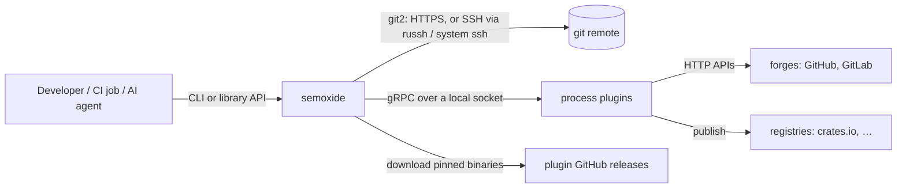
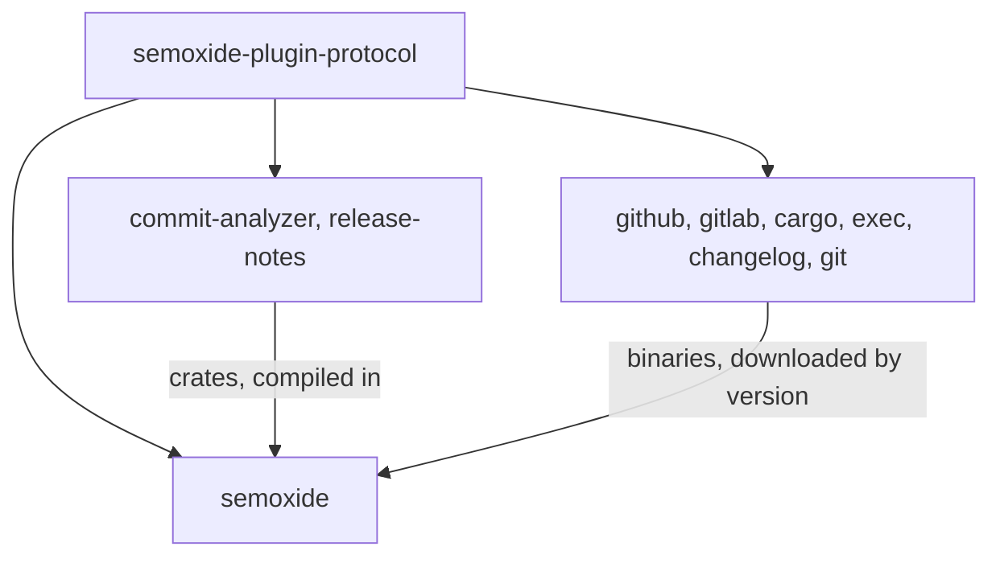
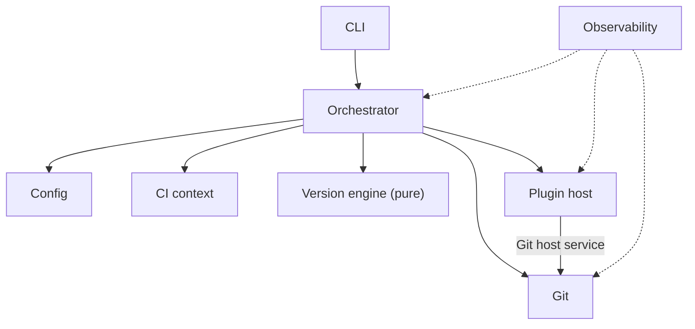
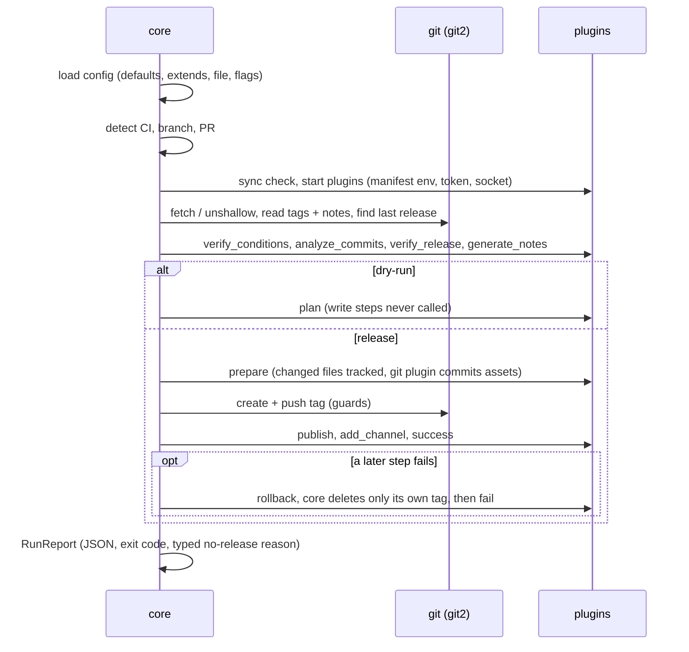
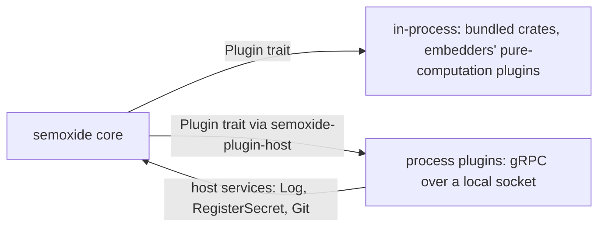
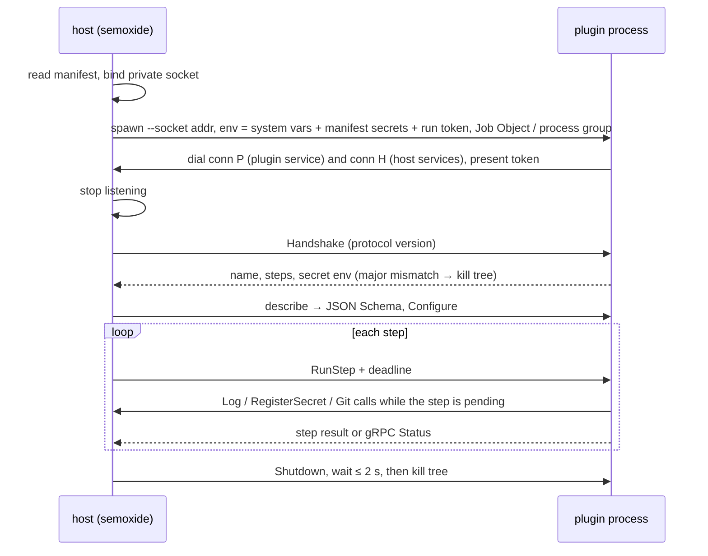
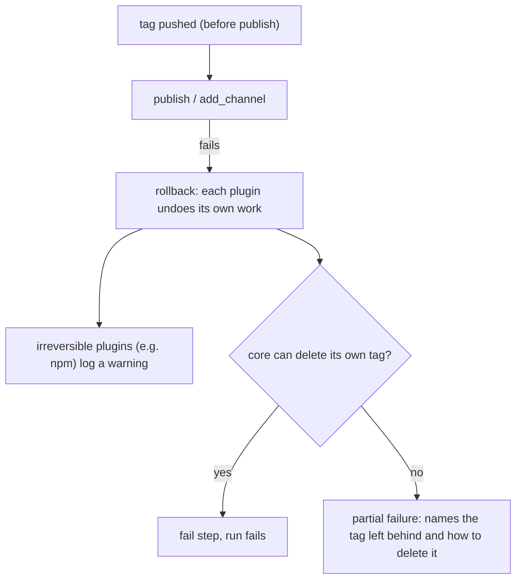
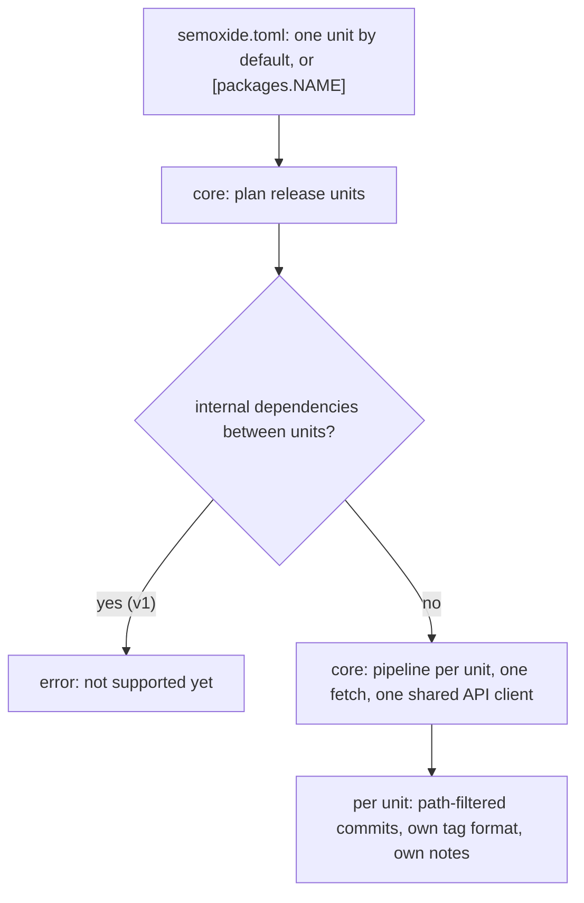

# Project architecture

How semoxide fits together as a system: repos, components, plugins, git, failure handling, monorepo and commit-back. Code layout: [CODE-ARCHITECTURE](CODE-ARCHITECTURE.md). Config options: [CONFIG](CONFIG.md). Commands, flags, exit codes, dry-run: [CLI](CLI.md). Logging, masking, errors: [OBSERVABILITY](OBSERVABILITY.md).

## 1. System context

Runs mostly in CI; behaviour outside CI is in [CLI](CLI.md).

## 2. Repositories

All repos live in the `semoxide` GitHub org ([REQUIREMENTS](REQUIREMENTS.md)).

| Repo | Contains | Versioned |
| --- | --- | --- |
| `semoxide` | core library, CLI, docs | semoxide's own SemVer |
| `semoxide-plugin-protocol` | `.proto` spec, `semoxide-plugin-sdk`, `semoxide-plugin-host`, `semoxide-plugin-conformance` | protocol SemVer, independent of semoxide |
| `semoxide-plugin-commit-analyzer`, `semoxide-plugin-release-notes` | bundled default plugins (crate + binary) | their own |
| `semoxide-plugin-{github,gitlab,cargo,exec,changelog,git}` | first official plugins (crate + binary + manifest) | their own |
| `semoxide-sandbox` | real-remote test workflows ([TESTING](TESTING.md)) | – |

## 3. Components

| Component | Responsibility |
| --- | --- |
| Config | load and merge layers (defaults → extends → file → flags), validate against core and plugin schemas ([CONFIG](CONFIG.md)) |
| CI context | detect CI, branch, PR and commit from the env snapshot only (no event files). Table-driven, derived from env-ci's detection table; differences in [DIFFERENCES](DIFFERENCES.md#ci-and-environment). v1: GitHub Actions, GitLab CI, Jenkins, CircleCI, Azure Pipelines, Bitbucket Pipelines; elsewhere branch/commit come from git2 |
| Git | all repo access via git2: tags, notes, log ranges, fetch/unshallow, guarded push, SSH transports, credentials ([§6](#6-git-and-credentials)) |
| Version engine | **pure, no I/O**: branch model, ranges, last and next version, bump rules, skip marker |
| Plugin host | start, connect, sync and lock plugins (via `semoxide-plugin-host`); host services; in-process plugins ([§5](#5-plugins)) |
| Orchestrator | lifecycle, multi-plugin rules, changed-file tracking, rollback, dry-run/plan, `RunReport` |
| Observability | tracing, secret registry and masking, error catalog ([OBSERVABILITY](OBSERVABILITY.md)) |
| CLI | **thin**: args, output formats, exit codes, commands ([CLI](CLI.md)) |

## 4. Release run flow

Step semantics follow [the spec](specs/SEMANTIC-RELEASE-SPEC.md); differences are in [DIFFERENCES](DIFFERENCES.md).

## 5. Plugins

### 5.1 Protocol

- **gRPC (tonic) + Protobuf** over a native local socket, never stdio: Unix domain socket on Unix, named pipe on Windows (tokio built-ins, no `interprocess`). The SDK hides the difference.
- The `.proto` in `semoxide-plugin-protocol` is the spec: messages and the plugin service. Code is generated for any language.
- **Compatibility:** protocol SemVer, host and plugin must share the major. Within a major only additive changes (new fields, new optional RPCs); both sides ignore unknown fields and steps. A major bump breaks every plugin, so it is rare.
- **Wire shapes:** context, step results and host services are typed Protobuf messages. A plugin's config section travels as `google.protobuf.Struct`, validated against its schema. No JSON strings inside Protobuf.
- **Protocol repo crates:** `semoxide-plugin-sdk` (plugin side: messages, socket + handshake, `Plugin` trait, `serve()`), `semoxide-plugin-host` (host side: start, connect, kill, handshake; used by semoxide and the conformance kit), `semoxide-plugin-conformance` (CI test tool proving any plugin, in any language, follows the protocol; tests both process and in-process paths).

### 5.2 Process lifecycle

One process per plugin per run: started once, receives every step it implements, may keep state (API client, rate limits).

- **Connections:** the host listens; the plugin dials both connections and a 1-byte tag (`P`/`H`) routes them, so HTTP/2 roles don't depend on who accepts. The handshake declaration of secrets is only a consistency check against the manifest.
- **Timeouts and crashes:** each step has a default deadline (verify 2 min, publish 30 min), overridable per plugin and step ([CONFIG](CONFIG.md)). On timeout or crash semoxide kills the plugin's whole tree (Job Object on Windows, process group on Unix), fails the step and runs `rollback`/`fail`. tonic reports a client-side deadline as `CANCELLED`, so both `CANCELLED` and `DEADLINE_EXCEEDED` mean timeout; the call is also wrapped in `tokio::time::timeout`.
- **Output:** plugin stdout/stderr (including children such as `npm publish`) is captured as masked log lines tagged with the plugin, never parsed; results come only via gRPC. Display rules: [OBSERVABILITY](OBSERVABILITY.md).

### 5.3 Platform constraints (from the [gRPC PoC](https://github.com/semoxide/semoxide-poc/tree/main/plugin-grpc))

| Area | Constraint |
| --- | --- |
| Named-pipe server | tonic has no `Connected` impl for pipes: a small `Io<T>` wrapper provides it; `serve_with_incoming_shutdown(once(io).chain(pending()))` keeps the server alive; `Io` signals on drop so the plugin exits when the host connection goes |
| Named-pipe client | `connect_with_connector` returns the already-accepted stream once (dummy URI); reconnect fails by design |
| Pipe instances | one client per instance; the host creates the next after each `connect()`. The plugin's second dial uses `WaitNamedPipeW` on `ERROR_PIPE_BUSY` (sleep-retry costs ~15 ms). `first_pipe_instance(true)` blocks squatting, `reject_remote_clients(true)` |
| Windows Job Object | assigned right after spawn, so a grandchild started in that instant can escape. A full fix needs `CreateProcessW` / `raw_attribute` (unstable) |
| Unix process group | not cleaned up if semoxide itself crashes: the SDK exits when the connection drops; `PR_SET_PDEATHSIG` is optional. Children calling `setsid()` escape the group kill |
| Windows program lookup | the SDK resolves names via `PATHEXT` (`npm` → `npm.cmd`); batch-file argument escaping needs care |

### 5.4 Environment, secrets, access

- A plugin gets the system variables (`PATH`, `SystemRoot`, `PATHEXT`, …) plus only the secret variables listed in its **manifest** (shipped with each plugin release). semoxide reads the manifest before spawn, so secrets are in the environment from the start and children inherit them. Every declared secret is registered for masking ([OBSERVABILITY](OBSERVABILITY.md)).
- **Socket access control:** Unix socket in a private 0700 temp dir; Windows pipe with a security descriptor allowing only the current user. A random one-time per-run token is passed in the plugin's environment; its first message must present it, connections without it are dropped while semoxide keeps listening. A same-user process that can read process environments could steal it, but could equally read semoxide's own secrets.
- **Host services:** `Log`, `RegisterSecret`, and a narrow `Git` service (add, commit, push) backed by semoxide's git2 and credentials. Enforced there: only the release tag is pushed, existing tags never move, plugins never delete tags, commit-back per [§8](#8-monorepo-and-commit-back). No generic host access.

### 5.5 Steps

- semantic-release's 9 steps (`verify_conditions`, `analyze_commits`, `verify_release`, `generate_notes`, `prepare`, `publish`, `add_channel`, `success`, `fail`) plus **`rollback`** ([§7](#7-failure-and-rollback)).
- Optional **`plan`** RPC for dry runs: returns typed "would do" actions for a write step. Additive, no major bump.
- **Several plugins on one step:** config order, errors collected; `analyze_commits` takes the highest release type, `generate_notes` joins outputs ([spec](specs/SEMANTIC-RELEASE-SPEC.md)). Config can override order per step ([CONFIG](CONFIG.md)).
- **Config validation:** each plugin provides a JSON Schema for its config (gRPC `describe`, also published with its release; schemars for Rust). semoxide validates all plugin config before any step runs; the editor schema for `semoxide.toml` includes plugin options. Plugins still do runtime checks (e.g. token permissions) in `verify_conditions`.
- **Changed files:** plugins change files freely in user-set order. semoxide compares the working tree before and after each plugin to know what each changed. If a file matching the `git` plugin's `assets` changes after it committed: during `prepare` an error by default (configurable down to a warning); during `publish` only a warning.

### 5.6 In-process plugins

- Bundled commit-analyzer and release-notes are compiled in as crates, run in-process and enabled by default; their binaries can replace them.
- Each Rust plugin repo publishes a library crate and a binary, both implementing the SDK `Plugin` trait. Embedders may link pure-computation plugins in-process and register them in the builder.
- Limits: no child processes (the SDK allows them only in process mode, so tool-running plugins like cargo, exec, git always run as processes); logging only via the masked `Log` API (the conformance kit checks they don't print); on timeout the step fails and the call is abandoned (can't be killed).

### 5.7 Getting and trusting plugins

| Source | Rule |
| --- | --- |
| Default | config pins a version; semoxide downloads the binary from the plugin's GitHub release, caches it, and records its sha256 in a lock file on first download; every later run requires that checksum |
| Official plugins | additionally verified against GitHub artifact attestations (Sigstore) before first use |
| Override | explicit `path`, or PATH lookup of `semoxide-plugin-<name>` (development, offline/air-gapped CI) |

Config keys: [CONFIG](CONFIG.md).

### 5.8 Naming and first plugins

- Repo, binary and crate: `semoxide-plugin-<name>` (e.g. `semoxide/semoxide-plugin-github`); config uses the short name (`[plugins.github]`).
- First official set: github, cargo, exec, gitlab, changelog, git. npm is not in it.

## 6. Git and credentials

- **git2** (vendored libgit2, `https` feature) is the only git library: no git CLI, no gix.
- **SSH:** git2 is built without its `ssh` feature (no libssh2). A custom transport is registered for `ssh://` and `git@host:` URLs ([git2-russh PoC](https://github.com/semoxide/semoxide-poc/tree/main/git2-russh)). Why not libssh2: [DECISIONS](DECISIONS.md).

| SSH backend | Selected | Behaviour |
| --- | --- | --- |
| `russh` (default) | always unless opted out | pure Rust, all key types (file, memory, passphrase) on every OS, OpenSSH agent (`SSH_AUTH_SOCK`, else `\\.\pipe\openssh-ssh-agent` on Windows) and Pageant, known_hosts verification (unknown host fails unless explicitly allowed, a mismatch always refuses), `~/.ssh/config`, every phase bounded by connect/IO timeouts, no external binary |
| system `ssh` (opt-in) | `SEMOXIDE_SSH_BACKEND=exec` or `GIT_SSH_COMMAND` / `GIT_SSH` | runs `ssh -o BatchMode=yes`; for OpenSSH-only features (ProxyJump, FIDO keys, `@cert-authority`); a missing `ssh` gives a clear error |

- git2 `RemoteCallbacks` (credentials, `certificate_check`) are not called for a custom transport, so SSH auth and host-key policy live in semoxide's own SSH options.

**Channel notes:** which channels a released version is on (needed for promotion via `add_channel`) is stored as a git note on the tagged commit, JSON `{"channels":[null,"next"]}` (`null` = default channel), one ref per tag: semoxide writes only `refs/notes/semoxide-<tag>`. It also reads upstream's `refs/notes/semantic-release-<tag>` and legacy `refs/notes/semantic-release`, so migrated repos keep their channel history; each ref is read separately (no concatenation, upstream #4073), and semoxide's note wins for the same tag. Notes refs are fetched explicitly and pushed right after the tag.

**Guards** (git2 behaviour proven in the [git2 PoC](https://github.com/semoxide/semoxide-poc/tree/main/git2-ops)):

| git2 behaviour | Product rule |
| --- | --- |
| libgit2 pushes a fast-forward move of an existing remote tag, and GitHub accepts it | never move an existing remote tag: `push_negotiation` rejects `refs/tags/*` updates with a non-zero `src` |
| `push()` returns `Ok` when the server rejects a ref | check every pushed ref's status (`push_update_reference`); a bare `failed` (no reason) is retried once, logged; if the retry reports the tag exists, success only when the remote tag points at our commit |
| tag names can carry build metadata (`tags.metadata`), so a version can have differently named tags | every tag lookup (clobber guard, rerun, promotion) goes through the parsed version index, never a name built from the version; a test enforces it |
| on 401 libgit2 re-calls the credential callback (up to 15 times) | cap credential retries in our callback |
| HTTP error text differs by OS (WinHTTP vs OpenSSL), no numeric status API | match HTTP errors by class (`class=Http`) and status (`403` in message), never by full text |
| push negotiation abort = `git push --dry-run` depth | branch protection and hooks are reported only by the real push |
| `Repository::commit` runs no hooks and no signing | commit-back commits are unsigned, hookless (bot signature) |

**Credential rules:**

- A configured token (e.g. `GITHUB_TOKEN`, `GITLAB_TOKEN`) wins over any credential already attached to the remote.
- With a token, a `git@host:` remote is pushed over HTTPS; without one, SSH is used as configured.
- The credential used is logged by name only.
- A warning is logged when the token won't trigger downstream CI (`GITHUB_TOKEN`, the GitLab job token).

## 7. Failure and rollback

- The tag is pushed before publish (semantic-release order).
- A failing `success` step never rolls back and never runs `fail`: the release stands, the outcome stays `Released`, and the errors are warnings in the log and in `RunReport.success_errors` (exit 0, default). With `steps.success.errors = "fail"` ([CONFIG](CONFIG.md)) the run exits with the partial-failure code instead, still without rollback.
- Only the core deletes a tag, and only the one it pushed in this run. Plugins and the `Git` service never delete tags.
- Without delete rights, rollback still runs for the other plugins; the run ends as a partial failure. Partial failure has its own exit code ([CLI](CLI.md)).
- User docs must state that tag deletion needs delete rights on the remote.

## 8. Monorepo and commit-back

**Release units:**

- **Core** owns orchestration: release units, planned order, one fetch and one shared API client per run, changed paths per commit, tag lookup per unit.
- **Plugins** own ecosystem parts: workspace discovery, updating dependents' manifests.
- **v1:** one unit, or units declared under `[packages.NAME]` ([CONFIG](CONFIG.md)) released independently; units depending on each other fail the run.
- **Later:** dependency-ordered plan, bumping dependents (requires commit-back), locked version groups, plugin workspace discovery.

**Commit-back:**

- Default is tags only: without the `git` plugin semoxide never commits.
- Configuring the `git` plugin is the opt-in: it commits and pushes its `assets` via the host `Git` service.
- User docs must list its drawbacks: extra release commits, CI re-trigger loops (`[skip ci]` convention), branch protection must allow the bot, races with concurrent pushes fail the release, commit-signing requirements.

## 9. Distribution

One `dist` build feeds every binary channel. **Targets: Linux and Windows, x86_64 + aarch64; no macOS binaries for now** (macOS users run the Docker image).

| When | Channels |
| --- | --- |
| v1 | GitHub Release binaries + shell/PowerShell installers; GitHub Action; `cargo binstall` / `cargo install`; Docker image (static musl, GHCR, amd64/arm64) |
| v1.x | npm wrapper (one package works with npx, pnpm dlx, yarn dlx, bunx, Deno: no postinstall, `preferUnplugged`, one static-musl Linux package per arch); Homebrew formula (Linux) |
| next | own Scoop bucket, then winget |
| next | PyPI wheels via maturin `bindings = "bin"` (`uvx` / `pipx`) |
| next | AUR `semoxide-bin`; `.deb`/`.rpm` attached to releases; Nix (nixpkgs + `flake.nix`) |
| on demand | Chocolatey; Maven Central + Maven/Gradle plugins; Composer download wrapper; Cloudsmith apt/rpm/apk repos |
| skip | macOS binaries (for now), JSR, PHIVE, Flatpak, Snap, jbang; SDKMAN! unless it accepts non-JVM tools |
