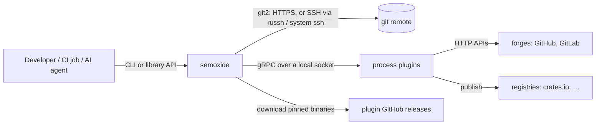
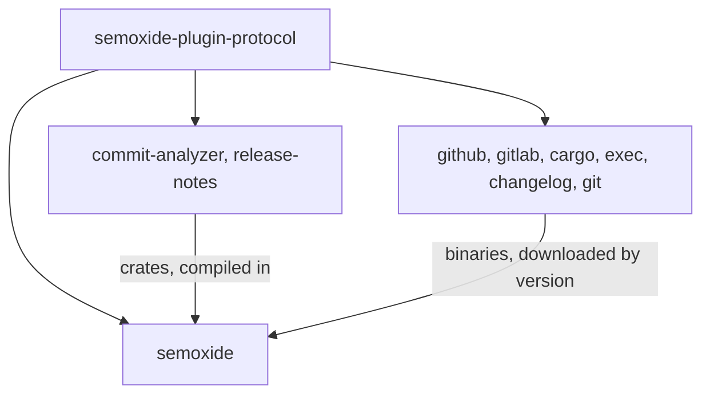
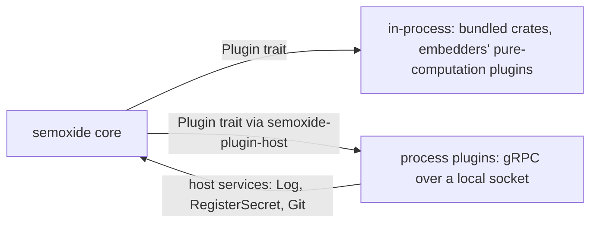

# Project architecture

How semoxide fits together as a system. Code layout lives in [CODE-ARCHITECTURE](CODE-ARCHITECTURE.md). Decisions are in [DECISIONS](DECISIONS.md); this doc links to them instead of repeating them.

## 1. System context



- Runs mostly in CI; outside CI it forces dry-run unless `--no-ci` is passed ([0016](decisions/0016-agent-experience.md)).
- Git: [0011](decisions/0011-git-backend.md). Plugins: [0010](decisions/0010-plugin-architecture.md).

## 2. Repositories

All repos live in the `semoxide` GitHub org ([REQUIREMENTS](REQUIREMENTS.md)).

| Repo | Contains | Versioned |
|---|---|---|
| `semoxide` | core library, CLI, docs | semoxide's own SemVer |
| `semoxide-plugin-protocol` | `.proto` spec, `semoxide-plugin-sdk`, `semoxide-plugin-host`, `semoxide-plugin-conformance` | protocol SemVer, independent of semoxide ([0010](decisions/0010-plugin-architecture.md)) |
| `semoxide-plugin-commit-analyzer`, `semoxide-plugin-release-notes` | bundled default plugins (crate + binary) | their own |
| `semoxide-plugin-{github,gitlab,cargo,exec,changelog,git}` | first official plugins (crate + binary + manifest) | their own |
| `semoxide-sandbox` | real-remote test workflows ([0015](decisions/0015-testing.md)) | – |



## 3. Components

_Pending decisions._

## 4. Release run flow

Step semantics follow [the spec](specs/SEMANTIC-RELEASE-SPEC.md); semoxide's differences are in the linked ADRs.

```mermaid
sequenceDiagram
    participant C as core
    participant G as git (git2)
    participant P as plugins
    C->>C: load config (file, extends, env, flags) [0002, 0014]
    C->>C: detect CI, branch, PR [0014]; outside CI → dry-run
    C->>P: sync check, start plugins (manifest env, token, socket) [0010]
    C->>G: fetch / unshallow, read tags + notes, find last release
    C->>P: verify_conditions, analyze_commits, verify_release, generate_notes
    alt dry-run [0005, 0013, 0016]
        C->>P: plan (write steps never called)
    else release
        C->>P: prepare (changed files tracked; git plugin commits assets) [0009, 0010]
        C->>G: create + push tag (guards) [0011]
        C->>P: publish, add_channel, success
        opt a later step fails
            C->>P: rollback; core deletes only its own tag; fail [0012]
        end
    end
    C->>C: RunReport (JSON, exit code, typed no-release reason) [0013, 0016]
```

## 5. Plugin boundary



Everything about the protocol, lifecycle, secrets, timeouts and trust is in [0010](decisions/0010-plugin-architecture.md).

## 6. Distribution

_Pending decisions._

## 7. Cross-cutting rules

- Secrets and masking: [0013](decisions/0013-observability.md), [0010](decisions/0010-plugin-architecture.md).
- Non-interactive rule, JSON contracts, injection guard: [0016](decisions/0016-agent-experience.md).
- Errors, exit codes, logging: [0013](decisions/0013-observability.md).
- Git safety guards and credentials: [0011](decisions/0011-git-backend.md).
- Commit-back: [0009](decisions/0009-commit-back.md). Monorepo units: [0003](decisions/0003-monorepo-scope.md).
