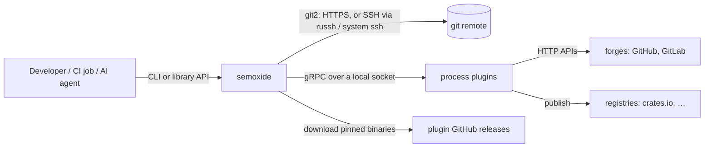
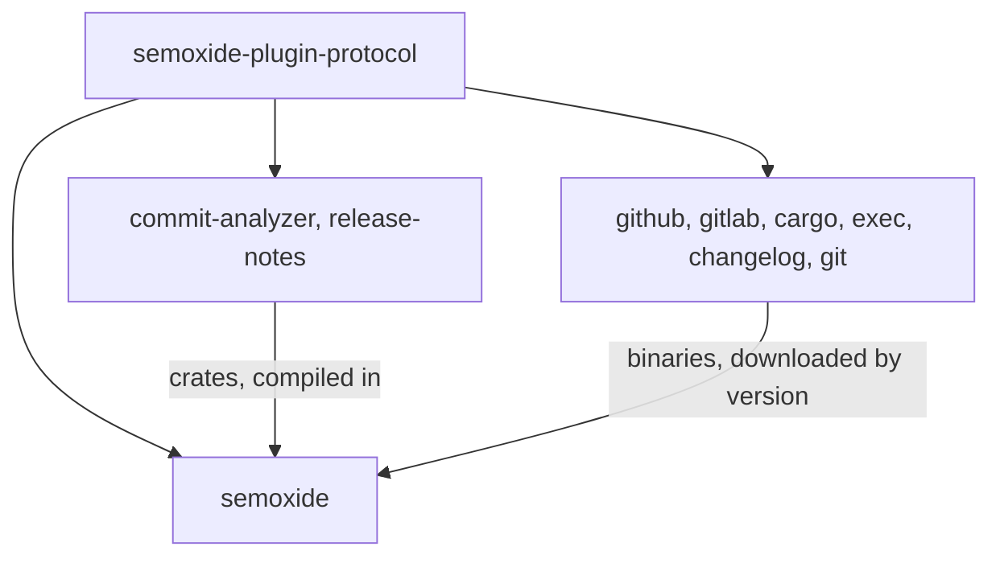
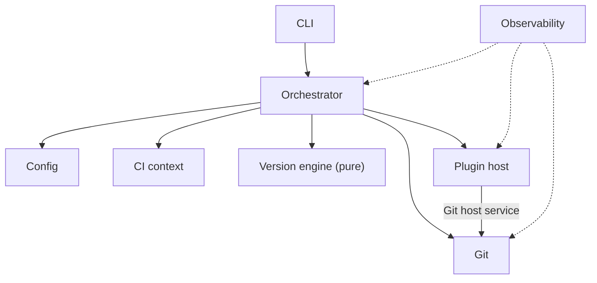
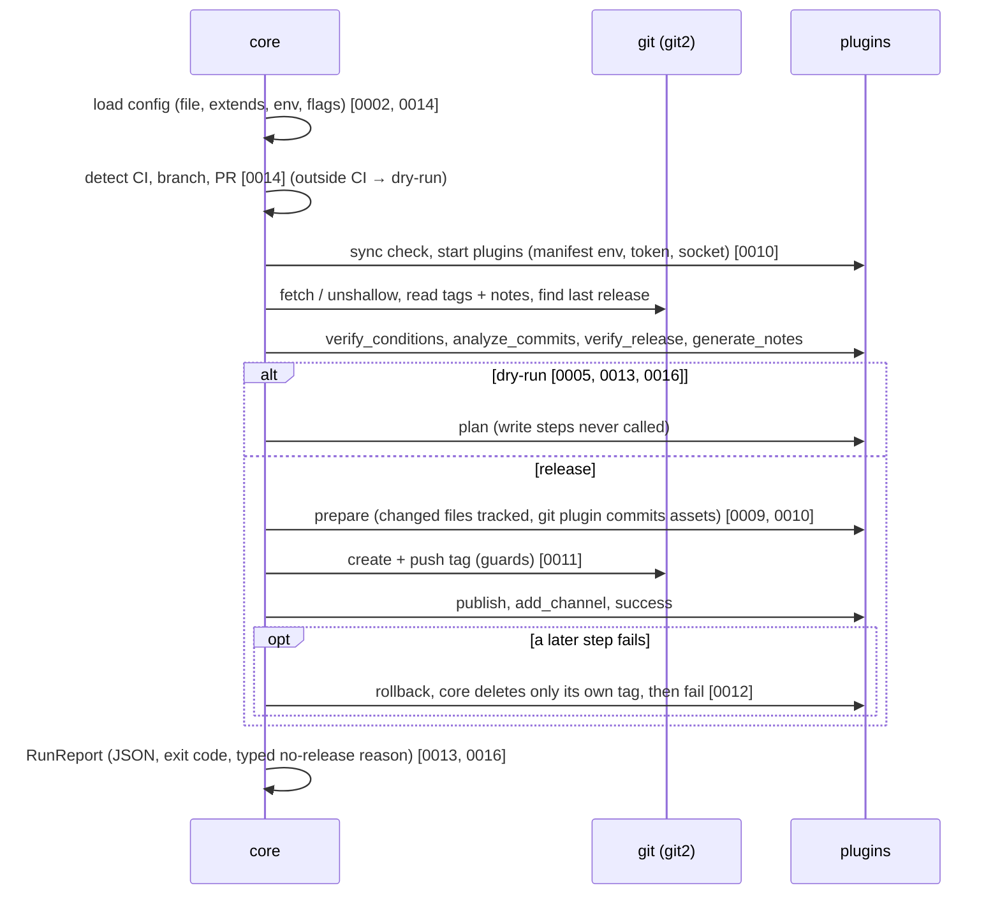
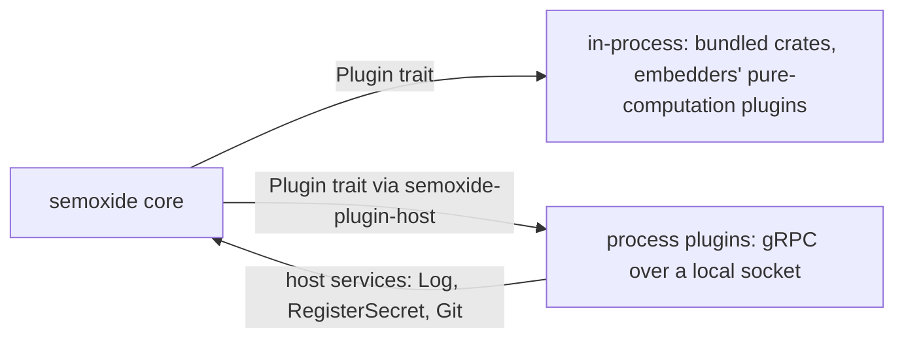

# Project architecture

How semoxide fits together as a system. Code layout lives in [CODE-ARCHITECTURE](CODE-ARCHITECTURE.md). Decisions are in [DECISIONS](DECISIONS.md); this doc links to them instead of repeating them.

## 1. System context

- Runs mostly in CI; outside CI it forces dry-run unless `--no-ci` is passed ([0016](decisions/0016-agent-experience.md)).
- Git: [0011](decisions/0011-git-backend.md). Plugins: [0010](decisions/0010-plugin-architecture.md).

## 2. Repositories

All repos live in the `semoxide` GitHub org ([REQUIREMENTS](REQUIREMENTS.md)).

| Repo | Contains | Versioned |
|---|---|---|
| `semoxide` | core library, CLI, docs | semoxide's own SemVer |
| `semoxide-plugin-protocol` | `.proto` spec, `semoxide-plugin-sdk`, `semoxide-plugin-host`, `semoxide-plugin-conformance` | protocol SemVer, independent of semoxide ([0010](decisions/0010-plugin-architecture.md)) |
| `semoxide-plugin-commit-analyzer`, `semoxide-plugin-release-notes` | bundled default plugins (crate + binary) | their own |
| `semoxide-plugin-{github,gitlab,cargo,exec,changelog,git}` | first official plugins (crate + binary + manifest) | their own |
| `semoxide-sandbox` | real-remote test workflows ([0015](decisions/0015-testing.md)) | – |

## 3. Components

| Component | Responsibility |
|---|---|
| Config | load and merge layers (defaults → extends → file → env → flags), validate against the core and plugin schemas, resolve `extends` ([0002](decisions/0002-config-format.md), [0014](decisions/0014-porting-behaviour.md)) |
| CI context | detect CI, branch, PR and commit; env snapshot ([0013](decisions/0013-observability.md), [0014](decisions/0014-porting-behaviour.md)) |
| Git | all repo access via git2: tags, notes, log ranges, fetch/unshallow, guarded push, SSH transports, credential rules ([0011](decisions/0011-git-backend.md)) |
| Version engine | **pure, no I/O**: branch model, ranges, last and next version, bump rules, skip marker ([0007](decisions/0007-bump-defaults.md), [0014](decisions/0014-porting-behaviour.md)) |
| Plugin host | start, connect, sync and lock plugins (via `semoxide-plugin-host`); host services; in-process plugins ([0010](decisions/0010-plugin-architecture.md)) |
| Orchestrator | lifecycle, multi-plugin rules, changed-file tracking, rollback, dry-run/plan, `RunReport` ([0010](decisions/0010-plugin-architecture.md), [0012](decisions/0012-partial-failure.md)) |
| Observability | tracing events, secret registry and masking, error catalog ([0013](decisions/0013-observability.md)) |
| CLI | **thin**: args, output formats, exit codes, TTY rule, commands ([0013](decisions/0013-observability.md), [0016](decisions/0016-agent-experience.md)) |

## 4. Release run flow

Step semantics follow [the spec](specs/SEMANTIC-RELEASE-SPEC.md); semoxide's differences are in the linked ADRs.

## 5. Plugin boundary

Everything about the protocol, lifecycle, secrets, timeouts and trust is in [0010](decisions/0010-plugin-architecture.md).

## 6. Distribution

One `dist` build (6 targets) feeds every binary channel ([research](research/distribution-config.md#1-distribution)).

| When | Channels |
|---|---|
| v1 | GitHub Release binaries + shell/PowerShell installers; GitHub Action; `cargo binstall` / `cargo install`; Docker image (static musl, GHCR, amd64/arm64) |
| v1.x | npm wrapper; Homebrew tap |
| Later | Scoop; winget, Chocolatey |

Under research: Python (uv/pipx), other JS runners, Java, PHP, macOS builds.

## 7. Cross-cutting rules

- Secrets and masking: [0013](decisions/0013-observability.md), [0010](decisions/0010-plugin-architecture.md).
- Non-interactive rule, JSON contracts, injection guard: [0016](decisions/0016-agent-experience.md).
- Errors, exit codes, logging: [0013](decisions/0013-observability.md).
- Git safety guards and credentials: [0011](decisions/0011-git-backend.md).
- Commit-back: [0009](decisions/0009-commit-back.md). Monorepo units: [0003](decisions/0003-monorepo-scope.md).
