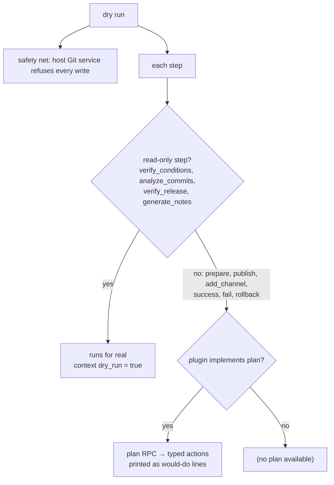

# CLI

Commands, flags, dry-run, JSON contract, exit codes and agent support. Logging flags, masking, the error catalog and CI log integration live in [OBSERVABILITY.md](OBSERVABILITY.md); config in [CONFIG.md](CONFIG.md).

## Commands

| Command | Purpose | Key flags |
| --- | --- | --- |
| `semoxide release` | the release run: release, promote or report why not | `--dry-run`, `--no-ci`, `--verify-push`, `--fail-on-no-release` |
| `semoxide version` | prints only the next version. No release: empty stdout, reason on stderr, exit 0 (6 with `--fail-on-no-release`) | `--fail-on-no-release` |
| `semoxide explain` | offline, read-only decision trace: branch rule → last release → each commit's verdict → next version or no-release reason | `--commit <sha>`, `--limit`, `--notes-preview-lines <N>` |
| `semoxide doctor` | checks the setup without releasing (check list: [OBSERVABILITY.md](OBSERVABILITY.md)) | `--online`, `--limit` |
| `semoxide doctor --bundle` | masked support bundle, Markdown by default, paste-ready for an issue (contents: [OBSERVABILITY.md](OBSERVABILITY.md)) | `--bundle-format=json`, `--out <file>` (default: stdout) |
| `semoxide init` | creates `semoxide.toml` | flags for each detection |
| `semoxide sync` | downloads pinned plugins, verifies checksums, writes/updates the lock file ([ARCHITECTURE.md](ARCHITECTURE.md)) | |
| `semoxide migrate` | converts `.releaserc` to `semoxide.toml` where possible and reports everything it can't convert | |
| `semoxide schema` | offline self-description (alias: `semoxide help --output=json`) | |

Bare `semoxide` prints help; it never starts a release.

`init`:

- Detects the forge (git remote), the ecosystem (`Cargo.toml`, `package.json`, …) and the release branch.
- Writes a short `semoxide.toml`: default branches, the matching forge plugin, analyzer/notes defaults.
- If a `.releaserc` exists, offers `migrate` instead.
- In a terminal, asks to confirm or adjust the detections; otherwise uses flags and defaults ([non-interactive rule](#non-interactive-rule)).

`schema` lists every command and flag, the exit codes, all error codes with docs links, and the JSON Schemas, generated from the CLI definition and error catalog. With a config present it adds the configured plugins' config schemas (`describe`). It never downloads plugins: if local plugins and lock are out of sync with the config, it warns and points to `semoxide sync`.

## Global flags

| Flag | Effect |
| --- | --- |
| `--output=text\|json` | data format on stdout ([JSON contract](#json-contract)); no separate `--json` |
| `--set <key>=<value>` | overrides one config key (repeatable); value in TOML syntax, validated like the file (`--set plugins.github.draft=true`). The only way to set config from the CLI ([CONFIG.md](CONFIG.md)) |
| `--dry-run` | [dry-run](#dry-run) |
| `--no-ci` | outside CI, semoxide forces dry-run unless this is passed; the outcome is then `NoRelease(NotCi)` plus the would-be result ([OBSERVABILITY.md](OBSERVABILITY.md#7-no-release-reasons)). An explicit `--dry-run` reports only the dry-run result |
| `--no-input` | [non-interactive rule](#non-interactive-rule) even with a TTY |
| `--limit N` | caps list-like output (`explain` verdicts, `doctor` details) |
| `--notes-preview-lines <N>` | caps the notes preview shown in dry-run/`explain` output (a preview is always shown); notes in the release itself are never cut |
| logging (`-q`, `-v`, `--debug`, `--log-format`, `--log-file`, `--color`) | [OBSERVABILITY.md](OBSERVABILITY.md) |

Logs go to stderr; stdout carries only data (JSON, the printed version), so piping works.

## Environment variables

Config is never read from env ([CONFIG.md](CONFIG.md)). Env carries only secrets (tokens, [ARCHITECTURE.md](ARCHITECTURE.md#6-git-and-credentials)) and this fixed list:

| Variable | Effect |
| --- | --- |
| `SEMOXIDE_LOG` | log filter ([OBSERVABILITY.md](OBSERVABILITY.md)) |
| `SEMOXIDE_CI_BRANCH` | overrides the detected branch on any CI |
| `SEMOXIDE_CI_IS_PR` | overrides the detected PR state on any CI |
| `SEMOXIDE_SSH_BACKEND` | `exec` selects the system `ssh` ([ARCHITECTURE.md](ARCHITECTURE.md#6-git-and-credentials)) |

Any other `SEMOXIDE_*` var produces a warning (likely a typo).

## Dry-run

- No network writes; push rights are never needed. `--verify-push` opts in to the push-permission check.
- Plugins see `dry_run = true` and adapt (e.g. skip their push-permission check).
- `plan` actions are typed: `{ plugin, step, action, target, details }`. Text output renders them as lines; JSON carries them in the result, so agents and CI policies can check a planned release before allowing it.

## JSON contract

- Every command supports `--output=json` with a published JSON Schema; a test fails if any command lacks either.
- Every JSON output carries `"schema_version"`. Schemas are generated from the Rust types (`schemars`) and published with each release.
- Evolution: fields are only added. Renames and removals require a `schema_version` bump in a major release.
- `release` prints the `RunReport` (the same struct the library returns), including the typed no-release reason ([OBSERVABILITY.md](OBSERVABILITY.md)).
- Truncated lists carry `"truncated": true` and `"total"`; nothing is truncated silently. Defaults are generous.
- Fields with user-authored text (commit subjects/bodies, notes, plugin output) are marked `x-untrusted: true`; see [injection guard](#injection-guard).

Error object fields:

| Field | Meaning |
| --- | --- |
| `code` | namespaced error code, e.g. `git::push_rejected` (catalog: [OBSERVABILITY.md](OBSERVABILITY.md)) |
| `message`, `help`, docs link | as rendered in text output |
| config pointer | line in `semoxide.toml`, for config errors |
| `retryable` | transient failure (network timeout, rate limit, SSH handshake flake) |
| `remote_writes_happened` | true once anything was pushed or published |

Retrying is safe only when `retryable && !remote_writes_happened`.

## Exit codes

| Code | Meaning |
| --- | --- |
| 0 | released, promoted, or no release |
| 1 | any other failure before a remote write (git, network, plugin error, rejected push); check `retryable` |
| 2 | CLI usage |
| 3 | config invalid (incl. plugin schema) |
| 4 | a `verify_conditions` / `verify_release` step failed: fix the setup (credentials, config, permissions); a rerun won't help |
| 5 | partial failure: tag pushed, a later step failed; rollback result in the summary ([ARCHITECTURE.md](ARCHITECTURE.md)). Also a failed `success` step when `success_errors = "fail"` (no rollback) |
| 6 | no release, only with `--fail-on-no-release` |
| 101 | panic |
| 130 | interrupted |

## Non-interactive rule

- Without a TTY, or with `--no-input`, semoxide never prompts, pages, opens an editor, or shows spinners/progress bars. Anything that needs an answer fails fast, naming the flag to pass instead.
- Child processes get `GIT_TERMINAL_PROMPT=0`, `GIT_PAGER=cat`, `GIT_EDITOR=true`, and `BatchMode` for `ssh`.
- A test runs every command without a TTY and fails on any prompt or hang.

## Agent experience

- Agents are treated like humans: no agent detection.
- Shipped with the user docs site:
  - an Agent Skill (`SKILL.md`): `doctor` → `explain` → `--dry-run --output=json` → review the plan → release;
  - `llms.txt` plus `.md` copies of every docs page, including each error code.
- AGENTS.md in semoxide's repos for contributing agents.
- No MCP server in v1. If added later: read-only tools only (`explain`, `doctor`, `plan`), never `release`.

### Injection guard

ANSI escapes, control characters and invisible Unicode (zero-width, bidi overrides) are stripped from `x-untrusted` fields in all output, including published notes; the rest of the authored text is kept. Workflow-command (`::`) escaping in CI logs: [OBSERVABILITY.md](OBSERVABILITY.md).
