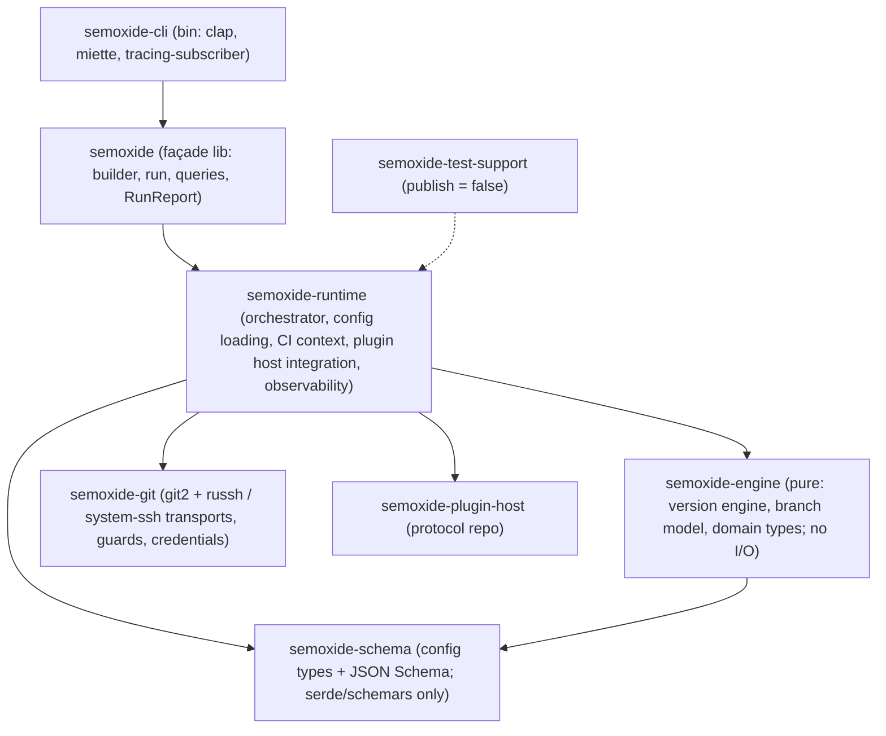

# Code architecture

How the `semoxide` repo's code is organised and where things go. System view: [ARCHITECTURE](ARCHITECTURE.md). Decisions: [DECISIONS](DECISIONS.md).

## 1. Workspace layout

A flat `crates/` workspace, split along **purity and heavy dependencies**. Each crate boundary carries real weight; inside a crate, components are modules (`pub(crate)`). This follows typst, cargo and jj.

| Crate | Holds | Heavy deps | Published |
|---|---|---|---|
| `semoxide-schema` | `semoxide.toml` types, JSON Schema generation | none (serde, schemars) | yes, internal (§5) |
| `semoxide-engine` | version engine, branch model, domain types | none: **pure, no I/O** | yes, internal (§5) |
| `semoxide-git` | git2, SSH transports, push guards, credential rules ([0011](decisions/0011-git-backend.md)) | git2, russh | yes, internal (§5) |
| `semoxide-runtime` | orchestrator, config loading, CI context, plugin host integration, observability | tokio, tonic (via `semoxide-plugin-host`) | yes, internal (§5) |
| `semoxide` | façade: the public library API ([0014](decisions/0014-porting-behaviour.md)) | – | yes |
| `semoxide-cli` | the binary | clap, miette | yes (binary) |
| `semoxide-test-support` | fixtures, git-repo DSL, builders ([0015](decisions/0015-testing.md)) | – | no |

The pure engine and the schema compile and test without git2, tonic, russh or tokio: fast rebuilds, and miri can run them.

## 2. Crate boundaries and enforcement

| Crate | May depend on | Must never use |
|---|---|---|
| `semoxide-schema` | serde, schemars | anything with I/O |
| `semoxide-engine` | `schema` | any I/O: `std::fs`, `std::net`, `std::process`, `std::env`, git2, tokio, printing |
| `semoxide-git` | `engine` types, git2, russh | tokio outside its SSH bridge; printing |
| `semoxide-runtime` | all above, `semoxide-plugin-host` | `std::env::var` (env snapshot only, [0013](decisions/0013-observability.md)); printing |
| `semoxide` | `runtime` | anything beyond re-exports and thin glue |
| `semoxide-cli` | the façade only | inner crates directly |

Enforced in CI by:
- the Cargo dependencies themselves
- a `clippy.toml` per crate with `disallowed-methods` / `disallowed-types`, each ban with a reason
- cargo-deny `bans` with `wrappers` (e.g. git2 only via `semoxide-git`, tokio never in `engine`/`schema`)

## 3. Sync vs async

- **Sync:** orchestrator, config, CI context, engine, git (git2). Async is confined to two places: the plugin host and the SSH transport bridge in `semoxide-git`.
- **Plugin host:** owns a private tokio runtime on its own thread and exposes **blocking** calls to the orchestrator. Because it runs on its own thread, it also works inside an embedder's tokio runtime (the SSH PoC proved this bridge design).
- **Façade:** both a blocking `run()` and an **async** `run()` from the start. The async one runs the sync core on a dedicated thread and awaits the result, so it doesn't depend on any particular runtime. Cancellation behaviour: §5.
- Basis: async only where concurrency is real (2025–26 consensus); the release steps run sequentially.

## 4. Error and result types

- Each crate has its own `thiserror` enum, marked `#[non_exhaustive]`.
- Every error implements one small trait of ours, `ErrorInfo`: `code()` (namespaced), `help()`, `url()`, `retryable()`, `remote_writes_happened()`, `known()` ([0013](decisions/0013-observability.md), [0016](decisions/0016-agent-experience.md)).
- The façade exposes a single `semoxide::Error` wrapping the crate errors; a step's collected errors stay a list.
- **No miette in the libraries:** the CLI converts `ErrorInfo` into miette diagnostics for display (typed errors in libraries, report layer at the edge).

## 5. Public API surface

- **Publishing:** all crates except `semoxide-test-support` go to crates.io, because a published crate's dependencies must be published too. They are versioned in lockstep. **Only the façade `semoxide` (and the CLI binary) is a stable API**; the inner crates are documented as "internal, no stability promise". `cargo-semver-checks` runs on the façade only. This is uv/ruff's model.
- **Façade shape:** builder, `run()` (blocking and async), and the read-only queries ([0014](decisions/0014-porting-behaviour.md)).

## 6. Testing layout

Decided in [0015](decisions/0015-testing.md): placement, kinds, how tests run.

## 7. Workspace config

_To decide (lints: [0017](decisions/0017-code-quality.md))._

## 8. Where things go

_Written last, from §1–§7 and §9._

## 9. Patterns

_To decide._

## 10. Approaches

_To decide._
