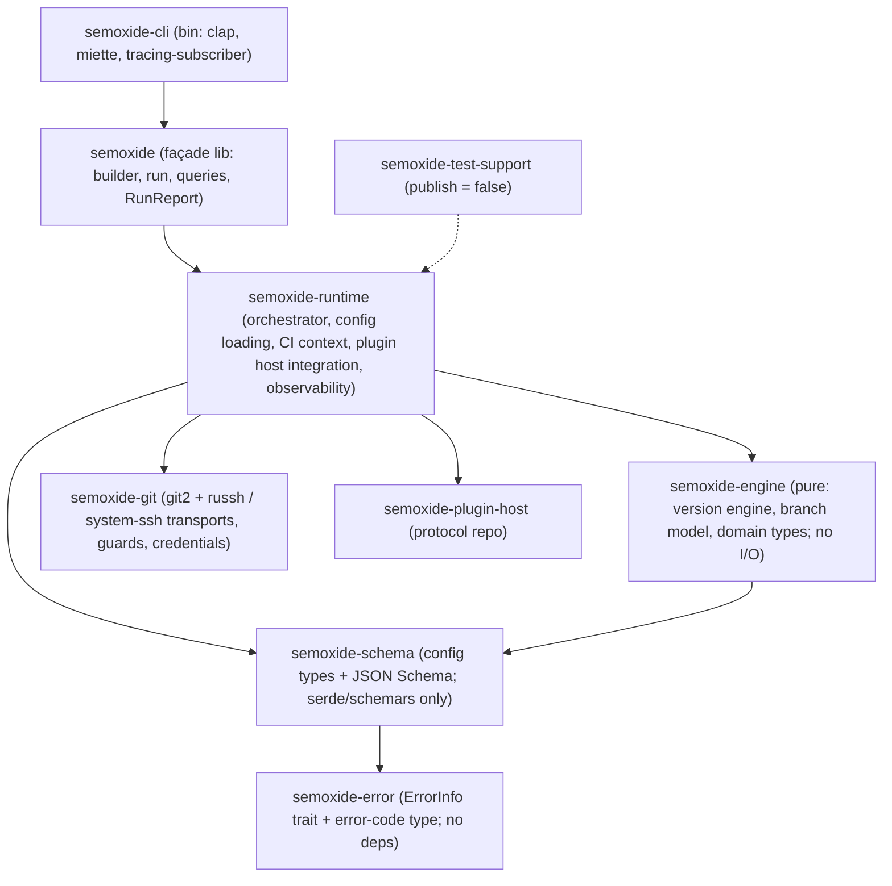

# Code architecture

How the `semoxide` repo's code is organised and where things go. System view: [ARCHITECTURE](ARCHITECTURE.md). Rationale: [DECISIONS](DECISIONS.md).

## 1. Workspace layout

A flat `crates/` workspace, split along **purity and heavy dependencies**. Inside a crate, components are modules (`pub(crate)`).

| Crate | Holds | Heavy deps | Published |
| --- | --- | --- | --- |
| `semoxide-error` | `ErrorInfo` trait and error-code type (§4); bottom of the graph | none | yes, internal (§5) |
| `semoxide-schema` | `semoxide.toml` types, JSON Schema generation | none (serde, schemars) | yes, internal |
| `semoxide-engine` | version engine, branch model, domain types | none: **pure, no I/O** | yes, internal |
| `semoxide-git` | git2, SSH transports, push guards, credential rules ([ARCHITECTURE](ARCHITECTURE.md)) | git2, russh | yes, internal |
| `semoxide-runtime` | orchestrator, config loading, CI context, plugin host integration, observability | tokio, tonic (via `semoxide-plugin-host`) | yes, internal |
| `semoxide` | façade: the public library API | – | yes |
| `semoxide-cli` | the binary | clap, miette | yes (binary) |
| `semoxide-test-support` | fixtures, git-repo DSL, builders ([TESTING](TESTING.md)) | – | no |

The engine and schema compile and test without git2, tonic, russh or tokio; miri can run them.

Key libraries for domain logic:

| Need | Library | Rule |
| --- | --- | --- |
| versions | `semver` | parse/compare only; own `Range { min, max_exclusive }` and bump code (the crate has no bump API, and `VersionReq` is cargo semantics) |
| commit parsing | `git-conventional` (in the commit-analyzer repo) | used as-is; its deviations from Conventional Commits are documented, not patched ([CONFIG](CONFIG.md)) |
| templates | `minijinja` | notes, messages, `tag_metadata` |
| user regexes | `fancy-regex` | with a backtrack limit |
| globs | `globset` | `*` crosses `/` in rule values |
| notes sorting | `icu_collator` | compiled-in data; locales covered checked when implemented |

## 2. Crate boundaries and enforcement

| Crate | May depend on | Must never use |
| --- | --- | --- |
| `semoxide-error` | nothing | any dependency |
| `semoxide-schema` | `error`, serde, schemars | anything with I/O |
| `semoxide-engine` | `schema` | any I/O: `std::fs`, `std::net`, `std::process`, `std::env`, git2, tokio, printing |
| `semoxide-git` | `engine` types, git2, russh | tokio outside its SSH bridge; printing |
| `semoxide-runtime` | all above, `semoxide-plugin-host` | `std::env::var` (env snapshot only, [OBSERVABILITY](OBSERVABILITY.md)); printing |
| `semoxide` | `runtime` | anything beyond re-exports and thin glue |
| `semoxide-cli` | the façade only | inner crates directly |

Enforced in CI by:

- the Cargo dependencies themselves
- one root `clippy.toml` with `disallowed-methods` (env reads, process spawning, stdout/stderr handles, `temp_dir`, TLS "danger" methods) and `max-fn-params-bools = 0`, each ban with a reason; allowed sites carry `#[expect(clippy::disallowed_methods, reason = …)]`
- `scripts/check-forbid-unsafe.sh` (CI): every crate root except semoxide-git has `#![forbid(unsafe_code)]`
- `clippy::exhaustive_enums` / `exhaustive_structs` in the façade crate (P14)
- cargo-deny `bans` with `wrappers` (e.g. git2 only via `semoxide-git`, tokio never in `engine`/`schema`)

## 3. Sync vs async

- **Sync:** orchestrator, config, CI context, engine, git (git2). Async lives only in the plugin host and the SSH transport bridge in `semoxide-git`.
- **Plugin host:** owns a private tokio runtime on its own thread and exposes **blocking** calls to the orchestrator; this works inside an embedder's tokio runtime too ([PoC](https://github.com/semoxide/semoxide-poc/tree/main/git2-russh)).
- **Façade:** a blocking `run()` and an **async** `run()`. The async one runs the sync core on a dedicated thread and awaits the result, independent of the caller's runtime (about one OS thread per concurrent release). Cancellation: §5.
- **`Plugin` trait is sync.** The SDK's `serve()` runs the async gRPC server and calls plugin methods on a blocking thread; network plugins use blocking HTTP clients. An `AsyncPlugin` SDK adapter may be added later (additive).

## 4. Error and result types

- Each crate has its own `thiserror` enum, `#[non_exhaustive]`.
- Every error implements `ErrorInfo` (in `semoxide-error`): `code()` (namespaced), `help()`, `url()`, `retryable()`, `remote_writes_happened()`. Codes are compile-time constants named after the full code (`CORE_NO_GIT_REPO` for `core::no_git_repo`), validated by `ErrorCode::from_static`. Known vs unexpected is not a trait method (every `ErrorInfo` error is known): the orchestrator flags each error it hands to `fail` and puts in the `RunReport`; unexpected means a panic, a plugin crash or an error without a code. Code catalog: [OBSERVABILITY](OBSERVABILITY.md); JSON error contract: [CLI](CLI.md).
- The façade exposes a single `semoxide::Error` wrapping the crate errors; a step's collected errors stay a list.
- **No miette in the libraries:** the CLI converts `ErrorInfo` into miette diagnostics for display.

## 5. Public API surface

- **Publishing:** every crate except `semoxide-test-support` goes to crates.io (a published crate's dependencies must be published), versioned in lockstep. **Only the façade `semoxide` and the CLI binary are a stable API**; inner crates are documented as "internal, no stability promise". `cargo-semver-checks` runs on the façade only.
- **Protocol SDK dependency:** pinned git dependency on `semoxide-plugin-protocol` (`rev = <sha>`) until the protocol reaches a usable `0.1.0` on crates.io, then the crates.io version.
- **Façade shape:** `Semoxide::builder()` takes `cwd`, an env map, config layers, in-process plugins and `dry_run`; `.run()` (blocking and async) returns a `RunReport` ([CLI](CLI.md)). Read-only queries that never write: `analyze()` (next version or no-release reason), `notes()`, `explain()`; the CLI's `version`, `explain` and `--dry-run` use them. Individual write steps are not public, so embedders can't bypass the safety rules.
- **Cancellation is cooperative and follows the failure path.**
  - Triggers: dropping the async `run()` future, Ctrl-C, or a `CancellationToken` given to the builder.
  - The core checks the flag between steps and before every remote write.
  - Before the tag push: clean stop, nothing written. After it: handled as a failed step, so `rollback` runs and the result is a partial failure ([ARCHITECTURE](ARCHITECTURE.md)).
  - A running plugin call gets gRPC cancellation ([ARCHITECTURE](ARCHITECTURE.md)).

## 6. Testing layout

Placement, kinds and how tests run: [TESTING](TESTING.md).

## 7. Workspace config

- **Toolchain:** pinned in `rust-toolchain.toml` to the exact stable release, bumped by Renovate/Dependabot. **MSRV = latest minus 2**, checked with `cargo hack --rust-version` ([TESTING](TESTING.md)).
- **Every other tool is pinned:** dev tools in `mise.toml` (qlty, typos, lefthook, cargo-nextest, cargo-deny, cargo-mutants, cargo-hack, uv), installed by mise locally and by `jdx/mise-action` in CI; qlty plugins in `.qlty/qlty.toml`; CI actions to commit SHA. Renovate bumps them all; nothing floats.
- **`[workspace.package]`:** `edition = "2024"`, `rust-version`, `license = "MIT OR Apache-2.0"`, `repository`, inherited by every crate.
- **`[workspace.dependencies]`:** every external dependency declared once; crates use `dep.workspace = true`, with per-crate `default-features` overrides where needed (e.g. git2).
- **`[workspace.lints]`:** the lint policy (§7 Quality tooling); every crate sets `lints.workspace = true`.
- **Resolver 3. `default-members = ["crates/semoxide-cli"]`. CI uses `CARGO_BUILD_WARNINGS=deny`.**
- **Features:** few, additive only, `dep:` syntax; no feature removes behaviour. SSH backends: `ssh-russh` (default) and `ssh-exec`.
- **Profiles:** dev/test build dependencies at `opt-level = 3`; release uses `strip = true`, `lto = "thin"`, `codegen-units = 1`.

### Quality tooling

**Findings are fixed in the code. Rules and thresholds are never loosened without the user's explicit approval.**

Git hooks via lefthook (`lefthook.yml`; setup per clone: `lefthook install`): pre-commit runs rustfmt (`.rs`) and qlty's markdownlint fix (`.md`) on the staged files in place, then typos; pre-push runs `qlty check` on the pushed changes, `cargo clippy` and `cargo nextest run`. rustfmt and clippy always come from the toolchain in `rust-toolchain.toml` (hooks, CI, rust-analyzer), never from qlty, which bundles an older Rust. qlty config: `.qlty/qlty.toml` (only `target/` excluded, plugins pinned). Hooks are local conveniences; CI is the gate ([TESTING](TESTING.md)).

| Tool | Catches | Runs |
| --- | --- | --- |
| rustfmt (toolchain) | formatting | pre-commit + CI (`cargo fmt --check`) |
| clippy: `pedantic` on, selected `restriction` lints (incl. `undocumented_unsafe_blocks` for `// SAFETY:`), `clippy.toml` bans with reasons (e.g. `std::env::var`, printing in the library, bare `Command::new`) | bugs, style, architecture rules (§2) | pre-push + CI, warnings as errors |
| rustc + rustdoc lints (`missing_docs` on published crates, broken doc links) | undocumented API | CI |
| qlty maintainability (complexity, duplication, smells; `mode = "block"`) | complex or duplicated code | pre-push + CI |
| gitleaks (`.gitleaks.toml`: default rules; only test tokens containing `SEMOXIDE_FAKE` allowlisted) | secrets | pre-push + CI |
| osv-scanner | known-vulnerable versions in `Cargo.lock` | pre-push (when the lockfile changes) + CI |
| semgrep, our own rules only (`.semgrep/rules.yaml`: private fields, no `get_`, no inline test modules, `env_clear()` on child processes, no exposed secrets or raw URLs in logs, regex `\d`, paused tokio tests) | patterns clippy can't express | pre-push + CI; every rule has cases in `.semgrep/rules.rs`, checked by `semgrep --test --config .semgrep/rules.yaml .semgrep/rules.rs` in CI |
| markdownlint (`.markdownlint.json`: MD013 line length off) | broken Markdown structure in docs | pre-commit (autofix) + pre-push + CI |
| actionlint | incorrect GitHub Actions workflows | pre-push + CI |
| cargo-deny | licenses, RustSec, banned/duplicate deps, sources | CI on PRs + daily schedule |
| cargo-shear | unused deps | CI |
| dependency budget (max `Cargo.lock` packages; number set once code exists) | dependency bloat | CI |
| typos | spelling (code, docs, messages) | pre-commit + CI |
| cargo-semver-checks | breaking changes in the façade (§5) | CI |
| cargo-mutants | tests that test nothing | `--in-diff` on PRs for the pure crates (gating once the baseline is clean, A2); full runs scheduled |
| zizmor | insecure GitHub Actions workflows | pre-push + CI |

## 8. Where things go

| I need to add… | Goes in | Rules |
| --- | --- | --- |
| a config option | type in `semoxide-schema`; loading/merge in `semoxide-runtime` (config module) | P4, P5; schema regenerated; documented in [CONFIG](CONFIG.md) |
| version / bump / branch / channel logic | `semoxide-engine` | pure (P1), newtypes (P8), strict TDD (A2) |
| a git operation | `semoxide-git` | guards and credential rules ([ARCHITECTURE](ARCHITECTURE.md)); characterization test against a real repo |
| CI vendor detection | `semoxide-runtime` (CI module) | env snapshot only, never `std::env` |
| lifecycle / step behaviour | `semoxide-runtime` (orchestrator) | A1 failure table first; rollback and idempotency |
| plugin protocol changes | the `semoxide-plugin-protocol` repo | additive within a major version ([ARCHITECTURE](ARCHITECTURE.md)) |
| plugin host behaviour (spawn, services, lock) | `semoxide-runtime` (plugin host module) + `semoxide-plugin-host` | async stays inside it (§3) |
| a new plugin | its own `semoxide-plugin-<name>` repo | [ARCHITECTURE](ARCHITECTURE.md) |
| a public API item | `semoxide` façade | `#[non_exhaustive]` (P14); semver-checked |
| a CLI command or flag | one file in `semoxide-cli` | P6; contract in [CLI](CLI.md) (`--output=json` + schema, no TTY prompts) |
| an error | its crate's enum + `ErrorInfo`; its code as a `const` in the crate's `codes.rs`, listed in `codes::ALL` | a page `docs/errors/<slug>.md`; the registry test (façade crate) fails on a missing page, an orphan page or a code missing from `ALL` ([OBSERVABILITY](OBSERVABILITY.md)) |
| logging | `tracing` events in the library crates | the library never prints ([OBSERVABILITY](OBSERVABILITY.md)) |
| test fixtures / helpers | `semoxide-test-support` | [TESTING](TESTING.md) |
| a test | sibling `tests.rs` (unit) or `tests/` (integration) | no inline test blocks; A2 workflow; [TESTING](TESTING.md) |
| an external dependency | `[workspace.dependencies]` | cargo-deny allowed; §2 bans; dependency budget (§7) |

## 9. Patterns

| # | Pattern | Where |
| --- | --- | --- |
| P1 | Pure core, I/O at the edges | `semoxide-engine` takes and returns data |
| P2 | Traits only at real seams; concrete types until a 2nd implementation exists | `Plugin` (in-process / process), SSH transport (russh / system `ssh`) |
| P3 | Façade crate | `semoxide` re-exports the stable API |
| P4 | Schema-only crate | `semoxide-schema` |
| P5 | Layered merge trait (`combine(self, lower)`) | config layers |
| P6 | Command file: args → validated options → library call | each command is one small file in `semoxide-cli` |
| P7 | Builder | `Semoxide::builder()` |
| P8 | Newtypes | `Tag`, `Version`, `PluginName`, `Channel`, … |
| P9 | Parse, don't validate | raw input → types that can only be valid; the engine accepts only those |
| P10 | Typestate, only where a wrong order is costly | `Plan → Approved → Executed` |
| P11 | RAII guards | plugin processes (kill on drop), temp files, the release lock (`File::lock`) |
| P12 | Typed errors + `ErrorInfo`, rendering at the edge | §4 |
| P13 | Lints as architecture rules | §2, §7 |
| P14 | `#[non_exhaustive]` on public enums and structs from day one | façade types, `RunReport`, errors |
| P15 | Snapshot-first output testing | [TESTING](TESTING.md) |

## 10. Approaches

- **A1. Failure path first.**
  - Before a step is implemented, its spec gets a failure table: what can fail, whether anything remote was written, what rollback does, the error code, `retryable`.
  - Preflight checks everything checkable before any write (P10).
  - Irreversible steps run last: the reversible tag push precedes the irreversible publish ([ARCHITECTURE](ARCHITECTURE.md)).
  - Steps are idempotent, e.g. "release already exists with the same content" is OK.
- **A2. Test-first, per area.**

  | Area | Approach |
  | --- | --- |
  | Pure core (SemVer, bump rules, next version, channels, branches, commit parser, config merge) | strict spec-first TDD; cases derived from upstream behaviour, specs and proptest laws are the failing tests |
  | Notes, templates | a few hand-written expected outputs plus approved snapshots |
  | CLI, JSON, `explain`, plan | outside-in: the `assert_cmd` case first |
  | git2, plugin host, forge, npm | PoC first, then characterization tests |
  | Every bug | a failing reproduction test first |

  **AI-agent workflow:**
  1. A human approves the spec or table rows.
  2. The agent writes **tests only**, against a stub, and shows them failing on assertions. That `test:` commit is human-reviewed, and the tests are **locked** (`// LOCKED:` header): a Claude Code hook refuses edits to locked files, a lefthook pre-commit check refuses commits changing them, and the `test-lock` CI check fails a PR that changes them unless the maintainer added the `tests-unlocked` label.

  **Unlocking** (a spec change, a wrong test, a renamed API): the agent stops and reports; the maintainer agrees, starts the agent session with `SEMOXIDE_TESTS_UNLOCKED=1` (lifts the Claude hook and the pre-commit check for that session), the change lands as its own `test:` commit with the `// LOCKED:` header updated to the new commit, and the maintainer adds `tests-unlocked` to the PR.
  3. A fresh session implements under the lock. It stops and reports rather than editing a test; new snapshots stay `.snap.new`.
  4. `cargo mutants --in-diff`: every surviving mutant becomes a test.
  5. A reviewer checks the change against the spec, the lock, and the no-mocks rule.
  6. Refactors go in separate commits with the tests unchanged.
- **A3. Simplicity over abstraction.** Concrete types until a 2nd implementation exists (P2); no speculative generics. The core is held to a strict bar, the periphery to a looser one.
- **A4. Walking skeleton, then vertical slices.** First a dry run on a real temp repo end to end; then tag + push; then one gRPC plugin; then publish. Each slice is a task an agent can finish and verify, and it drives the milestone order ([PLANNING](PLANNING.md)).
- **A5. Lightweight spec-driven flow.** Every task has a short spec: scope, out of scope, the A1 failure table, an end-to-end check. Specs are revised when implementation teaches something; small fixes need no ceremony.
- **A6. Deterministic guardrails over prompts.** CLAUDE.md and AGENTS.md stay short. Any rule that must always hold lives in the compiler, clippy, CI or hooks (§7), and every task ends in a runnable check.
- **A7. Security by design.** No ambient secrets for plugins ([ARCHITECTURE](ARCHITECTURE.md)). Our own releases use trusted publishing (OIDC), not stored tokens. CI uses minimal `permissions`, SHA-pinned actions, zizmor and cargo-deny. A short threat model covers the release path.
- **A8. Dogfood from release #1.** semoxide releases itself with its previous released binary. Dry-run release check on every PR and nightly ([TESTING](TESTING.md)); Conventional Commits are enforced on our repos; PRs are small and squash-merged.
- **A9. Invariants in the cheapest checkable form.** Types first, then `debug_assert!` and `#[must_use]`; no nightly-only contracts.
