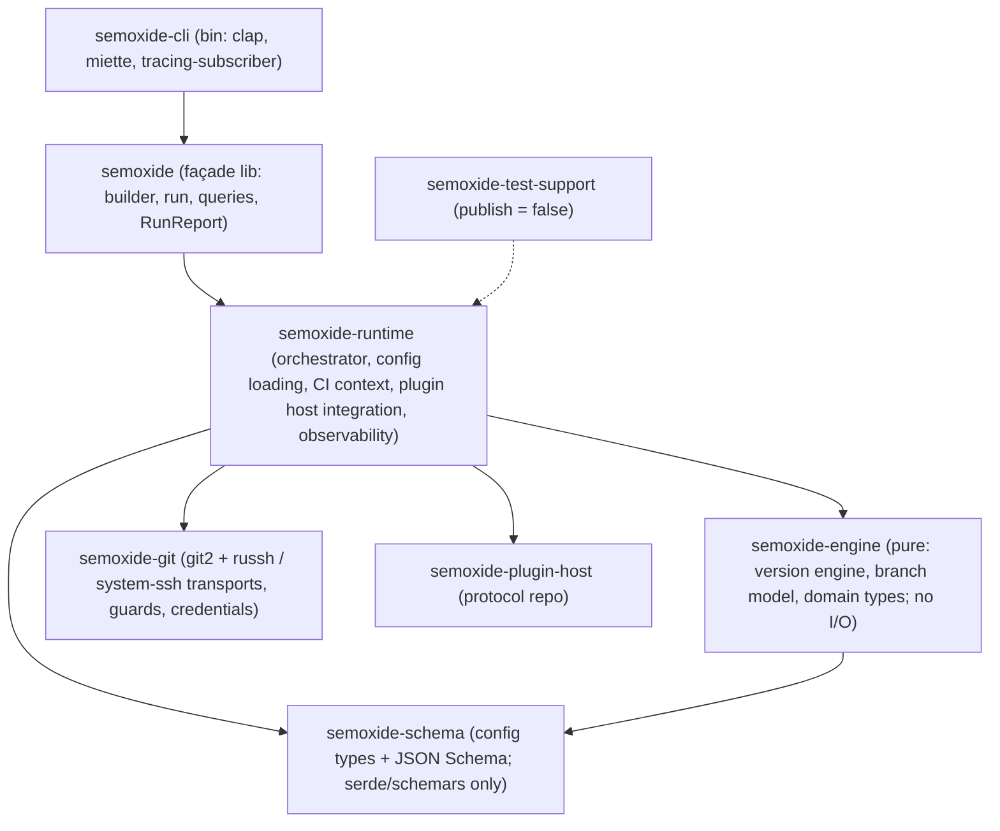

# Code architecture

How the `semoxide` repo's code is organised and where things go. System view: [ARCHITECTURE](ARCHITECTURE.md). Decisions: [DECISIONS](DECISIONS.md).

## 1. Workspace layout

A flat `crates/` workspace, split along **purity and heavy dependencies**. Each crate boundary carries real weight; inside a crate, components are modules (`pub(crate)`). This follows typst, cargo and jj.

| Crate | Holds | Heavy deps | Published |
|---|---|---|---|
| `semoxide-schema` | `semoxide.toml` types, JSON Schema generation | none (serde, schemars) | yes, internal (§5) |
| `semoxide-engine` | version engine, branch model, domain types | none: **pure, no I/O** | yes, internal (§5) |
| `semoxide-git` | git2, SSH transports, push guards, credential rules ([0011](decisions/0011-git-backend.md)) | git2, russh | yes, internal (§5) |
| `semoxide-runtime` | orchestrator, config loading, CI context, plugin host integration, observability | tokio, tonic (via `semoxide-plugin-host`) | yes, internal (§5) |
| `semoxide` | façade: the public library API ([0014](decisions/0014-porting-behaviour.md)) | – | yes |
| `semoxide-cli` | the binary | clap, miette | yes (binary) |
| `semoxide-test-support` | fixtures, git-repo DSL, builders ([0015](decisions/0015-testing.md)) | – | no |

The pure engine and the schema compile and test without git2, tonic, russh or tokio: fast rebuilds, and miri can run them.

## 2. Crate boundaries and enforcement

| Crate | May depend on | Must never use |
|---|---|---|
| `semoxide-schema` | serde, schemars | anything with I/O |
| `semoxide-engine` | `schema` | any I/O: `std::fs`, `std::net`, `std::process`, `std::env`, git2, tokio, printing |
| `semoxide-git` | `engine` types, git2, russh | tokio outside its SSH bridge; printing |
| `semoxide-runtime` | all above, `semoxide-plugin-host` | `std::env::var` (env snapshot only, [0013](decisions/0013-observability.md)); printing |
| `semoxide` | `runtime` | anything beyond re-exports and thin glue |
| `semoxide-cli` | the façade only | inner crates directly |

Enforced in CI by:
- the Cargo dependencies themselves
- a `clippy.toml` per crate with `disallowed-methods` / `disallowed-types`, each ban with a reason
- cargo-deny `bans` with `wrappers` (e.g. git2 only via `semoxide-git`, tokio never in `engine`/`schema`)

## 3. Sync vs async

- **Sync:** orchestrator, config, CI context, engine, git (git2). Async is confined to two places: the plugin host and the SSH transport bridge in `semoxide-git`.
- **Plugin host:** owns a private tokio runtime on its own thread and exposes **blocking** calls to the orchestrator. Because it runs on its own thread, it also works inside an embedder's tokio runtime (the SSH PoC proved this bridge design).
- **Façade:** both a blocking `run()` and an **async** `run()` from the start. The async one runs the sync core on a dedicated thread and awaits the result, so it doesn't depend on any particular runtime. Cancellation: §5.
- Basis: async only where concurrency is real (2025–26 consensus); the release steps run sequentially.

## 4. Error and result types

- Each crate has its own `thiserror` enum, marked `#[non_exhaustive]`.
- Every error implements one small trait of ours, `ErrorInfo`: `code()` (namespaced), `help()`, `url()`, `retryable()`, `remote_writes_happened()`, `known()` ([0013](decisions/0013-observability.md), [0016](decisions/0016-agent-experience.md)).
- The façade exposes a single `semoxide::Error` wrapping the crate errors; a step's collected errors stay a list.
- **No miette in the libraries:** the CLI converts `ErrorInfo` into miette diagnostics for display (typed errors in libraries, report layer at the edge).

## 5. Public API surface

- **Publishing:** all crates except `semoxide-test-support` go to crates.io, because a published crate's dependencies must be published too. They are versioned in lockstep. **Only the façade `semoxide` (and the CLI binary) is a stable API**; the inner crates are documented as "internal, no stability promise". `cargo-semver-checks` runs on the façade only. This is uv/ruff's model.
- **Façade shape:** builder, `run()` (blocking and async), and the read-only queries ([0014](decisions/0014-porting-behaviour.md)).
- **Cancellation is cooperative and follows the failure path.**
  - Triggers: dropping the async `run()` future, Ctrl-C, or a `CancellationToken` given to the builder.
  - The core checks the flag between steps and before every remote write.
  - Cancelled before the tag push: clean stop, nothing written. After the tag push: handled like a failed step, so `rollback` runs ([0012](decisions/0012-partial-failure.md)) and the result is a partial failure.
  - A running plugin call gets gRPC cancellation ([0010](decisions/0010-plugin-architecture.md)).

## 6. Testing layout

Decided in [0015](decisions/0015-testing.md): placement, kinds, how tests run.

## 7. Workspace config

- **Toolchain:** pinned in `rust-toolchain.toml` to the exact stable release; Renovate/Dependabot bumps it. **MSRV = latest minus 2**, checked with `cargo hack --rust-version` ([0015](decisions/0015-testing.md)).
- **Every other tool is pinned too:** CI actions (to commit SHA), cargo tools (exact versions, e.g. nextest, insta, deny, shear, semver-checks, mutants, llvm-cov, hack), qlty and its plugins, typos, zizmor, and the hook config. Pins are bumped by automation, never floating.
- **`[workspace.package]`:** `edition = "2024"`, `rust-version`, `license = "MIT OR Apache-2.0"`, `repository`, all inherited by every crate.
- **`[workspace.dependencies]`:** every external dependency is declared once; crates use `dep.workspace = true`, with the per-crate `default-features` override where needed (e.g. git2).
- **`[workspace.lints]`:** the [0017](decisions/0017-code-quality.md) policy; every crate sets `lints.workspace = true`.
- **Resolver 3. `default-members = ["crates/semoxide-cli"]`. CI uses `CARGO_BUILD_WARNINGS=deny`.**
- **Features:** few and additive only, using `dep:` syntax; no feature removes behaviour. SSH backends: `ssh-russh` (default) and `ssh-exec`.
- **Profiles:** dev/test build dependencies at `opt-level = 3`; release uses `strip = true`, `lto = "thin"`, `codegen-units = 1`.

## 8. Where things go

_Written last, from §1–§7 and §9._

## 9. Patterns

| # | Pattern | Where |
|---|---|---|
| P1 | Pure core, I/O at the edges | `semoxide-engine` takes and returns data |
| P2 | Traits only at real seams; concrete types until a 2nd implementation exists | `Plugin` (in-process / process), SSH transport (russh / system `ssh`) |
| P3 | Façade crate | `semoxide` re-exports the stable API |
| P4 | Schema-only crate | `semoxide-schema` |
| P5 | Layered merge trait (`combine(self, lower)`) | config layers |
| P6 | Command file: args → validated options → library call | each command is one small file in `semoxide-cli` |
| P7 | Builder | `Semoxide::builder()` |
| P8 | Newtypes | `Tag`, `Version`, `PluginName`, `Channel`, … |
| P9 | Parse, don't validate | raw input → types that can only be valid; the engine accepts only those |
| P10 | Typestate, only where a wrong order is costly | `Plan → Approved → Executed` |
| P11 | RAII guards | plugin processes (kill on drop), temp files, the release lock (`File::lock`) |
| P12 | Typed errors + `ErrorInfo`, rendering at the edge | §4 |
| P13 | Lints as architecture rules | §2 |
| P14 | `#[non_exhaustive]` on public enums and structs from day one | façade types, `RunReport`, errors |
| P15 | Snapshot-first output testing | [0015](decisions/0015-testing.md) |

Basis: typst, ripgrep, cargo, uv, ruff and jj, plus the 2025–26 architecture articles.

## 10. Approaches

- **A1. Failure path first.**
  - Before implementing a step, its spec gets a failure table: what can fail, whether anything remote was written, what rollback does, the error code, and whether it's `retryable`.
  - Preflight checks everything checkable before any write (P10).
  - Irreversible steps run last: with [0012](decisions/0012-partial-failure.md)'s order the reversible tag push comes before the irreversible publish.
  - Steps are idempotent, e.g. "release already exists with the same content" counts as OK.
- **A2. Test-first, per area.**

  | Area | Approach |
  |---|---|
  | Pure core (SemVer, bump rules, next version, channels, branches, commit parser, config merge) | strict spec-first TDD; ported upstream tables, specs and proptest laws are the failing tests |
  | Notes, templates | a few hand-written expected outputs plus approved snapshots |
  | CLI, JSON, `explain`, plan | outside-in: the `assert_cmd` case first |
  | git2, plugin host, forge, npm | PoC first, then characterization tests |
  | Every bug | a failing reproduction test first |

  **AI-agent workflow:**
  1. A human approves the spec or table rows.
  2. The agent writes **tests only**, against a stub, and shows them failing on assertions. That `test:` commit is human-reviewed, and the tests are **locked**: a local hook blocks agent edits, and a CI check rejects test changes outside a reviewed `test:` commit.
  3. A fresh session implements under the lock. It stops and reports rather than editing a test; new snapshots stay `.snap.new`.
  4. `cargo mutants --in-diff`: every surviving mutant becomes a test.
  5. A reviewer checks the change against the spec, the lock, and the no-mocks rule.
  6. Refactors go in separate commits with the tests unchanged.

  Basis: TDFlow (locked human tests, 2025), Beck (2025), Böckeler (2026), Anthropic's Claude Code guidance.
