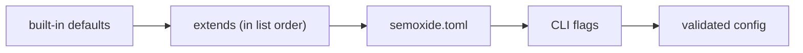

# Configuration

Reference for `semoxide.toml`. Commands that read or write it (`init`, `migrate`, `schema`, `sync`) are in [CLI.md](CLI.md); exit codes in [CLI.md](CLI.md); error codes and rendering in [OBSERVABILITY.md](OBSERVABILITY.md).

## 1. Format, discovery and layers

- TOML only, data only (no computed values, no functions).
- Discovery in the working directory: `semoxide.toml`, then `.config/semoxide.toml`. The first one found is used.
- No file found: semoxide runs with defaults.
- Unknown keys are rejected with a coded config error ([OBSERVABILITY.md](OBSERVABILITY.md) owns the `ErrorInfo` codes and the line pointer into `semoxide.toml`).
- All config, including every `[plugins.*]` section, is validated before any step runs.

Layers, lowest to highest precedence:

- CLI flags: `--set <key>=<value>` per key ([CLI.md](CLI.md)).
- Merge: tables merge key by key; arrays and scalars from a later layer replace the earlier value whole (`branches`, `release_rules` behave like upstream). `explain` shows the layer each value came from.
- `merge = "shallow"` (top level, default `"deep"`): a top-level key from a later layer replaces the whole earlier value, as upstream. Only `semoxide.toml` can set it; it is ignored in `extends` sources. CLI flags always override single keys.
- There is no env layer: config is never read from env vars. The few env vars semoxide reads are listed in [CLI.md](CLI.md#environment-variables).

## 2. `extends`

`extends = "<source>"` or a list; later entries override earlier ones, the file overrides all of them.

| Source | Form | Since |
| --- | --- | --- |
| Built-in preset | `preset:<name>` | v1 |
| Local path | `./ci/release.toml` | v1 |
| Git ref pinned to a commit SHA | `git+https://…@<sha>#<file>` | v1 |
| HTTPS URL with `sha256` | — | later |

- Git sources are fetched via git2 with the normal git credentials and cached ([ARCHITECTURE.md](ARCHITECTURE.md)); each fetched config is recorded in the lock file.
- No npm resolution. Plugins come from their pinned versions, never from an extended config's package.

## 3. Branches

`[branches]` defaults (upstream's full set):

| Branch | Type |
| --- | --- |
| `N.x`, `N.N.x` | maintenance (built-in matcher) |
| `master`, `main`, `next`, `next-major` | release |
| `beta` | prerelease (`beta`) |
| `alpha` | prerelease (`alpha`) |

- User branch patterns are `globset` globs. No extended globs.
- Version ranges per branch are computed by semoxide; versions compare by SemVer precedence (build metadata ignored, [specs/SEMVER-SPEC.md](specs/SEMVER-SPEC.md)).
- Monorepo release units (`[packages.<name>]`): [ARCHITECTURE.md](ARCHITECTURE.md).

## 4. Versions

- `initial_version`: first release version, default `1.0.0` (e.g. `"0.1.0"`).
- On 0.x, the analyzer's level maps as breaking → minor, feature → patch, fix → patch, so 0.x never leaves 0.x on its own (matches cargo and npm `^0.y`). Configurable via `[version.zero]` (`breaking`, `feature`, `fix` = `"major"|"minor"|"patch"`).
- Leaving 0.x is explicit: a commit footer `Release-As: 1.0.0` ([CONVENTIONAL-COMMITS-SPEC](specs/CONVENTIONAL-COMMITS-SPEC.md) footer syntax). `[version.zero] breaking = "major"` instead lets the first breaking change graduate. From 1.0.0 on, breaking → major as usual.
- `Release-As: <version>` footer, any version (manual override): strict SemVer, higher than the branch's last release and inside the branch range, else a coded error. On a prerelease branch the channel is appended (`2.0.0` on `beta` → `2.0.0-beta.1`). It releases even without other releasable commits. Several in range: the highest wins, with a warning listing all. Never shown in notes; `explain` shows it as the reason.

## 5. `tag_format`

- Own syntax with a single placeholder `{version}`, so versions parse back out of tags. Default `v{version}`.
- Not a template: no expressions.
- Tags are matched by version, not by name: `v1.2.3+anything` is 1.2.3, and build metadata is ignored for precedence and for "already released".
- `tag_metadata` (optional minijinja template over the run context, e.g. `"{{ commit.short_sha }}"`): appended as `+<metadata>` to the **git tag only**. Versions passed to plugins never carry `+`. `Release-As:` rejects metadata.

## 6. Templates

- Release notes and message templates (e.g. git commit message, forge templates) are minijinja.
- No JS expressions; lodash `${…}` / `<% %>` and Handlebars `.hbs` are unsupported (`migrate` reports them).
- Templates may filter, map and sort inside notes. Anything beyond TOML + templates needs a replacement `analyze_commits` / `generate_notes` plugin; there is no embedded scripting.

## 7. Commit analysis

- `preset` (top level, set once): `"conventionalcommits"` (default, `!` marks breaking) or `"angular"`. Both bundled plugins (commit-analyzer, release-notes) read it from the run context. Presets are built-in data; user presets are written in TOML. `migrate` sets `angular` for configs that relied on upstream's default.
- Default bump table:

| Commit | Release |
| --- | --- |
| breaking change | major |
| `feat` | minor |
| `fix`, `perf`, `revert` | patch |
| any other type | none |

- Parser: Conventional Commits ([specs/CONVENTIONAL-COMMITS-SPEC.md](specs/CONVENTIONAL-COMMITS-SPEC.md)) as implemented by `git-conventional`, used as-is. Known deviations from the spec: a footer `Token:value` without a space is accepted, and lowercase `breaking-change:` counts as breaking. Edge-case behaviour is pinned by tests and listed in the user docs.
- `[plugins.commit-analyzer] strict` (default `false`): when false, a commit that fails to parse never bumps and never fails the release; when true, an unparsable commit in the range fails the release with a coded error. In both modes `explain` lists every unparsable commit with its parse error.
- All commits in the range are parsed, merges included (as upstream), so a merge whose header is conventional (e.g. the PR title) counts. Unparsable merge commits and `fixup!` / `squash!` / `amend!` commits are exempt from `strict` and shown in `explain` as skipped. `[plugins.commit-analyzer] strict_merges = true` (default `false`) removes the exemption for merge commits.
- Reverts: a revert whose target is in the range cancels both (no bump, neither in notes); a revert of an earlier release's commit bumps patch. Detected forms: git's `Revert "<header>"` + `This reverts commit <sha>`, and `revert: <header>` with a `Refs: <sha>` footer. The SHA matches by unique prefix (≥ 7 chars).
- `[plugins.commit-analyzer] release_rules`: ordered list of rules overriding the table. Values are globs in which `*` also matches `/`.
- Skip marker: a commit containing `[skip release]` or `[release skip]` (any case) is excluded from the bump decision and from the notes.
- User regexes (e.g. parser patterns): `fancy-regex`, so lookaround and backreferences work. Patterns without them run in linear time; backtracking patterns run under a backtrack limit, and exceeding it is an error naming the pattern and the commit.
- Asset and path globs are standard file globs.

## 8. Notes

`[plugins.release-notes]` (TOML, no functions):

- type → section map, hidden types, sort keys.
- `locale`: collation locale for sorting groups, commits and notes, default `"en"` (matches JS `localeCompare`, [sort-order PoC](https://github.com/semoxide/semoxide-poc/tree/main/sort-order)); e.g. `"sv"`.

## 9. Plugins

`[plugins.<name>]` (short name, e.g. `[plugins.github]`):

- `version = "1.4.2"`: pinned version; `semoxide sync` downloads it and records its checksum in the lock file.
- `timeouts.<step> = "1h"`: per-step deadline override.
- `show_output = true`: show captured plugin output live ([OBSERVABILITY.md](OBSERVABILITY.md)).
- Any other keys are the plugin's own options, validated against the schema the plugin reports.
- `[steps.<step>] order = [...]` overrides plugin order for one step.
- `success_errors = "warn"` (default) or `"fail"`: what a failing `success` step does to an already published release ([ARCHITECTURE.md](ARCHITECTURE.md#7-failure-and-rollback)).

Plugin mechanics, the lock file and step semantics: [ARCHITECTURE.md](ARCHITECTURE.md).

## 10. Secrets

- `mask_env = ["NAME", …]`: extra env var names whose values are masked. Detection rules and masking: [OBSERVABILITY.md](OBSERVABILITY.md).

## 11. Bot identity (commit-back)

The author of commits made by `[plugins.git]` ([ARCHITECTURE.md](ARCHITECTURE.md)) resolves in this order:

1. `[plugins.git] author` in config.
2. `GIT_AUTHOR_*` / `GIT_COMMITTER_*` from the env snapshot.
3. The CI platform's bot: GitHub Actions uses `github-actions[bot] <41898282+github-actions[bot]@users.noreply.github.com>`. GitLab and other CIs have none.
4. semoxide default: `semoxide-bot` with the GitHub noreply address of the `semoxide-bot` GitHub account (account not yet created). At full release the default moves to an address on a semoxide-owned domain.

## 12. JSON Schema

- Generated from the `semoxide-schema` types with schemars ([CODE-ARCHITECTURE.md](CODE-ARCHITECTURE.md)) and committed to the repo.
- The editor schema for `semoxide.toml` includes the configured plugins' option schemas.
