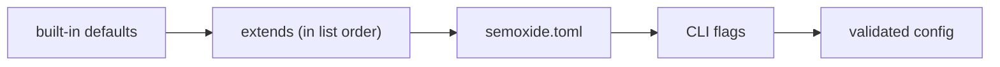

# Configuration

Reference for `semoxide.toml`. Commands that read or write it (`init`, `migrate`, `schema`, `sync`) are in [CLI.md](CLI.md); exit codes in [CLI.md](CLI.md); error codes and rendering in [OBSERVABILITY.md](OBSERVABILITY.md).

## 1. Format, discovery and layers

- TOML only, data only (no computed values, no functions).
- Every key lives in a domain table; dotted keys keep small configs short (`tags.format = "v{version}"`).
- Discovery in the run's directory (the current directory, or `--cwd`; parent directories aren't searched, as upstream): `semoxide.toml`, then `.config/semoxide.toml`. The first one found is used; if both exist, the other is reported as ignored (a warning).
- A file that isn't valid TOML is `config::invalid_toml` (with the parser's line and column); one that exists but can't be read (permissions, not UTF-8, a directory) is `config::unreadable`.
- No file found: semoxide runs with defaults.
- Unknown keys are rejected with a coded config error ([OBSERVABILITY.md](OBSERVABILITY.md) owns the `ErrorInfo` codes and the line pointer into `semoxide.toml`).
- All config, including every `[plugins.*]` section, is validated before any step runs.

| Domain | Keys | Section |
| --- | --- | --- |
| `config` | `extends`, `merge` | [§1](#1-format-discovery-and-layers), [§2](#2-configextends) |
| `branches` | `rules` | [§3](#3-branches) |
| `version` | `initial`, `zero` | [§4](#4-versions) |
| `tags` | `format`, `metadata` | [§5](#5-tags) |
| `commits` | `preset` | [§7](#7-commit-analysis) |
| `plugins.<name>` | `version`, `timeouts`, `show_output`, plugin options | [§9](#9-plugins-and-steps) |
| `steps` | `plugins`, `<step>.order`, `success.errors` | [§9](#9-plugins-and-steps) |
| `secrets` | `mask_env` | [§10](#10-secrets) |
| `packages.<name>` | monorepo units (not yet accepted) | [ARCHITECTURE.md](ARCHITECTURE.md) |

A config using every domain:

```toml
[config]
extends = "preset:rust"
merge = "deep"

[commits]
preset = "conventionalcommits"

[version]
initial = "0.1.0"
zero = { breaking = "minor", feature = "patch", fix = "patch" }

[branches]
rules = [{ maintenance = "N.x" }, "main", { name = "beta", prerelease = true }]

[tags]
format = "v{version}"

[steps]
plugins = ["commit-analyzer", "release-notes", "git", "github"]
publish.order = ["github", "git"]
success.errors = "warn"

[plugins.github]
version = "1.4.2"

[secrets]
mask_env = ["DEPLOY_TOKEN"]
```

Layers, lowest to highest precedence:



- Built-in defaults are a real layer, generated from the defaults in code ([Defaults](#defaults)); it is always merged first and key by key.
- CLI flags: `--set <key>=<value>` per key ([CLI.md](CLI.md)).
- Merge: tables merge key by key; arrays and scalars from a later layer replace the earlier value whole (`branches.rules`, `steps.plugins`, `release_rules` behave like upstream). The merge records a source per key path (`default`, `file <path>`, `--set #n`); `explain` shows it, and errors point at it.
- `config.merge = "shallow"` (default `"deep"`): between user layers (`extends` sources and the file), a domain from a later layer replaces the whole earlier domain, as upstream's top-level keys do. Defaults still fill every key the user layers leave unset, as upstream fills its defaults per key. Only `semoxide.toml` can set `config.merge` and `config.extends`; both are ignored in `extends` sources. CLI flags always override single keys.
- There is no env layer: config is never read from env vars. The few env vars semoxide reads are listed in [CLI.md](CLI.md#environment-variables).

### Defaults

Keys not listed have no default (unset). A test keeps this table in sync with the code.

| Key | Default |
| --- | --- |
| `config.merge` | `"deep"` |
| `commits.preset` | `"conventionalcommits"` |
| `version.initial` | `"1.0.0"` |
| `version.zero.breaking` | `"minor"` |
| `version.zero.feature` | `"patch"` |
| `version.zero.fix` | `"patch"` |
| `branches.rules` | upstream's set ([§3](#3-branches)) |
| `tags.format` | `"v{version}"` |
| `steps.plugins` | `["commit-analyzer", "release-notes"]` |
| `steps.success.errors` | `"warn"` |
| `secrets.mask_env` | `[]` |
| `plugins.<name>.show_output` | `false` |

## 2. `config.extends`

`config.extends = "<source>"` or a list; later entries override earlier ones, the file overrides all of them.

| Source | Form | Since |
| --- | --- | --- |
| Built-in preset | `preset:<name>` | v1 |
| Local path | `./ci/release.toml` | v1 |
| Git ref pinned to a commit SHA | `git+https://…@<sha>#<file>` | v1 |
| HTTPS URL with `sha256` | — | later |

- Git sources are fetched via git2 with the normal git credentials and cached ([ARCHITECTURE.md](ARCHITECTURE.md)); each fetched config is recorded in the lock file.
- No npm resolution. Plugins come from their pinned versions, never from an extended config's package.

## 3. Branches

`branches.rules` is an ordered array; each entry is a branch name (a release branch) or an inline table. Order matters as upstream: the first release branch is the main line. Default (upstream's full set):

```toml
[branches]
rules = [
  { maintenance = "N.x" },
  "master",
  "main",
  "next",
  "next-major",
  { name = "beta", prerelease = true },
  { name = "alpha", prerelease = true },
]
```

| Kind | Forms | Fields |
| --- | --- | --- |
| Release | `"main"` or `{ name = "main", channel = … }` | `name`: branch name or `globset` glob (no extended globs), expanded per matching remote branch |
| Prerelease | `{ name = "beta", prerelease = true }` | `prerelease`: `true` (identifier = branch name) or a string (`"rc"`) |
| Maintenance | `{ maintenance = "N.x" }`, `{ maintenance = "release/N.x" }`, `{ maintenance = "legacy", range = "1.x" }` | built-in matcher: the pattern ends in `N.x`, `N.x.x` or `N.N.x` (`N` = a number); each matches branch names of all three shapes (`1.x`, `1.x.x`, `1.2.x`, `x` in any case, as upstream), and the range comes from the matched name (`1.x` = `>=1.0.0 <2.0.0`, `1.2.x` = `>=1.2.0 <1.3.0`). A name without that ending needs `range` (`1.x`, `1.x.x` or `1.2.x`) |

- `channel` (any kind): unset = the default channel for the first release branch, the branch name for the others; `false` = the default channel; a non-empty string is used as given.
- `prerelease = true` uses the branch name as the identifier; with a literal name it must be a valid SemVer identifier (`1.0.0-<id>.1` parses). Globs and `{name}` templates are checked after expansion against the actual branch names.
- `channel` and `prerelease` strings accept one placeholder, `{name}`, the actual branch name a glob matched (`{ name = "release/*", prerelease = "rc", channel = "{name}" }`). No other expressions.
- Rejected when the config loads (`config::invalid_value` unless noted):
  - unknown keys in an entry (`config::unknown_key`); `name` with `maintenance`, `prerelease` on a maintenance entry, `range` with a pattern that already ends in `N.x` (`config::conflicting_keys`, pointing at the extra key: `maintenance` next to `name`, `prerelease` or `range` on a maintenance entry);
  - an entry without `name`/`maintenance`, or neither a string nor a table; an empty `rules`;
  - a maintenance pattern without the `N.x` ending and no `range`; an invalid `range`;
  - upstream-style maintenance entries, which would otherwise silently become release branches: a name shaped like a range (`"1.x"`, `{ name = "1.2.x" }`) or `range` on a `name` entry; the message points to `{ maintenance = … }`, and `migrate` converts them;
  - `prerelease = false` (a release branch simply has no `prerelease` key), an invalid literal prerelease identifier, `channel = true`, `channel = ""`, any placeholder other than `{name}`.
- Checks across rules (1 to 3 release branches, unique prerelease identifiers and ranges, no duplicate names) run after glob expansion, when the remote branches are known, not when the config loads.
- Version ranges per branch are computed by semoxide; versions compare by SemVer precedence (build metadata ignored, [specs/SEMVER-SPEC.md](specs/SEMVER-SPEC.md)).
- Monorepo release units (`[packages.<name>]`): [ARCHITECTURE.md](ARCHITECTURE.md).

## 4. Versions

- `version.initial`: first release version, default `1.0.0` (e.g. `"0.1.0"`).
- On 0.x, the analyzer's level maps as breaking → minor, feature → patch, fix → patch, so 0.x never leaves 0.x on its own (matches cargo and npm `^0.y`). Configurable via `version.zero` (`breaking`, `feature`, `fix` = `"major"|"minor"|"patch"`).
- Leaving 0.x is explicit: a commit footer `Release-As: 1.0.0` ([CONVENTIONAL-COMMITS-SPEC](specs/CONVENTIONAL-COMMITS-SPEC.md) footer syntax). `version.zero.breaking = "major"` instead lets the first breaking change graduate. From 1.0.0 on, breaking → major as usual.
- `Release-As: <version>` footer, any version (manual override): strict SemVer, higher than the branch's last release and inside the branch range, else a coded error. On a prerelease branch the channel is appended (`2.0.0` on `beta` → `2.0.0-beta.1`). It releases even without other releasable commits. Several in range: the highest wins, with a warning listing all. Never shown in notes; `explain` shows it as the reason.

## 5. Tags

- `tags.format`: own syntax with a single placeholder `{version}`, so versions parse back out of tags. Default `v{version}`.
- Not a template: no expressions.
- Tags are matched by version, not by name: `v1.2.3+anything` is 1.2.3, and build metadata is ignored for precedence and for "already released".
- `tags.metadata` (optional minijinja template over the run context, e.g. `"{{ commit.short_sha }}"`): appended as `+<metadata>` to the **git tag only**. Versions passed to plugins never carry `+`. `Release-As:` rejects metadata.

## 6. Templates

- Release notes and message templates (e.g. git commit message, forge templates) are minijinja.
- No JS expressions; lodash `${…}` / `<% %>` and Handlebars `.hbs` are unsupported (`migrate` reports them).
- Templates may filter, map and sort inside notes. Anything beyond TOML + templates needs a replacement `analyze_commits` / `generate_notes` plugin; there is no embedded scripting.

## 7. Commit analysis

- `commits.preset` (set once): `"conventionalcommits"` (default, `!` marks breaking) or `"angular"`. Both bundled plugins (commit-analyzer, release-notes) read it from the run context. Presets are built-in data; user presets are written in TOML. `migrate` sets `angular` for configs that relied on upstream's default.
- Default bump table:

| Commit | Release |
| --- | --- |
| breaking change | major |
| `feat` | minor |
| `fix`, `perf`, `revert` | patch |
| any other type | none |

- Parser: Conventional Commits ([specs/CONVENTIONAL-COMMITS-SPEC.md](specs/CONVENTIONAL-COMMITS-SPEC.md)) as implemented by `git-conventional`, used as-is. Known deviations from the spec: a footer `Token:value` without a space is accepted, and lowercase `breaking-change:` counts as breaking. Edge-case behaviour is pinned by tests and listed in the user docs.
- `[plugins.commit-analyzer] strict` (default `false`): when false, a commit that fails to parse never bumps and never fails the release; when true, an unparsable commit in the range fails the release with a coded error. In both modes `explain` lists every unparsable commit with its parse error.
- All commits in the range are parsed, merges included (as upstream), so a merge whose header is conventional (e.g. the PR title) counts. Unparsable merge commits and `fixup!` / `squash!` / `amend!` commits are exempt from `strict` and shown in `explain` as skipped. `[plugins.commit-analyzer] strict_merges = true` (default `false`) removes the exemption for merge commits.
- Reverts: a revert whose target is in the range cancels both (no bump, neither in notes); a revert of an earlier release's commit bumps patch. Detected forms: git's `Revert "<header>"` + `This reverts commit <sha>`, and `revert: <header>` with a `Refs: <sha>` footer. The SHA matches by unique prefix (≥ 7 chars).
- `[plugins.commit-analyzer] release_rules`: ordered list of rules overriding the table. Values are globs in which `*` also matches `/`.
- Skip marker: a commit containing `[skip release]` or `[release skip]` (any case) is excluded from the bump decision and from the notes.
- User regexes (e.g. parser patterns): `fancy-regex`, so lookaround and backreferences work. Patterns without them run in linear time; backtracking patterns run under a backtrack limit, and exceeding it is an error naming the pattern and the commit.
- Asset and path globs are standard file globs.

## 8. Notes

`[plugins.release-notes]` (TOML, no functions):

- type → section map, hidden types, sort keys.
- `locale`: collation locale for sorting groups, commits and notes, default `"en"` (matches JS `localeCompare`, [sort-order PoC](https://github.com/semoxide/semoxide-poc/tree/main/sort-order)); e.g. `"sv"`.

## 9. Plugins and steps

`[plugins.<name>]` (short name, e.g. `[plugins.github]`):

- `version = "1.4.2"`: pinned version; `semoxide sync` downloads it and records its checksum in the lock file.
- `timeouts.<step> = "1h"`: per-step deadline override.
- `show_output = true`: show captured plugin output live ([OBSERVABILITY.md](OBSERVABILITY.md)).
- Any other keys are the plugin's own options, validated against the schema the plugin reports. They travel as JSON values, so a TOML date-time, `nan` or `inf` in them is rejected (`config::invalid_value`); quote dates as strings.
- `steps.plugins = [...]`: the enabled plugins in run order (upstream's `plugins` array). An option table for a plugin not in the list is rejected with a coded error.
- `steps.<step>.order = [...]` overrides plugin order for one step.
- `steps.success.errors = "warn"` (default) or `"fail"`: what a failing `success` step does to an already published release ([ARCHITECTURE.md](ARCHITECTURE.md#7-failure-and-rollback)).

Plugin mechanics, the lock file and step semantics: [ARCHITECTURE.md](ARCHITECTURE.md).

## 10. Secrets

- `secrets.mask_env = ["NAME", …]`: extra env var names whose values are masked. Detection rules and masking: [OBSERVABILITY.md](OBSERVABILITY.md).

## 11. Bot identity (commit-back)

The author of commits made by `[plugins.git]` ([ARCHITECTURE.md](ARCHITECTURE.md)) resolves in this order:

1. `[plugins.git] author` in config.
2. `GIT_AUTHOR_*` / `GIT_COMMITTER_*` from the env snapshot.
3. The CI platform's bot: GitHub Actions uses `github-actions[bot] <41898282+github-actions[bot]@users.noreply.github.com>`. GitLab and other CIs have none.
4. semoxide default: `semoxide-bot <338146621+semoxide-bot@users.noreply.github.com>` (the `semoxide-bot` GitHub account's noreply address). At full release the default moves to an address on a semoxide-owned domain.

## 12. JSON Schema

- [`schemas/semoxide.schema.json`](../schemas/semoxide.schema.json), JSON Schema draft-07, generated from the `semoxide-schema` types with schemars ([CODE-ARCHITECTURE.md](CODE-ARCHITECTURE.md)) and committed. Each table's schema sits next to its parser and takes its defaults from the code.
- Editors based on Taplo (Even Better TOML, Zed) pick it up from a comment on the first line of `semoxide.toml`:

  ```toml
  #:schema https://raw.githubusercontent.com/semoxide/semoxide/main/schemas/semoxide.schema.json
  ```

- Tests keep it in step with the parser: every table lists exactly the parser's keys and rejects others (except `[plugins.<name>]`, open for the plugin's options), the defaults match, every config the parser accepts validates, and each rejected config is marked as rejected by the schema too or only by the parser (checks across keys). A type change without regenerating fails the test suite; regenerate with `SEMOXIDE_UPDATE_SCHEMA=1 cargo nextest run -p semoxide-schema` and review the diff.
- The editor schema for `semoxide.toml` includes the configured plugins' option schemas.
