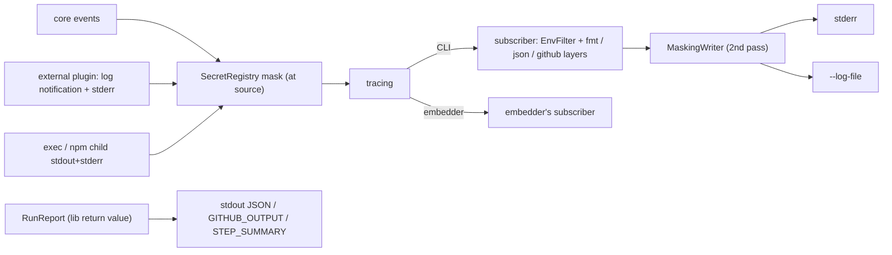
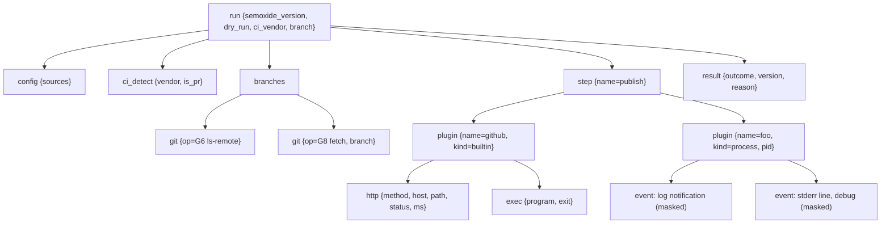

# Observability

**Status: proposed** (Wave B). Covers logging, debugging, secret masking, CI output and error reporting. Upstream behavior lives in the research and is only linked here: [logger, `debug`, hook-std, masking](research/semantic-release.md#4-side-effects), [masking rule](specs/SEMANTIC-RELEASE-SPEC.md#6-ci-git-and-auth), [plugin `log` notifications](research/plugin-mechanisms.md#recommendation-e-hybrid).

## 1. Principles

| # | Rule | Replaces upstream |
|---|---|---|
| P1 | The library emits `tracing` spans and events only. It never installs a subscriber and never writes to stdout or stderr | signale logger + `debug` namespaces |
| P2 | Secrets are masked **at the source** (core, plugin host, exec runner) before anything is emitted. The writer-level mask is a second line of defense | `hook-std` global stdout patching |
| P3 | The library takes an explicit `Env` snapshot and never reads or mutates the process env | `Object.assign(process.env, …)` ([port notes](research/semantic-release.md#6-rust-port-notes)) |
| P4 | Results are data (`RunReport`), not log lines. Logs go to stderr and data goes to stdout or files | logs + dry-run notes mixed on stdout |
| P5 | No release is never silent: a typed reason is always reported | [top complaint](research/semantic-release.md#8-issue-history) |

## 2. CLI flags and env

| Flag / env | Effect |
|---|---|
| (default) | `semoxide=info`, deps `warn` |
| `-q` / `-qq` | `warn` / `error` only. The final result line is still printed |
| `-v` / `-vv` | `semoxide=debug` / `semoxide=trace` |
| `--debug` | `semoxide=trace,git2=debug,reqwest=debug`, error SpanTraces, span close timings. Auto-on when `RUNNER_DEBUG=1` (GHA "re-run with debug logging") |
| `SEMOXIDE_LOG=<EnvFilter>` | Overrides all of the above. `RUST_LOG` is ignored (open decision) |
| `--log-format=auto\|pretty\|json\|github` | `auto` = `github` if `GITHUB_ACTIONS=true`, else `pretty`. `json` = one object per event with span fields, for CI log processing |
| `--log-file <path>` | Extra JSON layer at `trace`, own filter, independent of console verbosity. Upload as a CI artifact |
| `--color=auto\|always\|never` | `auto` = TTY or GHA, and no `NO_COLOR`. `CLICOLOR_FORCE` forces on |
| `--output=text\|json` | Format of the `RunReport` on stdout |

### Targets (EnvFilter)
| Target / span filter | Content |
|---|---|
| `semoxide::core` | orchestration, branch model, version math |
| `semoxide::config` | layer sources, effective values (redacted) |
| `semoxide::git` | git2 ops, field `op` = G-number from [git ops](research/semantic-release.md#3-git-operations) |
| `semoxide::http` | method, host, path (no query/userinfo), status, ms, rate-limit headers. Bodies only on error status, truncated, never for auth/OIDC endpoints |
| `semoxide::plugin` | external plugin log notifications and stderr |
| `semoxide::exec` | child process output (line by line) |
| `[plugin{name=github}]=trace` | per-plugin filtering via span field. `tracing` targets must be `'static`, so the plugin name is a span field, not a target |
| `git2`, `reqwest`, `hyper` | dependency internals, `warn` unless `--debug` |

## 3. Span structure

- Step timing: the CLI's `TimingLayer` records `step` and `plugin` span durations, prints `✔ publish 1.2s` on close, and renders a timing table at the end. Durations are also in `RunReport.timings` for embedders.
- `pretty` shows elapsed time, not wall clock (CI runners already add timestamps). `json` has both.

## 4. Secret masking

### Registry
`SecretRegistry` is per run (shareable across runs by an embedder) and holds an `Arc` Aho-Corasick automaton that is rebuilt on insert.

| Source | When registered |
|---|---|
| `Env` vars matching the upstream name pattern + length rule ([spec §6](specs/SEMANTIC-RELEASE-SPEC.md#6-ci-git-and-auth)) | run start |
| Built-in plugin values: `ctx.secrets().register(v)` | on creation (OIDC-exchanged tokens, GitHub App installation tokens) |
| External plugin values: `secrets` in the `initialize` result + a `register_secret` notification | before the plugin's next log line is accepted |
| Config values typed `Secret<String>` | config load |

`Secret<T>`: a thin wrapper over `secrecy::SecretBox` with `Debug`/`Display` = `[secure]` and no `Serialize`. Constructing one through a context auto-registers it.

### Masked forms
| Form | Upstream | semoxide |
|---|---|---|
| raw, `encodeURI`, `encodeURIComponent`, `:`-preserving ([side effects](research/semantic-release.md#4-side-effects)) | yes | yes |
| base64 of `user:token` (HTTP Basic, git credential) and of the bare token | **no** | yes (addition) |
| replacement text | `[secure]` | `[secure]` |

### Where masking applies
| Path | Mechanism |
|---|---|
| core events | `Secret<T>` fields + `url_for_log()` strips userinfo from any URL |
| plugin log notifications, plugin stderr, exec output | line-buffered mask in the plugin host / exec runner before `tracing` |
| `generateNotes` output, `success`/`fail` payloads | mask on the value (as upstream) |
| console, `--log-file`, GHA commands | `MaskingWriter` (a `MakeWriter` wrapper), second pass, catches dependency events |
| panics | CLI panic hook formats through `MaskingWriter` |
| disk | never write secrets: no temp `.npmrc` ([npm side effects](research/npm.md#4-side-effects), [fix](research/npm.md#5-rust-port-notes)); auth goes to children through env |

### Embedders
- They get at-source masking for free (P2), independent of their subscriber.
- Dependency events (git2, reqwest) are masked only if the embedder wraps its writer: `semoxide::observe::MaskingWriter::new(w, run.secrets())`.
- Optional helper `semoxide::observe::subscriber(&opts)` (feature `observe`) builds the same stack the CLI uses. The embedder calls it explicitly, so P1 holds.

## 5. Plugin output

| Input | Mapped to |
|---|---|
| `log {level, message, fields?}` notification | event, target `semoxide::plugin`, inside `plugin{name}` span, level as sent (clamped: a plugin can't emit `error` without failing the step) |
| stderr line | `debug` event, field `stream="stderr"` |
| stdout | reserved for JSON-RPC. A non-protocol line is a protocol error, logged masked at `warn` |
| exec plugin / `npm publish` child | `info` events, target `semoxide::exec`, live ([exec contract](research/dependencies.md#8-semantic-releaseexec)) |
| built-in plugins | plain `tracing` macros inside the same `plugin{name}` span |

Untrusted text (plugin output, commit subjects, notes) that starts with `::` is escaped in `github` format, so it can't inject workflow commands.

## 6. CI integration

### GitHub Actions (`github` format)
| Feature | Use |
|---|---|
| `::group::<step>` / `::endgroup::` | one group per step (GHA groups don't nest) |
| `::error title=<CODE>::` / `::warning::` | error and warn events. `file=`/`line=` when the diagnostic has a config span |
| `::notice::` | final outcome: released version or no-release reason |
| `::add-mask::` | every derived secret and its encoded forms, written **bypassing** `MaskingWriter`. Env-provided GHA secrets are already masked by the runner |
| `$GITHUB_OUTPUT` | `released`, `version`, `tag`, `channel`, `type`, `last_version`, `notes` (random heredoc delimiter); matches the [Action outputs](research/distribution-config.md#github-action-shape) |
| `$GITHUB_STEP_SUMMARY` | outcome, no-release reason, version table, timing table, notes in `
` |

### Other CIs and embedders
- `--output=json` prints `RunReport` on stdout. `--output-env <file>` writes dotenv (`SEMOXIDE_RELEASED=…`), e.g. for GitLab `artifacts:reports:dotenv`.
- Library: `run()` → `Result<RunReport, Error>`. `RunReport { outcome: Released | Promoted | NoRelease(reason), last_release, next_release, releases, commits, timings, warnings }`, `serde`-serializable. This also covers the upstream rejected `--json` / print-version requests ([#753, #3877](research/semantic-release.md#8-issue-history)).

## 7. Diagnostics

### No-release reasons (`NoReleaseReason`, always printed at `info`)
| Reason | Hint printed |
|---|---|
| `NotCi` / `PullRequest` | CI detection result ([env-ci](research/dependencies.md#5-env-ci)) |
| `BranchNotConfigured {branch, configured}` | closest glob |
| `NoCommitsSince {tag}` | last tag + sha |
| `NoRelevantCommits {n}` | per-commit verdict table at `-v` (type → rule → bump or none) |
| `SkipReleaseMarker` | which commits |
| `TagsNotFound {shallow}` | shallow clone or `tag_format` mismatch, with near-miss tags listed |
| `PathFiltered` (monorepo) | unit path filter |

### Commands
| Command | Does | Network |
|---|---|---|
| `semoxide explain [--commit <sha>]` | read-only decision trace: branch match → last release → commits → per-commit bump → next version (or reason) | none, local refs only |
| `semoxide doctor [--online]` | checklist: repo, shallow, tags present, CI vendor/branch, token env **names** set, plugin resolution + handshake, config validation. `--online`: auth/permission probes. Each failure links its error code | opt-in |
| `--dry-run` plan | [ADR 0005](decisions/0005-dry-run.md) semantics. Output: version, tag, channel, per step × plugin "would do" lines (optional `describe` in the plugin protocol), notes preview | reads only |
| `semoxide doctor --bundle <file>` | support bundle (markdown, `--output=json` for JSON): semoxide version/target/features, OS, git facts (HEAD, branch, shallow, tag count, remote host only), CI vendor + CI env **names**, secret-pattern env **names** with set/unset, effective config with per-key source (redacted), plugins + versions + protocol, last `--log-file` re-masked | none |

## 8. Error reporting

- Library: `thiserror` enums deriving `miette::Diagnostic`: `code`, `help`, `url`, config `labels` (TOML spans), `related` for aggregated errors (upstream AggregateError: [error aggregation](research/semantic-release.md#error-aggregation)).
- Catalog: one entry per code, extending the core catalog (~23 codes) plus plugin codes (e.g. github, npm). Each code has help text and a doc URL `…/errors/<CODE>`. The docs page is generated from the catalog, and a test fails on any code without docs. Naming (upstream mnemonics like `ENOGITREPO` vs new scheme): open decision.
- CLI rendering: miette graphical on a TTY, narratable (plain) in CI, an `error` object in `json`. `--debug` appends the `tracing-error` SpanTrace (step → plugin → op).

| Exit | Meaning |
|---|---|
| 0 | released, promoted, or no release |
| 1 | release failed before any remote write |
| 2 | CLI usage error (clap) |
| 3 | config invalid |
| 4 | verify failed (auth, permissions, verifyConditions) |
| 5 | **partial**: tag pushed, a later step failed (upstream #896/#2381 state); summary lists what was written |
| 101 | panic (bug); the hook prints the issue link + bundle command |
| 130 | interrupted |

## 9. Crates

| Crate | Where | Why |
|---|---|---|
| `tracing` | lib | facade; near-zero cost without a subscriber; spans carry step/plugin context |
| `tracing-subscriber` (`env-filter`, `fmt`, `json`, `registry`) | CLI, `observe` feature | EnvFilter syntax incl. span-field filters; layered sinks |
| `tracing-error` | lib + CLI | SpanTrace in errors: which step/plugin/op failed |
| `miette` (`fancy` in CLI only) | lib derive, CLI render | code/help/url/labels; renders TOML spans. Chosen over `color-eyre`, which is app-only and untyped |
| `thiserror` | lib | typed error enums |
| `secrecy` | lib | redacted `Debug`, zeroize; base of `Secret<T>` |
| `aho-corasick` | lib | multi-pattern masking in one pass |
| `percent-encoding`, `base64` | lib | masked forms |
| `anstream` / `anstyle` | CLI | color + `NO_COLOR` handling, shared with clap |
| `serde_json` | lib + CLI | `RunReport`, json logs, bundle |
| `reqwest-tracing` | lib | an `http` span per request via the [reqwest-middleware stack](research/github.md#5-rust-port-notes); configured to drop query + headers |
| `git2::trace_set` (libgit2 trace callback, unverified) | lib | libgit2 internals bridged into tracing under `git2` target |

## Ticket candidates
- Observability ADR — record P1–P5, `SEMOXIDE_LOG` vs `RUST_LOG`, exit codes, error-code naming.
- tracing instrumentation baseline — target list, span tree, field names, `url_for_log()`.
- CLI subscriber — verbosity flags, `--debug`, `RUNNER_DEBUG`, EnvFilter, `pretty`/`json` formats, `--color`, `--log-file`.
- SecretRegistry + `Secret<T>` — env pattern scan, registration API, encoded forms incl. base64, automaton rebuild.
- MaskingWriter — line-buffered `MakeWriter` wrapper, panic hook, `observe::subscriber()` helper for embedders.
- Plugin log bridge — protocol `log`/`register_secret`/`secrets`, stderr capture, level clamp, stdout protocol guard.
- Exec output streaming — live masked child output for exec/npm.
- GitHub Actions layer — groups, annotations, `::add-mask::`, `::` escaping, `GITHUB_OUTPUT`, `GITHUB_STEP_SUMMARY`.
- RunReport + machine outputs — serde type, `--output=json`, `--output-env` dotenv.
- NoReleaseReason — typed reasons + hints, always logged.
- `semoxide explain` — read-only decision trace, per-commit verdicts.
- `semoxide doctor` + `--bundle` — checklist, `--online` probes, redacted support bundle.
- Dry-run plan output — per-plugin "would do" lines; `describe` method in plugin protocol v1.
- Error catalog + miette diagnostics — codes, help, generated docs pages, docs-coverage test, exit codes.
- Secret-leak test suite — port upstream `plugin-log-env` fixture; assert no secret (any encoded form) in console, log file, GHA outputs, bundle.
- PoC: observability (Wave B) — tracing span-field filter for plugins, MaskingWriter throughput, reqwest-tracing + libgit2 trace callback output check.
