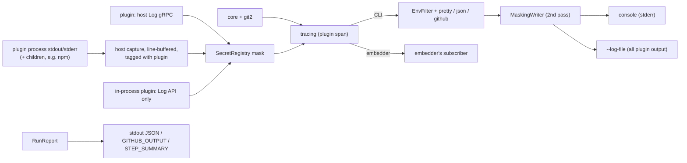
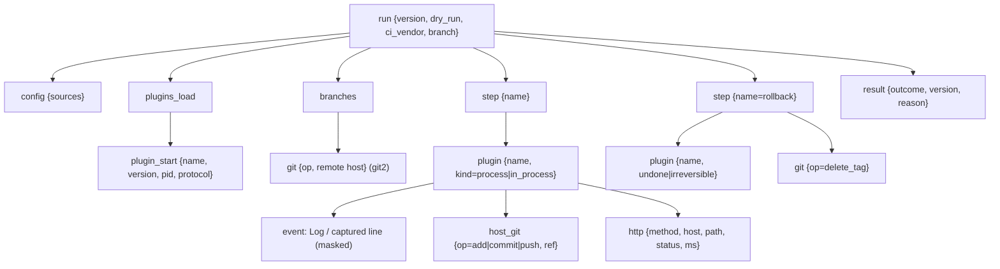

# Observability

Logging, debugging, secret masking, CI output and error reporting. Items backed by an ADR say so; **everything else is proposed**. Upstream behavior is only linked: [logger, `debug`, hook-std, masking](research/semantic-release.md#4-side-effects), [masking rule](specs/SEMANTIC-RELEASE-SPEC.md#6-ci-git-and-auth).

## 1. Principles (decided: [ADR 0013](decisions/0013-observability.md))

| # | Rule | Replaces upstream |
|---|---|---|
| P1 ✅ [ADR 0013](decisions/0013-observability.md) | The library emits `tracing` spans/events only. It never installs a subscriber or writes to stdout/stderr | signale + `debug` |
| P2 ✅ [ADR 0013](decisions/0013-observability.md) | Secrets are masked **at the source** (core, plugin host) before emission; a writer-level mask is the second pass | `hook-std` stdout patching |
| P3 ✅ [ADR 0013](decisions/0013-observability.md) | The library takes an explicit `Env` snapshot and never reads or mutates the process env | `Object.assign(process.env, …)` ([port notes](research/semantic-release.md#6-rust-port-notes)) |
| P4 ✅ [ADR 0013](decisions/0013-observability.md) | Results are data (`RunReport`), not log lines. Logs on stderr, data on stdout/files | logs + dry-run notes mixed on stdout |
| P5 ✅ [ADR 0013](decisions/0013-observability.md) | No release is never silent: a typed reason is always reported | [top complaint](research/semantic-release.md#8-issue-history) |

## 2. Log flow

Plugin side per [ADR 0010](decisions/0010-plugin-architecture.md) ("Host services", "Plugin output", "In-process limits"); sinks proposed.

### Plugin output (decided, ADR 0010)

| Source | Handling |
|---|---|
| `Log` host service | event inside `plugin{name}` span, level as sent; an `error` from a step that then succeeds fails the step (`core::plugin_error_on_success`, ADR 0013) |
| Plugin stdout/stderr, incl. child tools | captured, masked, tagged with the plugin; never parsed (results only via gRPC) |
| In-process plugin | `Log` API only; the conformance kit checks it doesn't print |

Display of captured output: in full when that plugin's step fails, live with `-v`/`--debug`, always in `--log-file`; `[plugins.<name>] show_output = true` shows it live on every run. Captured lines are `debug` events with `stream="stdout|stderr"` (ADR 0013).

Untrusted text (plugin output, commit subjects, notes) starting with `::` is escaped in `github` format (proposed).

## 3. CLI flags and filters (decided: [ADR 0013](decisions/0013-observability.md))

| Flag / env | Effect |
|---|---|
| (default) | `semoxide=info`, deps `warn` |
| `-q` / `-qq` | `warn` / `error`; the final result line still prints |
| `-v` / `-vv` | `semoxide=debug` / `trace`; live plugin output |
| `--debug` | `semoxide=trace,git2=debug,reqwest=debug`, SpanTraces, span timings. Auto-on with `RUNNER_DEBUG=1` or `CI_DEBUG_TRACE=true` |
| `SEMOXIDE_LOG=<EnvFilter>` (fallback `RUST_LOG`; ADR 0013) | overrides the above |
| `--log-format=auto\|pretty\|json\|github\|gitlab` | `auto` = `github` under `GITHUB_ACTIONS=true`, `gitlab` under `GITLAB_CI=true` (collapsible sections, no annotations), else `pretty` |
| `--log-file <path>` | JSON at `trace`, own filter |
| `--color=auto\|always\|never` | honors `NO_COLOR`, `CLICOLOR_FORCE` |
| `--output=text\|json` | `RunReport` format on stdout |

Targets: `semoxide::core`, `::config` (redacted values), `::git` (field `op` = G-number from [git ops](research/semantic-release.md#3-git-operations)), `::http` (no query/userinfo; bodies only on error, never for auth endpoints), `::plugin`. Per-plugin filtering uses the span field (`[plugin{name=github}]=trace`), since `tracing` targets must be `'static`. Dependencies (`git2`, `reqwest`, `hyper`, `tonic`) stay at `warn` unless `--debug`.

## 4. Span tree (proposed)

- A `TimingLayer` prints `✔ publish 1.2s` per step and a table at the end; durations are also in `RunReport.timings`.
- `http` spans exist only for core and in-process plugins; process plugins log their own HTTP via `Log`.
- libgit2 internals: `git2::trace_set` bridged into the `git2` target ([ADR 0011](decisions/0011-git-backend.md); callback output unverified).

## 5. Secret masking

`SecretRegistry`: per run, an `Arc` Aho-Corasick automaton rebuilt on insert. Replacement text `[secure]`.

| Source | Status |
|---|---|
| Secret env vars declared in each plugin's **manifest** | decided ([ADR 0010](decisions/0010-plugin-architecture.md) "Environment and secrets"); registered before spawn |
| `Env` vars matching the upstream name/length rule ([spec §6](specs/SEMANTIC-RELEASE-SPEC.md#6-ci-git-and-auth)) | decided (ADR 0013) |
| User list `mask_env = [...]` in config | decided (ADR 0013) |
| Config values typed `Secret<T>` (`secrecy::SecretBox`, `Debug` = `[secure]`, no `Serialize`) | proposed |
| Secrets a plugin derives at runtime (OIDC, GitHub App tokens) | decided (ADR 0013): `RegisterSecret` host call |

Masked forms: raw, `encodeURI`, `encodeURIComponent`, `:`-preserving (as upstream). Plus base64 of `user:token` and of the bare token (decided, ADR 0013).

Where masking applies: host `Log` service and captured plugin output (at source); notes and `success`/`fail` payloads (value, as upstream); `url_for_log()` strips userinfo; `MaskingWriter` second pass on console, `--log-file`, GHA commands and the panic hook. Secrets never touch disk: plugins get them via env ([npm notes](research/npm.md#5-rust-port-notes)).

Embedders get at-source masking regardless of subscriber; dependency events are masked only if they wrap their writer with `observe::MaskingWriter::new(w, run.secrets())`. Optional `observe::subscriber(&opts)` builds the CLI stack.

## 6. CI integration (decided: [ADR 0013](decisions/0013-observability.md))

| GitHub Actions | Use |
|---|---|
| `::group::` / `::endgroup::` | one per step (groups don't nest) |
| `::error title=<CODE>::` / `::warning::` | errors/warnings; `file=`/`line=` for config spans |
| `::notice::` | released version or no-release reason |
| `::add-mask::` | every registered secret and encoded form, bypassing `MaskingWriter` |
| `$GITHUB_OUTPUT` | `released`, `version`, `tag`, `channel`, `type`, `last_version`, `notes` ([Action shape](research/distribution-config.md#github-action-shape)) |
| `$GITHUB_STEP_SUMMARY` | outcome, reason, versions, timings, rollback result, notes |

Elsewhere: `--output=json` prints `RunReport`; `--output-env <file>` writes dotenv (GitLab `artifacts:reports:dotenv`). GitLab: collapsible sections, no annotations, no runtime masking (only predefined masked variables). Library: `run() -> Result<RunReport, Error>`, `RunReport { outcome: Released | Promoted | NoRelease(reason) | Partial{rollback}, … }`, serde-serializable (covers upstream [#753, #3877](research/semantic-release.md#8-issue-history)).

## 7. Diagnostics (decided: [ADR 0013](decisions/0013-observability.md))

`NoReleaseReason`, always logged at `info` with a hint: `NotCi`/`PullRequest` ([env-ci](research/dependencies.md#5-env-ci)), `BranchNotConfigured` (closest glob), `NoCommitsSince`, `NoRelevantCommits` (per-commit verdicts at `-v`), `AllCommitsSkipped` (every commit had `[skip release]`, ADR 0013), `TagsNotFound` (shallow / `tag_format` near-misses), `PathFiltered` ([ADR 0003](decisions/0003-monorepo-scope.md) units).

| Command | Does |
|---|---|
| `semoxide explain [--commit <sha>]` | local read-only decision trace: branch → last release → per-commit bump → next version or reason |
| `semoxide doctor [--online]` | repo, shallow, tags, CI vendor, token env **names**, plugin download/checksum lock, manifest, handshake, `describe` schema validation; `--online` adds auth probes, plus push/tag-delete rights ([ADR 0012](decisions/0012-partial-failure.md)) |
| `--dry-run` | semantics per [ADR 0005](decisions/0005-dry-run.md) (no push rights, no network writes, `--verify-push` opt-in). Plan output (ADR 0013): version, tag, channel, per write step × plugin `plan` lines, notes preview |
| `semoxide doctor --bundle <file>` | redacted support bundle: semoxide/OS facts, git facts (remote host only), CI env **names**, secret env set/unset, config with per-key source, plugins + versions + checksums + protocol version, last `--log-file` re-masked |

## 8. Errors and exit codes (decided: [ADR 0013](decisions/0013-observability.md))

- Library: `thiserror` enums deriving `miette::Diagnostic` (`code`, `help`, `url`, TOML `labels`, `related` for collected plugin errors, [aggregation](research/semantic-release.md#error-aggregation)). Each code has a generated docs page; a test fails on undocumented codes. Plugin errors arrive as gRPC `Status`; timeout = `CANCELLED` or `DEADLINE_EXCEEDED` (ADR 0010 notes).
- CLI: miette graphical on TTY, plain in CI, `error` object in `json`; `--debug` appends the SpanTrace (step → plugin → op).
- Partial failure (decided, [ADR 0012](decisions/0012-partial-failure.md)): tag pushed, later step fails → `rollback` step, the core deletes only its own tag (missing delete rights → reported, run ends as partial failure), irreversible plugins warn. Reported with exit code 5 (ADR 0013); summary lists what was written, undone and left behind.

Exit codes: decided in [ADR 0013](decisions/0013-observability.md).

| Exit | Meaning |
|---|---|
| 0 | released, promoted, or no release |
| 1 | failed before any remote write |
| 2 | CLI usage (clap) |
| 3 | config invalid (incl. plugin schema) |
| 4 | verify failed |
| 5 | partial: tag pushed, later step failed (rollback result in summary) |
| 101 | panic; hook prints issue link + bundle command |
| 130 | interrupted |

## 9. Crates (proposed)

`tracing`; `tracing-subscriber` (`env-filter`, `fmt`, `json`) in CLI / `observe` feature; `tracing-error`; `miette` (`fancy` CLI only, over `color-eyre`); `thiserror`; `secrecy`; `aho-corasick`; `percent-encoding` + `base64`; `anstream`/`anstyle`; `serde_json`; `reqwest-tracing` ([middleware stack](research/github.md#5-rust-port-notes), drops query + headers); `git2::trace_set`.

## Decisions needed

1. ~~Log env var~~: decided (ADR 0013): `SEMOXIDE_LOG`, falling back to `RUST_LOG`.
2. ~~Logs on stderr, data on stdout~~: decided (ADR 0013).
3. ~~Error-code naming~~: decided (ADR 0013).
4. ~~Exit codes~~: decided (ADR 0013).
5. ~~Base64 forms~~: decided (ADR 0013).
6. ~~Env-pattern secret scan~~: decided (ADR 0013): manifests + name pattern + `mask_env` list.
7. ~~Runtime secrets~~: decided (ADR 0013): `RegisterSecret`.
8. ~~Plugin log levels~~: decided (ADR 0013).
9. ~~Support bundle format~~: decided (ADR 0013): Markdown default.
10. ~~CI log formats~~: decided (ADR 0013), GitHub and GitLab automatic.
11. ~~Dry-run plan~~: decided (ADR 0013): read-only steps run, write steps → `plan` RPC, Git service write-locked.

## Ticket candidates

Observability ADR (items above) · tracing baseline (targets, span tree, `url_for_log()`) · CLI subscriber + flags · `SecretRegistry` + `Secret<T>` · `MaskingWriter` + panic hook + `observe::subscriber()` · plugin log bridge (`Log` service, output capture, display policy, `show_output`) · GitHub Actions layer · `RunReport` + `--output`/`--output-env` · `NoReleaseReason` · `explain` · `doctor` + `--bundle` · dry-run plan · error catalog + exit codes · secret-leak suite (port upstream `plugin-log-env`; assert no secret in any sink) · PoC: span-field filter, `MaskingWriter` throughput, `git2::trace_set` output.
