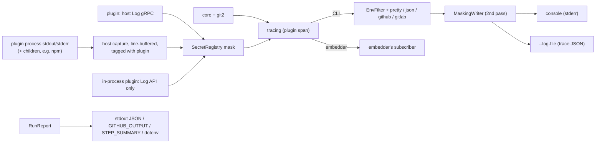
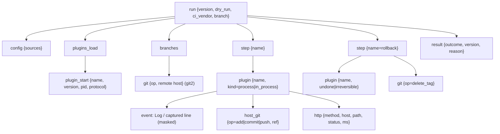

# Observability

Logging, secret masking, CI output, errors and diagnostics. Exit codes, commands, `RunReport`/JSON contracts and the dry-run plan: [CLI.md](CLI.md). Plugin protocol, rollback and partial failure: [ARCHITECTURE.md](ARCHITECTURE.md).

## 1. Principles

| # | Rule |
| --- | --- |
| P1 | The library emits `tracing` spans/events only. It never installs a subscriber and never writes to stdout/stderr; the CLI or the embedder chooses the sink |
| P2 | Secrets are masked **at the source** (core, plugin host) before an event exists; `MaskingWriter` masks again on output |
| P3 | The library reads only the `Env` map passed to its builder (the CLI passes a copy of its own). It never reads or mutates the process env and builds child-process envs from that map |
| P4 | Logs go to stderr. stdout carries data only (`--output=json`, the printed next version) |
| P5 | No release is never silent: a typed reason is always reported ([§7](#7-no-release-reasons)) |

## 2. Log flow

### Plugin output

| Source | Handling |
| --- | --- |
| `Log` host service | event in the `plugin{name}` span at the level the plugin sent. An `error` event from a step that then returns success fails the step (`core::plugin_error_on_success`); normal failure handling applies, including rollback after the tag push. The conformance kit checks for it |
| Plugin stdout/stderr, incl. child tools | captured, masked, tagged with the plugin, emitted as `debug` events with `stream=stdout\|stderr`; never parsed (results come only via gRPC) |
| In-process plugin | `Log` API only; the conformance kit checks it doesn't print |

Captured output is shown in full when that plugin's step fails, live with `-v`/`--debug`, always in `--log-file`, and live on every run with `[plugins.<name>] show_output = true` ([CONFIG.md](CONFIG.md)).

## 3. Logging flags and filters

| Flag / env | Effect |
| --- | --- |
| (default) | `semoxide=info`, dependencies `warn` |
| `-q` / `-qq` | `warn` / `error`; the final result line still prints |
| `-v` / `-vv` | `semoxide=debug` / `trace`; live plugin output |
| `--debug` | `semoxide=trace,git2=debug,reqwest=debug`, SpanTraces, span timings. Auto-on with `RUNNER_DEBUG=1` or `CI_DEBUG_TRACE=true` |
| `SEMOXIDE_LOG=<EnvFilter>` | overrides the above; `RUST_LOG` is used when `SEMOXIDE_LOG` is unset |
| `--log-format=auto\|pretty\|json\|github\|gitlab` | `auto` = `github` under `GITHUB_ACTIONS=true`, `gitlab` under `GITLAB_CI=true`, else `pretty` |
| `--log-file <path>` | writes the full `trace`-level log as JSON to the file only, with its own filter; the console keeps its level and format |
| `--color=auto\|always\|never` | honors `NO_COLOR`, `CLICOLOR_FORCE` |

Targets: `semoxide::core`, `::config` (values redacted), `::git` (field `op` = the G-number of the git operation, [SEMANTIC-RELEASE-SPEC](specs/SEMANTIC-RELEASE-SPEC.md)), `::http` (URL without query/userinfo; bodies only on error, never for auth endpoints), `::plugin`. Per-plugin filtering uses the span field (`[plugin{name=github}]=trace`), since `tracing` targets are `'static`. Dependencies (`git2`, `reqwest`, `hyper`, `tonic`) stay at `warn` unless `--debug`.

## 4. Span tree

- A `TimingLayer` prints `✔ publish 1.2s` per step and a table at the end; durations are also in `RunReport.timings`.
- `http` spans exist only for core and in-process plugins; process plugins log their own HTTP via `Log`.
- libgit2 internals: `git2::trace_set` is bridged into the `git2` target, pending a PoC (does the vendored build emit anything, can lines carry credentials, the hook is process-global).

## 5. Secret masking

`SecretRegistry`: one per run, an `Arc` Aho-Corasick automaton rebuilt on insert. Replacement text: `[secure]`.

| Secret source | Registered |
| --- | --- |
| Secret env vars declared in a plugin's manifest | before the plugin is spawned |
| `Env` vars whose name matches `token\|password\|credential\|secret\|private` with value ≥ 5 chars (upstream rule, [SEMANTIC-RELEASE-SPEC](specs/SEMANTIC-RELEASE-SPEC.md)) | at run start |
| Env names listed in `secrets.mask_env = [...]` ([CONFIG.md](CONFIG.md)) | at run start |
| Config values typed `Secret<T>` (`secrecy::SecretBox`; `Debug` prints `[secure]`; no `Serialize`) | at config load |
| Values a plugin creates at runtime (OIDC-exchanged npm token, GitHub App installation token) | by the plugin via the `RegisterSecret` host call, before first use; SDK helpers register automatically |

Masked forms of each secret: raw, `encodeURI`, `encodeURIComponent`, `:`-preserving encoding, base64 of `user:token`, base64 of the bare token.

Masking applies to: the host `Log` service and captured plugin output (at source); notes and `success`/`fail` payloads; URLs via `url_for_log()` (strips userinfo); and, as the second pass, `MaskingWriter` on the console, `--log-file`, GitHub workflow commands and the panic hook. Secrets never touch disk: plugins receive them via env.

Embedders get at-source masking with any subscriber. Dependency events are masked only if the embedder wraps its writer with `observe::MaskingWriter::new(w, run.secrets())`. `observe::subscriber(&opts)` builds the CLI stack.

## 6. CI integration

**GitHub Actions** (`--log-format=github`):

| Command / file | Use |
| --- | --- |
| `::group::` / `::endgroup::` | one per step (groups don't nest) |
| `::error title=<CODE>::` / `::warning::` | errors/warnings; `file=`/`line=` for config spans |
| `::notice::` | final line: released version or no-release reason |
| `::add-mask::` | every registered secret and encoded form, bypassing `MaskingWriter` |
| `$GITHUB_OUTPUT` | names of the most-used upstream wrapper action, so migrated workflows keep working: `new_release_published`, `new_release_version`, `new_release_major_version`, `new_release_minor_version`, `new_release_patch_version`, `new_release_channel`, `new_release_notes`, `new_release_git_head`, `new_release_git_tag`, `last_release_version`, `last_release_git_head`, `last_release_git_tag`. Public contract: names are never renamed |
| `$GITHUB_STEP_SUMMARY` | outcome, reason, versions, timings, rollback result, notes |

Untrusted text (plugin output, commit subjects, notes) starting with `::` is escaped (workflow-command injection guard).

**GitLab CI** (`--log-format=gitlab`): collapsible `section_start`/`section_end` per step; no annotations; outputs via `--output-env <file>` (dotenv for `artifacts:reports:dotenv`). GitLab masks only predefined variables at runtime, so semoxide's masking is the only protection.

**Everywhere:** `--output=json` prints the `RunReport` the library returns ([CLI.md](CLI.md)).

## 7. No-release reasons

`NoReleaseReason` is a fixed, public enum. Every run without a release ends with one, logged at `info` with a hint and included in `RunReport`:

| Reason | Hint content |
| --- | --- |
| `NotCi` | outside CI: the run is forced to dry-run, and the report also carries `dry_run: forced (not_ci)` with the would-be outcome (version + plan, or the would-be reason) |
| `PullRequest` | detected CI context |
| `BranchNotConfigured` | closest configured branch glob |
| `NoCommitsSince` | last release tag |
| `NoRelevantCommits` | per-commit verdicts at `-v` |
| `AllCommitsSkipped` | every relevant commit carries the [skip marker](CONFIG.md) |
| `TagsNotFound` | shallow clone, `tags.format` near-misses |
| `PathFiltered` | the monorepo unit's path filter ([ARCHITECTURE.md](ARCHITECTURE.md)) |

## 8. Errors

- Library errors are `thiserror` enums implementing `ErrorInfo` ([CODE-ARCHITECTURE.md](CODE-ARCHITECTURE.md)): code, message, help line, docs URL, and for config errors a label pointing at the line in `semoxide.toml`. `miette` is used only by the CLI for rendering.
- Codes are namespaced names: `core::no_git_repo`, `git::push_rejected`, `github::release_exists`; a plugin's name is its namespace. The docs map upstream mnemonics (`ENOGITREPO` → `core::no_git_repo`).
- Message wording, help lines and the page template: [docs/errors/README.md](errors/README.md).
- Every code has a page `docs/errors/<slug>.md` (until the docs site exists); each crate lists its codes in `codes::ALL`, and a test fails on a missing page, an orphan page, a duplicate code or a code used in the source but missing from `ALL`.
- All errors from a step are collected and reported together (`related`).
- Plugin errors arrive as gRPC `Status`; a timeout is `CANCELLED` or `DEADLINE_EXCEEDED`.
- Display: graphical on a TTY, plain in CI, an `error` object in `--output=json`; `--debug` appends the SpanTrace (step → plugin → operation).
- `fail` always runs on a failed release. Each error in its context is marked `known` (has a namespaced code) or `unexpected`, so plugins can phrase it (e.g. "unexpected error, please report" plus the bundle command).
- The panic hook is masked and prints the issue link and the `doctor --bundle` command.

## 9. Diagnostics

Command syntax and flags: [CLI.md](CLI.md). What each shows or checks:

| Command | Content |
| --- | --- |
| `explain [--commit <sha>]` | offline, read-only decision trace: branch rule → last release → each commit's verdict (skip marker, merge/fixup skips, unparsable commits with their parse error, a `Release-As:` footer as the reason; [CONFIG.md](CONFIG.md)) → next version or no-release reason |
| `doctor` | repo, shallow clone, tags, CI vendor, token env **names**, plugin download/checksum lock, manifests, handshakes, `describe` schema validation |
| `doctor --online` | adds token auth probes, push rights, tag-delete rights |
| `doctor --bundle` | support bundle, below |

**Support bundle:** Markdown by default (paste-ready for an issue), `--bundle-format=json` optional. Contents, all masked: semoxide/OS facts; git facts (remote host only); CI env var **names**; secret env vars as set/unset; config with per-key source; plugins with versions, checksums and protocol version; the last `--log-file`, re-masked.

## 10. Crates

`tracing`; `tracing-subscriber` (`env-filter`, `fmt`, `json`) in the CLI and the `observe` feature; `tracing-error`; `miette` (`fancy`, CLI only); `thiserror`; `secrecy`; `aho-corasick`; `percent-encoding` + `base64`; `anstream`/`anstyle`; `serde_json`; `reqwest-tracing` (drops query and headers); `git2::trace_set`.
