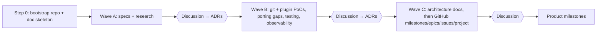

# Planning

GitHub conventions (labels, epics, dependencies, project board) are defined in Wave C.

## Milestones
- Created now: **M0 Planning closure** (condense docs, decisions → issues, repo/CI skeletons, open items) and **M1 Walking skeleton** (dry run end to end on a real temp repo, [A4](CODE-ARCHITECTURE.md#10-approaches)).
- **After M1 is done**, the next milestones are discussed and created. The intended slices are tag + push, plugin system, publish (self-release), beta pre-release. They are not created earlier.

## Research-phase waves
Each wave ends with a user discussion and approval before the next one starts.

## Issue structure
- **Issue types** (org-level, shared by all repos): `Epic`, `Feature`, `Task`, `Bug`, `Spike` (PoC / research).
- **Epics** are parent issues; their work items are **sub-issues**. "Blocked by" uses GitHub **issue dependencies**.
- **Labels** carry only *area* and status extras (defined below), not the kind of issue.
- Milestones are the slices (M0, M1, …), never epics.

## Labels
Created identically in every org repo.

| Label | Use |
|---|---|
| `area:engine` | version engine, branch model, domain types |
| `area:schema` | config types, JSON Schema |
| `area:error` | `ErrorInfo`, error codes, docs pages |
| `area:git` | git2, SSH transports, push guards, credentials |
| `area:runtime` | orchestrator, config loading, CI detection, plugin host integration |
| `area:observability` | tracing, masking, logging flags |
| `area:cli` | commands, output formats, exit codes |
| `area:api` | façade, public API, semver |
| `area:plugins` | protocol, SDK, host, conformance, plugin repos |
| `area:ci` | our CI, tooling, release pipeline |
| `area:docs` | docs, ADRs, condensing |
| `needs-decision` | waiting on the user's decision |
| `blocked-external` | waiting on something outside the project |
| `good-first-issue` | once public |
