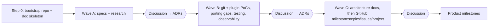

# Planning

GitHub conventions (labels, epics, dependencies, project board) are defined in Wave C.

## Milestones
- Created now: **M0 Planning closure** (condense docs, decisions → issues, repo/CI skeletons, open items) and **M1 Walking skeleton** (dry run end to end on a real temp repo, [A4](CODE-ARCHITECTURE.md#10-approaches)).
- **After M1 is done**, the next milestones are discussed and created. The intended slices are tag + push, plugin system, publish (self-release), beta pre-release. They are not created earlier.

## Research-phase waves
Each wave ends with a user discussion and approval before the next one starts.

