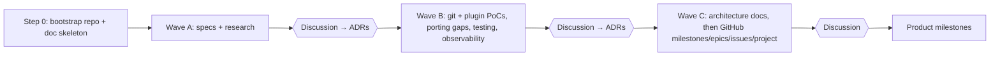

# Planning

GitHub conventions (labels, milestones, epics, dependencies, project board) are defined in Wave C.

## Research-phase waves
Each wave ends with a user discussion and approval before the next one starts.

