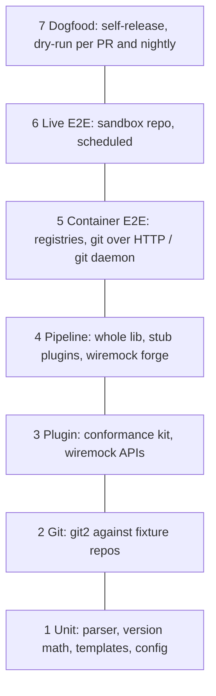

# Testing

How semoxide is tested, from pure functions to real releases. Per-area test-first approach and the AI-agent workflow: [CODE-ARCHITECTURE](CODE-ARCHITECTURE.md) (A2) and the [`rust-testing` skill](../.claude/skills/rust-testing/SKILL.md).

## Where tests live

| Repo | Tests |
|---|---|
| `semoxide` | core: config, planning, release units, git2 layer, step pipeline, host services, CLI |
| `semoxide-plugin-protocol` | SDK, host launcher, the conformance kit itself |
| `semoxide-plugin-<name>` | the plugin's own logic (ported upstream tests), its registry/forge fakes, the conformance kit in CI |

Inside a crate:

- No inline `#[cfg(test)] mod tests { … }` blocks with a body in source files.
- Unit tests: sibling file, `foo.rs` → `foo/tests.rs`, declared with `#[cfg(test)] mod tests;`.
- Integration tests: `tests/`, compiled as one binary.
- Shared fixtures and builders: the `semoxide-test-support` crate (`publish = false`).
- Doc tests in `///` examples are allowed.

## Kinds of tests

- **Unit** and **integration** (library API against real temporary repos).
- **CLI end-to-end:** `assert_cmd`.
- **Snapshot:** `insta` is the backbone (notes, JSON, errors, `explain`, plan).
- **Data-driven:** ported upstream tables (`rstest`).
- **Property-based:** `proptest` for parsers and the version engine (incl. semver round trip).
- **Fuzzing:** `cargo-fuzz` for the commit, config and tag parsers.
- **Doc tests.**
- **Fakes, not mocks:** a fake plugin binary, `wiremock` as a fake forge. No mocking frameworks, no `trycmd`.
- **Benchmarks:** `criterion` from the start, for large-history log walks and analysis.
- **miri:** every crate it can run. miri cannot execute FFI (libgit2), real processes or sockets, so it covers the pure-Rust crates.
- Plus [plugin conformance](#plugin-conformance), [failure injection](#failure-injection), the [sandbox E2E](#sandbox-repo) and the [upstream comparison](#upstream-comparison).

## Layers

| # | Tests | Tooling |
|---|---|---|
| 1 | CC parser, bump rules, next/last release, branch normalization, notes context, templates, config merge + plugin schema validation, env-ci table, secret masking | `rstest`, `insta`, `proptest`, `cargo-fuzz` |
| 2 | Every git op from the [git2 PoC](https://github.com/semoxide/semoxide-poc/tree/main/git2-ops) table, plus the [guards](#git) | `tempfile`, [fixtures](#fixtures), `file://` bare remotes; `git daemon` for shallow |
| 3 | Protocol compliance; per-plugin API calls, retry/throttle | [conformance kit](#plugin-conformance), `wiremock`, `tokio::time::pause` |
| 4 | Full pipeline: branches, channels, prerelease, maintenance, multiple units, dry-run, `fail`/`rollback`, error aggregation, host `Git` service rules | lib API + stub plugins (process and in-process), `wiremock` |
| 4b | CLI: args, exit codes, output, `migrate` | `assert_cmd` + `insta` |
| 5 | Real registry publishes, git over HTTP with auth, shallow/unshallow | `testcontainers`: `kellnr` (cargo), Verdaccio (npm), a git-http container |
| 6 | Real GitHub push, releases, assets, comments, channels | [sandbox](#sandbox-repo) |
| 7 | Self-release; dry-run per PR and nightly on main | dogfooding ([CODE-ARCHITECTURE](CODE-ARCHITECTURE.md) A8) |

When each layer runs: [CI](#ci).

## Fixtures

- **Fixture DSL** (`semoxide-test-support`): builder for commits, tags, notes, merges (ff/no-ff/rebase), shallow clone, detached HEAD, modeled on upstream's `git-utils.js`. It writes history with the real git CLI, an independent oracle; tests also use `git daemon` and git cross-checks. Test machines and CI need git installed (only the tool itself is git-CLI-free).
- **Deterministic SHAs:** fixed author/committer dates and identity, `core.autocrlf=false`.
- **Golden histories:** `tests/histories/*.toml` = commit script + branch config + expected next version, channel and notes (`insta`). Shared by layers 2 and 4 and dry-run snapshots.
- **Remotes:** `file://` bare repos by default. libgit2 refuses shallow over `file://`, so shallow/unshallow tests use a `git daemon` or HTTP server.

## Git

Required guard tests:

| Guard | Test |
|---|---|
| Tag clobber | remote already has the tag at another commit: `push_negotiation` rejects, remote unchanged (libgit2 would fast-forward it) |
| Per-ref push status | pre-receive hook / protected branch declines: `push()` returns Ok, the per-ref status error must fail the step |
| Credential retry cap | server answers 401 forever: the callback gives up after N attempts instead of looping |
| One tag only | unrelated local tags exist: remote gains exactly the release tag |

Real-remote items (GitHub 401 vs 403, SSH agent, proxies, smart-HTTP shallow) are layer 6.

## Ported upstream tests

Ported into the repo that owns the logic.

| Upstream suite | Port as | Lands in |
|---|---|---|
| core pure logic, `git.test`, `integration.test` | `rstest` tables, layer 2/4 scenarios | `semoxide` |
| conventional-commits-parser specs | parser corpus | `semoxide-plugin-commit-analyzer` |
| commit-analyzer | tables `(rules, messages, expected)` | `semoxide-plugin-commit-analyzer` |
| release-notes-generator | full-output `insta` goldens | `semoxide-plugin-release-notes` |
| github | `wiremock` | `semoxide-plugin-github` |
| npm | tables, `wiremock`, Verdaccio | npm plugin |
| not ported | JS module loading, ESM plugins, preset resolution, Node HTTP specifics | |

**License header:** each 1:1 ported file starts with `// Ported from <repo>@<sha>/<path>, <MIT|ISC>, (c) <holder>`; the holder goes into `THIRD_PARTY_LICENSES.md`. One pinned upstream SHA per batch. Re-derived cases need no header.

## Plugin conformance

`semoxide-plugin-conformance` (protocol repo) runs against any plugin, in any language; every plugin repo runs it in CI. It uses `semoxide-plugin-host`, the launcher semoxide uses. PoC: [plugin-grpc](https://github.com/semoxide/semoxide-poc/tree/main/plugin-grpc).

| Check | Fails when |
|---|---|
| Transport | gRPC over the local socket (UDS / named pipe) fails, or the per-run token is not presented |
| Handshake | protocol major differs, `steps` invalid, or unknown fields/steps are rejected |
| Manifest | handshake `secret_env` disagrees with the manifest |
| `describe` | it returns no config JSON Schema, or an invalid one |
| Secrets | a sentinel secret appears unmasked in any log, stdout or stderr (plugin and children) |
| Process tree | a grandchild survives kill after timeout or crash (Job Object / process group) |
| Deadlines | a step overruns its deadline and is not reported as timeout (`CANCELLED` or `DEADLINE_EXCEEDED`) |
| Shutdown | the plugin outlives `Shutdown` or the dropped connection |
| In-process path | for Rust plugins, the library crate passes the same checks in-process; it spawns no children and prints nothing directly |

## Dry-run

Behavior: [CLI](CLI.md). Tests:

- **No writes:** `wiremock` catch-all for non-GET `.expect(0)`; remote refs identical before and after; host `Git` service push is never called.
- **Read-only token** passes dry-run (regression for semantic-release#2232); `--verify-push` fails with it.
- **Plan snapshot** per golden history (`insta`), the readable spec of release behavior.

## Failure injection

One named regression test per row. Rollback and step-order rules: [ARCHITECTURE](ARCHITECTURE.md).

| Case | Injection | Expected | Layer |
|---|---|---|---|
| Publish fails after tag push (upstream #896, #2381) | stub publisher fails | `rollback` runs for each plugin; tag deleted via Git service; irreversible plugin logs a warning | 4 |
| Rollback without delete rights | remote refuses tag deletion | partial failure, partial-failure exit code ([CLI](CLI.md)), message names the leftover tag | 4, 6 |
| Plugin timeout / crash | plugin hangs or exits mid-step | tree killed, step fails, `rollback`/`fail` run | 4 |
| Asset changed after git commit | a plugin after `git` modifies a file matching its `assets` | in `prepare`: error by default, warning when configured; in `publish`: warning | 4 |
| Host `Git` rule | plugin pushes a non-release tag or moves a tag | `PERMISSION_DENIED`, remote unchanged | 4 |
| Half-done GitHub release | asset upload 500 once | draft deleted or reused on rerun; one release | 3, 6 |
| `push --tags` pushes every tag | unrelated local tags | remote gains only the new tag | 2, 4 |
| Secondary rate limit | 403 secondary, 429 `retry-after`, `x-ratelimit-remaining: 0` | retries after delay (paused clock), no duplicate POSTs | 3 |
| Shallow clone, missing tags | depth 1, with/without tags (`git daemon`) | correct last release | 2, 5 |
| Detached HEAD | checkout a SHA, branch from CI env | branch from env detection | 2, 4 |
| Branch behind remote | remote advances after clone | abort before tagging, remote unchanged | 4 |
| Several tags on one commit (#4073) | two tags, one commit | each tag's note read separately | 2 |
| Secret leak (upstream `plugin-log-env`) | plugin logs its env | masked everywhere | 3, 4 |
| `success` failure fails the run (github#738) | 500 on comments | non-fatal policy followed | 3 |

## Sandbox repo

Private `semoxide/semoxide-sandbox` hosts layer 6 and the git2 real-remote items.

- **Credentials:** the tests run as a workflow inside the sandbox repo with its automatic `GITHUB_TOKEN` (scoped to that repo, one run, permissions set in the workflow). SSH tests use a write deploy key on that repo only. A fine-grained PAT (owned by `semoxide-bot`) is added only when a test must run outside GitHub Actions.
- Workflow on `schedule` + `workflow_dispatch` from `main` only, never fork PRs; one `concurrency` group.
- Per-run `tag_format` prefix `e2e-<run_id>-v{version}`; an `if: always()` cleanup deletes releases, tags, notes refs and `e2e/*` branches with that prefix; a weekly sweep removes leftovers older than 7 days.
- Scenarios: first release, `beta`/`next` channels, promotion (`add_channel`), maintenance `1.x`, assets, success comments, fail issue, rollback; protected-branch rejection; 401 vs 403 tokens.
- cargo: `kellnr` container only, never crates.io.
- npm: Verdaccio only (throwaway local registry in Docker), never npmjs; tentative until the npm plugin is built.

## Upstream comparison

Development phase only. A scheduled job runs a pinned semantic-release version in dry-run on the golden histories, with intentional differences ([DIFFERENCES](DIFFERENCES.md)) configured on both sides, and compares next version and release type (not notes). Before the first release its outputs are frozen into golden fixtures and the job is removed.

## CI

- **Runner:** `cargo-nextest` with a `ci` profile (retries for known-flaky network tests, JUnit output).
- Linux jobs run in Docker containers; Windows runs natively.
- **Toolchains:** stable on PRs; MSRV check with `cargo hack --rust-version` (policy: [CODE-ARCHITECTURE](CODE-ARCHITECTURE.md)); beta scheduled.
- **Speed:** `rust-cache`; dependency opt-level per [CODE-ARCHITECTURE](CODE-ARCHITECTURE.md) profiles.
- **Coverage:** `cargo llvm-cov` on layers 1 to 4, reported, not gating.
- One aggregate `required-checks` job gates merges.

| Job | OS | Trigger |
|---|---|---|
| Quality checks ([CODE-ARCHITECTURE](CODE-ARCHITECTURE.md)) | Linux | PR |
| Layers 1 to 4 + CLI | Linux, Windows | PR |
| `cargo insta test --unreferenced reject` | Linux | PR |
| Doc tests (separate step) | Linux | PR |
| miri, pure-Rust crates | Linux | PR |
| `cargo hack --each-feature`, published crates | Linux | PR |
| MSRV | Linux | PR |
| Layer 5 containers | Linux | PR |
| musl static build; aarch64 build check | Linux | PR |
| aarch64 tests | Linux aarch64 | scheduled |
| Fuzz (time-boxed), beta toolchain | Linux | nightly |
| Benchmarks | Linux | scheduled + on demand for log-walk PRs |
| Dogfood dry-run with the PR's own build | Linux | PR |
| Live E2E (sandbox), dogfood dry-run on main | Linux | nightly + manual |
| Upstream comparison (development phase) | Linux | scheduled |
| Conformance kit | per plugin repo, Linux + Windows | PR |

Windows-specific cases: CRLF in messages, path separators in asset globs, named pipes, Job Object kill, `PATHEXT` resolution (`npm` → `npm.cmd`).
