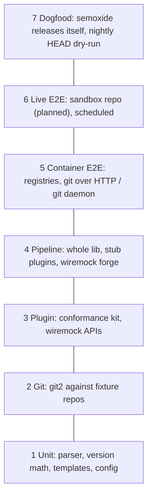

# Testing

How semoxide is tested, from pure functions to real releases. Decisions live in the [ADRs](DECISIONS.md) and upstream test inventories in the research files; both are linked, not repeated.

## Where tests live

Plugins live in their own repos ([ADR 0010](decisions/0010-plugin-architecture.md)), so tests are split by repo:

| Repo | Tests |
|---|---|
| `semoxide` | core: config, planning, release units ([ADR 0003](decisions/0003-monorepo-scope.md)), git2 layer, step pipeline, host services, CLI |
| `semoxide-plugin-protocol` | SDK, host launcher, and the conformance kit itself |
| `semoxide-plugin-<name>` | the plugin's own logic (ported upstream tests), its registry/forge mocks, plus the conformance kit in CI |

## Layers

| # | Tests | Tooling | Runs |
|---|---|---|---|
| 1 | CC parser, bump rules, next/last release, branch normalization, notes context, templates, config merge + plugin schema validation, env-ci table, secret masking | `cargo nextest`, `rstest`, `insta`, `proptest` (parser, semver round trip), `cargo-fuzz` (parser, config) | PR, all OS; fuzz scheduled |
| 2 | Every git op from the [git2 PoC](../poc/git2-ops/README.md#results) table, plus the [guards](#git) | `tempfile`, [fixtures](#fixtures), `file://` bare remotes; `git daemon` for shallow | PR, all OS |
| 3 | Protocol compliance; per-plugin API calls (e.g. [GitHub inventory](research/github.md#6-tests)), retry/throttle | [conformance kit](#plugin-conformance), `wiremock`, `tokio::time::pause` | PR, all OS (plugin repos) |
| 4 | Full pipeline: branches, channels, prerelease, maintenance, multiple units, dry-run, `fail`/`rollback`, error aggregation, host `Git` service rules | lib API + stub plugins (process and in-process), wiremock | PR, all OS |
| 4b | CLI: args, exit codes, output, `migrate` | `trycmd` or `assert_cmd` + `insta` | PR, all OS |
| 5 | Real registry publishes, git over HTTP with auth, shallow/unshallow | `testcontainers`: `kellnr` (cargo), Verdaccio (npm, later), a git-http container | PR, Linux |
| 6 | Real GitHub push, releases, assets, comments, channels | [sandbox](#sandbox-repo) | scheduled + manual |
| 7 | Self-release and HEAD dry-run | [dogfooding](research/distribution-config.md#dogfooding) | each release + nightly |

Coverage: `cargo llvm-cov` on layers 1 to 4.

## Fixtures

- **Fixture DSL** (test-support crate): builder for commits, tags, notes, merges (ff/no-ff/rebase), shallow clone, detached HEAD, following upstream's `git-utils.js` ([helpers](research/semantic-release.md#7-tests)). Whether it writes history with the git CLI (an independent oracle) or with git2 is **open**.
- **Deterministic SHAs:** fixed author/committer dates and identity, `core.autocrlf=false`.
- **Golden histories:** `tests/histories/*.toml` = commit script + branch config + expected next version, channel and notes (`insta`). Shared by layers 2 and 4 and dry-run snapshots.
- **Remotes:** `file://` bare repos by default. libgit2 refuses shallow over `file://` ([PoC gap 1](../poc/git2-ops/README.md#gaps)), so shallow/unshallow tests need a `git daemon` or HTTP server (as the PoC's `tests/daemon.rs` does).

## Git

git2 only ([ADR 0011](decisions/0011-git-backend.md)). Required guard tests:

| Guard | Test |
|---|---|
| Tag clobber | remote already has the tag at another commit: `push_negotiation` rejects, remote unchanged (libgit2 would fast-forward it) |
| Per-ref push status | pre-receive hook / protected branch declines: `push()` returns Ok, the per-ref status error must fail the step |
| Credential retry cap | server answers 401 forever: the callback gives up after N attempts instead of looping |
| One tag only | unrelated local tags exist: remote gains exactly the release tag |

Items the PoC marks [needs sandbox](../poc/git2-ops/README.md#needs-a-real-remote-sandbox) (GitHub 401 vs 403, SSH agent, proxies, smart-HTTP shallow) go to layer 6.

## Ported upstream tests

Ported into the repo that owns the logic.

| Upstream suite | Port as | Lands in | Source |
|---|---|---|---|
| core pure logic, `git.test`, `integration.test` | `rstest` tables, layer 2/4 scenarios | `semoxide` | [core §7](research/semantic-release.md#7-tests) |
| conventional-commits-parser specs | parser corpus | `semoxide-plugin-commit-analyzer` | [deps §1](research/dependencies.md#1-conventional-commits-parser-712), [ADR 0006](decisions/0006-cc-parser.md) |
| commit-analyzer | tables `(rules, messages, expected)` | `semoxide-plugin-commit-analyzer` | [§6](research/commit-analyzer.md#6-tests-ava-test) |
| release-notes-generator | full-output `insta` goldens | `semoxide-plugin-release-notes` | [§6](research/release-notes-generator.md#6-tests) |
| github | wiremock | `semoxide-plugin-github` | [§6](research/github.md#6-tests) |
| npm | tables, wiremock, Verdaccio | npm plugin (not in the first set) | [§6](research/npm.md#6-tests) |
| Not ported | JS module loading, ESM plugins, preset resolution, Node HTTP specifics | | |

**License rule** ([licenses 2a](research/licenses.md#answers)): each 1:1 ported file starts with `// Ported from <repo>@<sha>/<path>, <MIT|ISC>, (c) <holder>`; holder goes into `THIRD_PARTY_LICENSES.md`. One pinned upstream SHA per batch. Re-derived cases need no header.

## Plugin conformance

`semoxide-plugin-conformance` (protocol repo) runs against any plugin, in any language; every plugin repo runs it in CI. It uses `semoxide-plugin-host`, the same launcher semoxide uses. PoC: [9 checks](../poc/plugin-grpc/README.md#results).

| Check | Fails when |
|---|---|
| Transport | gRPC over the local socket (UDS / named pipe) fails, or the per-run token is not presented |
| Handshake | protocol major differs, `steps` invalid, or unknown fields/steps are rejected |
| Manifest | handshake `secret_env` disagrees with the manifest |
| `describe` | it returns no config JSON Schema, or an invalid one |
| Secrets | a sentinel secret appears unmasked in any log, stdout or stderr (plugin and children) |
| Process tree | a grandchild survives kill after timeout or crash (Job Object / process group) |
| Deadlines | a step overruns its deadline and is not reported as timeout (`CANCELLED` or `DEADLINE_EXCEEDED`) |
| Shutdown | the plugin outlives `Shutdown` or the dropped connection |
| In-process path | for Rust plugins, the library crate passes the same checks in-process; it spawns no children and prints nothing directly |

## Dry-run

Per [ADR 0005](decisions/0005-dry-run.md):

- **No writes:** wiremock catch-all for non-GET `.expect(0)`; remote refs identical before and after; host `Git` service push is never called.
- **Read-only token** passes dry-run (regression for [semantic-release#2232](research/semantic-release.md#8-issue-history)); `--verify-push` fails with it.
- **Plan snapshot** per golden history (`insta`), the readable spec of release behavior.

## Failure injection

One named regression test per row.

| Case | Injection | Expected | Layer |
|---|---|---|---|
| Publish fails after tag push ([ADR 0012](decisions/0012-partial-failure.md); upstream #896, #2381) | stub publisher fails | `rollback` runs for each plugin; tag deleted via Git service; irreversible plugin logs a warning | 4 |
| Rollback without delete rights | remote refuses tag deletion | failure surfaced (reporting format **open** in ADR 0012) | 4, 6 |
| Plugin timeout / crash | plugin hangs or exits mid-step | tree killed, step fails, `rollback`/`fail` run | 4 |
| Asset changed after git commit ([ADR 0010](decisions/0010-plugin-architecture.md)) | a plugin after `git` modifies a file matching its `assets` | in `prepare`: error by default, warning when configured; in `publish`: warning | 4 |
| Host `Git` rule | plugin pushes a non-release tag or moves a tag | `PERMISSION_DENIED`, remote unchanged | 4 |
| Half-done GitHub release ([github §7](research/github.md#7-issue-history)) | asset upload 500 once | draft deleted or reused on rerun; one release | 3, 6 |
| `push --tags` pushes every tag ([G19](research/semantic-release.md#3-git-operations)) | unrelated local tags | remote gains only the new tag | 2, 4 |
| Secondary rate limit ([github §5](research/github.md#5-rust-port-notes)) | 403 secondary, 429 `retry-after`, `x-ratelimit-remaining: 0` | retries after delay (paused clock), no duplicate POSTs | 3 |
| Shallow clone, missing tags ([G8](research/semantic-release.md#3-git-operations)) | depth 1, with/without tags (git daemon) | correct last release | 2, 5 |
| Detached HEAD | checkout a SHA, branch from CI env | branch from env detection | 2, 4 |
| Branch behind remote (G13/G14) | remote advances after clone | abort before tagging, remote unchanged | 4 |
| Several tags on one commit (#4073) | two tags, one commit | each tag's note read separately | 2 |
| Secret leak (upstream `plugin-log-env`) | plugin logs its env | masked everywhere | 3, 4 |
| `success` failure fails the run (github#738) | 500 on comments | non-fatal policy followed | 3 |

## Sandbox repo

**Planned, not created:** private `sm-steel/semoxide-sandbox` (approved) for layer 6 and the git2 PoC's real-remote items. Token type is **open**.

- Workflow on `schedule` + `workflow_dispatch` from `main` only, never fork PRs; one `concurrency` group.
- Per-run `tag_format` prefix `e2e-<run_id>-v{version}`; an `if: always()` cleanup deletes releases, tags, notes refs and `e2e/*` branches with that prefix; a weekly sweep removes leftovers older than 7 days.
- Scenarios: first release, `beta`/`next` channels, promotion (`add_channel`), maintenance `1.x`, assets, success comments, fail issue, rollback; protected-branch rejection; 401 vs 403 tokens.
- cargo: kellnr container only, never crates.io (permanent).

## CI

Linux jobs run in Docker containers (as in the [gRPC PoC](../poc/plugin-grpc/README.md#results)); macOS and Windows run natively.

| Job | OS | Trigger |
|---|---|---|
| fmt, clippy `-D warnings`, `cargo-deny` | Linux | PR |
| Layers 1 to 4 + CLI | Linux, macOS arm64, Windows | PR |
| `cargo hack --each-feature` | Linux | PR |
| MSRV ([policy](research/distribution-config.md#msrv--edition)) | Linux | PR |
| Layer 5 containers | Linux | PR |
| musl static + aarch64 cross smoke | Linux | PR |
| Fuzz (time-boxed), beta toolchain | Linux | nightly |
| Live E2E, dogfood dry-run | Linux | nightly + manual |
| Conformance kit | per plugin repo, all OS | PR |

Windows-specific: CRLF in messages, path separators in asset globs, named pipes, Job Object kill, `PATHEXT` resolution (`npm` → `npm.cmd`).

## Open

- npm: Verdaccio only, or also real npmjs publishes.
- Comparison job against upstream semantic-release (dry-run outputs on golden histories).
- Fixtures: git CLI allowed, or git2 only.
- Sandbox token type.

## Ticket candidates

- Test-support crate: fixture DSL, golden history format, git daemon helper.
- git2 guard tests (tag clobber, per-ref status, retry cap).
- Port core tests; port analyzer/notes/parser tests in their plugin repos.
- Conformance kit in `semoxide-plugin-protocol`; wire into each plugin repo's CI.
- Failure-injection set incl. `rollback` and asset-after-commit.
- Dry-run no-write assertions.
- kellnr / git-http testcontainers.
- Sandbox repo + scheduled workflow + cleanup sweep.
- CI workflow (Docker Linux, OS matrix, MSRV, features, fuzz, coverage).
