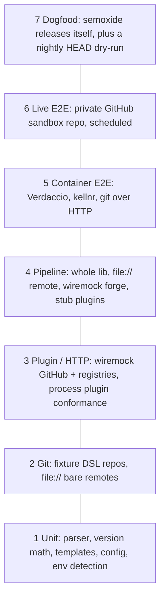

# Testing

How semoxide is tested, from pure functions to real releases. Upstream test inventories live in the research files and are linked, not repeated here.

## Layers



Lower layers have more tests and run faster. Layers 1 to 4 run on every PR on all three OSes.

| # | Tests | Tooling | Runs |
|---|---|---|---|
| 1 | CC parser, bump rules, next/last release, branch normalization, notes context, templates, config merge, env-ci table, npmrc resolution, secret masking | `cargo nextest`, `rstest` (tables), `insta` (snapshots), `proptest` (parser, semver round trip), `cargo-fuzz` (parser, config, JSON-RPC framing) | PR, all OS. Fuzz: Linux, scheduled |
| 2 | Tags merged into a branch, log ranges, notes, tag create/push, unshallow, detached HEAD, push permission probe | `tempfile`, fixture DSL ([below](#fixtures)), `git` CLI as an independent oracle | PR, all OS |
| 3 | GitHub API calls ([inventory](research/github.md#api-calls-exhaustive)), npm auth/registry, retry/throttle, process plugins | `wiremock`, `tokio::time::pause` for retry delays, conformance harness ([below](#plugin-protocol-conformance)) | PR, all OS |
| 4 | Full step pipeline: branches, channels, prerelease, maintenance, dry-run, fail/success, error aggregation | lib API + stub `impl Plugin`, `file://` remote, wiremock | PR, all OS |
| 4b | CLI: args, exit codes, output, `migrate` | `trycmd` or `assert_cmd` + `insta` | PR, all OS |
| 5 | Real npm publish/dist-tags, cargo publish, git over HTTP with basic auth | `testcontainers`: `verdaccio/verdaccio`, `kellnr`, a git-http container (upstream uses `semanticrelease/docker-gitbox`) | PR (Linux only, needs Docker) |
| 6 | Real GitHub releases, assets, comments, prerelease channels | sandbox repo ([below](#live-e2e)) | scheduled + manual, Linux |
| 7 | Self-release and HEAD dry-run | [dogfooding](research/distribution-config.md#dogfooding) | each release + nightly |

Coverage: `cargo llvm-cov` on layers 1 to 4.

## Fixtures

- **Fixture DSL** (test-support crate): a builder that writes the history with the `git` CLI, so the git layer under test is not its own oracle.
  ```rust
  let fx = Fixture::new()                  // tempdir + bare remote
      .commit("feat: a").tag("v1.0.0")
      .branch("beta").commit("feat!: b")
      .push_all()                          // to file://…/remote.git
      .clone_shallow(1).detach_head();     // CI-style checkout
  ```
  Operations follow upstream's `git-utils.js` ([helpers row](research/semantic-release.md#7-tests)): commits, tags, notes, merges (ff/no-ff/rebase), shallow clone, detached HEAD.
- **Deterministic SHAs:** fixed `GIT_AUTHOR_DATE`/`GIT_COMMITTER_DATE`, author and `core.autocrlf=false`, so snapshots stay stable on every OS.
- **Golden histories:** `tests/histories/*.toml` holds a commit script, the branch config and the expected outcome (next version, channel, notes in an `insta` snapshot). The same file feeds layers 2, 4, dry-run and differential tests.
- **Remotes:** `file://` bare repos for everything except HTTP auth (layer 5) and GitHub (layer 6).

## Ported upstream tests

| Upstream suite | Port as | Source |
|---|---|---|
| core pure logic (next-version, last-release, release-to-add, normalize, hide-sensitive, errors) | `rstest` tables | [core §7](research/semantic-release.md#7-tests) |
| core `git.test` + `integration.test` scenarios | layer 2/4 tests on fixture DSL | same |
| commit-analyzer `analyze-commit`, `compare-release-types`, `integration` (angular, conventionalcommits) | tables `(rules, messages, expected)`; log lines as snapshots | [commit-analyzer §6](research/commit-analyzer.md#6-tests-ava-test) |
| release-notes-generator `integration` (URL matrix, reverts, malformed) | full-output `insta` goldens (stricter than upstream's regexes) | [notes §6](research/release-notes-generator.md#6-tests) |
| conventional-commits-parser `CommitParser.spec.ts`, `regex.spec.ts` | parser corpus fixtures | [deps §1](research/dependencies.md#1-conventional-commits-parser-712), [ADR 0006](decisions/0006-cc-parser.md) |
| npm `get-registry`, `set-npmrc-auth`, `verify-auth`, trusted publishing, `integration` | tables, wiremock, Verdaccio | [npm §6](research/npm.md#6-tests) |
| github `verify`, `publish`, `add-channel`, `success`, `fail`, `integration` | wiremock | [github §6](research/github.md#6-tests) |
| Not ported | JS module loading, ESM plugins, preset `require` resolution, undici/Node HTTP specifics | linked rows above |

**License rule** ([licenses, answer 2a](research/licenses.md#answers)): every 1:1 ported test or fixture file starts with `// Ported from <repo>@<sha>/<path>, <MIT|ISC>, (c) <holder>`, and the holder goes into `THIRD_PARTY_LICENSES.md`. Pin one upstream SHA per batch. Cases re-derived from the spec in our own words need no header.

## Plugin protocol conformance

A reusable harness that runs against any plugin command (protocol: [plugin-mechanisms](research/plugin-mechanisms.md#recommendation-e-hybrid)).

- Shipped as the `semoxide-plugin-conformance` crate (`conformance::run(cmd)` in a Rust test) and as `semoxide plugin test -- <command>` for authors in other languages.
- Built-in plugins and the SDK example plugins run it in CI. Third-party authors run the same command in their own CI.

| Check | Fails when |
|---|---|
| Handshake | `initialize` is missing or wrong, the protocol is not N or N-1, or `steps[]` is invalid |
| Schema | a result does not match the `schemars` JSON Schema for its step |
| Forward compatibility | the plugin rejects unknown request fields |
| Errors | an unknown method does not return JSON-RPC `-32601`, or a step error lacks a code |
| Stdout purity | non-JSON-RPC bytes appear on stdout (logs must go to notifications or stderr) |
| Secrets | a sentinel secret in env shows up in any message or log |
| Large payloads | a payload over 1 MiB in either direction deadlocks (Windows pipes) |
| Lifecycle | the plugin does not exit within a timeout after stdin EOF, or survives host kill |
| Windows | a `.cmd`/`npx` shim command fails to spawn |

## Live E2E

| Target | Setup | Isolation and cleanup |
|---|---|---|
| GitHub | private `sm-steel/semoxide-sandbox`, a token scoped to that repo only, workflow on `schedule` + `workflow_dispatch` from `main` only (never fork PRs) | per-run `tagFormat` prefix `e2e-<run_id>-v${version}`; `concurrency` group; a cleanup job (`if: always()`) deletes releases, tags, notes refs and `e2e/*` branches with that prefix, plus a weekly sweep of anything older than 7 days |
| GitHub scenarios | first release, `beta`/`next` prerelease channels, promotion to `main` (addChannel), maintenance branch `1.x`, assets, success comments on a sandbox PR/issue, fail issue | release body, flags (`prerelease`, `make_latest`) and assets checked through the API |
| npm | Verdaccio container (layer 5). No real npmjs publishes | container is discarded |
| cargo | kellnr container. Fallback: a wiremock sparse index + publish API ([npm §6 last row](research/npm.md#6-tests)). Never crates.io (publishes are permanent) | container is discarded |

**Differential test** (scheduled): run upstream semantic-release in `--dry-run` and semoxide in dry-run on each golden history, then compare next version, channel and notes. Diffs are either bugs or entries in [PORTING-GAPS](PORTING-GAPS.md).

## Dry-run as a test tool

Per [ADR 0005](decisions/0005-dry-run.md), dry-run makes no network writes and needs no push rights, which makes it testable:

- **No-write assertion:** in layer 4 the wiremock catch-all for non-GET methods `.expect(0)`, and the `file://` remote's refs (`git for-each-ref`) are identical before and after.
- **Read-only token:** dry-run passes with a read-only token (regression test for [semantic-release#2232](research/semantic-release.md#8-issue-history)). `--verify-push` fails with the same token.
- **Plan snapshot:** dry-run output for each golden history is an `insta` snapshot, which serves as the readable spec of release behavior.
- **Dogfood guard:** a nightly HEAD build runs dry-run on the semoxide repo and the sandbox ([dogfooding](research/distribution-config.md#dogfooding)).

## Failure injection

Each known upstream bug gets a named regression test.

| Upstream bug | Injection | Expected | Layer |
|---|---|---|---|
| Half-done GitHub release: orphan draft, then `already_exists` on rerun ([github §7](research/github.md#7-issue-history)) | wiremock asset upload returns 500 once | draft is deleted, or a rerun reuses it by tag; one release in the end | 3, 6 |
| Tag pushed before publish, no rollback (#896, #2381, [core G19](research/semantic-release.md#3-git-operations)) | stub publisher fails after the tag step | remote tag state matches the chosen policy; rerun converges without manual steps | 4 |
| `push --tags` pushes every local tag ([G19](research/semantic-release.md#3-git-operations), [@sr/git](research/dependencies.md#6-semantic-releasegit)) | fixture has unrelated local tags | remote gains exactly the new tag (`ls-remote` diff) | 2, 4 |
| Secondary rate limit ([github §5 retry row](research/github.md#5-rust-port-notes)) | wiremock returns 403 secondary-limit, 429 with `retry-after`, or `x-ratelimit-remaining: 0`, `up_to_n_times(2)` | retries after the advertised delay (paused clock), no duplicate POSTs, writes serialized; on give-up `success` errors but the release stands | 3 |
| Shallow clone, missing tags ([core G8](research/semantic-release.md#3-git-operations)) | `clone --depth 1`, with and without tags | finds the correct last release | 2, 4 |
| Detached HEAD (PR/GitLab checkouts) | checkout a SHA, branch only in CI env | branch from env detection; no error | 2, 4 |
| Branch behind remote (G13/G14) | push a commit to the remote after cloning | aborts before tagging with a clear error, no remote change | 4 |
| Notes concatenated when one commit has several tags (#4073) | two tags on one commit | each tag's channel read correctly | 2 |
| Secret leak in logs | plugin that logs env (upstream `plugin-log-env`) | token masked in stdout, stderr and plugin logs | 3, 4 |
| `success` failure fails the whole run (github#738) | wiremock 500 on comments | exit code and summary follow the non-fatal policy | 3 |

## CI matrix and MSRV

| Job | OS | Toolchain | Trigger |
|---|---|---|---|
| fmt, clippy (`-D warnings`), `cargo-deny` (licenses, advisories) | ubuntu | stable | PR |
| Layers 1 to 4 + CLI | ubuntu, macos-arm64, windows | stable | PR |
| Feature combinations (built-in plugins behind features) | ubuntu | stable, `cargo hack --each-feature` | PR |
| MSRV | ubuntu | `rust-version` (stable minus 2, [policy](research/distribution-config.md#msrv--edition)), `cargo +msrv check` + lib tests | PR |
| Layer 5 containers | ubuntu | stable | PR |
| musl static + aarch64 cross build smoke (`--version`, one dry-run) | ubuntu | stable | PR |
| Fuzz (time-boxed), beta toolchain | ubuntu | nightly / beta | nightly |
| Live E2E, differential, dogfood dry-run | ubuntu | release build | nightly + manual |

Windows checks: CRLF in messages and manifests, path separators in asset globs, credential helpers (GCM), process plugin pipes and shims.

## Ticket candidates

- Test-support crate with fixture DSL — git CLI builder, `file://` remotes, shallow/detached helpers, fixed dates.
- Golden history format — TOML scripts + insta snapshots shared by layers 2, 4, dry-run and differential tests.
- Port core pure-logic and git tests — tables + fixture scenarios with provenance headers.
- Port commit-analyzer tests — rule tables and integration messages.
- Port release-notes-generator tests — full-output goldens incl. URL matrix.
- Port parser corpus — `CommitParser.spec.ts` / `regex.spec.ts` cases as fixtures.
- GitHub wiremock suite — verify/publish/addChannel/success/fail + retry/rate-limit scenarios.
- npm test suite — npmrc tables, wiremock auth, Verdaccio testcontainer.
- cargo registry testcontainer — kellnr (or wiremock sparse index) for the cargo publisher.
- Plugin conformance harness — crate + `semoxide plugin test` subcommand.
- Failure-injection regression set — one named test per row of the table above.
- Dry-run no-write assertions — catch-all mocks + ref snapshot comparison.
- Live E2E sandbox — create `sm-steel/semoxide-sandbox`, scoped token, scheduled workflow + cleanup sweep.
- Differential test vs semantic-release — scheduled job comparing dry-run outputs on golden histories.
- CI workflow — OS matrix, MSRV, feature powerset, containers, fuzz, coverage.
- Fuzz targets — CC parser, config loader, JSON-RPC framing.
