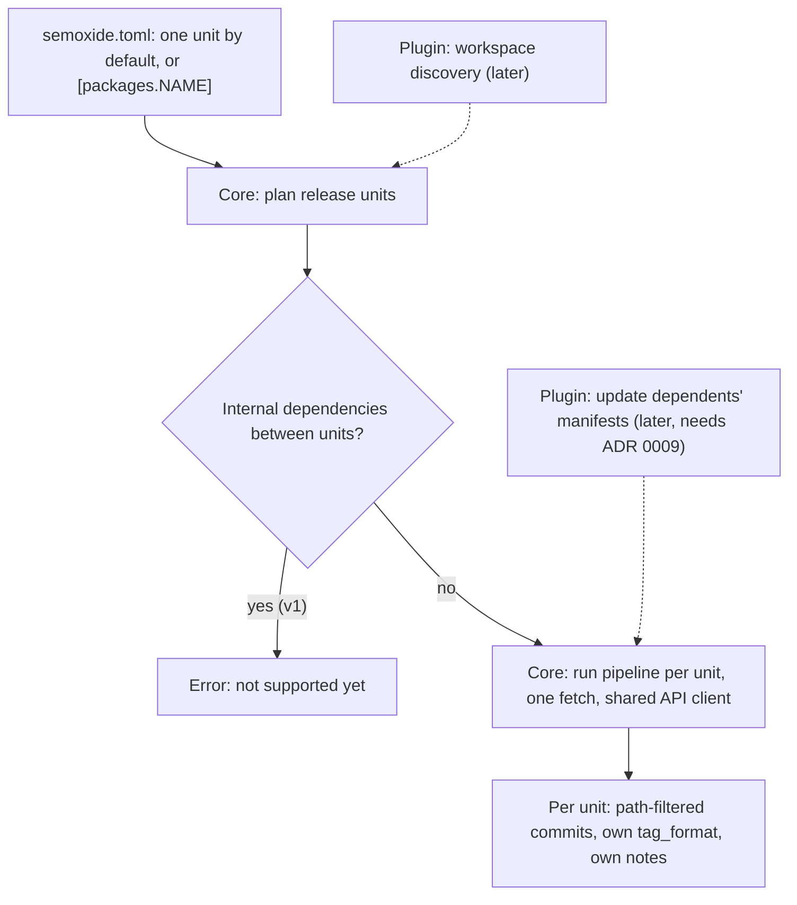

# 0003 Monorepo scope
Status: accepted (2026-10-05), revised the same day: hybrid model

- **Core** owns orchestration: release units, the planned order, one fetch and one shared API client per run. It provides the changed paths for each commit and looks up tags per unit.
- **Plugins** handle the ecosystem-specific parts: finding packages in a workspace, and updating the manifests of dependent packages.
- **v1:** one unit by default, or units declared explicitly under `[packages.NAME]` and released independently. If units depend on each other, the run fails with an error.
- **Later:** a dependency-ordered plan, bumping dependents, and locked version groups.

Why: the demand is large ([numbers](../research/distribution-config.md#demand)). semantic-release's plugin-only approach fragmented into several community add-ons and forks and runs N separate times. Orchestration can't live inside a step plugin.
