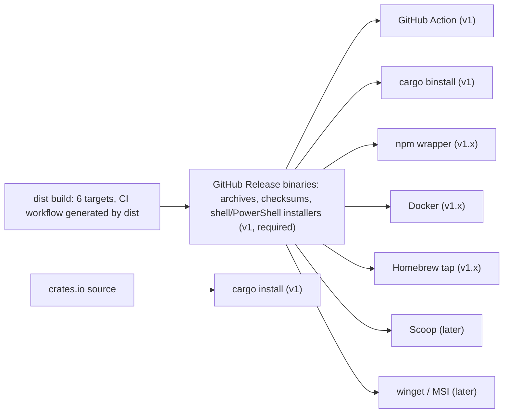
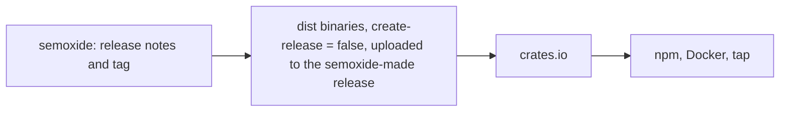
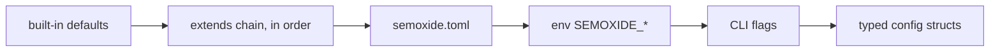
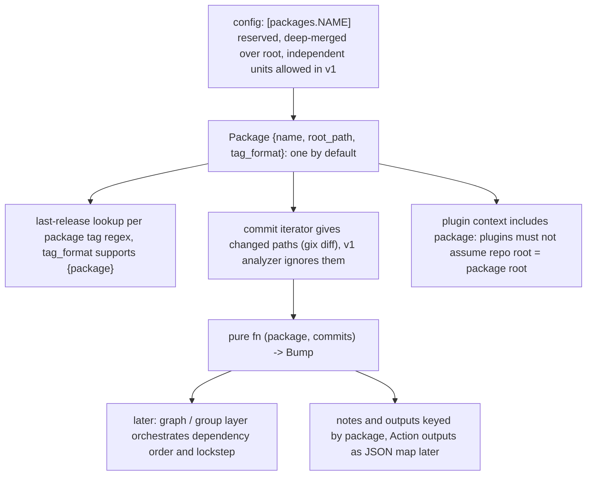

# Distribution, config, monorepo scope

Crate data: crates.io API, 2026-10-05. Action data: each repo's `action.yml`, 2026-10-05.

## 1. Distribution

### Channels

Proposed: every channel except `cargo install` ships the binaries from one `dist` build. Priority in brackets.

| Channel | Mechanism | Notes |
|---|---|---|
| GitHub Release binaries | `dist` (ex cargo-dist, axodotdev, v0.33.0 2026-09, active) | |
| `cargo binstall` | Finds dist artifacts by default; `[package.metadata.binstall]` only if layout differs | release-plz's own action uses this |
| `cargo install` | crates.io source build | Needs MSRV policy (below) |
| GitHub Action | Composite (see below) | Main CI entry point |
| npm wrapper | `semoxide` + `@semoxide/cli-<os>-<arch>` with `os`/`cpu` + `optionalDependencies` (biome/esbuild pattern). dist has an npm installer, but it downloads on postinstall, which breaks with `--ignore-scripts` and offline mirrors | `npx semoxide` is the migration path for semantic-release users |
| Docker | `FROM scratch` or distroless/static + musl binary + CA certs; buildx amd64/arm64; GHCR | Works with no git CLI because gix is used ([git-libraries](git-libraries.md)). Covers GitLab CI and Jenkins |
| Homebrew | dist `homebrew` installer to own tap `semoxide/homebrew-tap` | homebrew-core needs notability first |
| Scoop | Own bucket manifest with `autoupdate` (dist has no scoop installer) | |
| winget / MSI | dist `msi` installer | |

### Targets

| Target | Runner (native, no `cross`) |
|---|---|
| x86_64-unknown-linux-musl | ubuntu-24.04 |
| aarch64-unknown-linux-musl | ubuntu-24.04-arm |
| x86_64-apple-darwin | macos-15-intel (or cross from arm) |
| aarch64-apple-darwin | macos-15 |
| x86_64-pc-windows-msvc | windows-2025 |
| aarch64-pc-windows-msvc | windows-11-arm |

musl needs pure-Rust TLS (`rustls` features on reqwest/gix, no OpenSSL). GNU target optional: static musl covers all Linux CI images incl. Alpine.

### GitHub Action shape

| Type | + | − | Used by |
|---|---|---|---|
| **Composite** + download prebuilt binary | All runner OSes, about 2 s startup, no node runtime churn | Needs a bash/pwsh install script and checksum check | release-plz (via cargo-binstall), git-cliff-action (`install.sh`), cocogitto-action (`install.sh`) |
| Docker | Hermetic | Linux runners only, slow image pull, container UID breaks workspace file ownership | early git-cliff-action |
| JS wrapper | Typed inputs, `@actions/tool-cache` | node20 to node24 runtime deprecations, `dist/` bundle committed | |

**Pick: composite.** Version input defaults to the action's own tag. Verify the binary against the release's `sha256`. Expose outputs: `released`, `version`, `tag`, `notes` (semantic-release users script on these).

### Dogfooding

| Step | Approach |
|---|---|
| Bootstrap (0.1.0) | Manual tag + `dist` workflow on tag push |
| Steady state | Release workflow runs **the previous released semoxide** (pinned action tag) to compute the version, then tags and creates the GitHub Release. dist builds the artifacts and the crates.io publish runs after that |
| Guard | A nightly job runs the HEAD build in `--dry-run` against the repo, so regressions show up before they ship |

Proposed order (needs the publish-step plugin hook to work):

### MSRV / edition

| Item | Policy |
|---|---|
| Edition | 2024 |
| MSRV | `rust-version` = stable minus 2 (about 12 weeks). Raising it is a minor bump, not a major one. CI job runs `cargo +msrv check` |
| Resolver | v3 (MSRV-aware, the default in 2024), so lib consumers on older toolchains get compatible deps |
| Lib crate | Same MSRV. `Cargo.lock` committed for the CLI |

## 2. Config

### Format

| | TOML | YAML | JSON5 | KDL |
|---|---|---|---|---|
| Rust crate | `toml` 1.1 (spec 1.1, very active) | `serde_yaml` **deprecated**. Forks `serde_yaml_ng`/`serde_norway` stalled since 2024. `serde-saphyr` 1.3 is young | `json5` 1.3 | `kdl` 6.7 (no serde), `knus` derive |
| Rust ecosystem fit | Native (Cargo, dist, release-plz, git-cliff, knope) | — | — | Niche |
| semantic-release familiarity | Medium | High (`.releaserc.yml`) | High (`.releaserc` JSON) | None |
| Editor schema | Taplo / Tombi (`#:schema`, SchemaStore) | yaml-language-server | VS Code JSON | Weak |
| Pitfalls | Arrays of inline tables are verbose for `plugins` | Norway problem, anchors, indentation | Comments are fine, but trailing-key churn | Unknown to users |

**Pick: TOML only.** Opinionated: one format, no cosmiconfig-style search. Files: `semoxide.toml`, falling back to `.config/semoxide.toml`. No `package.json`/`Cargo.toml` metadata key (it may come later as an `extends` source). Plugin list syntax: `[[plugins]] name = "github"` + options, or `[plugins.github]` tables with an explicit `order`. Decide this in the ADR.

### Crates / layering

| Crate | State | Verdict |
|---|---|---|
| figment 0.10.19 | Last release 2024-05 (stalled) | Its provenance-aware errors are nice, but it's a dependency risk |
| config 0.15 | Active | Weakly typed, historical key-case folding, heavy defaults |
| **serde + toml + own merge** | — | **Pick.** Merge `toml::Table` layers (about 200 LOC), deserialize once into typed structs, use `serde_path_to_error` for key paths. Track the source layer per key for `semoxide config --explain` |

Proposed precedence, low to high (merge rules under [shareable configs](#shareable-configs-no-npm)):

Lib API: `Config::builder().file(..).env(..).overrides(..)`. The CLI only feeds the layers.

Env naming:

| Kind | Rule | Example |
|---|---|---|
| Core option | `SEMOXIDE_` + UPPER_SNAKE, `__` for nesting | `SEMOXIDE_DRY_RUN=true`, `SEMOXIDE_BRANCHES__0__NAME` (avoid; arrays come from file only) |
| Plugin option | `SEMOXIDE_PLUGIN__<NAME>__<KEY>` | `SEMOXIDE_PLUGIN__GITHUB__DRAFT=true` |
| Secrets | Not config. Each plugin reads its own conventional names | `GITHUB_TOKEN`/`GH_TOKEN`, `CARGO_REGISTRY_TOKEN`, `NPM_TOKEN` |
| CI detection | env-ci equivalent, separate from config | `CI`, `GITHUB_ACTIONS` |

### Schema

`schemars` 1.2: `#[derive(JsonSchema)]` on the core config. `semoxide schema` prints the merged schema. Publish it to SchemaStore with `fileMatch: semoxide.toml` so Taplo/Tombi pick it up with zero setup. Also commit `schema.json` per release and pin it via the `#:schema https://…/v1/schema.json` header.

### Per-plugin config typing

| Plugin kind ([plugin-mechanisms](plugin-mechanisms.md)) | Typing |
|---|---|
| Compiled-in | `trait Plugin { type Config: DeserializeOwned + JsonSchema; }`. Core stores raw `toml::Value` per plugin and the plugin deserializes in `verify_conditions`. Errors are prefixed with `plugins.<name>.` |
| Subprocess / WASM | Plugin exposes `schema` (JSON Schema) through its protocol. Core validates with `jsonschema` before invoking it |
| Combined schema | Root `plugins` items = `oneOf` discriminated by `name`. Built by `semoxide schema` from the installed plugin set |

Unknown keys: `deny_unknown_fields` on core and built-in plugins (catches typos, a frequent semantic-release complaint).

### Shareable configs (no npm)

| Source | Syntax | Integrity | Verdict |
|---|---|---|---|
| Built-in presets | `extends = ["semoxide:rust"]` | Compiled in | **v1** (`rust`, `npm`, `github`) |
| Local path | `"./ci/release.toml"` | — | **v1** (monorepo/org templates in-repo) |
| Git ref | `"git+https://github.com/org/cfg#<sha-or-tag>:path.toml"` | Requires a SHA, or a tag plus lockfile | v1.x. Fetched via gix into a cache dir |
| HTTPS URL | `"https://…/x.toml"` + `sha256 = "…"` | Hash required | v1.x |
| npm package | Resolved from `node_modules/<pkg>/semoxide.toml` if present | npm lockfile | Optional, later. Has no npm runtime dependency |
| Registry | — | — | No. Not worth running one |

Merge rules: tables deep-merge, arrays replace (same as semantic-release `plugins`), and extends chains are resolved recursively with cycle detection. An `extends` source cannot itself execute anything.

### Templating

semantic-release uses lodash `template` (arbitrary JS). There are two separate needs:

| Use | Requirement | Pick |
|---|---|---|
| `tag_format` (`v{version}`, `pkg@{version}`) | Must be **reversible** (tag → version regex) | Tiny own placeholder syntax `{version}` (and `{package}` for monorepo). Exactly one `{version}`, validated at load |
| Free text (commit message, release name, notes header, exec cmds) | Logic, filters, loops | `minijinja` 2.x (mitsuhiko, active, small, sandboxed, serde context). tera 2 is heavier, handlebars is weaker, upon is too niche |

Context object: `version`, `previous_version`, `tag`, `channel`, `branch`, `notes`, `commits`, `package`, `env` (allow-listed). It is documented in the schema.

## 3. Monorepo scope

| Tool | Model | Versioning | Commit → package |
|---|---|---|---|
| semantic-release | None: core assumes one version, tagFormat and lastRelease per run. [#193](https://github.com/semantic-release/semantic-release/issues/193) (most-voted, open since 2016, 256 👍), [#1688](https://github.com/semantic-release/semantic-release/issues/1688), [#2834](https://github.com/semantic-release/semantic-release/issues/2834), [#1628](https://github.com/semantic-release/semantic-release/issues/1628) (wontfix): maintainers lacked monorepo expertise, asked for an RFC, now "officially does not support monorepos". Plugins inherit the stance (commit-analyzer [#174/#252](commit-analyzer.md#7-issue-history-120-non-bot-issues-ranked-by-reactions--comments), [npm](npm.md#7-issue-history) rejections) | — | — |
| semantic-release-monorepo | Plugin wrapper; one run per package | Independent | Filters commits by touched path. Tag `pkg-v1.2.3` |
| multi-semantic-release (qiwi / anolilab) | Runs N semantic-release instances in one process | Independent + bumps internal deps | Path, with sequential coordination |
| release-plz | Cargo workspace native, per-package release PR | Independent, plus `version_group` for lockstep | Paths of the package's files (from `cargo package --list`) + semver-checks |
| knope | `[packages.<name>]` with `versioned_files`, `scopes` | Independent | Conventional commit **scope** and/or changeset files |
| changesets | Change files written by humans | Independent, `fixed` / `linked` groups | Explicit in the change file |
| release-please | `release-please-config.json` + `.release-please-manifest.json` | Independent, `linked-versions` / `node-workspace` / `cargo-workspace` plugins | Path, with `exclude-paths` |

### Demand
Measured 2026-10-05. npm download counts are CI-inflated, so treat them as relative signals.

| Signal | Value |
|---|---|
| semantic-release [#193](https://github.com/semantic-release/semantic-release/issues/193) | 256 👍 (335 reactions in total), 159 comments. #1 issue by reactions; #2 has 138 |
| [#1688](https://github.com/semantic-release/semantic-release/issues/1688), npm workspaces | 54 👍, #8 overall |
| Issues mentioning "monorepo" across the semantic-release org | 119 |
| npm per month: semantic-release | 12.8M |
| semantic-release-monorepo | 649k |
| multi-semantic-release (3 forks: original, `@qiwi`, `@anolilab`) | 249k |
| `@semrel-extra/npm` (npm plugin fork for monorepos) | 192k |
| changesets (monorepo-first) | 21.9M, 1.7× semantic-release |
| release-please | 842k |

**Why upstream declined (from the maintainers' comments on [#193](https://github.com/semantic-release/semantic-release/issues/193)):** this was a scope choice, not an anti-monorepo stance. The docs ([supported-branching](https://github.com/semantic-release/docs/blob/main/src/content/docs/foundation/supported-branching.md#monorepos)) say "not officially supported at this time" and point to community plugins.
- Commit filtering by path is "relatively trivial" (pvdlg, 2019). The blocker is **interdependent packages**: releases must run in dependency order, and dependents' manifests must be updated between publishes, otherwise broken packages get published. A path-filter-only feature was rejected for this reason.
- That conflicts with the "versions live only in tags, never commit back" principle many users rely on (travi, 2021).
- 2018: no maintainer had monorepo expertise, and they asked for an RFC. 2023: "no short term plans… would need to come from the community".

**Researcher recommendation (superseded by [ADR 0003](../decisions/0003-monorepo-scope.md): v1 also allows explicitly declared independent units):** design it in from the start:

Proposed `Package` abstraction (v1 constraints):

Planned v2 approach: path-based attribution (release-plz / release-please style; no human change files), discovering Cargo and npm workspaces, plus `groups` for lockstep.

## Ticket candidates

### Distribution
- **Set up dist release pipeline**: `dist init`, 6 targets on native runners, musl + rustls, checksums.
- **Composite GitHub Action**: install script (bash + pwsh), sha256 verification, version input, outputs `released/version/tag/notes`.
- **binstall metadata check**: verify `cargo binstall semoxide` resolves dist artifacts and add a CI smoke test.
- **npm wrapper packages**: `semoxide` + `@semoxide/cli-*` optional deps, generated and published from the release workflow.
- **Docker image**: static musl, scratch/distroless, multi-arch, GHCR.
- **Homebrew tap**: dist homebrew installer into `semoxide/homebrew-tap`.
- **Scoop bucket**: manifest with autoupdate.
- **Dogfooding workflow**: previous-release semoxide cuts the release, dist uploads to it, and a nightly HEAD dry-run.
- **ADR: MSRV and edition policy**: edition 2024, stable minus 2, resolver v3, MSRV CI job.

### Config
- **ADR: TOML-only config and file discovery**: `semoxide.toml` / `.config/semoxide.toml`, plugin list syntax.
- **Config layering in the lib**: builder, `toml::Table` merge, per-key provenance, `serde_path_to_error`.
- **Env var mapping**: `SEMOXIDE_*`, `__` nesting, plugin namespace; secrets kept out of config.
- **JSON schema generation**: schemars derive, `semoxide schema`, SchemaStore submission.
- **Plugin config typing**: `Plugin::Config` associated type, raw-value handoff, external-plugin schema protocol and validation.
- **`extends`: presets + local path** (v1), with deep-merge/array-replace and cycle detection.
- **`extends`: git ref and HTTPS sources** (v1.x), pinned SHA/hash and cache.
- **Templating**: reversible `tag_format` placeholder parser + minijinja for free-text fields and context spec.
- **`semoxide config --explain`**: print the effective config with the source layer of each key.

### Monorepo
- **ADR: monorepo out of v1**: list the non-preclusion constraints above.
- **Package abstraction in core pipeline**: single default `Package`, tag lookup per package.
- **Changed paths in commit iterator**: gix diff per commit, PoC for performance on large histories.
- **Reserve `[packages.*]` config key**: parse, then reject with a v2 pointer.
- **v2 research: workspace discovery and lockstep groups** (Cargo, npm), dependency-graph bump propagation.
