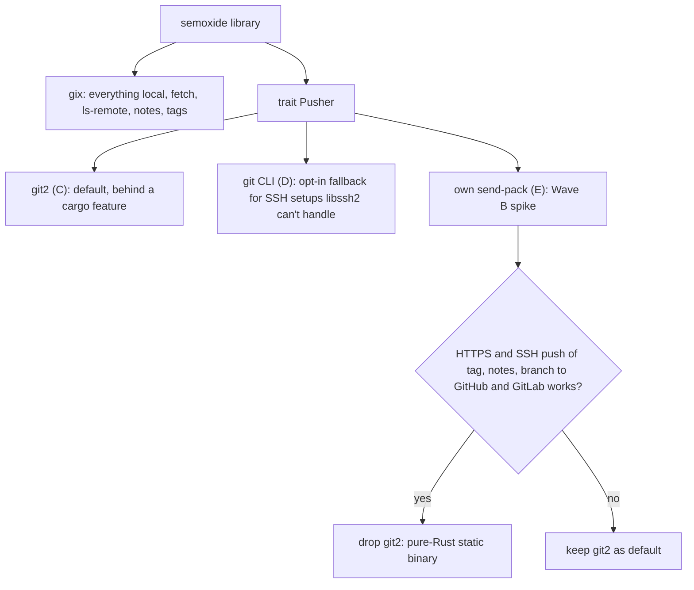

# Git libraries

Snapshot 2026-10-05: `gix` 0.88.0 (2026-09-25), `git2` 0.21.0 / `libgit2-sys` 0.18.8+**libgit2 1.9.7** (2026-08).
Ops: G-numbers from [semantic-release §3](semantic-release.md#3-git-operations); @sr/git ops from [dependencies §6](dependencies.md#6-semantic-releasegit).
Legend: **Y** supported, **P** partial / needs glue, **N** unsupported.

Refs used below:
[cs]: gitoxide [`crate-status.md`](https://github.com/GitoxideLabs/gitoxide/blob/main/crate-status.md) ·
[gix]: [docs.rs/gix `Repository`](https://docs.rs/gix/0.88.0/gix/struct.Repository.html) ·
[g2]: [docs.rs/git2 `Repository`](https://docs.rs/git2/0.21.0/git2/struct.Repository.html) ·
[g2r]: [docs.rs/git2 `Remote`](https://docs.rs/git2/0.21.0/git2/struct.Remote.html)

## Operation matrix

| Op (G#) | gix | git2 | Notes |
|---|---|---|---|
| Is git repo (G3) | Y `gix::discover` | Y `Repository::discover` | |
| HEAD sha, detached HEAD (G7, G14) | Y | Y | |
| List tags | Y `references().tags()` | Y `tag_names` | |
| Tags merged into HEAD (G11) | P | P | No direct API in either. Walk HEAD ancestry once into a set, then peel each tag. gix: commit-graph accelerated walk. git2: `graph_descendant_of` per tag is O(tags×history). |
| Tag → commit (G15) | Y peel | Y `peel_to_commit` | |
| Log range with full message (G16) | Y rev-walk include/exclude tips | Y `Revwalk::push`/`hide` | gix walk respects shallow boundary. git2 had a shallow revwalk panic ([git2-rs#796](https://github.com/rust-lang/git2-rs/issues/796), closed). |
| Remote branch list (G6) | Y ls-refs + refspec filter [cs] | Y `Remote::list` [g2r] | |
| `ls-remote` generic | Y (V1+V2 handshake) | Y | |
| Remote URL (G2) | Y `find_remote().url()` | Y | gix can't **write** config yet [cs]. Not needed. |
| Branch up to date (G13) | Y | Y | ls-remote sha vs local sha + ancestry check. |
| Fetch with tags (G8) | Y `Tags::All` | Y `AutotagOption::All` | |
| Fetch into shallow repo | Y `Shallow::NoChange` | P | libgit2 shallow since 1.7. Fetch bugs fixed only in 1.9 ([libgit2#7105](https://github.com/libgit2/libgit2/issues/7105)). Local `file://` shallow broken ([#6634](https://github.com/libgit2/libgit2/issues/6634)). git2 has no shallow tests (comment on `FetchOptions::depth`). |
| Unshallow (G8, G9) | Y [`Shallow::undo()`](https://docs.rs/gix-protocol/0.66.0/gix_protocol/fetch/enum.Shallow.html) | P `depth(i32::MAX)` = `GIT_FETCH_DEPTH_UNSHALLOW` | Not documented in git2. `depth(0)` means "no limit", **not** unshallow. |
| Fetch notes (G9) | Y custom refspecs | Y | |
| Lightweight tag (G17) | Y `tag_reference` | Y `tag_lightweight` | |
| Annotated tag | Y `Repository::tag` | Y `tag` / `tag_annotation_create` | cs marks only *signed* tags as missing. |
| Signed tag / commit | N ([#12](https://github.com/GitoxideLabs/gitoxide/issues/12), closed into a proposal) | P `commit_signed` (caller supplies the signature) | Neither runs gpg/ssh-keygen. Signed tag = hand-build tag bytes + odb write (P in both). |
| Read/write notes (G10, G18) | Y `notes()`: get/replace/remove ([gix-note](https://docs.rs/gix-note/0.2.0)) | Y `note`/`find_note`/`note_delete` | gix notes landed in 2026. Very new. |
| **Push tag / notes / branch** (G19, G20) | **N** [cs] `gix-protocol: [ ] push`. [#306](https://github.com/GitoxideLabs/gitoxide/issues/306) closed into a [proposal discussion #2776](https://github.com/GitoxideLabs/gitoxide/discussions/2776). Push refspec matching also missing. | Y `Remote::push` + `push_update_reference` callback [g2r] | gix has the parts: receive-pack service, thin pack creation, credentials. It has no send-pack client. |
| Push permission (G5) | P: `connect(Direction::Push)` + receive-pack handshake | P `connect_auth(Direction::Push)` | Neither has dry-run. The handshake proves auth, and GitHub 401/403s receive-pack without write. Branch protection is not checked (same blind spot as git). PoC. |
| Add files + commit (@sr/git) | P: no `add` / index→tree [cs]. Build the tree with `edit_tree` + `commit_as`, then index-from-tree. | Y `Index::add_path` / `write_tree` / `commit` | Hooks: N in both (git runs pre-commit; we won't). |
| Push branch (@sr/git) | N | Y | |

## Cross-cutting

| Topic | gix | git2 |
|---|---|---|
| HTTPS token in URL / `GH_TOKEN` | Y via `with_credentials` callback | Y `RemoteCallbacks::credentials` |
| Credential helpers | Y `gix-credentials` cascade. Helpers run as `git credential-<name>`, **so a git binary is needed** [cs] | P `Cred::credential_helper` also shells out to `git credential-*`. [auth-git2](https://crates.io/crates/auth-git2) wraps it. |
| SSH | P: spawns external `ssh` (OpenSSH, honors `~/.ssh/config` and agent). Native SSH `[ ]` [cs] | P: libssh2 only (`ssh` feature). No `~/.ssh/config`. Agent/key via callback. libgit2's exec-ssh backend not enabled by `libgit2-sys` build.rs. |
| TLS | reqwest+rustls (pure Rust), reqwest native-tls, curl (+rustls/openssl) | WinHTTP (Windows), SecureTransport (macOS), **OpenSSL** (Linux) |
| Windows | Y | Y |
| Large-history perf | Faster pack/rev-walk, commit-graph accel, `max-performance` | Good. Single-threaded walk. |
| Build | Pure Rust (reqwest+rustls). Trivial musl/cross. MSRV 1.88. Heavy dep tree, so pick features carefully. | C (cc, no cmake). `vendored-libgit2`. Linux https needs OpenSSL (`vendored-openssl` needs perl+make). libssh2 C. musl/cross is painful. **`git2` 0.21 default features = `[]`**, so `https`/`ssh` must be enabled explicitly. |
| License | MIT/Apache-2.0 | git2-rs MIT/Apache-2.0. libgit2 GPLv2 + linking exception (static OK). libssh2 BSD-3. OpenSSL Apache-2.0. |
| Maintenance | Very active: monthly 0.x releases, ~1.2k commits since 2026-07. **Breaking API every minor.** New feature-proposal flow. Maintainer says review is the bottleneck. | Stable, slower: libgit2 1.9.x patch releases, git2 0.21 (2026-05). rust-lang org. |

## Options

| Option | No git CLI | Risks |
|---|---|---|
| A. gix only | Fails at push | Push missing, no ETA. |
| B. git2 only | Y | C/OpenSSL build, libssh2 limits, weaker shallow fetch. |
| **C. gix + git2 for push only** (`trait GitRemote`) | Y | Two libs on one repo dir (gix caches, so reopen after push). Still C build, but only for push. |
| D. gix + git CLI fallback for push | N (push only) | Violates requirement, but matches sr exactly (ssh/helpers/hooks). |
| E. gix + own minimal send-pack (v0/v1 receive-pack: ref cmds + `gix-pack` thin pack + report-status) | Y | Own protocol code. Upstream may land push later. Sr pushes are tiny (tag ref, notes commit, 1 release commit). |

## Recommendation

Proposed layering, and the Wave B decision on option E:

- Pin `gix` exactly. Budget for breaking upgrades each release.
- Signed commits: out of core. If needed, add a signer hook (`gpg`/`ssh-keygen -Y sign`) + `commit_signed`/hand-built object.

## Wave B PoCs (must prove)

| # | PoC | Pass criteria |
|---|---|---|
| 1 | gix read ops | Tags merged into HEAD, `from..to` log with full messages, HEAD sha in a detached HEAD. Matches `git` output on a real repo with 10k+ commits, plus timings. |
| 2 | gix shallow | In a `--depth 1` CI clone: fetch tags, deepen, `Shallow::undo()`. Result equals `git fetch --unshallow --tags`. Also run on a detached-HEAD PR checkout. |
| 3 | gix notes | Write/read `refs/notes/semantic-release-v<x>` JSON (per-tag ref, no [#4073](https://github.com/semantic-release/semantic-release/issues/4073) concat). `git notes --ref … show` reads it back byte-identical. Fetch notes refspec. |
| 4 | gix tags | Lightweight + annotated tag. `git cat-file -t` / `git describe` agree. |
| 5 | git2 push | Push tag, notes ref and branch to GitHub over HTTPS token (`x-access-token`), with per-ref status from `push_update_reference`. Rejected (non-ff/protected) push reports an error. |
| 6 | Push permission | `connect(Push)` handshake (gix and git2) tells write vs read-only vs bad token apart on GitHub + GitLab. |
| 7 | SSH | gix fetch via external ssh. git2 push via libssh2 with agent (Linux + Windows OpenSSH agent pipe). Document what fails. |
| 8 | Credential helpers | gix cascade + git2 helper with GCM on Windows and `store` on Linux. Behavior with no git installed. |
| 9 | Build matrix | Static musl, Windows MSVC, macOS arm64, aarch64 cross. gix-only vs gix+git2 (vendored, rustls/WinHTTP). Binary size + build time. |
| 10 | @sr/git commit | gix: HEAD tree + edited blobs → commit → index updated so `git status` is clean. Compare with git2 `Index::add_path`. |
| 11 | Option E spike | Minimal send-pack on gix-transport/gix-pack: push lightweight tag, annotated tag and notes commit over HTTPS. Report LOC + edge cases. |

## Ticket candidates

- PoC gix read ops — merged tags, log ranges, HEAD, perf vs git on 10k+ commits.
- PoC gix shallow fetch/unshallow — CI depth-1 clone parity with `git fetch --unshallow --tags`.
- PoC gix notes — sr notes ref read/write/fetch, byte parity with `git notes`.
- PoC gix tags — lightweight + annotated creation, git parity.
- PoC git2 push — tag/notes/branch over HTTPS token, per-ref status, rejection handling.
- PoC push-permission check — receive-pack handshake as `push --dry-run` replacement.
- PoC SSH auth — gix external ssh vs git2 libssh2, Linux + Windows.
- PoC credential helpers — gix/git2 helper cascade, GCM on Windows, no-git case.
- PoC build matrix — musl/Windows/macOS/cross, gix vs gix+git2, size/time.
- PoC @sr/git commit — tree edit + commit + index sync with gix.
- Spike gix send-pack — minimal pure-Rust push client (option E), go/no-go.
- ADR git backend — gix core + pluggable `Pusher` (git2 / CLI / native).
- Watch gix push — track discussion #2776 and the crate-status push row.
