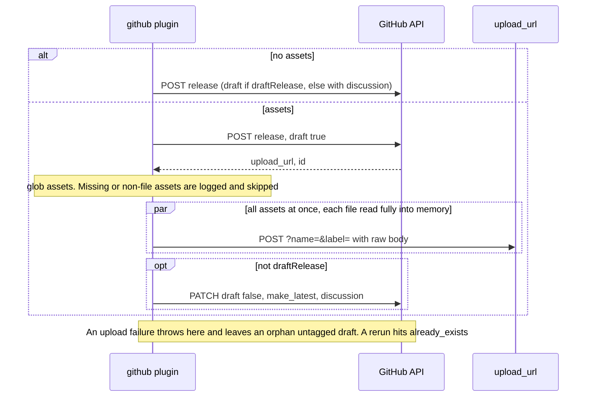
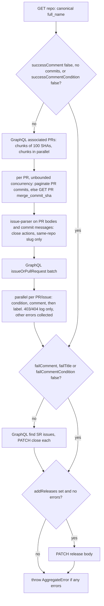
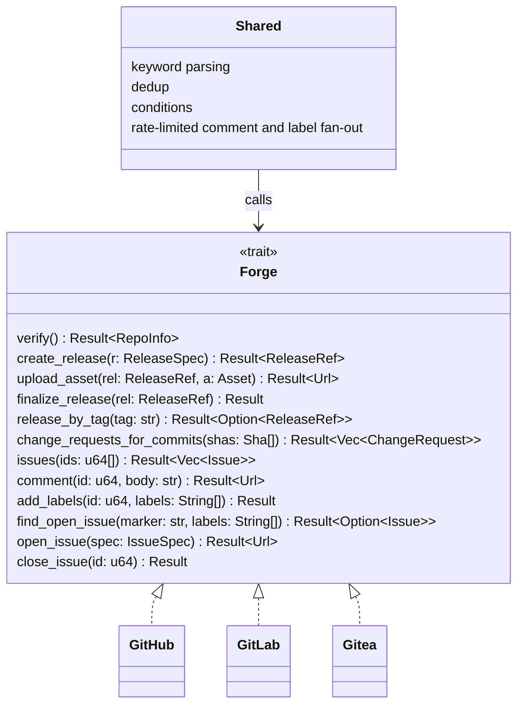

# @semantic-release/github: research

Source: `semantic-release/github` master @ `a32b856` (2026-10-04). ~1.5k LOC in `lib/`, 13k LOC of tests (ava + `fetch-mock` + sinon). Deps: `@octokit/core` 7 + `plugin-paginate-rest` + `plugin-retry` + `plugin-throttling`, `undici` 7, `issue-parser`, `tinyglobby` + `dir-glob`, `mime`, `lodash-es` (`template`). Steps: `verifyConditions`, `publish`, `addChannel`, `success`, `fail`.

## 1. Features

| Feature | File |
|---|---|
| Steps share one module-global `verified` flag. If `verifyConditions` did not run, every other step runs verify lazily | `index.js:12,58-104` |
| verifyConditions borrows `assets`/`successComment`/`failComment`/`failTitle`/`labels`/`assignees`/`discussionCategoryName` from the `publish` entry so it can validate early | `index.js:21-48` |
| Option validation that collects every error (AggregateError of `SemanticReleaseError`) | `lib/verify.js:21-47,82-92` |
| Token, repo existence and push-permission check, with a GitHub Actions and GitHub App installation bypass | `lib/verify.js:104-155` |
| Repo-rename detection: `repositoryUrl` vs `clone_url`, compared case-insensitively | `lib/verify.js:113-121` |
| `repositoryUrl` parsing (https, ssh `git@host:o/r`, shorthand) | `lib/parse-github-url.js` |
| Creates a release with templated name and body, `prerelease` and `make_latest` | `lib/publish.js:51-60` |
| Draft-then-publish when assets are present (create draft, upload, PATCH `draft:false`) | `lib/publish.js:97-191` |
| `draftRelease`: the release stays a draft | `lib/publish.js:64-75,164-167` |
| Release discussion (`discussion_category_name`), but not for drafts | `lib/publish.js:78-80,177-179` |
| Asset globbing (tinyglobby, dotfiles, dir expansion, negation, object or string dedup) | `lib/glob-assets.js` |
| Asset `name`/`label` are lodash templates. Content type comes from `mime`, with `text/plain` as fallback | `lib/publish.js:132-150` |
| Missing or non-file assets only log an error and are skipped (not fatal) | `lib/publish.js:114-130` |
| `isPrerelease` (branch type, `main`, `prerelease` flag) and `isLatestRelease` (the string `"true"`/`"false"`) | `lib/is-prerelease.js`, `lib/is-latest-release.js` |
| addChannel: GET release by tag, then PATCH `prerelease`/`name`. On 404 it creates the release with `notes` | `lib/add-channel.js` |
| success: finds associated PRs through batched GraphQL, filters out false positives over REST, parses closing keywords, comments and labels the results | `lib/success.js:70-262` |
| success: closes open semantic-release fail issues | `lib/success.js:266-303` |
| success: `addReleases` appends or prepends links to other releases in the GH release body | `lib/success.js:305-327`, `lib/get-release-links.js` |
| Comment-guard templates: `successCommentCondition`/`failCommentCondition` (lodash template, truthy string) | `lib/success.js:195-202`, `lib/fail.js:67-74` |
| fail: opens one issue (title, labels, assignees, marker `<!-- semantic-release:github -->`) or comments on the existing one | `lib/fail.js`, `lib/find-sr-issues.js` |
| Default comment bodies | `lib/get-success-comment.js`, `lib/get-fail-comment.js` |
| Octokit with paginate, retry and throttle. Proxy support through undici `ProxyAgent` plus legacy `http(s)-proxy-agent` | `lib/octokit.js` |
| Error catalogue (code, message, markdown details) | `lib/definitions/errors.js` |

## 2. Config options and env vars

Resolution happens in `lib/resolve-config.js`. Options win over env vars.

| Option | Env fallback | Default | Validation / notes |
|---|---|---|---|
| (token) | `GH_TOKEN` \|\| `GITHUB_TOKEN` | – | Required (`ENOGHTOKEN`) |
| `githubUrl` | `GH_URL` \|\| `GITHUB_URL` | – (api.github.com) | GHE server root. Also passed to `issue-parser` `hosts` |
| `githubApiPathPrefix` | `GH_PREFIX` \|\| `GITHUB_PREFIX` | `""` | Joined to `githubUrl`, e.g. `/api/v3` |
| `githubApiUrl` | `GITHUB_API_URL` | – | Overrides url+prefix. GH Actions always sets it |
| `proxy` | `http_proxy` \|\| `HTTP_PROXY` | `false` | String URL or `{host, port, headers?, secureProxy?}`. **No `HTTPS_PROXY`/`NO_PROXY`** |
| `assets` | – | – | `Array<glob \| glob[] \| {path, name?, label?}>`. A scalar gets cast to an array |
| `successComment` | – | built-in | Non-empty string or `false` (deprecated, use the condition) |
| `successCommentCondition` | – | – | Lodash template. `false` skips comments |
| `failTitle` | – | `The automated release is failing 🚨` | `false` is deprecated |
| `failComment` | – | built-in | `false` is deprecated |
| `failCommentCondition` | – | – | Template with `issue` = the existing SR issue or `undefined` |
| `labels` | – | `["semantic-release"]` | For the fail issue. `false` means none (`semantic-release` is still always added) |
| `assignees` | – | – | For the fail issue |
| `releasedLabels` | – | `["released<%= nextRelease.channel ? ` on @${channel}` : "" %>"]` | Templated. `false` means none. Tied to the success-comment gate |
| `addReleases` | – | `false` | `false\|"top"\|"bottom"` |
| `draftRelease` | – | `false` | bool |
| `releaseNameTemplate` | – | `<%= nextRelease.name %>` | |
| `releaseBodyTemplate` | – | `<%= nextRelease.notes %>` | |
| `discussionCategoryName` | – | `false` | |
| – | `GITHUB_ACTION` | – | When set, verify skips the `permissions.push` check |

## 3. Per-step behavior

| Step | Flow |
|---|---|
| verifyConditions | validate options → parse URL → (if token and proxy valid) GET repo → rename check → if not `GITHUB_ACTION` and not `permissions.push`, HEAD `/installation/repositories` (success means App token, so OK) → 401 gives `EINVALIDGHTOKEN`, 404 gives `EMISSINGREPO`, other errors are rethrown |
| addChannel | GET release by tag → PATCH `{name, prerelease, tag_name}`. On 404, POST a new release with `body: notes`. **No `make_latest`**, body is not updated |
| fail | GET repo → GraphQL find SR issue (first 100 open, label filter, marker in body) → evaluate condition → comment on the existing issue, or POST a new issue |

**publish** returns `{url, name:"GitHub release", id, discussion_url}`:

**success** (`releasedLabels` are added only after the comment succeeds):

### API calls (exhaustive)

| # | Call | Purpose | Step | File |
|---|---|---|---|---|
| 1 | `GET /repos/{o}/{r}` | auth, existence, `permissions.push`, `clone_url` rename check | verify | `verify.js:111` |
| 2 | `HEAD /installation/repositories?per_page=1` | detect App installation token | verify | `verify.js:134` |
| 3 | `POST /repos/{o}/{r}/releases` | create the release (or a draft when assets or `draftRelease` are set) | publish, addChannel | `publish.js:69,85,100`, `add-channel.js:56` |
| 4 | `POST {upload_url}` (uploads.github.com, `?name=&label=`) | upload asset (raw body, `content-type`) | publish | `publish.js:153` |
| 5 | `PATCH /repos/{o}/{r}/releases/{id}` | un-draft + `make_latest` + discussion | publish | `publish.js:179` |
| 6 | `GET /repos/{o}/{r}/releases/tags/{tag}` | find the release for the channel | addChannel | `add-channel.js:45` |
| 7 | `PATCH /repos/{o}/{r}/releases/{id}` | set `prerelease`/`name` | addChannel | `add-channel.js:72` |
| 8 | `GET /repos/{o}/{r}` | resolve the renamed `full_name` | success, fail | `success.js:52`, `fail.js:51` |
| 9 | GraphQL `getAssociatedPRs`: up to 100 aliased `commit<sha12>: object(oid:) { ...on Commit { associatedPullRequests(first:100) } }` | SHA to PRs | success | `success.js:81,454` |
| 10 | GraphQL `getCommitAssociatedPRs(sha, cursor)` | page more than 100 PRs per commit (**broken**, see below) | success | `success.js:96,496` |
| 11 | `GET /repos/{o}/{r}/pulls/{n}/commits` (paginated) | confirm the PR really contains a released SHA | success | `success.js:121` |
| 12 | `GET /repos/{o}/{r}/pulls/{n}` | fallback: `merge_commit_sha` is in the release (squash/rebase) | success | `success.js:132` |
| 13 | GraphQL `getRelatedIssues`: up to 100 aliased `issue<N>: issueOrPullRequest(number:)` | hydrate keyword-closed issues/PRs | success | `success.js:176,416` |
| 14 | `POST /repos/{o}/{r}/issues/{n}/comments` | success comment, or fail comment on the existing issue | success, fail | `success.js:213`, `fail.js:76` |
| 15 | `POST /repos/{o}/{r}/issues/{n}/labels` | released labels | success | `success.js:227` |
| 16 | GraphQL `getSRIssues`: `issues(first:100, states:OPEN, filterBy:{labels})` | find the fail issue (replaced `GET /search/issues` in v12, [#1022](https://github.com/semantic-release/github/issues/1022)) | success, fail | `find-sr-issues.js:11` |
| 17 | `PATCH /repos/{o}/{r}/issues/{n}` `state:closed` | close the fail issue | success | `success.js:291` |
| 18 | `PATCH /repos/{o}/{r}/releases/{id}` `body` | `addReleases` | success | `success.js:317` |
| 19 | `POST /repos/{o}/{r}/issues` | create the fail issue | fail | `fail.js:93` |

Notes on PR/issue discovery:
- PR nodes are mapped into REST-issue-shaped objects (`pull_request: true`, `user`, `labels`, `merged_at`…) so the `issue` that templates receive stays compatible (`success.js:534-607`).
- Hard-coded fields matter. One field missing on GHE (`canBeRebased`) broke users ([#910](https://github.com/semantic-release/github/issues/910)).
- The commit alias uses only the first 12 SHA characters, so an alias collision is theoretically possible.

**Rate limiting/retry** (`lib/octokit.js`, `definitions/{retry,throttle}.js`):
- `plugin-throttling` uses default limits (concurrency 1 for writes, a delay between content-creating POSTs).
- `onRateLimit` and `onSecondaryRateLimit` both retry while `retryCount <= 3`.
- `plugin-retry` uses `retries:3`, with `doNotRetry:[400,401,403,422]`. **404 is retried**, on purpose, because of replication lag.
- **A new Octokit is built per step**, so throttle state is not shared between steps (open PR [#640](https://github.com/semantic-release/github/pull/640)).

**Asset globbing** (`lib/glob-assets.js`):
- Each entry is cast to an array, then `dir-glob` expands directories.
- A lone `!pattern` is skipped.
- tinyglobby runs with `{dot:true, onlyFiles:false}`.
- An object entry that matches more than one file is split into one entry per file, with `name` set to the basename (the custom `name` is lost).
- If nothing matches, the original pattern is kept and later logged as missing.
- Object entries are sorted first, then deduplicated by resolved path.
- Template variables are not supported in `path` ([#363](https://github.com/semantic-release/github/issues/363), [#274](https://github.com/semantic-release/github/issues/274)). Only `name` and `label` are templated.

**Bugs found while reading**:
1. `success.js:98` references an undefined `response.commit.oid`, so a commit with more than 100 associated PRs throws `ReferenceError`. The "multipaged" test does not catch it: `overwriteRoutes:true` replaces the first GraphQL mock, so the pagination path never runs (the test only asserts on PR #6).
2. An empty `commits` array logs the `successComment:false` deprecation warning.
3. The proxy object form is passed as `ProxyAgent({uri: <object>})`, and undici expects a string. Likely broken (not verified).

## 4. Side effects

| Side effect | Where | Notes |
|---|---|---|
| GitHub release created or updated (draft, prerelease, `make_latest`, discussion) | publish, addChannel | Orphan draft on failed upload (see publish diagram; [#295](https://github.com/semantic-release/github/issues/295), [#995](https://github.com/semantic-release/github/issues/995)) |
| Release assets uploaded | publish | No overwrite or delete of an existing asset |
| Comments on PRs and issues | success | Can be hundreds of POSTs, which trips secondary rate limits |
| Labels added to PRs and issues (the label is auto-created by GitHub if missing) | success | |
| Fail issue opened or commented | fail | Uses the marker comment plus the `semantic-release` label |
| Fail issue closed | success | |
| Release body rewritten | success (`addReleases`) | |
| Tags: none directly | – | `POST releases` with `tag_name` + `target_commitish` creates the tag if core did not push it |

## 5. Rust port notes

| Concern | Recommendation |
|---|---|
| HTTP client | **reqwest + a small hand-written REST layer** rather than octocrab. Only around 12 REST endpoints are needed. octocrab hides retries and headers, and GHE base-URL plus upload-URL handling is awkward there. octocrab is fine for a prototype, and it does support a custom `base_uri` and `upload_uri` |
| GraphQL | `graphql_client` cannot express dynamic aliased batches (`commit<sha>: object(...)`). Build query strings by hand and decode `repository` as `HashMap<String, Node>` with serde. Keep field sets minimal and GHE-safe |
| Retry/throttle | `reqwest-middleware` + `reqwest-retry`, plus a custom middleware that reads `retry-after`, `x-ratelimit-remaining` and `x-ratelimit-reset` and the secondary-limit 403 message. Use a `governor`/semaphore to serialize writes (concurrency 1, about 1s gap between comment POSTs). **Share one client across all steps** |
| Proxy | reqwest supports `HTTP(S)_PROXY`/`NO_PROXY` natively plus `Proxy::custom`. That is a strict improvement over upstream |
| Glob | `globset` + `walkdir` (or `ignore::WalkBuilder` without gitignore) for negation and dotfiles. `glob` crate as the simple alternative. Dedup by canonical path. Do not split objects silently |
| Upload | Stream with `tokio::fs::File` → `reqwest::Body::wrap_stream`, explicit `Content-Length`, MIME from `mime_guess`. Bounded concurrency (2-4) |
| Templates | Replace lodash `template` (JS eval) with `minijinja`. Conditions become a minijinja expression that evaluates to a bool ([#1029](https://github.com/semantic-release/github/issues/1029)) |
| GHE | Derive `{api_base, upload_base, graphql_url}` from `GITHUB_API_URL`/`GITHUB_SERVER_URL`. GHE uses `/api/v3` and `/api/graphql` paths, and uploads go to `{host}/api/uploads`. Always use the `upload_url` returned by the API |
| Steps | Drop the module-global `verified`. The host guarantees that verify runs. Verify should also check the extra permissions ([#895](https://github.com/semantic-release/github/issues/895)) |

**Proposed `trait Forge`**, a shared shape for GitHub, GitLab and Gitea. All methods are `async` and take `&self`. SHA → PR discovery is forge-specific. Keyword parsing, dedup, conditions and the rate-limited comment/label fan-out are shared.

## 6. Tests

Tests inject `TestOctokit` (baseUrl `https://api.github.local`, `request.fetch = fetchMock.sandbox()`), a sinon logger stub, fixtures in `test/fixtures/files`.

| File (tests) | Portable to wiremock? | How |
|---|---|---|
| `verify.test.js` (69) | Yes | `Mock::given(method("GET")).and(path("/repos/o/r"))` with JSON responses. Cover 401, 404, missing permissions with a HEAD installation fallback, and env permutations. Replace the AggregateError assertions with `Vec<Error>` codes |
| `publish.test.js` (17) | Yes | Serve the `upload_url` from the mock server with `{?name,label}`. Match `query_param("name")`, `header("content-type")` and the body bytes |
| `add-channel.test.js` (9) | Yes | A 404 branch mock, then expect a POST |
| `success.test.js` (29, 4.3k LOC) | Yes, rewritten | Match GraphQL by `body_partial_json` or a custom matcher on the `query` substring (`getAssociatedPRs`, `getRelatedIssues`, `getSRIssues`). Use `.expect(n)` for call counts. Add a real >100-PR pagination test (upstream bug) |
| `fail.test.js` (11), `find-sr-issue.test.js` (4) | Yes | Same GraphQL matcher |
| `integration.test.js` (16) | Yes | Full step pipeline against a single `MockServer` |
| `glob-assets.test.js` (19) | No HTTP | Plain unit tests on a `tempfile` dir |
| `get-*-comment`, `get-release-links`, `is-prerelease`, `is-latest-release` | No HTTP | Golden-string or table tests (`insta`) |
| `to-octokit-options.test.js` (12), `octokit-proxy-integration.test.js` (2) | Partly | Node and undici specific (content-length, dispatcher). Replace with reqwest proxy tests against a local CONNECT proxy, or drop |

Retry and throttle behavior is **untested upstream** (the Octokit plugins are mocked out in TestOctokit). Add wiremock scenarios that return 403 secondary limits or 429 with `retry-after`, using `up_to_n_times`.

## 7. Issue history

The repo has 241 issues in total (`gh api graphql`, ranked by reactions×2 + comments).

**Recurring problems**

| Problem | Links |
|---|---|
| Secondary or primary rate limits in `success` (comment fan-out, search API). Mitigated with GraphQL batching in v10.0.7 and by dropping `/search/issues` in v12 | [#867](https://github.com/semantic-release/github/issues/867), [#542](https://github.com/semantic-release/github/issues/542), [#644](https://github.com/semantic-release/github/issues/644), [#377](https://github.com/semantic-release/github/issues/377), [#299](https://github.com/semantic-release/github/issues/299), [#1022](https://github.com/semantic-release/github/issues/1022) |
| GraphQL fragility: empty SHA list makes an invalid query, a field missing on GHE, unresolvable issue numbers, 502 on large queries | [#871](https://github.com/semantic-release/github/issues/871), [#910](https://github.com/semantic-release/github/issues/910), [#942](https://github.com/semantic-release/github/issues/942), [#1017](https://github.com/semantic-release/github/issues/1017) (open) |
| `success` fails after a successful publish (a non-fatal step fails the run) | [#415](https://github.com/semantic-release/github/issues/415), [#738](https://github.com/semantic-release/github/issues/738) (open), [#936](https://github.com/semantic-release/github/issues/936) |
| Forks and cross-repo PRs: associated PR lives in another repo, so 404 | [#1032](https://github.com/semantic-release/github/issues/1032), [#1092](https://github.com/semantic-release/github/issues/1092) (open, PR [#1292](https://github.com/semantic-release/github/pull/1292)) |
| HTTP stack breakage (content-length, node-fetch, undici, Node 26) | [#746](https://github.com/semantic-release/github/issues/746), [#1224](https://github.com/semantic-release/github/issues/1224), [#1242](https://github.com/semantic-release/github/issues/1242) (open), [#129](https://github.com/semantic-release/github/issues/129) |
| Proxy problems | [#696](https://github.com/semantic-release/github/issues/696) (open), [#642](https://github.com/semantic-release/github/issues/642), [#87](https://github.com/semantic-release/github/issues/87), no_proxy PR [#591](https://github.com/semantic-release/github/pull/591) |
| Repo URL mismatch or rename (`EMISMATCHGITHUBURL`, case sensitivity) | [#885](https://github.com/semantic-release/github/issues/885), [#901](https://github.com/semantic-release/github/issues/901), [#803](https://github.com/semantic-release/github/issues/803) |
| Orphan draft or untagged releases, asset `already_exists` | [#295](https://github.com/semantic-release/github/issues/295), [#362](https://github.com/semantic-release/github/issues/362), [#995](https://github.com/semantic-release/github/issues/995), [#212](https://github.com/semantic-release/github/issues/212) |
| Wrong `prerelease`/`latest` flags (maintenance branches) | [#817](https://github.com/semantic-release/github/issues/817), [#400](https://github.com/semantic-release/github/issues/400), [#760](https://github.com/semantic-release/github/issues/760) |
| Token and permission confusion (GHA token, App tokens, protected branches) | [#175](https://github.com/semantic-release/github/issues/175), [#135](https://github.com/semantic-release/github/issues/135), [#182](https://github.com/semantic-release/github/issues/182), [#895](https://github.com/semantic-release/github/issues/895) |
| Fail issue creation rejected (422 on labels) | [#1065](https://github.com/semantic-release/github/issues/1065) (open, PR [#1182](https://github.com/semantic-release/github/pull/1182)), [#138](https://github.com/semantic-release/github/issues/138) |
| Release body too long (125k char limit) | [#622](https://github.com/semantic-release/github/issues/622) (open) |
| Locked issue makes the comment fail | [#221](https://github.com/semantic-release/github/issues/221) |

**Rejected / not planned**

| Request | Reason | Link |
|---|---|---|
| Skip token verification on dry-run | Belongs in core (`--warn-tokens`), not in the plugin | [#843](https://github.com/semantic-release/github/issues/843), [#261](https://github.com/semantic-release/github/issues/261) |
| Use GitHub's generated release notes (`generate_release_notes`) | Closed. Notes are owned by release-notes-generator | [#521](https://github.com/semantic-release/github/issues/521) |
| Drop the auto "Source code" archives | Limitation of GitHub | [#981](https://github.com/semantic-release/github/issues/981) |
| Create milestones | Out of scope | [#314](https://github.com/semantic-release/github/issues/314) |
| Comments on prereleases from a reused branch | Working as designed (the commits were already released) | [#277](https://github.com/semantic-release/github/issues/277) |
| Labels without comments | "Same setting by design". Open PR [#861](https://github.com/semantic-release/github/pull/861) | [#660](https://github.com/semantic-release/github/issues/660) |

**Open known problems and wishes**: immutable releases are unsupported ([#1082](https://github.com/semantic-release/github/issues/1082)). Recursive comments on PRs merged into feature branches ([#105](https://github.com/semantic-release/github/issues/105)). Templated asset paths ([#363](https://github.com/semantic-release/github/issues/363)). Commenting on issues in other repos ([#355](https://github.com/semantic-release/github/issues/355)). Contributors and `author.login` in context ([#805](https://github.com/semantic-release/github/issues/805), [#905](https://github.com/semantic-release/github/issues/905)). Checksums in notes ([#279](https://github.com/semantic-release/github/issues/279)). OAuth/App auth ([#932](https://github.com/semantic-release/github/issues/932)). Ignore bots ([#529](https://github.com/semantic-release/github/issues/529)) is solved by `successCommentCondition`. Condition templates are awkward ([#1029](https://github.com/semantic-release/github/issues/1029)).

## Ticket candidates

- **GitHub REST client with shared rate limiter**: one reqwest client per run, with primary and secondary limit handling, `retry-after`, a write serializer, and retry on 404/5xx.
- **GitHub API base resolution**: derive api, upload and graphql URLs from options and env (`GITHUB_API_URL`, `GH_URL`+prefix, GHE).
- **github verify**: token, repo and rename check, push or App-installation detection, extra permission probes (issues, PRs, contents), option validation that collects all errors.
- **github publish**: create the release, with an idempotent rerun (reuse the existing draft or release by tag) and cleanup of the draft on upload failure.
- **Asset globbing**: globset-based expansion, dotfiles, negation, dedup, templated `path`/`name`/`label`.
- **Streaming asset upload**: bounded concurrency, MIME guess, replace-or-skip for existing assets.
- **github addChannel**: update prerelease and `make_latest` when a release moves channels.
- **Associated PR discovery**: batched GraphQL aliases with correct per-commit pagination, a cross-repo PR filter, and fallback/robustness for 502 (smaller chunks).
- **Closing-keyword parser**: Rust port of issue-parser `close` actions for GitHub and GHE hosts.
- **Success notifier**: comment and label fan-out, decoupled `releasedLabels`, minijinja conditions, non-fatal error policy.
- **Fail notifier**: find or create the marker issue, fall back to no labels on 422, close it on success.
- **Release body extras**: `addReleases` links plus a body-length guard (125k).
- **`Forge` trait**: extract a shared shape for future GitLab and Gitea plugins.
- **GitHub wiremock test suite**: port the verify, publish, success and fail suites, plus retry and secondary-limit scenarios.
