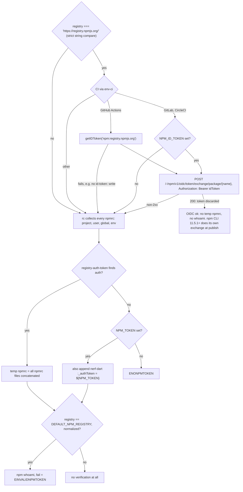
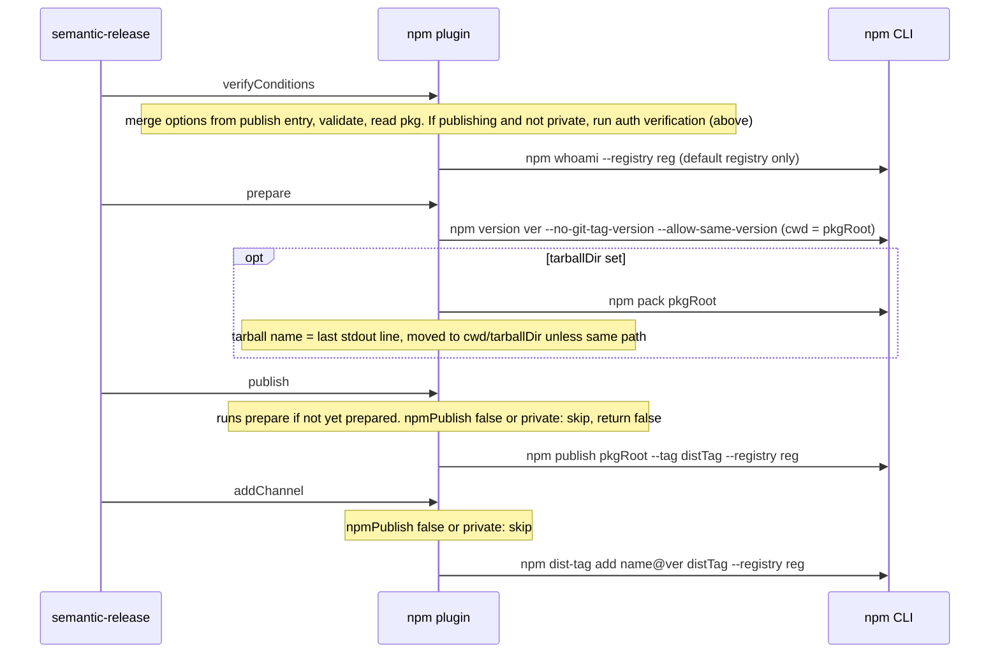

# @semantic-release/npm — research

Source: https://github.com/semantic-release/npm @ `ab4382f` (2026-10-05). ~400 LOC JS, ESM, Node `^22.14 || >=24.10`. Bundles `npm@^11.6.2` as a runtime dependency; every registry operation shells out to `npm` (`execa`, `preferLocal: true`).

## 1. Features

| Feature | File |
|---|---|
| Lifecycle exports: `verifyConditions`, `prepare`, `publish`, `addChannel` (no `success`/`fail`) | `index.js` |
| Inherit `npmPublish`/`tarballDir`/`pkgRoot` from the `publish` entry for `@semantic-release/npm` during verify | `index.js:15-24` |
| Option type validation (`npmPublish` bool, `tarballDir`/`pkgRoot` non-empty string) | `lib/verify-config.js` |
| Read `package.json` (from `pkgRoot`), require `name` | `lib/get-pkg.js` |
| Registry resolution (publishConfig > env > scoped .npmrc > default) | `lib/get-registry.js` |
| Build temp `.npmrc` (merge all found npmrc files + `_authToken=${NPM_TOKEN}`) | `lib/set-npmrc-auth.js` |
| Auth verify: OIDC first, else token + `npm whoami` (official registry only) | `lib/verify-auth.js` |
| OIDC trusted publishing check for GitHub Actions / GitLab / CircleCI | `lib/trusted-publishing/*.js` |
| Version bump via `npm version`, optional tarball via `npm pack` | `lib/prepare.js` |
| Publish with dist-tag | `lib/publish.js` |
| Add version to dist-tag (channel promotion) | `lib/add-channel.js` |
| Channel → dist-tag mapping | `lib/get-channel.js` |
| Release info (name/url/channel) | `lib/get-release-info.js` |
| Skip publish when `npmPublish:false` or `pkg.private === true` (still bumps version) | `lib/publish.js`, `lib/add-channel.js` |
| Dead code: `attemptPublishDryRun` (auth check for custom registries, tests `skip`ped) | `lib/verify-auth.js:39-71` |
| Error catalog (`ENONPMTOKEN`, `EINVALIDNPMTOKEN`, `EINVALIDNPMAUTH`, `ENOPKG`, `ENOPKGNAME`, `EINVALID*`) | `lib/definitions/errors.js` |

## 2. Config options and env vars

| Option | Type | Default | Notes |
|---|---|---|---|
| `npmPublish` | bool | `true` (effectively `false` if `pkg.private === true`) | false → bump only |
| `pkgRoot` | string | `.` (cwd) | dir with `package.json` to bump/pack/publish |
| `tarballDir` | string | unset (no tarball kept) | README says `false` allowed; validator rejects it ([#302](https://github.com/semantic-release/npm/issues/302)) |

| Env var | Use |
|---|---|
| `NPM_TOKEN` | Written as literal `${NPM_TOKEN}` into temp npmrc (npm expands at run time; secret never hits disk) — only if no auth already found in npmrc |
| `NPM_CONFIG_REGISTRY` | Registry override (below `publishConfig.registry`) |
| `NPM_CONFIG_USERCONFIG` | Path of user npmrc used for `rc()` instead of `<cwd>/.npmrc` |
| `npm_config_*` (any) | Read by `rc("npm")` and by npm CLI itself (whole `context.env` passed to child) |
| `DEFAULT_NPM_REGISTRY` | Undocumented; overrides "official" registry for whoami/url decisions; stripped from child env in verify |
| `NPM_ID_TOKEN` | OIDC ID token for GitLab / CircleCI (read from `process.env`, not `context.env`) |
| GHA `ACTIONS_ID_TOKEN_REQUEST_*` | Via `@actions/core.getIDToken("npm:registry.npmjs.org")`; needs `id-token: write` |

`package.json` `publishConfig`: `registry` (honoured by plugin), `tag`, `provenance`, `access` (honoured by npm CLI only).

**Registry resolution** (`get-registry.js`): `publishConfig.registry` → `env.NPM_CONFIG_REGISTRY` → `@scope:registry` / `registry` from `rc("npm", {registry: OFFICIAL}, {config: USERCONFIG || <cwd>/.npmrc})` → `https://registry.npmjs.org/`. Note: `.npmrc` is read from `cwd`, never from `pkgRoot`.

**Auth verification** (`verify-auth.js`, `trusted-publishing/`, `set-npmrc-auth.js`). Every OIDC failure falls back to token auth silently (logged only):

The strict compare silently disables OIDC for a registry without a trailing slash ([#1066](https://github.com/semantic-release/npm/issues/1066)). The temp file is created by `tempy` at module load and never deleted. Every npm command gets `--userconfig <temp>`.

**Provenance**: not implemented by the plugin. npm CLI emits it automatically under trusted publishing, or via `publishConfig.provenance` / `NPM_CONFIG_PROVENANCE=true`.

## 3. Per-step behavior

Module-level state: `verified`, `prepared`, temp `npmrc` path. Each step re-reads `package.json`; if `verifyConditions` did not run, steps re-validate config + auth themselves.

Every command gets `--userconfig tmp`; cwd is `context.cwd` unless noted. `success`/`fail` are not implemented.

**dist-tag mapping** (`get-channel.js`): no channel → `latest`; channel is a valid semver range (e.g. `1.x`) → `release-1.x`; else channel verbatim.

**Return value** (`publish`/`addChannel`): `{ name: "npm package (@<tag> dist-tag)", url: "https://www.npmjs.com/package/<name>/v/<ver>" | undefined (non-default registry), channel: <tag> }`.

**Files written**: temp `.npmrc` (OS temp dir); `<pkgRoot>/package.json`, plus `package-lock.json` / `npm-shrinkwrap.json` (by `npm version`, preserves indentation + CRLF); `<tarballDir>/<name>-<ver>.tgz`.

## 4. Side effects

- Lifecycle scripts executed by npm: `preversion/version/postversion` (prepare), `prepack/prepare/postpack` (pack + publish → `prepack` runs twice with `tarballDir`, [#535](https://github.com/semantic-release/npm/issues/535)), `prepublishOnly/publish/postpublish`.
- `npm version` in a workspace may run a full `npm install` / touch root lockfile ([#1068](https://github.com/semantic-release/npm/issues/1068), [#495](https://github.com/semantic-release/npm/issues/495)).
- Temp npmrc leaks into `/tmp`; contains concatenated user/global npmrc (may include plaintext tokens).
- Irreversible registry publish; dist-tag mutation. No rollback if later plugins fail ([#275](https://github.com/semantic-release/npm/issues/275)).
- Network: OIDC exchange (token thrown away) + whoami.
- npm stdout/stderr piped into semantic-release streams.
- Bundled `npm` dependency may shadow/compete with the user's npm (`preferLocal`) ([#272](https://github.com/semantic-release/npm/issues/272), [#1026](https://github.com/semantic-release/npm/issues/1026)); its transitive deps generate recurring "unfixable vulnerability" issues.

## 5. Rust port notes

**Shell out vs HTTP**: shell out for `pack`/`publish`; HTTP for the cheap stuff.

| Concern | Recommendation | Why |
|---|---|---|
| Pack + publish | Shell out (`npm`/`pnpm`/`yarn` selectable) | `files`/`.npmignore`, lifecycle scripts, `workspace:` rewriting (pnpm), sigstore provenance, OIDC exchange all live in the CLI. Reimplementing = huge + drifts |
| Version bump | Native: edit `version` in manifest preserving formatting; lockfile via PM (`npm version --package-lock-only` style) or opt-in | Avoids `npm install` side-effects ([#1068](https://github.com/semantic-release/npm/issues/1068)); decouples from PM |
| Auth verify | Native HTTP `GET /-/whoami` with `Authorization: Bearer` | No subprocess; works for any registry that implements it; treat 404 as "unknown", not fail |
| OIDC | Native: fetch ID token (GHA `ACTIONS_ID_TOKEN_REQUEST_URL/TOKEN`, GitLab/CircleCI `NPM_ID_TOKEN`), `POST /-/npm/v1/oidc/token/exchange/package/<name>`; **pass token to child** (`NPM_CONFIG_//registry.npmjs.org/:_authToken`) instead of discarding | Deterministic, one exchange; normalize registry URL |
| dist-tags | Native `PUT /-/package/<name>/dist-tags/<tag>` body `"<ver>"` (JSON string) | Trivial; can use exchanged token |
| Already-published check | Native `GET /<name>` → `versions[ver]` | Idempotent re-runs (publish skipped, addChannel only) |
| npmrc | Parse ini ourselves (project/user/global/env), nerf-dart keys; never write merged file; pass auth via env to child | No temp-file leak |
| Provenance | Delegate to PM (`--provenance`) | Sigstore signing out of scope |

**Generalizable "package-manager publish plugin" shape** (template for cargo/crates.io):

| Hook | npm | cargo / crates.io |
|---|---|---|
| `read_manifest` → name, version, private | `package.json` (`private`) | `Cargo.toml` (`publish = false`) |
| `resolve_registry` | publishConfig / env / npmrc | `--registry`, `[registries]` in `.cargo/config.toml`, `CARGO_REGISTRIES_<N>_INDEX` |
| `resolve_auth` (OIDC → env token → config file) | OIDC / `NPM_TOKEN` / npmrc | crates.io trusted publishing (OIDC exchange) / `CARGO_REGISTRY_TOKEN` / `credentials.toml` |
| `verify_auth` | `whoami` | `GET /api/v1/me` |
| `bump_version` | `package.json` + lockfile | `Cargo.toml` (toml_edit) + `Cargo.lock` |
| `pack` (optional artifact) | `npm pack` → `.tgz` | `cargo package` → `.crate` |
| `publish(channel)` | `npm publish --tag` | `cargo publish` (no channels) |
| `add_channel` | `dist-tag add` | unsupported → no-op / capability flag |
| `is_published(ver)` | `GET /<name>` | `GET /api/v1/crates/<name>/<ver>` |
| `release_info` | npmjs.com URL if default registry | crates.io URL |

Design: `trait Publisher` with capability flags (`channels`, `pack`, `oidc`), a `CommandRunner` trait for subprocesses (mockable), and a shared `oidc` module (CI ID-token fetch is identical across registries; only audience + exchange endpoint differ). Workspaces/monorepo: one plugin instance per package; no module-global state (upstream's `verified`/`prepared` globals break multiple instances, [#69](https://github.com/semantic-release/npm/issues/69), [#194](https://github.com/semantic-release/npm/issues/194)).

## 6. Tests

| Suite | Mechanism | Portable? |
|---|---|---|
| `get-channel`, `verify-config`, `get-release-info`, `get-pkg` | Pure functions / temp dirs | Yes, trivially (unit tests) |
| `get-registry`, `set-npmrc-auth` | Temp dirs + fake `HOME`/`NPM_CONFIG_USERCONFIG` npmrc files; asserts temp npmrc content | Yes — port as npmrc-resolution table tests (`tempfile`, override home dir via injected config) |
| `verify-auth` | `testdouble` ESM mocks of `execa`, asserts exact npm argv + env | Yes — `CommandRunner` mock asserting argv; HTTP parts via `wiremock` |
| `trusted-publishing/*` | Stub `env-ci`, `@actions/core`, global `fetch` | Yes — `wiremock` for exchange endpoint + GHA token endpoint; env injected |
| `prepare` | **Real npm CLI** (no registry): checks package.json/lockfile/shrinkwrap bump, CRLF+indent preservation, tarball move | Partially: native bump = pure tests; pack needs `npm` on PATH (gate with feature/ignore) |
| `integration` (excluded from `ava` default) | Docker `verdaccio/verdaccio:6` on :4873 via dockerode, config `test/helpers/config.yaml` (publish: `$authenticated`); user via `PUT /-/user/org.couchdb.user:<u>`, token via `POST /-/npm/v1/tokens`; full verify/prepare/publish/addChannel, then `npm view` to assert | Yes — `testcontainers` crate + same image/config; `#[ignore]`/CI-only. Cargo analogue: containerized alt registry (e.g. kellnr) or `wiremock` sparse-index + publish API |

Two tests are `skip`ped (custom-registry dry-run auth check). OIDC path has no integration test (official registry only).

## 7. Issue history

197 issues total. Sorted by reactions+comments.

**Recurring problems**

| Theme | Issues |
|---|---|
| OIDC / trusted publishing (introduced 13.1.0) | [#958](https://github.com/semantic-release/npm/issues/958) support (top issue); [#1023](https://github.com/semantic-release/npm/issues/1023) OPEN: `addChannel` 401 on first maintenance release — OIDC tokens can't set dist-tags (npm-side; [npm/cli#8547](https://github.com/npm/cli/issues/8547), opt-in dist-tag permission announced 2026-09-30); [#1066](https://github.com/semantic-release/npm/issues/1066) OPEN: no-trailing-slash registry silently disables OIDC; [#1069](https://github.com/semantic-release/npm/issues/1069) `ENONPMTOKEN` from stale plugin version / misconfig; [#1054](https://github.com/semantic-release/npm/issues/1054) read-only install token conflicts with OIDC; [#1081](https://github.com/semantic-release/npm/issues/1081) OIDC + GitHub PAT; [#1121](https://github.com/semantic-release/npm/issues/1121) CircleCI added |
| Token types / auth validity | [#215](https://github.com/semantic-release/npm/issues/215) invalid npm token; [#277](https://github.com/semantic-release/npm/issues/277) automation tokens; [#298](https://github.com/semantic-release/npm/issues/298) automation tokens can't dist-tag (npm fixed); [#777](https://github.com/semantic-release/npm/issues/777) `ERR_INVALID_AUTH`; [#598](https://github.com/semantic-release/npm/issues/598) legacy `_auth` dropped; [#790](https://github.com/semantic-release/npm/issues/790)/[#791](https://github.com/semantic-release/npm/issues/791)/[#792](https://github.com/semantic-release/npm/issues/792) OPEN: npmrc merge drifted from npm's own semantics |
| 2FA | [#209](https://github.com/semantic-release/npm/issues/209)/[#208](https://github.com/semantic-release/npm/issues/208) OTP errors with auth-only 2FA; [#93](https://github.com/semantic-release/npm/issues/93) OPEN: auth-and-writes 2FA via OTP secret; [#11](https://github.com/semantic-release/npm/issues/11) OPEN: detect 2FA in verify |
| Custom registries (Artifactory/Nexus/ADO) | [#13](https://github.com/semantic-release/npm/issues/13), [#279](https://github.com/semantic-release/npm/issues/279), [#324](https://github.com/semantic-release/npm/issues/324) OPEN: allow no NPM_TOKEN (ambient auth), [#271](https://github.com/semantic-release/npm/issues/271), [#69](https://github.com/semantic-release/npm/issues/69)/[#194](https://github.com/semantic-release/npm/issues/194) multiple registries |
| pkgRoot / workspaces / monorepo | [#504](https://github.com/semantic-release/npm/issues/504) OPEN: `npm publish <folder>` publishes cwd under `-w`; [#470](https://github.com/semantic-release/npm/issues/470) OPEN: `workspaces=true` breaks `whoami` (`ENOWORKSPACES`); [#1068](https://github.com/semantic-release/npm/issues/1068) OPEN: `npm version` triggers install; [#255](https://github.com/semantic-release/npm/issues/255), [#601](https://github.com/semantic-release/npm/issues/601), [#511](https://github.com/semantic-release/npm/issues/511), [#246](https://github.com/semantic-release/npm/issues/246) |
| Bundled npm dependency | [#272](https://github.com/semantic-release/npm/issues/272), [#1026](https://github.com/semantic-release/npm/issues/1026) OPEN: wrong npm version used; vuln-noise: [#1037](https://github.com/semantic-release/npm/issues/1037), [#1128](https://github.com/semantic-release/npm/issues/1128), [#1129](https://github.com/semantic-release/npm/issues/1129), [#434](https://github.com/semantic-release/npm/issues/434) |
| Silent success on failure / no rollback | [#269](https://github.com/semantic-release/npm/issues/269) 403 treated as success; [#275](https://github.com/semantic-release/npm/issues/275) OPEN: package stays published on later failure; [#518](https://github.com/semantic-release/npm/issues/518) republish over existing version |
| Misc open bugs | [#773](https://github.com/semantic-release/npm/issues/773) malformed path in prepare; [#302](https://github.com/semantic-release/npm/issues/302) `tarballDir:false` rejected; [#369](https://github.com/semantic-release/npm/issues/369) `"private":"true"` string ignored; [#535](https://github.com/semantic-release/npm/issues/535) prepack twice; [#4](https://github.com/semantic-release/npm/issues/4) OPEN: check package write permission (granular tokens 403 on `npm access`) |

**Rejected / not planned (and why)**

| Request | Reason |
|---|---|
| pnpm as publisher [#280](https://github.com/semantic-release/npm/issues/280) (top open, 31 reactions) | Monorepos unsupported ([details](distribution-config.md#3-monorepo-scope)); use `@semantic-release/exec` (`pnpm version` / `pnpm publish`) |
| pnpm-workspace.yaml registries [#1201](https://github.com/semantic-release/npm/issues/1201) | "This plugin uses npm"; put registries in `.npmrc` |
| `--no-workspaces` / no-workspaces-update [#639](https://github.com/semantic-release/npm/issues/639), [#495](https://github.com/semantic-release/npm/issues/495) | Configure via `.npmrc`/`publishConfig`; monorepos unsupported |
| Yarn workspace bump [#500](https://github.com/semantic-release/npm/issues/500), monorepo [#829](https://github.com/semantic-release/npm/issues/829), [#923](https://github.com/semantic-release/npm/issues/923) | Monorepos out of scope |
| Remove `npm` dep [#272](https://github.com/semantic-release/npm/issues/272) | Pins a known-good npm CLI version |
| Unfixable transitive vulns in bundled npm [#1037](https://github.com/semantic-release/npm/issues/1037), [#1128](https://github.com/semantic-release/npm/issues/1128) | Upstream npm's problem |
| Staged publishing (`npm stage`, 2FA approval) [#1160](https://github.com/semantic-release/npm/issues/1160) OPEN | Needs big semantic-release architecture change; maintainer reluctant to adopt early |

## Ticket candidates

- **Publisher trait + capability flags** — generic package-manager publish interface (manifest, registry, auth, bump, pack, publish, add_channel, is_published, release_info).
- **CommandRunner abstraction** — mockable subprocess runner with argv/env assertions and streamed output.
- **Shared CI OIDC module** — fetch ID token (GHA/GitLab/CircleCI), audience param, exchange endpoint per registry, normalized registry URL.
- **npmrc resolver** — ini parse of project/user/global/env layers, nerf-dart auth lookup, scoped registries; no temp-file merge.
- **npm plugin: verify** — native whoami + OIDC check + already-published check; clear errors for custom registries.
- **npm plugin: prepare** — native version bump preserving formatting/EOL; optional lockfile update via PM; optional pack to dir.
- **npm plugin: publish** — shell out to selectable PM (`npm`/`pnpm`/`yarn`), pass OIDC/token via env, dist-tag, provenance flag; idempotent if version exists.
- **npm plugin: addChannel** — native dist-tag PUT; document OIDC dist-tag permission requirement.
- **Channel→tag mapping** — `latest` / `release-<range>` / verbatim, shared policy.
- **Integration test harness** — testcontainers + verdaccio (user + token bootstrap), CI-only.
- **cargo plugin (later)** — same shape: Cargo.toml/Cargo.lock bump, `cargo publish`, crates.io trusted publishing, `add_channel` unsupported.
