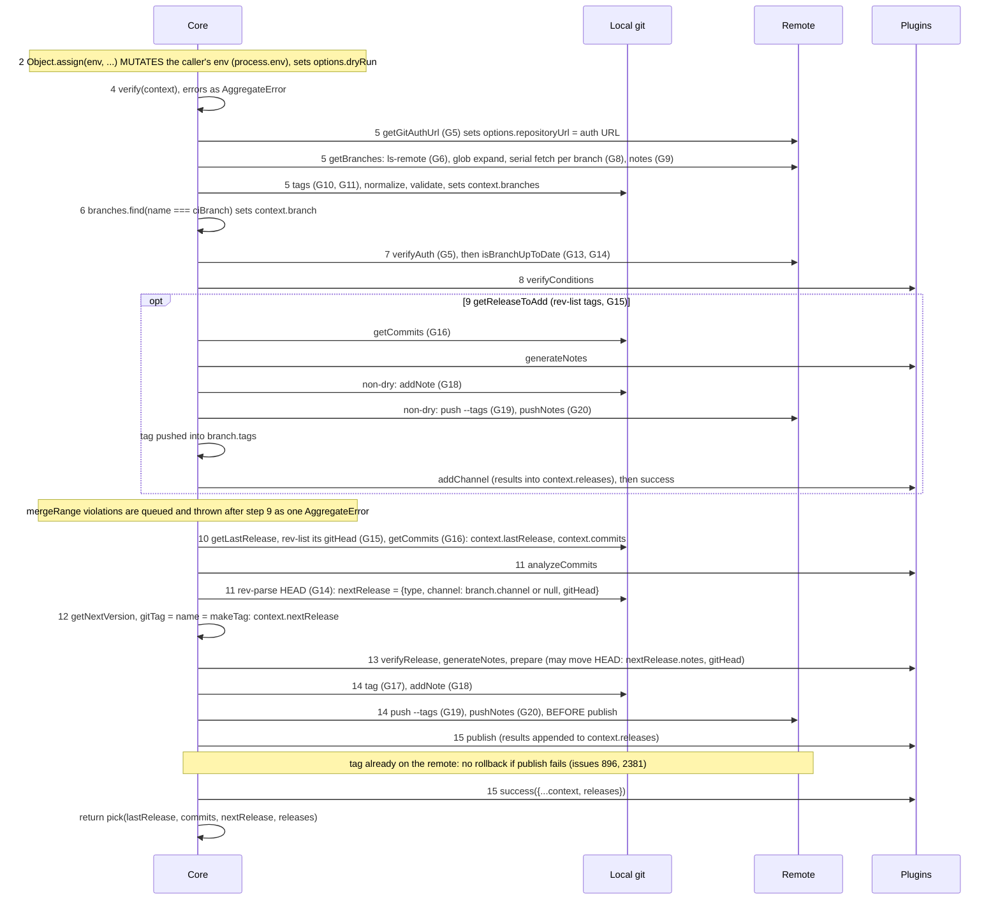
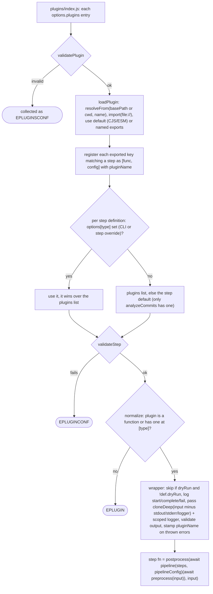

# semantic-release core: code research

Source: `semantic-release/semantic-release` @ `04c1923` (2026-10-04). Paths are relative to the repo root. `git.js:N` means `lib/git.js` line N.

## 1. Feature → source map

Behavior is in the [spec](../specs/SEMANTIC-RELEASE-SPEC.md); this maps it to code.

| Area | Source |
|---|---|
| `run` orchestration, CI/PR/dry-run guards, `mergeRange` and range guards, JS API result | `index.js` |
| 9 step definitions, output validators (`E<STEP>OUTPUT`), `[skip release]` filter, notes concat, prepare HEAD re-check | `lib/definitions/plugins.js` |
| Config discovery, defaults (plugins, branches), `extends` | `lib/get-config.js` |
| Plugin forms, resolution relative to the shareable config | `lib/plugins/utils.js` |
| Step-level overrides (`--publish x`, `options.publish = {...}`) | `lib/plugins/index.js` |
| Per-plugin options (global minus step keys and `plugins`, deep-cloned), dry-run step skip | `lib/plugins/normalize.js` |
| Branch model, micromatch globs, `${name}` templating, ranges | `lib/branches/*`, `lib/definitions/branches.js` |
| Merged-release promotion | `lib/get-release-to-add.js` |
| Next version, last release | `lib/get-next-version.js`, `lib/get-last-release.js` |
| tagFormat validation, `makeTag` | `lib/verify.js`, `lib/utils.js` |
| Repo URL (shorthand `owner/repo`, `gitlab:o/r`, `git+https`), auth URL (parallel token probing) | `lib/get-git-auth-url.js` |
| Git calls ([§3](#3-git-operations)) | `lib/git.js` |
| Secret masking | `lib/hide-sensitive.js` |
| Error catalog and rendering | `lib/definitions/errors.js`, `index.js` `logErrors` |
| CLI (yargs), Node and git ≥ 2.7.1 guards, `--debug` → `debug("semantic-release:*")` | `cli.js`, `bin/semantic-release.js` |
| TypeScript types (API, context, plugins) | `index.d.ts` |

## 2. Pipeline

### Entry (`index.js` default export)
1. `hookStd(process.stdout, process.stderr, opts.stdout, opts.stderr)` passes every write through `hideSensitive(env)`.
2. `context = {cwd, env, stdout, stderr, envCi: envCi({env,cwd})}`, then `context.logger` (signale, scope `semantic-release`).
3. `getConfig(context, cliOptions)` produces `{options, plugins}`. Then `options.originalRepositoryURL = options.repositoryUrl` and `context.options = options`.
4. `run(context, plugins)`. On throw, `callFail` runs, then `logErrors`, `unhook`, and a rethrow.

### `run()` internals
Order and semantics: [spec §2.2](../specs/SEMANTIC-RELEASE-SPEC.md#22-actual-run-order-src-conflict-with-the-docs-table). Code per spec step (leading number), with git calls from [§3](#3-git-operations):

### Plugin loading and normalization

### Pipeline internals (`lib/plugins/pipeline.js`, `lib/definitions/plugins.js`)
Per-step semantics: [spec §2.1](../specs/SEMANTIC-RELEASE-SPEC.md#21-hooks). Sequential `pReduce` returning an array of results. Hook points:
- analyzeCommits: pre drops `[skip release]`; post picks the highest of patch<minor<major, else undefined.
- generateNotes: `getNextInput` feeds accumulated notes; post joins `\n\n`, then `hideSensitive`.
- prepare: `getNextInput` re-reads HEAD and re-runs generateNotes, mutating the shared context.
- publish/addChannel: `transform` = `{...nextRelease (unless result===false), ...result, pluginName}`.
- success/fail: pre `hideSensitiveValues(releases|errors)`.

Plugins get deep clones, so they cannot mutate the core context (open #2641).

### Error aggregation
- `SemanticReleaseError(message, code, details)` from `@semantic-release/error` carries `semanticRelease = true`. Built by `getError(code, ctx)` from `lib/definitions/errors.js` (message plus markdown details with docs links).
- `AggregateError` comes from verify, branches, plugin config, settleAll steps, and the addChannel errors. `extractErrors(err)` flattens it.
- `callFail`: `fail` plugins run **only if at least one error has `semanticRelease`**, and only with those errors. Errors thrown by `fail` itself are logged.
- `logErrors`: SR errors first, as `code message`, with details rendered to stderr. Other errors are logged as `%O`.
- Codes: ENOGITREPO, ENOREPOURL, EINVALIDREPOURL, EGITNOPERMISSION, EINVALIDTAGFORMAT, ETAGNOVERSION, EPLUGINCONF, EPLUGINSCONF, EPLUGIN, EANALYZECOMMITSOUTPUT, EGENERATENOTESOUTPUT, EPUBLISHOUTPUT, EADDCHANNELOUTPUT, EINVALIDBRANCH, EINVALIDBRANCHNAME, EDUPLICATEBRANCHES, EMAINTENANCEBRANCH(ES), ERELEASEBRANCHES, EPRERELEASEBRANCH(ES), EINVALIDNEXTVERSION, EINVALIDMAINTENANCEMERGE.

### Branch normalization (`lib/branches/normalize.js`)
Algorithms: [spec §4.6](../specs/SEMANTIC-RELEASE-SPEC.md#46-range-calculation-src). The output order ([spec §4.3](../specs/SEMANTIC-RELEASE-SPEC.md#43-validation-errors)) defines "higher branches" in `getReleaseToAdd`.

## 3. Git operations

All calls go through `execa("git", args, {cwd, env})`. `URL` is `options.repositoryUrl` after auth injection. Every call that takes a URL uses a `--` separator to block option injection (tests `--upload-pack` and `--receive-pack`).

| # | Command and args | Source | Purpose | When | Notes for the Rust port |
|---|---|---|---|---|---|
| G1 | `git --version` | `bin/semantic-release.js` | require ≥ 2.7.1 | CLI start | drop |
| G2 | `git config --get remote.origin.url` | `git.js:177` repoUrl | default repositoryUrl | config, if `package.json#repository` is missing | read config; errors swallowed |
| G3 | `git rev-parse --git-dir` | `git.js:192` isGitRepo | is cwd a repo (walks up) | verify | discover repo |
| G4 | `git check-ref-format refs/tags/<tagFormat(version=0.0.0)>` | `git.js:263` verifyTagName | validate tagFormat | verify | pure ref-name validation |
| G5 | `git push --dry-run --no-verify -- URL HEAD:<branch>` | `git.js:209` verifyAuth | probe push auth | getGitAuthUrl: 1× raw URL, then N× in parallel per token candidate (if more than 1); `run`: 1× | network; needs a real push-negotiation dry run (receive-pack handshake), not just ls-remote |
| G6 | `git ls-remote --heads -- URL` | `git.js:73` getBranches | list remote branches for glob expansion | getBranches, once (called with `{cwd}` only, no env) | network |
| G7 | `git rev-parse --abbrev-ref HEAD` | `git.js:110` fetch | detect detached HEAD (`=="HEAD"`), reject:false | per release branch | |
| G8a | `git fetch --unshallow --tags -- URL` | `git.js:110` fetch | unshallow + tags for the CI branch (non-detached) | per branch, serial | network; must not touch HEAD |
| G8b | `git fetch --unshallow --tags --update-head-ok -- URL +refs/heads/B:refs/heads/B` | `git.js:110` | force-update local branch B (non-CI branch or detached HEAD) | per branch | updates refs even if checked out |
| G8c | same as G8a/G8b without `--unshallow` | `git.js:110` | fallback when the repo is already complete (unshallow errors) | on G8a/b failure | gix: deepen-to-full vs normal fetch |
| G9a | `git fetch --unshallow -- URL +refs/notes/*:refs/notes/*` | `git.js:148` fetchNotes | fetch all notes refs | once after branch fetch | network |
| G9b | `git fetch -- URL +refs/notes/*:refs/notes/*` (reject:false) | `git.js:148` | fallback; failure ignored | on G9a failure | |
| G10 | `git log --tags=* --decorate-refs=refs/tags/* --no-walk --format=%d%x09%N --notes=refs/notes/semantic-release*` | `git.js:315` getTagsNotes | map tag → JSON note (channels); reads legacy `semantic-release` + per-tag `semantic-release-<tag>` refs | once in get-tags | notes concatenate if several refs annotate one commit, which breaks JSON (#4073). Rust: read each `refs/notes/semantic-release-<tag>` directly |
| G11 | `git tag --merged <branch>` | `git.js:34` getTags | tags reachable from branch | per branch | ancestry check of each tag target vs branch tip |
| G12 | `git check-ref-format refs/heads/<branch>` | `git.js:279` verifyBranchName | validate branch names | per branch (called without cwd/env) | pure |
| G13 | `git ls-remote --heads -- URL <branch>` | `git.js:296` isBranchUpToDate | remote head sha | only if G5 fails in `run` | network |
| G14 | `git rev-parse HEAD` | `git.js:166` getGitHead | HEAD sha | isBranchUpToDate; nextRelease.gitHead; after **each prepare plugin** (`{cwd}` only) | |
| G15 | `git rev-list -1 <tag>` | `git.js:21` getTagHead | peel tag → commit sha | lastRelease, currentRelease, nextRelease (addChannel) | peel annotated or lightweight |
| G16 | `git log --format=%H==FIELD==%h==FIELD==%T==FIELD==%t==FIELD==%an==FIELD==%ae==FIELD==%ai==FIELD==%cn==FIELD==%ce==FIELD==%ci==FIELD==%s==FIELD==%b==FIELD==%H==FIELD==%B==FIELD==%d==FIELD==%ci==END== [<from>..]<to>` | `git.js:49` getCommits, via git-log-parser (spawns `git log`, env = process.env + env) | commits since last release | normal path and addChannel path | revwalk `to` hiding `from`. Output: `{commit{long,short}, tree{long,short}, author{name,email,date}, committer{…}, subject, body, hash, message(trimmed), gitTags(%d decoration), committerDate}`. Default log order, no `--first-parent`, merges included |
| G17 | `git tag <tag> <sha>` | `git.js:227` tag | **lightweight** tag | new release, non-dry | |
| G18 | `git notes --ref semantic-release-<tag> add -f -m <json> <tag>` | `git.js:371` addNote | channel note on the tag target (commit) | new release; addChannel (channels = current + new) | write notes tree commit on `refs/notes/semantic-release-<tag>`. Ref is per tag since #1613 (parallel races) |
| G19 | `git push --tags -- URL` | `git.js:239` push | push tags | after G17/G18 and addChannel | pushes **all** local tags, not just the new one |
| G20 | `git push -- URL refs/notes/semantic-release-<tag>` | `git.js:251` pushNotes | push the note ref | after G19 | non-force |
| G21 | `git rev-parse --verify <ref>` | `git.js:88` isRefExists | ref exists | **unused** in lib (tests only) | skip |
| G22 | `git show-ref <tag> --hash` | `git.js:385` getTagRef | tag object sha | **unused** | skip |

G5–G20 run with the CI env from [spec §2.2](../specs/SEMANTIC-RELEASE-SPEC.md#22-actual-run-order-src-conflict-with-the-docs-table) step 2 (bot identity affects only prepare-plugin commits). Credentials travel inside the URL (`https://<prefix><token>@host/...`).

## 4. Side effects

| Kind | Detail |
|---|---|
| Env read | token vars ([spec §6](../specs/SEMANTIC-RELEASE-SPEC.md#6-ci-git-and-auth)), `DEBUG`, env-ci vars, every env var name (masking scan) |
| Env written | mutates the passed `env` (default `process.env`) with the [spec §2.2](../specs/SEMANTIC-RELEASE-SPEC.md#22-actual-run-order-src-conflict-with-the-docs-table) step 2 vars |
| Files read | config files (cwd only, cosmiconfig v9 default), `package.json` (read-package-up, **walks up**), plugin and shareable-config modules (node resolution), `.git` |
| Files written | none by core. Git objects/refs: lightweight tag, notes commits, `refs/notes/*`, `refs/heads/*` (G8b), shallow → full |
| Network | git only (ls-remote, fetch, push dry-run, push). No HTTP in core. Plugins do HTTP |
| Git notes | [spec §4.4](../specs/SEMANTIC-RELEASE-SPEC.md#44-tags-notes-last-release); G10, G18, G20 |
| Pushes | `push --dry-run` (auth probe, 1+N times), `push --tags`, `push <notes ref>`. Tag pushed **before** publish. No rollback on publish failure (#896, #2381) |
| stdout/stderr | `hook-std` intercepts process and custom streams. Logger: log/success to stdout, warn/error to stderr, with timestamps. Dry-run notes go to stdout; error details go to stderr |
| Secret masking | Rule: [spec §6](../specs/SEMANTIC-RELEASE-SPEC.md#6-ci-git-and-auth). Length check is on the trimmed value. Masked forms: raw, `encodeURI`, `encodeURIComponent`, `:`-preserving. Applied to all stream writes, generateNotes output, and string props of success `releases` / fail `errors` (shallow, mutating) |
| Exit codes | 0 on success, no-release, or help/version. 1 on any thrown error, unsupported Node, git < 2.7.1, or git missing. The CLI prints a non-yargs error with `util.inspect` (masked) |

## 5. Dependencies

| npm dep | Used for | Rust equivalent |
|---|---|---|
| @semantic-release/commit-analyzer, release-notes-generator, npm, github | default plugins | must rewrite (built-ins); conventional parsing: `git-conventional` |
| @semantic-release/error | coded error with `details` | own error enum (`thiserror`) + code + markdown details |
| aggregate-error | multi-error | own `Vec<Error>` type |
| cosmiconfig | config discovery/parse | must rewrite: `serde` + `toml`/`serde_json`/`serde_yaml`; no JS configs |
| debug | namespaced debug logs | `tracing` + `EnvFilter` |
| env-ci | CI vendor/branch/PR detection (~40 CIs) | must rewrite (`ci_info` crate is partial: no branch/PR); see [dependencies §5](dependencies.md#5-env-ci) |
| execa | spawn git | `gix` (no CLI); `std::process` for exec plugins |
| figures | log badges | constants |
| find-versions | parse `git --version` | n/a |
| get-stream | stream → array | n/a |
| git-log-parser | `git log` parsing | `gix` revwalk |
| hook-std | intercept stdout/stderr for masking | n/a. Route all output through a masking `Write` / tracing layer; plugin subprocess output piped through the same |
| hosted-git-info | shorthand URL expansion | must rewrite (small); `git-url-parse` partial |
| import-from-esm, resolve-from | plugin/config module resolution | n/a: plugin registry (compiled-in / subprocess / WASM) |
| lodash-es | utilities + `template` (tagFormat, branch fields) | std; own `${version}`/`${name}` interpolation |
| marked, marked-terminal | render markdown to the terminal | `termimad` or plain text |
| micromatch | branch globs incl. **extglob** `+([0-9])?(...)` | `globset` lacks extglob → must rewrite or replace the defaults with regex |
| p-each-series, p-reduce | sequential async | loops |
| read-package-up | `package.json#repository` | drop (opinionated) or `serde_json` walk-up |
| semver | versions, ranges, `inc`, `diff`, `satisfies`, `validRange` | `semver` crate ([SEMVER-SPEC §6](../specs/SEMVER-SPEC.md#6-implementation-notes-for-semoxide)) has no node ranges (`>=a <b` with prerelease rules, `x` ranges); `nodejs-semver` crate, or own range type (only `>=a <b` is generated) |
| signale | logger | `tracing-subscriber` / own formatter |
| yargs | CLI | `clap` |

## 6. Rust port notes

**Maps cleanly**
- Pure logic: `get-next-version`, `get-last-release`, `get-release-to-add`, `branches/normalize`, `definitions/branches`, `utils` (ranges), `hide-sensitive`, error catalog, and the pipeline combinator (settleAll / getNextInput / transform → trait or enum per step).
- The `context` object becomes a typed struct per step (`index.d.ts` already defines `*Context` types), with mutation made explicit and owned by the core.
- Git ops G2–G20 map to gix. The risky ones need a PoC: G5 (push dry-run auth probe), G8 (unshallow + `--update-head-ok` on a checked-out branch), G9/G10/G18/G20 (notes read/write/push), G11 (`--merged`), and G19 (push tags).

**JS-specific / needs redesign**
- Dynamic plugins: `import()` of npm modules, CJS/ESM interop, `npx --package`, inline function plugins, shareable configs resolved relative to each other. Rust needs compiled-in plugins plus external plugins ([plugin-mechanisms](plugin-mechanisms.md)), and a way to keep running JS plugins.
- lodash `template`: arbitrary JS in `${...}` (exec plugin, `${nextRelease.version}`; docs even show `${name.replace(...)}` in branch fields, which `evaluate:false` only partly limits). Core uses only `${version}` and `${name}`. Use a restricted template engine.
- cosmiconfig `.js`/`.ts`/`.mjs` configs, where options can be functions. Not portable: data-only config.
- `cloneDeep` isolation and `Reflect.defineProperty(pluginName)` become ownership + `Clone`, with plugin metadata in a struct.
- `hook-std` global stdout patching: no Rust equivalent. Masking must be designed in (output sink + subprocess pipes).
- `process.env` mutation is a library anti-pattern. Pass an explicit env/credential config into the git transport.
- Credentials in URL: gix supports credential helpers/callbacks. Prefer a callback over a URL-embedded token, which also avoids the masking problem.
- node-semver semantics (`inc("prerelease")`, `diff`, prerelease range matching, the `-0` upper-bound quirk) must be replicated exactly for tests.
- micromatch extglob/braces in the default branch pattern.
- `error.semanticRelease` flag gating `fail`; `stream.Writable` stdout/stderr API; `debug` namespace.
- npm/GitHub-centric default plugins and conventional-changelog presets; Node version policy and npm OIDC/provenance are plugin territory.

## 7. Tests

| Item | Detail |
|---|---|
| Framework | ava 8 (`test/**/*.test.js`, 2m timeout), c8 coverage, testdouble `replaceEsm` (mock env-ci, logger, modules), sinon spies/stubs, stream-buffers |
| Unit (~270 tests) | `git.test.js` (34, real temp repos), `get-config` (27), `get-git-auth-url` (30), `hide-sensitive` (26), `plugins/*` (50), `branches/*` (26), `definitions/*`, `get-next-version`, `get-last-release`, `get-release-to-add`, `utils`, `verify`, `cli` (12) |
| Integration (38, `integration.test.js`) | full `index.js` against **local bare repos via `file://` URLs** (tempy + `git init --bare`), plugins as sinon stubs, env-ci mocked; covers addChannel through ff/no-ff/rebase merges, prereleases, maintenance, dry-run, fail/success semantics, masking, shallow-clone unshallow |
| E2E (17, `e2e.test.js`) | testcontainers from `e2e.compose.yml`: `semanticrelease/docker-gitbox` (git over HTTP basic auth), `verdaccio` npm registry (`test/helpers/config.yaml`), `mockserver` (GitHub API mock). Runs the real CLI/API with the real npm/github plugins |
| Helpers | `test/helpers/git-utils.js`: initGit, gitRepo, initBareRepo, gitCommits (`--allow-empty`), gitShallowClone (`--depth`), gitDetachedHead(FromBranch) (CircleCI/GitLab clones), gitTagVersion, gitAddNote/gitGetNote/gitPushNotes, merge/mergeFf/rebase, gitRemoteTagHead (uses the git CLI; fine for test fixtures) |
| Fixtures | `test/fixtures/*`: plugin-noop, plugin-identity, plugin-error(s), plugin-error-inherited (SR error subclass), plugin-log-env (secret-leak check), plugin-result-config, plugin-esm-named-exports, multi-plugin |
| Port 1:1 | pure-logic tables (next-version, last-release, release-to-add, normalize, utils, hide-sensitive, errors); git.test scenarios (unshallow, detached HEAD, notes, injection); integration scenarios with `file://` bare repos (gix supports the file transport) |
| Rewrite/drop | cli/get-config module mocking, ESM plugin loading, the npm/verdaccio e2e path; keep gitbox for HTTP auth e2e |

## 8. Issue history

**Top recurring problems / mistakes**
- Push permission / EGITNOPERMISSION / protected branches / token prefix confusion: [#695](https://github.com/semantic-release/semantic-release/issues/695), [#708](https://github.com/semantic-release/semantic-release/issues/708), [#1560](https://github.com/semantic-release/semantic-release/issues/1560), [#2481](https://github.com/semantic-release/semantic-release/issues/2481), [#2604](https://github.com/semantic-release/semantic-release/issues/2604), [#3590](https://github.com/semantic-release/semantic-release/issues/3590), [#1947](https://github.com/semantic-release/semantic-release/issues/1947).
- Branch config errors (ERELEASEBRANCHES, wrong branch, CI branch undefined): [#1486](https://github.com/semantic-release/semantic-release/issues/1486), [#1587](https://github.com/semantic-release/semantic-release/issues/1587), [#1645](https://github.com/semantic-release/semantic-release/issues/1645), [#987](https://github.com/semantic-release/semantic-release/issues/987), [#2448](https://github.com/semantic-release/semantic-release/issues/2448).
- Maintenance/prerelease version math (EINVALIDNEXTVERSION, duplicate prereleases, rebases): [#1487](https://github.com/semantic-release/semantic-release/issues/1487), [#1038](https://github.com/semantic-release/semantic-release/issues/1038), [#1131](https://github.com/semantic-release/semantic-release/issues/1131), [#1708](https://github.com/semantic-release/semantic-release/issues/1708), [#1793](https://github.com/semantic-release/semantic-release/issues/1793), [#2415](https://github.com/semantic-release/semantic-release/issues/2415), [#3254](https://github.com/semantic-release/semantic-release/issues/3254).
- Git notes fragility (GPG-required hosts, parallel races, wrong object, concat): [#1479](https://github.com/semantic-release/semantic-release/issues/1479), [#1613](https://github.com/semantic-release/semantic-release/issues/1613), [#2321](https://github.com/semantic-release/semantic-release/issues/2321), [#3009](https://github.com/semantic-release/semantic-release/issues/3009), [#4073](https://github.com/semantic-release/semantic-release/issues/4073).
- Shallow/CI clone problems (missing tags, outdated clone, FETCH_HEAD perms): [#1410](https://github.com/semantic-release/semantic-release/issues/1410), [#1208](https://github.com/semantic-release/semantic-release/issues/1208), [#1849](https://github.com/semantic-release/semantic-release/issues/1849), [#2218](https://github.com/semantic-release/semantic-release/issues/2218).
- "No release" confusion / dry-run forced or useless: [#192](https://github.com/semantic-release/semantic-release/issues/192), [#1316](https://github.com/semantic-release/semantic-release/issues/1316), [#1890](https://github.com/semantic-release/semantic-release/issues/1890), [#1168](https://github.com/semantic-release/semantic-release/issues/1168).
- Node/ESM/dependency breakage (packaging, not logic): [#1981](https://github.com/semantic-release/semantic-release/issues/1981), [#2133](https://github.com/semantic-release/semantic-release/issues/2133), [#3280](https://github.com/semantic-release/semantic-release/issues/3280), [#3725](https://github.com/semantic-release/semantic-release/issues/3725), [#3953](https://github.com/semantic-release/semantic-release/issues/3953), [#4102](https://github.com/semantic-release/semantic-release/issues/4102). A single binary removes this class.
- Slow runs (fetch every branch serially): [#1345](https://github.com/semantic-release/semantic-release/issues/1345), [#3241](https://github.com/semantic-release/semantic-release/issues/3241).

**Notable features rejected or stalled, and why**
- **Monorepo**: see [distribution-config §3](distribution-config.md#3-monorepo-scope).
- Print next version / output-only mode [#753](https://github.com/semantic-release/semantic-release/issues/753), [#1647](https://github.com/semantic-release/semantic-release/issues/1647), `--json` [#3877](https://github.com/semantic-release/semantic-release/issues/3877) (not planned). Rationale: "a release happens once; use exec/prepare".
- Split release steps [#2349](https://github.com/semantic-release/semantic-release/issues/2349), plugins overriding verifyAuth/tag creation [#1729](https://github.com/semantic-release/semantic-release/issues/1729). Rationale: core must push tags because tags are the source of truth.
- Recovery / revert tag on publish failure [#896](https://github.com/semantic-release/semantic-release/issues/896), [#2381](https://github.com/semantic-release/semantic-release/issues/2381). The tag is pushed before publish because some publishers need it remotely.
- More than 3 release branches [#1681](https://github.com/semantic-release/semantic-release/issues/1681), branch-for-release [#1529](https://github.com/semantic-release/semantic-release/issues/1529): "release from trunk only".
- Non-semver (calver [#2705](https://github.com/semantic-release/semantic-release/issues/2705), PEP 440 [#2555](https://github.com/semantic-release/semantic-release/issues/2555)), tagFormat changes over time [#3835](https://github.com/semantic-release/semantic-release/issues/3835), only maintenance+prerelease [#3721](https://github.com/semantic-release/semantic-release/issues/3721), prerelease on main [#2503](https://github.com/semantic-release/semantic-release/issues/2503): out of scope.
- 0.x initial versions [#1507](https://github.com/semantic-release/semantic-release/issues/1507): first release is always 1.0.0.
- No npm by default / core-only package [#1260](https://github.com/semantic-release/semantic-release/issues/1260): open since 2019, blocked by maintenance cost.

**Current open problems**
- `--dry-run` still requires push permission [#2232](https://github.com/semantic-release/semantic-release/issues/2232). The verifyAuth SSH-then-token brute force [#2053](https://github.com/semantic-release/semantic-release/issues/2053).
- getTagsNotes JSON concat when one commit has several tags [#4073](https://github.com/semantic-release/semantic-release/issues/4073).
- Plugins cannot modify `nextRelease` [#2641](https://github.com/semantic-release/semantic-release/issues/2641). generateNotes runs too early [#2791](https://github.com/semantic-release/semantic-release/issues/2791). The same plugin cannot run twice [#3038](https://github.com/semantic-release/semantic-release/issues/3038).
- Config file location is not configurable [#1592](https://github.com/semantic-release/semantic-release/issues/1592). Config validation [#1489](https://github.com/semantic-release/semantic-release/issues/1489). Plugin config is hard to get right [#1896](https://github.com/semantic-release/semantic-release/issues/1896).
- Floating major tag (`v1`) [#1515](https://github.com/semantic-release/semantic-release/issues/1515). Build metadata in tags [#2355](https://github.com/semantic-release/semantic-release/issues/2355). Forced prerelease [#3303](https://github.com/semantic-release/semantic-release/issues/3303).
- GitHub App / installation tokens [#1807](https://github.com/semantic-release/semantic-release/issues/1807), [#3490](https://github.com/semantic-release/semantic-release/issues/3490). Conventional-commits default preset [#1652](https://github.com/semantic-release/semantic-release/issues/1652), [#3406](https://github.com/semantic-release/semantic-release/issues/3406).

## Ticket candidates

**Epic: Git layer (gix, no CLI)**
- PoCs for G5, G8–G11, G15–G20: [git-libraries Wave B](git-libraries.md#wave-b-pocs-must-prove).
- PoC ls-remote (G6, G13) — list remote heads, compare with local HEAD.
- Ref-name validation (G4, G12) — check-ref-format equivalent.
- Repo discovery & remote URL (G2, G3).

**Epic: Core engine** (branch model, versioning, orchestration: [spec tickets](../specs/SEMANTIC-RELEASE-SPEC.md#ticket-candidates))
- Context/state model — typed per-step contexts, explicit mutation.
- Error catalog — coded errors + markdown details + aggregation.

**Epic: Plugin system** (pipeline: [spec tickets](../specs/SEMANTIC-RELEASE-SPEC.md#ticket-candidates); API/registry: [plugin-mechanisms](plugin-mechanisms.md#ticket-candidates))
- Config — data-only config discovery (TOML only, [ADR 0002](../decisions/0002-config-format.md)), shareable presets, validation.

**Epic: Security & output** (CI detection: [dependencies](dependencies.md#ticket-candidates))
- Secret masking sink — env-pattern masking incl. URL-encoded forms over all output and subprocesses.
- Credential handling — token env vars → credential callback, no env mutation.

**Epic: Differentiators (from issue history)**
- Version-only output mode — `--print-version`/`--json` (#753).
- Dry-run without push permission (#2232).
- Monorepo: [distribution-config tickets](distribution-config.md#monorepo).
- Publish-failure recovery / tag rollback (#896, #2381).
- Parallel branch fetch (#3241).

**Epic: Testing**
- Test harness — temp repos + `file://` bare remotes, shallow/detached-HEAD fixtures.
- Port pure-logic test tables — next-version, last-release, release-to-add, normalize, masking.
- HTTP auth e2e — gitbox container.
