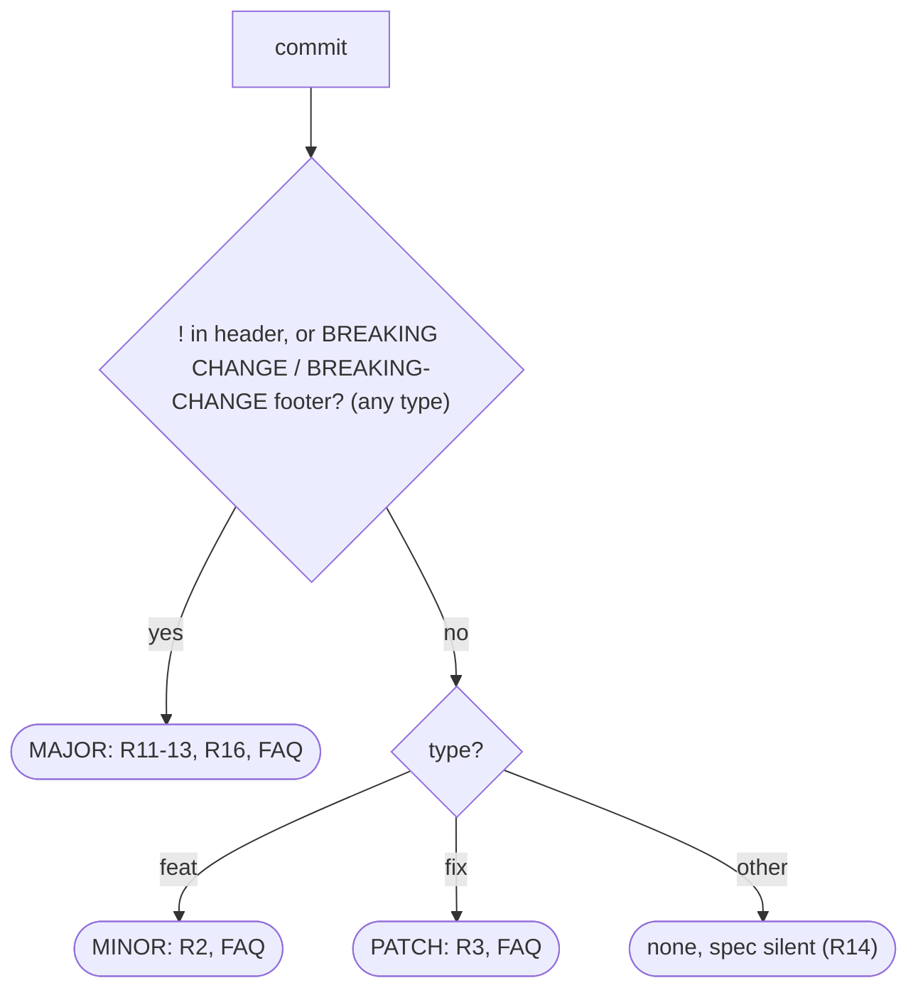

# Conventional Commits 1.0.0 — implementation spec

> Adapted from [Conventional Commits 1.0.0](https://www.conventionalcommits.org/en/v1.0.0/) by the Conventional Commits contributors, licensed [CC BY 3.0](https://creativecommons.org/licenses/by/3.0/). Condensed and modified; not endorsed by the original authors.

Sources:
- https://www.conventionalcommits.org/en/v1.0.0/#specification (rules 1–16, FAQ, examples)
- https://git-scm.com/docs/git-interpret-trailers (trailer convention referenced by rule 8)
- https://crates.io/crates/git-conventional, https://github.com/crate-ci/git-conventional
- https://crates.io/crates/conventional_commit_parser, https://github.com/oknozor/conventional_commits_parser_rs

Keywords MUST/MAY per RFC 2119. "R#" = spec rule number.

## 1. Grammar (normative restatement)

The spec has no formal grammar. ABNF-ish restatement; `NL` = `\n` (normalize `\r\n` first).

```
message     = header [ NL NL body ] [ NL NL footers ]        ; R6, R8: exactly one blank line between sections (min)
header      = type [ "(" scope ")" ] [ "!" ] ":" SP description ; R1, R4, R5, R13
type        = 1*( any char except WSP / "(" / ")" / ":" / "!" / NL )   ; R1 "a noun"; R14 any type allowed
scope       = 1*( any char except "(" / ")" / NL )          ; R4 "a noun"; content unconstrained by spec
description = 1*( any char except NL )                       ; R5 MUST immediately follow ": "
body        = free text, any number of paragraphs            ; R6, R7
footers     = footer *( NL footer )                          ; R8
footer      = token sep value                                ; R8
token       = "BREAKING CHANGE" / "BREAKING-CHANGE" / 1*( char except WSP / ":" / NL )  ; R9, R12, R16
sep         = ":" SP / SP "#"                                ; R8
value       = text, may span lines; ends where the next line matches `token sep`  ; R10
```

| R# | Element | Rule (condensed) |
|---|---|---|
| 1 | header | `type` + optional `(scope)` + optional `!` + REQUIRED `": "` |
| 2 | `feat` | new feature |
| 3 | `fix` | bug fix |
| 4 | scope | noun in parentheses, e.g. `fix(parser):` |
| 5 | description | immediately after `": "`, short summary |
| 6 | body | optional; MUST start one blank line after description |
| 7 | body | free-form, any number of newline-separated paragraphs |
| 8 | footers | optional, one blank line after body; `token` + (`": "` or `" #"`) + value; "inspired by git trailer convention" |
| 9 | footer token | `-` replaces whitespace (`Acked-by`), *to distinguish footers from body paragraphs*; sole exception `BREAKING CHANGE` |
| 10 | footer value | may contain spaces and newlines; parsing MUST stop at the next valid `token sep` |
| 11 | breaking | MUST be signalled in prefix (`!`) or footer |
| 12 | breaking footer | uppercase `BREAKING CHANGE`, `": "`, description |
| 13 | breaking prefix | `!` immediately before `:` |
| 14 | other types | allowed (`docs:`, …) |
| 15 | case | units MUST NOT be case-sensitive, except `BREAKING CHANGE` (MUST be uppercase) |
| 16 | synonym | `BREAKING-CHANGE` ≡ `BREAKING CHANGE` as footer token |

### Git trailer convention vs. CC footers

| Aspect | git trailers | CC footers |
|---|---|---|
| Location | last paragraph only | "one blank line after the body" (effectively last block) |
| Separator | `:` (configurable `trailer.separators`) | `": "` or `" #"` (`Closes #123`) |
| Multi-line value | continuation lines start with whitespace | any following line not matching `token sep` |
| Token with space | not allowed | only `BREAKING CHANGE` |

`git interpret-trailers --parse` will NOT treat `Fixes #12` or `BREAKING CHANGE: x` as trailers → do not delegate footer parsing to git.

## 2. Ambiguities and edge cases

| Case | Spec says |
|---|---|
| Body paragraph that looks like a footer (`Note: see below` mid-body) | silent |
| Line inside footer value matching `token sep` (e.g. `See: …` inside `BREAKING CHANGE:` text) | R10: terminates value |
| Blank lines inside footer value | R10 allows newlines |
| `": "` vs `":"` without space in footer | R8 requires `": "` |
| Header separator `feat:x`, `feat :x`, `feat(a) : x` | R1/R5 |
| Empty scope `feat():`, nested `feat((a)):`, multi-scope `feat(a,b):` | silent |
| Empty description `feat: ` | implied required |
| No blank line between header and body | R6 MUST |
| Case: `FEAT:`, `Feat(API):` | R15 case-insensitive; FAQ "any casing" |
| `breaking change:` / `Breaking Change:` | R12/R15: MUST be uppercase |
| `breaking-change:` (lowercase hyphen) | R15 exempts only `BREAKING CHANGE`; R16 synonym |
| `!` and `BREAKING CHANGE` both present | allowed (example) |
| Multiple `BREAKING CHANGE` footers | silent |
| Unicode / emoji types (`✨ feat:`) | R1 "noun" |
| Revert: git default `Revert "feat: x"` + `This reverts commit <sha>.` | FAQ: undefined; suggests `revert:` type + `Refs: <sha>, <sha>` |
| Merge commits (`Merge branch …`, `Merge pull request #1 from …`) | silent |
| Squash-merge suffix `feat: x (#12)` | silent |
| `fixup!` / `squash!` / `amend!` | silent |
| Non-conventional commits | FAQ: "will be missed by tools" |
| CRLF, trailing whitespace, `Signed-off-by` from `-s` | silent |
| Git comment lines (`# …`) | silent |

## 3. SemVer mapping

Per commit; the release bump is the max over all commits in range (convention).



`0.y.z`: spec silent; FAQ: "proceed as if you've already released".

## 4. FAQ points affecting implementation

- Type casing: "any casing may be used" → case-insensitive matching (R15).
- Custom types allowed and may change over time → type→bump table must be configurable.
- Commit fitting several types: spec says split commits → parser yields exactly one type per commit; no multi-type.
- Wrong/non-spec commits: tools simply miss them → no hard failure on non-conventional history by default.
- Squash workflows: only the squashed message matters → parse the commit on the release branch, not PR commits.
- Reverts: tooling-defined (see §2).
- Initial development: treat as released → no special pre-1.0 semantics required by spec.
