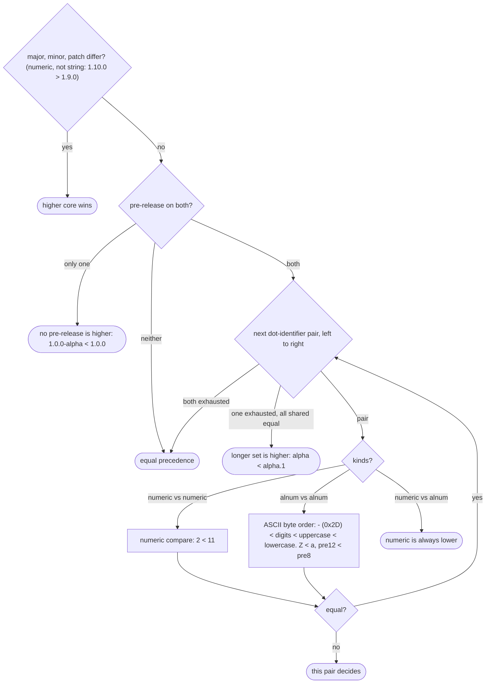

# SemVer 2.0.0 — implementation spec

> Adapted from [Semantic Versioning 2.0.0](https://semver.org/spec/v2.0.0.html) by Tom Preston-Werner, licensed [CC BY 3.0](https://creativecommons.org/licenses/by/3.0/). Condensed and modified; not endorsed by the original author.

Text verified against [semver.md](https://github.com/semver/semver/blob/master/semver.md). §N = the spec's numbered rules.

## 1. Grammar

```
<valid semver> ::= <version core>
                 | <version core> "-" <pre-release>
                 | <version core> "+" <build>
                 | <version core> "-" <pre-release> "+" <build>
<version core> ::= <major> "." <minor> "." <patch>
<major> | <minor> | <patch> ::= <numeric identifier>
<pre-release> ::= <pre-release identifier> { "." <pre-release identifier> }
<build>       ::= <build identifier> { "." <build identifier> }
<pre-release identifier> ::= <alphanumeric identifier> | <numeric identifier>
<build identifier>       ::= <alphanumeric identifier> | <digits>
<alphanumeric identifier> ::= <non-digit>
                            | <non-digit> <identifier characters>
                            | <identifier characters> <non-digit>
                            | <identifier characters> <non-digit> <identifier characters>
<numeric identifier> ::= "0" | <positive digit> | <positive digit> <digits>
<identifier characters> ::= <identifier character>+
<identifier character> ::= <digit> | <non-digit>
<non-digit> ::= <letter> | "-"
<digits> ::= <digit>+
<digit> ::= "0" | <positive digit>
<positive digit> ::= "1".."9"
<letter> ::= "A".."Z" | "a".."z"
```
(Repetition `{}`/`+`/ranges condense the spec's recursive productions; semantics identical.)

| Part | Charset | Empty allowed | Leading zeros | Notes |
|---|---|---|---|---|
| major/minor/patch | `[0-9]` | no | **forbidden** (`0` ok, `01` not) | non-negative integer, no upper bound in spec |
| pre-release identifier | `[0-9A-Za-z-]` | no | forbidden **only if all-digit** (`01` bad, `01a`/`0-1` ok) | ASCII only |
| build identifier | `[0-9A-Za-z-]` | no | **allowed** (`+001` ok) | ASCII only |

Invalid examples: `1.2`, `1.2.3.4`, `v1.2.3`, `01.2.3`, `1.2.3-`, `1.2.3+`, `1.2.3-a..b`, `1.2.3-01`, `1.2.3-α`, `1.2.3-a_b`, ` 1.2.3`.
Valid oddities: `1.0.0-x-y-z.--`, `1.0.0+21AF26D3----117B344092BD`, `1.0.0-0.3.7`, `1.0.0--` (pre-release `-`), `1.0.0-0a`.

## 2. Official regex

Named groups (PCRE, Python, Go; Rust `regex` accepts `(?P<..>)`):
```
^(?P<major>0|[1-9]\d*)\.(?P<minor>0|[1-9]\d*)\.(?P<patch>0|[1-9]\d*)(?:-(?P<prerelease>(?:0|[1-9]\d*|\d*[a-zA-Z-][0-9a-zA-Z-]*)(?:\.(?:0|[1-9]\d*|\d*[a-zA-Z-][0-9a-zA-Z-]*))*))?(?:\+(?P<buildmetadata>[0-9a-zA-Z-]+(?:\.[0-9a-zA-Z-]+)*))?$
```
Numbered groups (cg1 major … cg5 build; ECMAScript-compatible):
```
^(0|[1-9]\d*)\.(0|[1-9]\d*)\.(0|[1-9]\d*)(?:-((?:0|[1-9]\d*|\d*[a-zA-Z-][0-9a-zA-Z-]*)(?:\.(?:0|[1-9]\d*|\d*[a-zA-Z-][0-9a-zA-Z-]*))*))?(?:\+([0-9a-zA-Z-]+(?:\.[0-9a-zA-Z-]+)*))?$
```

## 3. Precedence (§11)

First difference wins. **Build metadata is ignored**: `1.0.0+a` and `1.0.0+b` have equal precedence (but are different strings).



Canonical chain: `1.0.0-alpha < 1.0.0-alpha.1 < 1.0.0-alpha.beta < 1.0.0-beta < 1.0.0-beta.2 < 1.0.0-beta.11 < 1.0.0-rc.1 < 1.0.0`.

Edge cases:
- Precedence is a total **preorder**, not total order: equality under precedence ≠ string equality (build differs).
- Case-sensitive: `1.0.0-RC.1 < 1.0.0-rc.1`.
- Numeric pre-release identifiers are unbounded (`1.0.0-99999999999999999999999` is valid) → compare by (length, digits), not by parsing into an integer.
- `1.0.0-1 < 1.0.0-a`; `1.0.0-a.1 < 1.0.0-a.b`; `1.0.0-0 < 1.0.0-0.0`.

## 4. Bump semantics (§§2–8)

| Change to public API | x ≥ 1 | Resets |
|---|---|---|
| Backward-compatible bug fix only (internal fix of incorrect behaviour) | patch `Z+1` | — |
| New backward-compatible functionality | minor `Y+1` | patch → 0 |
| Any functionality **marked deprecated** | minor `Y+1` (MUST) | patch → 0 |
| Substantial private-code improvements | minor MAY | patch → 0 |
| Backward-incompatible change | major `X+1` | minor, patch → 0 |

- A higher bump MAY include lower-level changes; only the highest applies.
- Each element MUST increase numerically (`1.9.0 → 1.10.0`).
- Released versions are immutable (§3): any change ⇒ new version. Never re-tag/overwrite.
- **0.y.z** (§4): initial development, "anything MAY change", API not stable. Spec defines **no** bump rules for 0.y.z (rules 6–8 are scoped to `x > 0`). FAQ: start at `0.1.0`, bump minor per release. Mapping breaking→minor / feature→patch in 0.x is a *convention*, not spec.
- **1.0.0** (§5) defines the public API; graduating to 1.0.0 is a human decision (FAQ: "used in production" / stable API ⇒ be 1.0.0).
- Pre-release (§9): unstable, may not satisfy compatibility of its normal version. Spec defines **no** rules for incrementing pre-release identifiers (e.g. `-rc.1 → -rc.2`) — tool policy.
- Build metadata (§10): no bump semantics at all.

## 5. FAQ points affecting implementation

| FAQ | Implication |
|---|---|
| `v1.2.3` is not a semver | `v` is a tag-name prefix; strip/add at tag boundary, never part of `Version`. |
| No size limit | Don't impose one in the parser beyond integer representation; 255 chars called "overkill". |
| Accidentally released breaking change as minor | Fix and release a **patch** restoring compatibility; never modify the released version; optionally document the bad version. |
| Breaking change shipped in a patch | Judgment call; may release a **major** to signal it. Tool must allow manual override of computed bump. |
| Dependency updates without API change | Compatible; patch if bug fix, minor if new functionality. |
| Deprecation | Minor release; at least one minor with the deprecation before removal in a major. |
