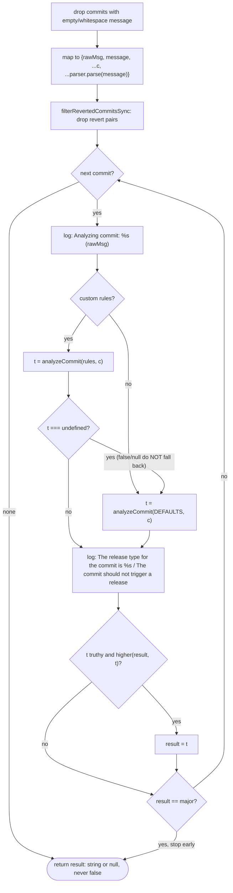
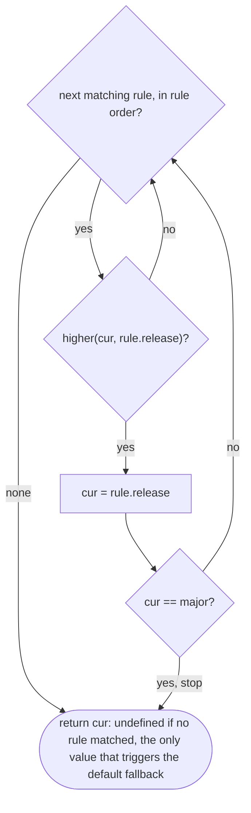

# Upstream commit-analyzer: implementation reference

Scope: how `@semantic-release/commit-analyzer` (the `analyzeCommits` step) actually behaves in code. Source: `semantic-release/commit-analyzer` master @ `96bba2f` (2026-10-04), diffed against `beta` (v14); ~200 LOC. Step contract and multi-plugin semantics: [SEMANTIC-RELEASE-SPEC.md](SEMANTIC-RELEASE-SPEC.md). Commit message grammar: [CONVENTIONAL-COMMITS-SPEC.md](CONVENTIONAL-COMMITS-SPEC.md).

## Source map

| Feature | File |
| --- | --- |
| Single export `analyzeCommits(pluginConfig, context)`; loops over commits, returns the highest type | `index.js` |
| Skips commits whose message is empty or whitespace (debug log only) | `index.js:36` |
| `CommitParser(config).parse(message)` merged into the raw commit object | `index.js:44` |
| Drops revert pairs inside the analysed range (`filterRevertedCommitsSync`) | `index.js:35` |
| Custom `releaseRules` first, default rules only if the custom result is `undefined` | `index.js:58-68` |
| Stops early at `major` | `index.js:82`, `lib/analyze-commit.js:35` |
| Rule matching: lodash `isMatchWith` + micromatch; special keys `breaking`, `revert`, `release` | `lib/analyze-commit.js:18-27` |
| Release-type ordering | `lib/compare-release-types.js`, `lib/default-release-types.js` |
| Built-in rules (angular, atom, ember, eslint, express, jshint) | `lib/default-release-rules.js` |
| `releaseRules` from inline array or module path/package, validated | `lib/load-release-rules.js` |
| Parser options from preset, config package or angular default, then `parserOpts` | `lib/load-parser-config.js` |

## Options

| Option | Type | Default | Behaviour |
| --- | --- | --- | --- |
| `preset` | string | `angular` (implicit) | Lowercased; imports `conventional-changelog-${preset}` from the plugin dir, then `cwd`; calls `fn(presetConfig)`; only `.parser` is used. **Wins over `config`.** |
| `config` | string | – | Package name or path, imported the same way, called **without args**; only `.parser` is used |
| `parserOpts` | object | – | Shallow `{...preset.parser, ...parserOpts}`. Angular is always the base (README claim "only parserOpts are used" is wrong) |
| `releaseRules` | array \| string | `undefined` (only default rules apply) | A string is imported as a module (plugin dir, then `cwd`). Must be an array; each item an object with a `release` key whose value is a valid type, `false` or `null` |
| `presetConfig` | object | `undefined` | Passed to the `preset` function only, never to `config`. Required by `conventionalcommits` |

Valid `release` values, highest priority first: `major, premajor, minor, preminor, patch, prepatch, prerelease`, plus `false`, `null`.

Beta (v14): drops the atom/ember/eslint/express/jshint presets, bundles `angular` and `conventionalcommits`, removes the unused `conventional-changelog-writer` dep, requires Node `^22.22.2 || >=24.15`. Default rules unchanged; default preset still angular (#858 switched it to conventionalcommits, `ce52d65` reverted).

## Algorithm

`rules = loadReleaseRules()` (`undefined | Rule[]`), `parser = CommitParser(loadParserConfig())`, `result = null`. `higher(cur, new) = !cur || idx(new) < idx(cur)`, with `idx(false|null) = -1`.

Final log: `Analysis of %s commits complete: %s release` with `commits.length` (including skipped empty commits) and `result || "no"`.

### `analyzeCommit(rules, commit)`

1. A rule matches if all hold:
   - `breaking` truthy ⇒ `commit.notes.length > 0` (**any** note counts, not only `BREAKING CHANGE`).
   - `revert` truthy ⇒ `commit.revert` truthy (set by the parser's `revertPattern`).
   - Other keys: `_.isMatchWith(commit, rest, cust)`, a deep partial match (nested objects subset, arrays unordered subset). The customizer applies only when **both** values are strings and calls `micromatch.isMatch(value, pattern)`; everything else is lodash `isEqual` (so `{scope: 1}` works). A rule with no criteria (`{release:"patch"}`) matches everything.
2. Matches fold in rule order:

Because `idx(false|null) = -1`, a falsy type after a truthy one also replaces it (unless `major` already stopped the fold): a trailing `{release:false}` is an order-dependent veto. Otherwise the higher type wins.

### Matching details

- Rule values are **globs, not regexes**. A JS RegExp falls through to `isEqual` and never matches a string. micromatch is path-oriented: `*` does not cross `/`, a leading `.` is treated as a dotfile, picomatch on win32 converts `\` to `/`. Braces and extglobs work. Case-sensitive.
- Rule keys can be any field of the merged commit. Parser fields (`type, scope, subject, header, body, footer, notes, references, mentions, merge, revert`, plus custom `headerCorrespondence` names such as eslint `tag`/`message`) **override** raw commit fields of the same name (`subject`, `body`, `message`). Raw fields (`hash`, `author.email`, `committerDate`, …) stay matchable.
- Any matching custom rule **suppresses all default rules for that commit**: with `{type:"refactor", release:"patch"}`, `refactor!:` gives only patch unless `{breaking:true, release:"major"}` is also configured.
- Reverts: a revert whose target is in range removes both commits; a revert whose target is out of range stays and becomes `patch` via the default `{revert:true}` rule.
- The preset's `whatBump`/recommended bump is **ignored**.

### Default rules

| Rule | Release |
| --- | --- |
| `breaking:true` | major |
| `revert:true` | patch |
| `type`: feat / fix / perf | minor / patch / patch |
| `emoji`: `:racehorse:` `:bug:` `:penguin:` `:apple:` `:checkered_flag:` | patch |
| `tag`: BUGFIX / FEATURE / SECURITY | patch / minor / patch |
| `tag`: Breaking / Fix / Update / New | major / patch / minor / minor |
| `component`: perf / deps | patch |
| `type`: FEAT / FIX | minor / patch |

## Side effects and errors

- `context.logger.log`: one analysis line and one result line per commit, one summary line.
- `debug("semantic-release:commit-analyzer")`: skipped empty commits, custom vs default rule path, each match.
- Dynamic `import()` of presets and rules from the plugin dir and `cwd` (can execute arbitrary JS). No other I/O, no context mutation.
- Errors: `TypeError`/`Error` from rule validation, `MODULE_NOT_FOUND` for an unknown preset or config, parser regex errors re-thrown.

## Tests (ava, `test/`)

| File | # | Covers | Portable |
| --- | --- | --- | --- |
| `compare-release-types.test.js` | 1 test, 13 asserts | ordering, falsy candidates | yes, as `(cur, new, expected)` table |
| `analyze-commit.test.js` | 12 | breaking, revert, combined criteria, glob, highest wins, `false`/`null` result, no match | yes, as `(rules, commit, expected)` table |
| `load-release-rules.test.js` | 9 | inline array, module path, undefined, preserving `false`/`null`, invalid type, missing `release`, non-array, `undefined` item | validation cases only |
| `load-parser-config.test.js` | 7 + 14 macro | angular default, `parserOpts` override, preset/config × 7 presets, missing module, `importFrom.silent` fallback | override/merge only |
| `integration.test.js` (separate script) | 25 | message list → type plus logged lines: presets, `parserOpts`, revert pairs, custom vs default fallback, glob on `message`, rule order, `false` precedence, empty commits, errors | angular/conventionalcommits cases as `(opts, messages[], expected_type)`; eslint cases need an eslint parser config |

Fixtures: `release-rules.cjs` (4 rules), `release-rules-invalid.cjs` (`42`).

## Known upstream bugs

- Any note counts as breaking, not only `BREAKING CHANGE`: [#335](https://github.com/semantic-release/commit-analyzer/issues/335)
- A body line starting with "Breaking change" gives major: [#776](https://github.com/semantic-release/commit-analyzer/issues/776)
- Angular default ignores `!`, so `feat!:` is not major: [#231](https://github.com/semantic-release/commit-analyzer/issues/231)
- Custom rules shadow the default `breaking → major`: [#413](https://github.com/semantic-release/commit-analyzer/issues/413), [#805](https://github.com/semantic-release/commit-analyzer/issues/805)
- `release:false` precedence depends on rule order: [#377](https://github.com/semantic-release/commit-analyzer/issues/377)
- No way to disable the default rules: [#122](https://github.com/semantic-release/commit-analyzer/issues/122), [#612](https://github.com/semantic-release/commit-analyzer/issues/612)
- `*` glob does not cross `/` in messages: [#175](https://github.com/semantic-release/commit-analyzer/issues/175)
- Rules are case-sensitive (`Feat:`, `feat(ABC)`): [#496](https://github.com/semantic-release/commit-analyzer/issues/496), [#641](https://github.com/semantic-release/commit-analyzer/issues/641)
- Missing or mismatched preset silently yields "no release": [#517](https://github.com/semantic-release/commit-analyzer/issues/517), [#642](https://github.com/semantic-release/commit-analyzer/issues/642)
- Preset `whatBump` ignored: [#171](https://github.com/semantic-release/commit-analyzer/issues/171)
- Logs cannot be silenced: [#340](https://github.com/semantic-release/commit-analyzer/issues/340)
