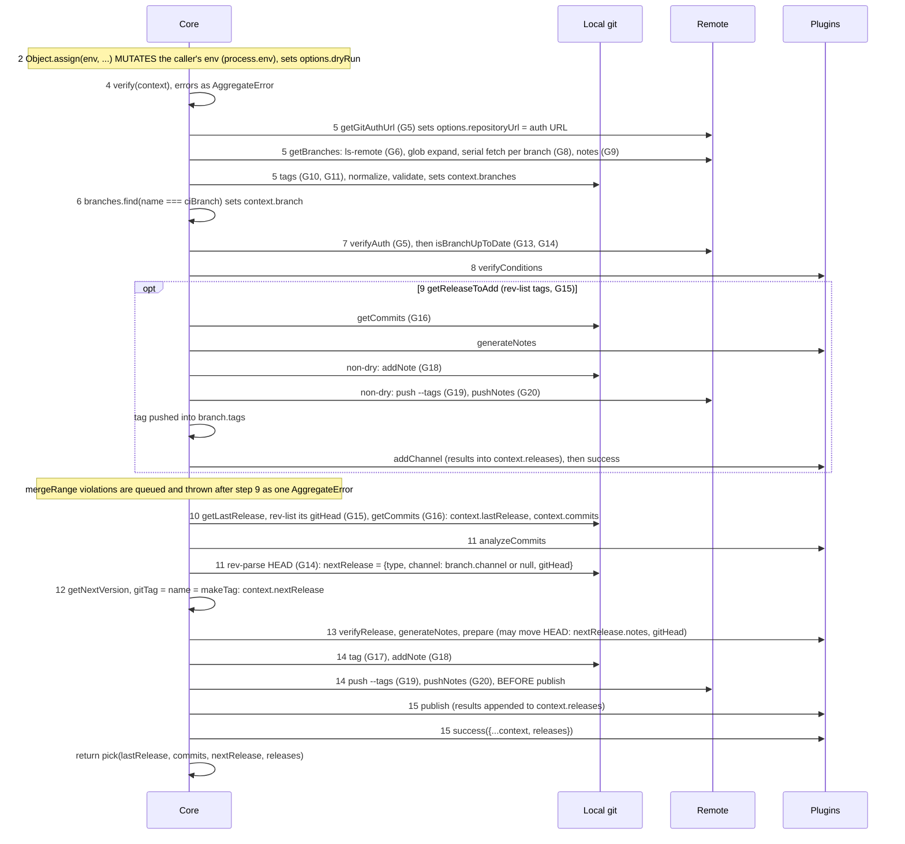
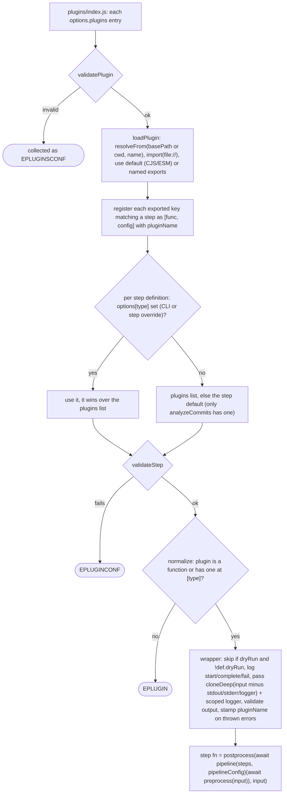

# Upstream semantic-release core: implementation reference

Scope: how semantic-release core actually behaves in code (algorithms, git calls, side effects, errors, tests). Source: `semantic-release/semantic-release` @ `04c1923` (2026-10-04). Documented behaviour (hooks, run order, config, branches, ranges, next version, tagFormat, auth, dry-run, JS API, plugin contract) is in [SEMANTIC-RELEASE-SPEC.md](SEMANTIC-RELEASE-SPEC.md) and is not repeated here. `git.js:N` means `lib/git.js` line N.

## Source map

| Area | Source |
| --- | --- |
| `run` orchestration, CI/PR/dry-run guards, `mergeRange` and range guards, JS API result | `index.js` |
| 9 step definitions, output validators (`E<STEP>OUTPUT`), `[skip release]` filter, notes concat, prepare HEAD re-check | `lib/definitions/plugins.js` |
| Config discovery, defaults (plugins, branches), `extends` | `lib/get-config.js` |
| Plugin forms, resolution relative to the shareable config | `lib/plugins/utils.js` |
| Step-level overrides (`--publish x`, `options.publish = {...}`) | `lib/plugins/index.js` |
| Per-plugin options (global minus step keys and `plugins`, deep-cloned), dry-run step skip | `lib/plugins/normalize.js` |
| Branch model, micromatch globs, `${name}` templating, ranges | `lib/branches/*`, `lib/definitions/branches.js` |
| Merged-release promotion | `lib/get-release-to-add.js` |
| Next version, last release | `lib/get-next-version.js`, `lib/get-last-release.js` |
| tagFormat validation, `makeTag` | `lib/verify.js`, `lib/utils.js` |
| Repo URL (shorthand `owner/repo`, `gitlab:o/r`, `git+https`), auth URL (parallel token probing) | `lib/get-git-auth-url.js` |
| Git calls ([Git operations](#git-operations)) | `lib/git.js` |
| Secret masking | `lib/hide-sensitive.js` |
| Error catalog and rendering | `lib/definitions/errors.js`, `index.js` `logErrors` |
| CLI (yargs), Node and git ≥ 2.7.1 guards, `--debug` → `debug("semantic-release:*")` | `cli.js`, `bin/semantic-release.js` |
| TypeScript types (API, per-step `*Context`, plugins) | `index.d.ts` |

## Pipeline

### Entry (`index.js` default export)

1. `hookStd(process.stdout, process.stderr, opts.stdout, opts.stderr)` passes every write through `hideSensitive(env)`.
2. `context = {cwd, env, stdout, stderr, envCi: envCi({env,cwd})}`, then `context.logger` (signale, scope `semantic-release`).
3. `getConfig(context, cliOptions)` produces `{options, plugins}`. Then `options.originalRepositoryURL = options.repositoryUrl` and `context.options = options`.
4. `run(context, plugins)`. On throw: `callFail`, `logErrors`, `unhook`, rethrow.

### `run()` internals

Leading numbers are the step ids of the run order in [SEMANTIC-RELEASE-SPEC.md](SEMANTIC-RELEASE-SPEC.md). G-numbers refer to [Git operations](#git-operations).

### Plugin loading and normalization

### Pipeline hook points (`lib/plugins/pipeline.js`, `lib/definitions/plugins.js`)

Sequential `pReduce` returning an array of results. Per-step semantics are in [SEMANTIC-RELEASE-SPEC.md](SEMANTIC-RELEASE-SPEC.md) (hooks table).

- analyzeCommits: pre drops `[skip release]`; post picks the highest of patch < minor < major, else `undefined`.
- generateNotes: `getNextInput` feeds accumulated notes; post joins `\n\n`, then `hideSensitive`.
- prepare: `getNextInput` re-reads HEAD (G14) and re-runs generateNotes, mutating the shared context.
- publish/addChannel: `transform` = `{...nextRelease (unless result === false), ...result, pluginName}`.
- success/fail: pre `hideSensitiveValues(releases|errors)`.

### Errors

- `SemanticReleaseError(message, code, details)` (`@semantic-release/error`) carries `semanticRelease = true`. Core builds them with `getError(code, ctx)` from `lib/definitions/errors.js`: message plus markdown details with docs links.
- `AggregateError` comes from verify, branches, plugin config, settleAll steps and addChannel; `extractErrors(err)` flattens it.
- `callFail`: `fail` plugins run only if at least one error has `semanticRelease`, and receive only those errors. Errors thrown by `fail` itself are logged.
- `logErrors`: SR errors first, as `code message`, with details rendered to stderr; other errors logged as `%O`.
- Codes: `ENOGITREPO`, `ENOREPOURL`, `EINVALIDREPOURL`, `EGITNOPERMISSION`, `EINVALIDTAGFORMAT`, `ETAGNOVERSION`, `EPLUGINCONF`, `EPLUGINSCONF`, `EPLUGIN`, `EANALYZECOMMITSOUTPUT`, `EGENERATENOTESOUTPUT`, `EPUBLISHOUTPUT`, `EADDCHANNELOUTPUT`, `EINVALIDBRANCH`, `EINVALIDBRANCHNAME`, `EDUPLICATEBRANCHES`, `EMAINTENANCEBRANCH(ES)`, `ERELEASEBRANCHES`, `EPRERELEASEBRANCH(ES)`, `EINVALIDNEXTVERSION`, `EINVALIDMAINTENANCEMERGE`.

### Branch normalization (`lib/branches/normalize.js`)

Implements the range algorithms in [SEMANTIC-RELEASE-SPEC.md](SEMANTIC-RELEASE-SPEC.md). Its output order (maintenance, release, prerelease) defines "higher branches" for `getReleaseToAdd`.

## Git operations

All calls go through `execa("git", args, {cwd, env})`. `URL` is `options.repositoryUrl` after auth injection; credentials travel inside it (`https://<prefix><token>@host/...`). Every call taking a URL puts `--` before it to block option injection (tested with `--upload-pack` and `--receive-pack`). G5–G20 run with the CI git env (bot identity, `GIT_ASKPASS=echo`, `GIT_TERMINAL_PROMPT=0`); the identity only affects commits made by prepare plugins.

| # | Command and args | Source | Purpose | When | Behaviour notes |
| --- | --- | --- | --- | --- | --- |
| G1 | `git --version` | `bin/semantic-release.js` | require ≥ 2.7.1 | CLI start | |
| G2 | `git config --get remote.origin.url` | `git.js:177` repoUrl | default repositoryUrl | config, if `package.json#repository` is missing | errors swallowed |
| G3 | `git rev-parse --git-dir` | `git.js:192` isGitRepo | is cwd a repo (walks up) | verify | |
| G4 | `git check-ref-format refs/tags/<tagFormat(version=0.0.0)>` | `git.js:263` verifyTagName | validate tagFormat | verify | pure ref-name check |
| G5 | `git push --dry-run --no-verify -- URL HEAD:<branch>` | `git.js:209` verifyAuth | probe push auth | getGitAuthUrl: 1× raw URL, then N× in parallel per token candidate (if more than 1); `run`: 1× | real receive-pack negotiation, not just ls-remote |
| G6 | `git ls-remote --heads -- URL` | `git.js:73` getBranches | list remote branches for glob expansion | getBranches, once | called with `{cwd}` only, no env |
| G7 | `git rev-parse --abbrev-ref HEAD` | `git.js:110` fetch | detect detached HEAD (`== "HEAD"`) | per release branch | `reject:false` |
| G8a | `git fetch --unshallow --tags -- URL` | `git.js:110` fetch | unshallow + tags for the CI branch (non-detached) | per branch, serial | does not touch HEAD |
| G8b | `git fetch --unshallow --tags --update-head-ok -- URL +refs/heads/B:refs/heads/B` | `git.js:110` | force-update local branch B (non-CI branch or detached HEAD) | per branch | updates the ref even if checked out |
| G8c | G8a/G8b without `--unshallow` | `git.js:110` | fallback when the repo is already complete (unshallow errors) | on G8a/b failure | |
| G9a | `git fetch --unshallow -- URL +refs/notes/*:refs/notes/*` | `git.js:148` fetchNotes | fetch all notes refs | once after branch fetch | |
| G9b | `git fetch -- URL +refs/notes/*:refs/notes/*` | `git.js:148` | fallback | on G9a failure | `reject:false`, failure ignored |
| G10 | `git log --tags=* --decorate-refs=refs/tags/* --no-walk --format=%d%x09%N --notes=refs/notes/semantic-release*` | `git.js:315` getTagsNotes | map tag → JSON note (channels) | once in get-tags | reads legacy `semantic-release` and per-tag `semantic-release-<tag>` refs; notes concatenate when several refs annotate one commit, breaking JSON (#4073) |
| G11 | `git tag --merged <branch>` | `git.js:34` getTags | tags reachable from branch | per branch | |
| G12 | `git check-ref-format refs/heads/<branch>` | `git.js:279` verifyBranchName | validate branch names | per branch | called without cwd/env |
| G13 | `git ls-remote --heads -- URL <branch>` | `git.js:296` isBranchUpToDate | remote head sha | only if G5 fails in `run` | |
| G14 | `git rev-parse HEAD` | `git.js:166` getGitHead | HEAD sha | isBranchUpToDate; nextRelease.gitHead; after **each prepare plugin** | prepare call uses `{cwd}` only |
| G15 | `git rev-list -1 <tag>` | `git.js:21` getTagHead | peel tag → commit sha | lastRelease, currentRelease, nextRelease (addChannel) | annotated or lightweight |
| G16 | `git log --format=%H==FIELD==%h==FIELD==%T==FIELD==%t==FIELD==%an==FIELD==%ae==FIELD==%ai==FIELD==%cn==FIELD==%ce==FIELD==%ci==FIELD==%s==FIELD==%b==FIELD==%H==FIELD==%B==FIELD==%d==FIELD==%ci==END== [<from>..]<to>` | `git.js:49` getCommits, via git-log-parser (env = process.env + env) | commits since last release | normal and addChannel paths | default log order, no `--first-parent`, merges included. Output: `{commit{long,short}, tree{long,short}, author{name,email,date}, committer{…}, subject, body, hash, message (trimmed), gitTags (%d), committerDate}` |
| G17 | `git tag <tag> <sha>` | `git.js:227` tag | create **lightweight** tag | new release, non-dry | |
| G18 | `git notes --ref semantic-release-<tag> add -f -m <json> <tag>` | `git.js:371` addNote | channel note on the tag target commit | new release; addChannel (channels = current + new) | per-tag ref since #1613 (parallel races) |
| G19 | `git push --tags -- URL` | `git.js:239` push | push tags | after G17/G18 and addChannel | pushes **all** local tags, not just the new one |
| G20 | `git push -- URL refs/notes/semantic-release-<tag>` | `git.js:251` pushNotes | push the note ref | after G19 | non-force |
| G21 | `git rev-parse --verify <ref>` | `git.js:88` isRefExists | ref exists | **unused** in lib (tests only) | |
| G22 | `git show-ref <tag> --hash` | `git.js:385` getTagRef | tag object sha | **unused** | |

## Side effects

| Kind | Detail |
| --- | --- |
| Env read | auth token vars, `DEBUG`, env-ci vars, every env var name (masking scan) |
| Env written | mutates the passed `env` (default `process.env`) with the CI git env |
| Files read | config files (cwd only, cosmiconfig v9 default), `package.json` (read-package-up, **walks up**), plugin and shareable-config modules (node resolution), `.git` |
| Files written | none by core. Git objects/refs: lightweight tag, notes commits, `refs/notes/*`, `refs/heads/*` (G8b), shallow → full |
| Network | git only (ls-remote, fetch, push dry-run, push). No HTTP in core; plugins do HTTP |
| Pushes | `push --dry-run` (auth probe, 1+N times), `push --tags`, `push <notes ref>`. Tag pushed **before** publish, no rollback on publish failure |
| stdout/stderr | `hook-std` intercepts process and custom streams. Logger: log/success to stdout, warn/error to stderr, with timestamps. Dry-run notes to stdout, error details to stderr |
| Secret masking | Name/length rule: [SEMANTIC-RELEASE-SPEC.md](SEMANTIC-RELEASE-SPEC.md). Length is checked on the trimmed value. Masked forms: raw, `encodeURI`, `encodeURIComponent`, `:`-preserving. Applied to all stream writes, generateNotes output, and string props of success `releases` / fail `errors` (shallow, mutating) |
| Exit codes | 0 on success, no-release, help/version. 1 on any thrown error, unsupported Node, git < 2.7.1 or missing. Non-yargs errors printed with `util.inspect` (masked) |

## Library semantics that leak into behaviour

| npm dep | Behaviour it defines |
| --- | --- |
| `semver` (node-semver) | `inc("prerelease")`, `diff`, `satisfies`, `validRange`, prerelease range matching, `-0` upper-bound quirk; only `>=a <b` ranges are generated |
| `micromatch` | branch globs incl. extglob/braces (default `+([0-9])?(.{+([0-9]),x}).x`) |
| `lodash` `template` | tagFormat and branch fields; core interpolates only `${version}` and `${name}` |
| `hosted-git-info` | shorthand repo URL expansion |
| `env-ci` | CI vendor, branch, PR detection (31 CIs, [UPSTREAM-DEPENDENCIES](UPSTREAM-DEPENDENCIES.md)) |
| `git-log-parser` | G16 parsing |
| `marked`, `marked-terminal` | dry-run notes rendered as terminal markdown |
| `signale`, `debug` | logger badges; `semantic-release:*` debug namespace |

## Tests

| Item | Detail |
| --- | --- |
| Framework | ava 8 (`test/**/*.test.js`, 2m timeout), c8, testdouble `replaceEsm` (mocks env-ci, logger, modules), sinon, stream-buffers |
| Unit (~270) | `git.test.js` (34, real temp repos), `get-config` (27), `get-git-auth-url` (30), `hide-sensitive` (26), `plugins/*` (50), `branches/*` (26), `definitions/*`, `get-next-version`, `get-last-release`, `get-release-to-add`, `utils`, `verify`, `cli` (12) |
| Integration (38, `integration.test.js`) | full `index.js` against local bare repos via `file://` URLs (tempy + `git init --bare`), plugins as sinon stubs, env-ci mocked. Covers addChannel through ff/no-ff/rebase merges, prereleases, maintenance, dry-run, fail/success semantics, masking, shallow-clone unshallow |
| E2E (17, `e2e.test.js`) | testcontainers from `e2e.compose.yml`: `semanticrelease/docker-gitbox` (git over HTTP basic auth), `verdaccio` (npm registry), `mockserver` (GitHub API). Real CLI/API with real npm/github plugins |
| Helpers | `test/helpers/git-utils.js`: initGit, gitRepo, initBareRepo, gitCommits (`--allow-empty`), gitShallowClone (`--depth`), gitDetachedHead(FromBranch), gitTagVersion, gitAddNote/gitGetNote/gitPushNotes, merge/mergeFf/rebase, gitRemoteTagHead |
| Fixtures | `test/fixtures/*`: plugin-noop, plugin-identity, plugin-error(s), plugin-error-inherited, plugin-log-env (secret-leak check), plugin-result-config, plugin-esm-named-exports, multi-plugin |
| Portable | pure-logic tables (next-version, last-release, release-to-add, normalize, utils, hide-sensitive, errors); git.test scenarios (unshallow, detached HEAD, notes, option injection); integration scenarios with `file://` bare repos; gitbox HTTP-auth e2e |
| Not portable | cli/get-config module mocking, ESM plugin loading, npm/verdaccio e2e |

## Known upstream bugs

- Notes from several refs on one commit concatenate into invalid JSON (G10): [#4073](https://github.com/semantic-release/semantic-release/issues/4073)
- Shared notes ref raced under parallel runs (fixed by per-tag refs): [#1613](https://github.com/semantic-release/semantic-release/issues/1613)
- Tag pushed before publish, no rollback when publish fails: [#896](https://github.com/semantic-release/semantic-release/issues/896), [#2381](https://github.com/semantic-release/semantic-release/issues/2381)
- `--dry-run` still requires push permission (G5): [#2232](https://github.com/semantic-release/semantic-release/issues/2232)
- Auth probing brute-forces SSH then every token: [#2053](https://github.com/semantic-release/semantic-release/issues/2053)
- Branches fetched serially, slow on many branches (G8): [#1345](https://github.com/semantic-release/semantic-release/issues/1345), [#3241](https://github.com/semantic-release/semantic-release/issues/3241)
- Plugins get deep clones and cannot modify `nextRelease`: [#2641](https://github.com/semantic-release/semantic-release/issues/2641)
- generateNotes runs too early in the pipeline: [#2791](https://github.com/semantic-release/semantic-release/issues/2791)
- The same plugin cannot run twice in a step: [#3038](https://github.com/semantic-release/semantic-release/issues/3038)
- Core mutates the caller's `process.env` (no issue)
- G19 pushes all local tags, not only the new one (no issue)
