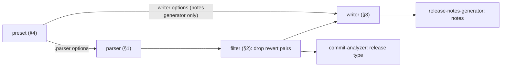
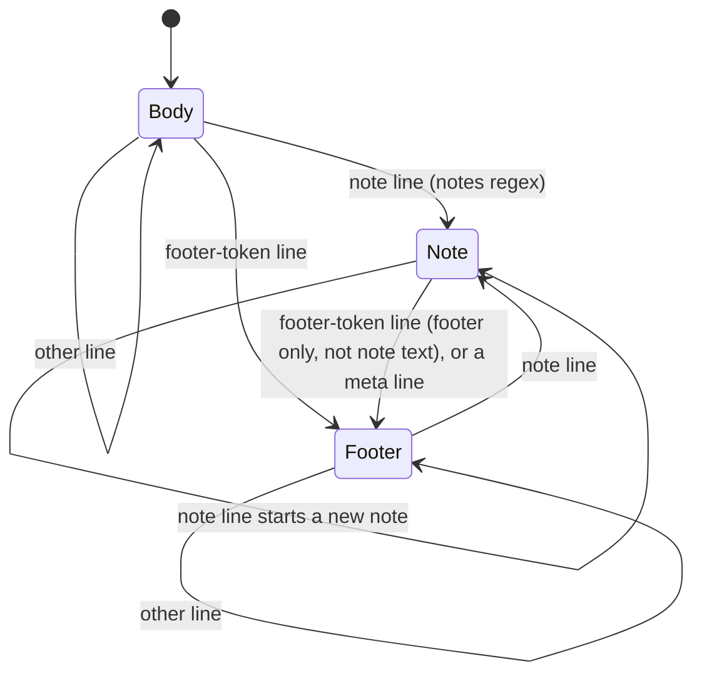
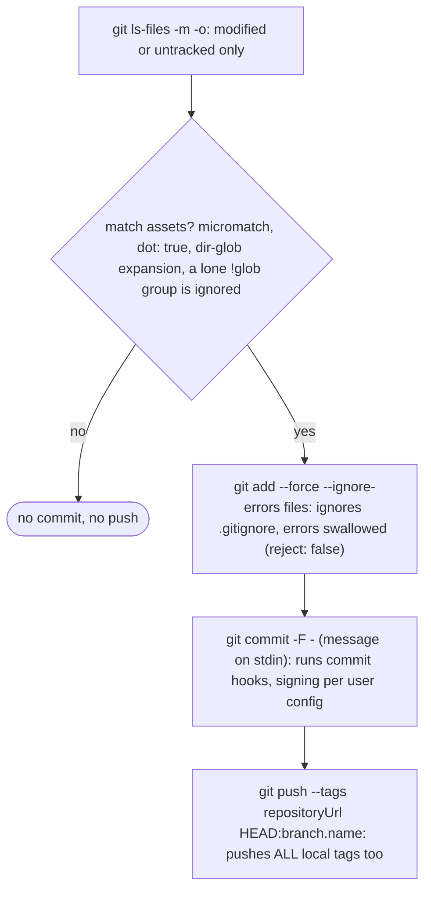

# Upstream dependencies: behaviour reference

Scope: how the conventional-changelog packages, env-ci, `@semantic-release/{git,changelog,exec,error}` and lodash `template` behave upstream. Source: `conventional-changelog` monorepo @ `f90c80e`, `env-ci` @ `0a8c00b`, `git` @ `08bfb3d`, `changelog` @ `d780a55`, `exec` @ `3988e52`, `error` @ `bfc9b06`, `semantic-release` master (2026-10-05).

> Attribution: describes MIT- and ISC-licensed code, © the respective upstream contributors; short excerpts (regexes, option names, messages) are quoted under those licenses. Not affiliated with semantic-release.

## 0. Version skew

| Package | Latest | Used by commit-analyzer / release-notes-generator |
| --- | --- | --- |
| conventional-commits-parser | 7.1.2 | `^6.0.0` |
| conventional-changelog-writer | 9.2.1 (no Handlebars) | `^8.0.0` (Handlebars) |
| conventional-changelog-angular | 9.4.0 (render functions) | `^8.0.0` |
| conventional-changelog-conventionalcommits | 10.4.0 | devDep only, user-installed |
| conventional-commits-filter | 6.0.1 | `^5.0.0` |

- Writer 9 (2026-06) replaced Handlebars templates/partials with TS render functions (`@conventional-changelog/template`). semantic-release still renders through Handlebars (writer 8).
- Presets ≥ 9/10 add `createLegacyWriterGuard()`: a `mainTemplate` string that makes writer ≤ 8 throw, so `conventionalcommits@10` + release-notes-generator fails loudly.
- The tables below describe parser 7.1.2 and presets 9.4 / 10.4.

## 1. conventional-commits-parser (7.1.2)

Commit message → `{type, scope, subject, merge, header, body, footer, notes[], references[], mentions[], revert}`.

### Default options (`src/options.ts`)

| Option | Default |
| --- | --- |
| `headerPattern` | `^(\w*)(?:\(([\w$@.\-*/ ]*)\))?: (.*)$` |
| `headerCorrespondence` | `[type, scope, subject]` (named groups win if present) |
| `breakingHeaderPattern` | unset (presets set it) |
| `mergePattern` / `mergeCorrespondence` | unset |
| `revertPattern` | `^Revert\s"([\s\S]*)"\s*This reverts commit (\w*)\.?` |
| `revertCorrespondence` | `[header, hash]` |
| `fieldPattern` | `^-(?=.*\w)(.*?)-$` (git-log `-hash-` meta fields) |
| `noteKeywords` | `BREAKING CHANGE`, `BREAKING-CHANGE` (string or RegExp) |
| `notesPattern` | `(keywords) => RegExp` override |
| `issuePrefixes` | `#`; `issuePrefixesCaseSensitive` false |
| `referenceActions` | close(s/d), fix(es/ed), resolve(s/d) |
| `commentChar` | unset; if set, drop lines starting with it and truncate at `<c> ------------------------ >8 ------------------------` |

### Derived regexes (`src/regex.ts`), `K` = escaped keywords joined by `|`

| Name | Regex | Flags |
| --- | --- | --- |
| notes | `^(?:\*\s+)?(K):\s*(.*)` | i |
| referenceParts | `(?:.*?)??\s*([\w-\.\/]*?)??(PREFIXES)([\w-]+)(?=\s\|$\|[,;.)\]])` | gi (g if case-sensitive) |
| references | `(ACTIONS)(?:\s+(.*?))(?=(?:ACTIONS)\|$)`; fallback `()(.+)` | gi |
| footerToken | `^(?:BREAKING CHANGE\|[\w-]+)(?::\s+\|\s+(?:PREFIXES)).+` | i |
| mentions | `@([\w-]+)` | g |
| url | `\b(?:https?):\/\/(?:www\.)?([-a-zA-Z0-9@:%_+.~#?&//=])+\b` | – |
| no-match | `(?!.*)` (when option is unset) | – |

`referenceParts`, `references`, `fieldPattern` and no-match use lookaround.

### Algorithm (`CommitParser.parse`)

1. Reject blank input. Trim leading/trailing newlines, split `\r?\n`, drop `gpg:` lines (+ comment/scissors filtering).
2. Line 0 vs `mergePattern` → `merge`, consume, skip empty lines.
3. Header = next line. Try `breakingHeaderPattern`, then `headerPattern`; assign correspondence. References parsed from header.
4. Remaining lines: `parseMeta` (fieldPattern blocks) → `parseNotes` → `parseBodyAndFooter`. Every line is scanned for references. A note line pushes `{title, text}` and is appended to the footer. Line routing:

1. If no notes and `breakingHeaderPattern` matches the header → note `BREAKING CHANGE: <group 3>`.
2. Mentions and revert are scanned over the **whole raw input**.
3. Cleanup: trim newlines of body/footer/notes; dedupe references by `lower(action + raw)`.

Reference parse: per action-sentence, skip if it contains a URL; `repository` is split on the first `/` into `owner/repository`.

Test suite: `CommitParser.spec.ts`, `regex.spec.ts`.

Known bugs:

- `#` in body → false `closes` reference ([#415](https://github.com/conventional-changelog/conventional-changelog/issues/415)).
- Reference matching confused without a reference part ([#925](https://github.com/conventional-changelog/conventional-changelog/issues/925)).
- Types are not case-sensitive ([#828](https://github.com/conventional-changelog/conventional-changelog/issues/828)).

## 2. conventional-commits-filter (6.0.1)

`RevertedCommitsFilter` (input newest-first) holds revert commits. A later commit whose fields equal **every** key of a held `revert` object (`header` and `hash`, trimmed, exact) cancels both. Other commits are buffered while reverts are pending. Used by the analyzer and the writer (`ignoreReverted: true`).

Known bug: a short hash in a revert message never equals the full `hash`, so the pair is not filtered.

## 3. conventional-changelog-writer (9.2.1)

Commits stream → changelog text blocks.

| Option | Default | Note |
| --- | --- | --- |
| `transform(commit, ctx, opts)` | hash → 7 chars, header → 100 chars, `committerDate` → `YYYY-MM-DD` | commit is a read-only Proxy; returns a patch, falsy = drop; result keeps `raw` |
| `groupBy` | `type` | groups keyed by `commit[groupBy] \|\| ''`, insertion order |
| `commitGroupsSort` / `commitsSort` | – / `header` | string, string[] (concatenated keys), or comparator; `localeCompare` |
| `noteGroupsSort` / `notesSort` | `title` / `text` | |
| `generateOn` | `semver.valid(commit.version)` | string = field exists; splits the stream into release blocks |
| `reverse`, `doFlush`, `skip`, `ignoreReverted` | false, true, –, true | |
| `finalizeContext` | identity | last hook before render |
| `template`, `headerPartial`, `preamblePartial`, `commitPartial`, `footerPartial` | render functions | v8: Handlebars strings |

Context defaults: `commit: 'commits'`, `issue: 'issues'`, `date: today`, `linkReferences = true` when `repository|repoUrl` is set. `isPatch` = semver patch ≠ 0. Note groups keep first-seen order unless sorted.

Known bugs: ignores the most recent tag ([#1337](https://github.com/conventional-changelog/conventional-changelog/issues/1337)); no commas between multiple issue ids ([#1298](https://github.com/conventional-changelog/conventional-changelog/issues/1298)).

## 4. Presets

| | angular 9.4.0 | conventionalcommits 10.4.0 |
| --- | --- | --- |
| headerPattern | `^(\w*)(?:\((.*)\))?: (.*)$` (**no `!`**) | `^(\w*)(?:\((.*)\))?!?: (.*)$` |
| breakingHeaderPattern | – | `^(\w*)(?:\((.*)\))?!: (.*)$` |
| noteKeywords | `BREAKING CHANGE` | `BREAKING CHANGE`, `BREAKING-CHANGE` |
| revertPattern | `^(?:Revert\|revert:)\s"?([\s\S]+?)"?\s*This reverts commit (\w{7,40})\b` i | same but `(\w*)\.` |
| issuePrefixes | `#` | config, default `#` |
| commits | `merges: false`, `ignore: ignoreCommits` | same |
| config | `ignoreCommits` | `types`, `scope`, `scopeOnly`, `preMajor`, `issuePrefixes`, `format{Issue,Commit,Compare,User}Url`, `formatNote{Title,Icon}` |

**angular sections**: hard-coded `feat` → Features, `fix` → Bug Fixes, `perf` → Performance Improvements, `revert` → Reverts, always shown; docs/style/refactor/test/build/ci shown **only if the commit has notes**, else dropped. Groups sorted by title.

**conventionalcommits** `DEFAULT_COMMIT_TYPES` (`effect`: `bump` | `changelog` | `hidden`, default `bump`; replaced `hidden: true` in 10.0):

| type | section | effect |
| --- | --- | --- |
| feat, feature | Features | bump |
| fix | Bug Fixes | bump |
| perf | Performance Improvements | bump |
| revert | Reverts | bump |
| docs / style / chore / refactor / test / build / ci | Documentation / Styles / Miscellaneous Chores / Code Refactoring / Tests / Build System / Continuous Integration | hidden |

- Groups sorted in `types` order. A `Release-As:` footer/body forces inclusion. `scopeOnly` drops unscoped commits.
- `!` breaking: `getNotes()` synthesizes a `BREAKING CHANGE` note from the subject unless one exists (the parser only adds it when there are no notes at all).
- `noteTitle()` folds `BREAKING-CHANGE` into `BREAKING CHANGES`; other keywords are upper-cased into their own groups. References in subject/notes are linkified; duplicates are removed from the trailing `closes`.
- Templates: `## [version](compare) "title" (date)` (`###`/small for a patch in angular), `### Section` + `* **scope:** subject ([hash](url)), closes #1`, then note groups.

**whatBump** (`conventional-recommended-bump`; semantic-release does not use it, commit-analyzer has its own `releaseRules`):

- angular: breaking note → major (0); `feat` → minor (1); else patch (2) **always** (never null).
- conventionalcommits: only `bump`-effect types count; none → `null`; `preMajor` shifts the level by +1.

## 5. env-ci

Detects CI and normalizes env into `{isCi, name, service, commit, tag, build, buildUrl, job, jobUrl, branch, pr, isPr, prBranch, slug, root}`. The first `detect()` match wins (object key order). Fallback: `{isCi: Boolean(CI), commit: git rev-parse HEAD, branch}`.

| Service | Detect var | Service | Detect var |
| --- | --- | --- | --- |
| appveyor | `APPVEYOR` | jenkins | `JENKINS_URL` |
| azurePipelines | `BUILD_BUILDURI` | netlify | `NETLIFY` |
| bamboo | `bamboo_agentId` | puppet | `DISTELLI_APPNAME` |
| bitbucket | `BITBUCKET_BUILD_NUMBER` | sail | `SAILCI` |
| bitrise | `BITRISE_IO` | screwdriver | `SCREWDRIVER` |
| buddy | `BUDDY_WORKSPACE_ID` | scrutinizer | `SCRUTINIZER` |
| buildkite | `BUILDKITE` | semaphore | `SEMAPHORE` |
| circleci | `CIRCLECI` | shippable | `SHIPPABLE` |
| cirrus | `CIRRUS_CI` | teamcity | `TEAMCITY_VERSION` (+ reads Java `.properties` files) |
| cloudflarePages | `CF_PAGES` | travis | `TRAVIS` |
| codebuild | `CODEBUILD_BUILD_ID` | vela | `VELA` |
| codefresh | `CF_BUILD_ID` | vercel | `VERCEL` / `NOW_GITHUB_DEPLOYMENT` |
| codeship | `CI_NAME=codeship` | wercker | `WERCKER_MAIN_PIPELINE_STARTED` |
| drone | `DRONE` | woodpecker | `CI=woodpecker` |
| github | `GITHUB_ACTIONS` | jetbrainsSpace | `JB_SPACE_EXECUTION_NUMBER` |
| gitlab | `GITLAB_CI` | | |

- GitHub: `commit=GITHUB_SHA`, `branch=parseBranch(GITHUB_REF)` (strips `refs/heads/`), `isPr` for `pull_request(_target)`; on a PR reads `GITHUB_EVENT_PATH` JSON → `pr=number`, `branch=base.ref`. `root=GITHUB_WORKSPACE`.
- GitLab: `branch = MR ? CI_MERGE_REQUEST_TARGET_BRANCH_NAME : CI_COMMIT_REF_NAME`, `pr=CI_MERGE_REQUEST_ID`, `tag=CI_COMMIT_TAG`.
- Jenkins: chains `ghprb*` / `gitlab*` / `CHANGE_ID` / `GIT_LOCAL_BRANCH|GIT_BRANCH|BRANCH_NAME`.
- Git fallback: `rev-parse --abbrev-ref HEAD`; if detached, the first `origin/*` in `git show -s --pretty=%d`.
- semantic-release uses `isCi` (dry-run/ci guard), `branch`, `isPr` (skip PR builds).

Known bugs: wrong behaviour on GitHub Actions ([#96](https://github.com/semantic-release/env-ci/issues/96)); unreliable branch detection ([#363](https://github.com/semantic-release/env-ci/issues/363)); no slug on Jenkins ([#249](https://github.com/semantic-release/env-ci/issues/249)).

## 6. @semantic-release/git

`prepare` commits release assets and pushes. Its own README recommends against committing during release.

| Option | Default |
| --- | --- |
| `assets` | `["CHANGELOG.md","package.json","package-lock.json","npm-shrinkwrap.json"]`; `false` disables; items: glob, glob[] (one group), or `{path}` |
| `message` | `chore(release): ${nextRelease.version} [skip ci]\n\n${nextRelease.notes}` (lodash template, ctx `{branch: branch.name, lastRelease, nextRelease}`) |

- `verifyConditions` borrows `assets`/`message` from the `prepare` plugin entry and validates them (`EINVALIDASSETS`, `EINVALIDMESSAGE`). Module-level `verified` flag.
- Author/committer: core sets `GIT_AUTHOR_*`/`GIT_COMMITTER_*` = semantic-release-bot unless the user env overrides.
- Push target is `options.repositoryUrl` (core-injected token URL). Core re-reads HEAD after prepare, so the tag lands on the release commit.

Known bugs:

- Push does not use `GH_TOKEN` ([#196](https://github.com/semantic-release/git/issues/196)).
- `assets: false` errors ([#280](https://github.com/semantic-release/git/issues/280)).
- package.json not pushed ([#321](https://github.com/semantic-release/git/issues/321)).
- `git ls-files` hits `maxBuffer` on large untracked trees ([#506](https://github.com/semantic-release/git/issues/506)).
- `--tags` pushes every local tag, not only the new one.

## 7. @semantic-release/changelog

`prepare` prepends `nextRelease.notes` to a file.

| Option | Default |
| --- | --- |
| `changelogFile` | `CHANGELOG.md` (non-empty string, **not** templated) |
| `changelogTitle` | unset |

Algorithm: if notes are non-empty → mkdir -p, create the file if missing; `cur = trim(file)`; strip a leading `changelogTitle` if `cur.startsWith(title)`; write `[title\n\n] + notes.trim() + "\n" + (cur ? "\n"+cur+"\n" : "")`. Errors `EINVALIDCHANGELOGFILE`, `EINVALIDCHANGELOGTITLE`.

Known bug: no dedup, a retried release prepends twice. File name is not templatable ([#89](https://github.com/semantic-release/changelog/issues/89)).

## 8. @semantic-release/exec

Shell command per lifecycle step.

| Option | Meaning |
| --- | --- |
| `verifyConditionsCmd`, `analyzeCommitsCmd`, `verifyReleaseCmd`, `generateNotesCmd`, `prepareCmd`, `publishCmd`, `addChannelCmd`, `successCmd`, `failCmd` | step command (lodash template, ctx `{config, ...context}` minus `cwd/env/stdout/stderr/logger`) |
| `cmd` | fallback for every step |
| `shell` | `true` (default) or shell path |
| `execCwd` | relative to `cwd` |

| Step | stdout contract |
| --- | --- |
| verifyConditions / verifyRelease | non-zero exit → `SemanticReleaseError(EVERIFYCONDITIONS/EVERIFYRELEASE)` |
| analyzeCommits | release type, or empty (= no release) |
| generateNotes | notes text |
| publish / addChannel | optional JSON release info; invalid JSON ignored (debug log only); returns `false` if no cmd |
| others | logging only |

stdout/stderr are piped live to the context streams; the result stdout is `.trim()`ed.

Known bugs:

- `error.stdout.trim.length > 0` checks the function's arity (0), so stdout is never used as the error message (always `name: message`).
- Commands are interpolated into a shell string: injection risk from notes/branch names.
- One command per step only ([#345](https://github.com/semantic-release/exec/issues/345)).
- `failCmd` not invoked on `publishCmd` failure ([#335](https://github.com/semantic-release/exec/issues/335)).

## 9. @semantic-release/error

`class SemanticReleaseError extends Error { name="SemanticReleaseError", code, details, semanticRelease: true }`. Core treats `semanticRelease: true` errors as user-facing (printed with `details` markdown, fed to `fail` plugins) vs. unexpected errors. Plugins throw an `AggregateError` of these. No `cause` support ([#195](https://github.com/semantic-release/error/issues/195)).

## 10. lodash `template` usage

| Where | Call | Variables |
| --- | --- | --- |
| core `tagFormat` → tag | `template(fmt, {evaluate:false, escape:false})({version})` | `version` |
| core tag regex | render with `version=" "`, escape, replace `" "` → `(.+)` | |
| core verify | render `0.0.0` → `git check-ref-format refs/tags/<t>`; exactly one `" "` in the render with `version=" "` | |
| core branches | `template(value, same opts)({name})` on every string branch prop (`channel`, `range`, `prerelease`) | `name` |
| git `message`, exec `*Cmd` | `template(str)` with **default opts** | see §6, §8 |

Default opts enable `<%= %>` and ES `${ }` interpolation, `<% %>` evaluate (arbitrary JS) and `<%- %>` HTML-escape. Expressions are JS (`new Function`); e.g. `${nextRelease.version.split('.')[0]}` is used in the wild.
