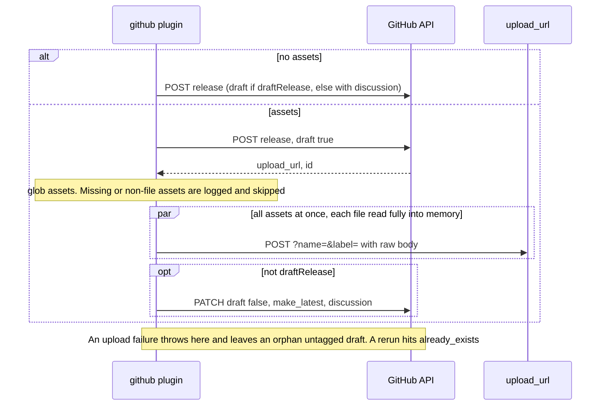
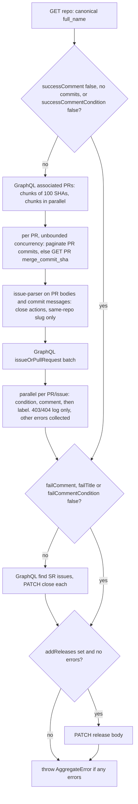

# Upstream @semantic-release/github: behaviour reference

Scope: how the upstream GitHub plugin behaves (options, API calls, step logic, side effects, tests, known bugs). Source: `semantic-release/github` master @ `a32b856` (2026-10-04).

~1.5k LOC in `lib/`, 13k LOC of tests (ava + `fetch-mock` + sinon). Deps: `@octokit/core` 7 + `plugin-paginate-rest` + `plugin-retry` + `plugin-throttling`, `undici` 7, `issue-parser`, `tinyglobby` + `dir-glob`, `mime`, `lodash-es` (`template`). Steps: `verifyConditions`, `publish`, `addChannel`, `success`, `fail`.

## 1. Features

| Feature | File |
| --- | --- |
| Steps share one module-global `verified` flag. If `verifyConditions` did not run, every other step runs verify lazily | `index.js:12,58-104` |
| verifyConditions borrows `assets`/`successComment`/`failComment`/`failTitle`/`labels`/`assignees`/`discussionCategoryName` from the `publish` entry to validate early | `index.js:21-48` |
| Option validation collects every error (AggregateError of `SemanticReleaseError`) | `lib/verify.js:21-47,82-92` |
| Token, repo existence and push-permission check, with a GitHub Actions and GitHub App installation bypass | `lib/verify.js:104-155` |
| Repo-rename detection: `repositoryUrl` vs `clone_url`, compared case-insensitively | `lib/verify.js:113-121` |
| `repositoryUrl` parsing (https, ssh `git@host:o/r`, shorthand) | `lib/parse-github-url.js` |
| Release with templated name and body, `prerelease` and `make_latest` | `lib/publish.js:51-60` |
| Draft-then-publish when assets are present (create draft, upload, PATCH `draft:false`) | `lib/publish.js:97-191` |
| `draftRelease`: the release stays a draft | `lib/publish.js:64-75,164-167` |
| Release discussion (`discussion_category_name`), not for drafts | `lib/publish.js:78-80,177-179` |
| Asset `name`/`label` are lodash templates. Content type from `mime`, fallback `text/plain` | `lib/publish.js:132-150` |
| Missing or non-file assets only log an error and are skipped (not fatal) | `lib/publish.js:114-130` |
| `isPrerelease` (branch type, `main`, `prerelease` flag) and `isLatestRelease` (the string `"true"`/`"false"`) | `lib/is-prerelease.js`, `lib/is-latest-release.js` |
| Comment-guard templates `successCommentCondition`/`failCommentCondition` (lodash template, truthy string) | `lib/success.js:195-202`, `lib/fail.js:67-74` |
| Fail issue marker `<!-- semantic-release:github -->` | `lib/fail.js`, `lib/find-sr-issues.js` |
| Default comment bodies | `lib/get-success-comment.js`, `lib/get-fail-comment.js` |
| `addReleases` links | `lib/get-release-links.js` |
| Octokit with paginate, retry, throttle. Proxy via undici `ProxyAgent` plus legacy `http(s)-proxy-agent` | `lib/octokit.js` |
| Error catalogue (code, message, markdown details) | `lib/definitions/errors.js` |

## 2. Options and env vars

Resolved in `lib/resolve-config.js`. Options win over env vars.

| Option | Env fallback | Default | Validation / notes |
| --- | --- | --- | --- |
| (token) | `GH_TOKEN` \|\| `GITHUB_TOKEN` | – | Required (`ENOGHTOKEN`) |
| `githubUrl` | `GH_URL` \|\| `GITHUB_URL` | – (api.github.com) | GHE server root. Also passed to `issue-parser` `hosts` |
| `githubApiPathPrefix` | `GH_PREFIX` \|\| `GITHUB_PREFIX` | `""` | Joined to `githubUrl`, e.g. `/api/v3` |
| `githubApiUrl` | `GITHUB_API_URL` | – | Overrides url + prefix. GH Actions always sets it |
| `proxy` | `http_proxy` \|\| `HTTP_PROXY` | `false` | String URL or `{host, port, headers?, secureProxy?}`. No `HTTPS_PROXY`/`NO_PROXY` |
| `assets` | – | – | `Array<glob \| glob[] \| {path, name?, label?}>`. A scalar is cast to an array |
| `successComment` | – | built-in | Non-empty string or `false` (deprecated, use the condition) |
| `successCommentCondition` | – | – | Lodash template. `false` skips comments |
| `failTitle` | – | `The automated release is failing 🚨` | `false` is deprecated |
| `failComment` | – | built-in | `false` is deprecated |
| `failCommentCondition` | – | – | Template with `issue` = the existing SR issue or `undefined` |
| `labels` | – | `["semantic-release"]` | For the fail issue. `false` = none (`semantic-release` is still always added) |
| `assignees` | – | – | For the fail issue |
| `releasedLabels` | – | `["released<%= nextRelease.channel ?` on @${channel}`: "" %>"]` | Templated. `false` = none. Tied to the success-comment gate |
| `addReleases` | – | `false` | `false\|"top"\|"bottom"` |
| `draftRelease` | – | `false` | bool |
| `releaseNameTemplate` | – | `<%= nextRelease.name %>` | |
| `releaseBodyTemplate` | – | `<%= nextRelease.notes %>` | |
| `discussionCategoryName` | – | `false` | |
| – | `GITHUB_ACTION` | – | When set, verify skips the `permissions.push` check |

## 3. Per-step behaviour

| Step | Flow |
| --- | --- |
| verifyConditions | validate options → parse URL → (if token and proxy valid) GET repo → rename check → if not `GITHUB_ACTION` and not `permissions.push`, HEAD `/installation/repositories` (success = App token, OK) → 401 → `EINVALIDGHTOKEN`, 404 → `EMISSINGREPO`, other errors rethrown |
| addChannel | GET release by tag → PATCH `{name, prerelease, tag_name}`. On 404, POST a new release with `body: notes`. No `make_latest`, body not updated |
| fail | GET repo → GraphQL find SR issue (first 100 open, label filter, marker in body) → evaluate condition → comment on the existing issue, or POST a new issue |

**publish** returns `{url, name:"GitHub release", id, discussion_url}`:

**success** (`releasedLabels` are added only after the comment succeeds):

### API calls (exhaustive)

| # | Call | Purpose | Step | File |
| --- | --- | --- | --- | --- |
| 1 | `GET /repos/{o}/{r}` | auth, existence, `permissions.push`, `clone_url` rename check | verify | `verify.js:111` |
| 2 | `HEAD /installation/repositories?per_page=1` | detect App installation token | verify | `verify.js:134` |
| 3 | `POST /repos/{o}/{r}/releases` | create the release (draft when assets or `draftRelease`) | publish, addChannel | `publish.js:69,85,100`, `add-channel.js:56` |
| 4 | `POST {upload_url}` (uploads.github.com, `?name=&label=`) | upload asset (raw body, `content-type`) | publish | `publish.js:153` |
| 5 | `PATCH /repos/{o}/{r}/releases/{id}` | un-draft + `make_latest` + discussion | publish | `publish.js:179` |
| 6 | `GET /repos/{o}/{r}/releases/tags/{tag}` | find the release for the channel | addChannel | `add-channel.js:45` |
| 7 | `PATCH /repos/{o}/{r}/releases/{id}` | set `prerelease`/`name` | addChannel | `add-channel.js:72` |
| 8 | `GET /repos/{o}/{r}` | resolve the renamed `full_name` | success, fail | `success.js:52`, `fail.js:51` |
| 9 | GraphQL `getAssociatedPRs`: up to 100 aliased `commit<sha12>: object(oid:) { ...on Commit { associatedPullRequests(first:100) } }` | SHA → PRs | success | `success.js:81,454` |
| 10 | GraphQL `getCommitAssociatedPRs(sha, cursor)` | page > 100 PRs per commit (broken, see bugs) | success | `success.js:96,496` |
| 11 | `GET /repos/{o}/{r}/pulls/{n}/commits` (paginated) | confirm the PR contains a released SHA | success | `success.js:121` |
| 12 | `GET /repos/{o}/{r}/pulls/{n}` | fallback: `merge_commit_sha` is in the release (squash/rebase) | success | `success.js:132` |
| 13 | GraphQL `getRelatedIssues`: up to 100 aliased `issue<N>: issueOrPullRequest(number:)` | hydrate keyword-closed issues/PRs | success | `success.js:176,416` |
| 14 | `POST /repos/{o}/{r}/issues/{n}/comments` | success comment, or fail comment on the existing issue | success, fail | `success.js:213`, `fail.js:76` |
| 15 | `POST /repos/{o}/{r}/issues/{n}/labels` | released labels | success | `success.js:227` |
| 16 | GraphQL `getSRIssues`: `issues(first:100, states:OPEN, filterBy:{labels})` | find the fail issue (replaced `GET /search/issues` in v12) | success, fail | `find-sr-issues.js:11` |
| 17 | `PATCH /repos/{o}/{r}/issues/{n}` `state:closed` | close the fail issue | success | `success.js:291` |
| 18 | `PATCH /repos/{o}/{r}/releases/{id}` `body` | `addReleases` | success | `success.js:317` |
| 19 | `POST /repos/{o}/{r}/issues` | create the fail issue | fail | `fail.js:93` |

PR/issue discovery:

- PR nodes are mapped into REST-issue-shaped objects (`pull_request: true`, `user`, `labels`, `merged_at`…) so the `issue` passed to templates stays compatible (`success.js:534-607`).
- GraphQL field sets are hard-coded; a field missing on GHE (`canBeRebased`) broke users ([#910](https://github.com/semantic-release/github/issues/910)).
- The commit alias uses only the first 12 SHA characters (collision theoretically possible).

### Rate limiting and retry

`lib/octokit.js`, `definitions/{retry,throttle}.js`:

- `plugin-throttling` with default limits (concurrency 1 for writes, a delay between content-creating POSTs).
- `onRateLimit` and `onSecondaryRateLimit` both retry while `retryCount <= 3`.
- `plugin-retry`: `retries:3`, `doNotRetry:[400,401,403,422]`. 404 is retried on purpose (replication lag).
- A new Octokit is built per step, so throttle state is not shared between steps.

### Asset globbing (`lib/glob-assets.js`)

- Each entry is cast to an array, then `dir-glob` expands directories. A lone `!pattern` is skipped.
- tinyglobby runs with `{dot:true, onlyFiles:false}`.
- An object entry matching more than one file is split into one entry per file with `name` = basename (the custom `name` is lost).
- No match → the original pattern is kept and later logged as missing.
- Object entries sorted first, then deduplicated by resolved path.
- `path` is not templated; only `name` and `label` are ([#363](https://github.com/semantic-release/github/issues/363)).

## 4. Side effects

| Side effect | Step | Notes |
| --- | --- | --- |
| GitHub release created or updated (draft, prerelease, `make_latest`, discussion) | publish, addChannel | Orphan draft on failed upload |
| Release assets uploaded | publish | No overwrite or delete of an existing asset |
| Comments on PRs and issues | success | Can be hundreds of POSTs, trips secondary rate limits |
| Labels added to PRs and issues (auto-created by GitHub if missing) | success | |
| Fail issue opened or commented | fail | Marker comment plus `semantic-release` label |
| Fail issue closed | success | |
| Release body rewritten | success (`addReleases`) | |
| Tag created | publish | Only indirectly: `POST releases` with `tag_name` + `target_commitish` creates the tag if core did not push it |

## 5. Test suite

Tests inject `TestOctokit` (baseUrl `https://api.github.local`, `request.fetch = fetchMock.sandbox()`), a sinon logger stub, fixtures in `test/fixtures/files`.

| File (tests) | Covers |
| --- | --- |
| `verify.test.js` (69) | 401, 404, missing permissions with HEAD installation fallback, env permutations, AggregateError contents |
| `publish.test.js` (17) | release creation, `upload_url` `{?name,label}`, content-type, body bytes |
| `add-channel.test.js` (9) | update, 404 → POST |
| `success.test.js` (29, 4.3k LOC) | GraphQL `getAssociatedPRs` / `getRelatedIssues` / `getSRIssues`, comments, labels, call counts |
| `fail.test.js` (11), `find-sr-issue.test.js` (4) | fail issue find/create/comment |
| `integration.test.js` (16) | full step pipeline |
| `glob-assets.test.js` (19) | globbing on a fixture dir, no HTTP |
| `get-*-comment`, `get-release-links`, `is-prerelease`, `is-latest-release` | pure string/table tests |
| `to-octokit-options.test.js` (12), `octokit-proxy-integration.test.js` (2) | Node/undici specific (content-length, dispatcher) |

Retry and throttle are untested upstream (the Octokit plugins are mocked out in `TestOctokit`).

## 6. Known bugs

- `success.js:98` references an undefined `response.commit.oid`: a commit with > 100 associated PRs throws `ReferenceError`. The "multipaged" test misses it (`overwriteRoutes:true` replaces the first GraphQL mock).
- An empty `commits` array logs the `successComment:false` deprecation warning.
- The proxy object form is passed as `ProxyAgent({uri: <object>})`; undici expects a string (likely broken, unverified).
- Upload failure leaves an orphan draft; rerun fails with `already_exists` ([#295](https://github.com/semantic-release/github/issues/295), [#995](https://github.com/semantic-release/github/issues/995)).
- Comment fan-out trips secondary rate limits ([#867](https://github.com/semantic-release/github/issues/867)).
- Throttle state not shared across steps ([#640](https://github.com/semantic-release/github/pull/640)).
- GraphQL: empty SHA list builds an invalid query ([#871](https://github.com/semantic-release/github/issues/871)); 502 on large queries ([#1017](https://github.com/semantic-release/github/issues/1017)).
- `success` failure after a successful publish fails the run ([#738](https://github.com/semantic-release/github/issues/738)).
- Cross-repo/fork PRs → 404 ([#1092](https://github.com/semantic-release/github/issues/1092)).
- Proxy: no `HTTPS_PROXY`/`NO_PROXY` ([#696](https://github.com/semantic-release/github/issues/696), [#591](https://github.com/semantic-release/github/pull/591)).
- Repo URL case/rename mismatch (`EMISMATCHGITHUBURL`) ([#885](https://github.com/semantic-release/github/issues/885)).
- Wrong `prerelease`/`latest` flags on maintenance branches ([#817](https://github.com/semantic-release/github/issues/817)); addChannel never sets `make_latest`.
- Verify checks only push permission, not issues/PRs/contents ([#895](https://github.com/semantic-release/github/issues/895)).
- Fail issue creation rejected with 422 on labels ([#1065](https://github.com/semantic-release/github/issues/1065)).
- Release body over the 125k char limit fails ([#622](https://github.com/semantic-release/github/issues/622)).
- Locked issue makes the comment fail ([#221](https://github.com/semantic-release/github/issues/221)).
- Immutable releases unsupported ([#1082](https://github.com/semantic-release/github/issues/1082)).
- `releasedLabels` cannot be applied without comments ([#660](https://github.com/semantic-release/github/issues/660)).
- Condition templates are awkward (truthy string) ([#1029](https://github.com/semantic-release/github/issues/1029)).
