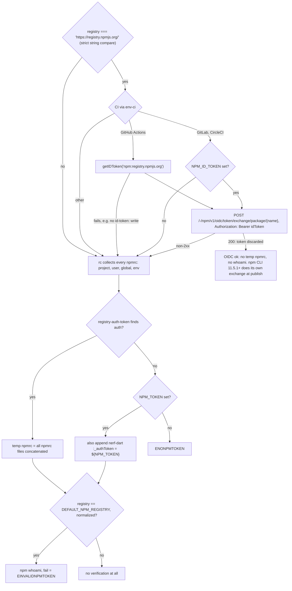
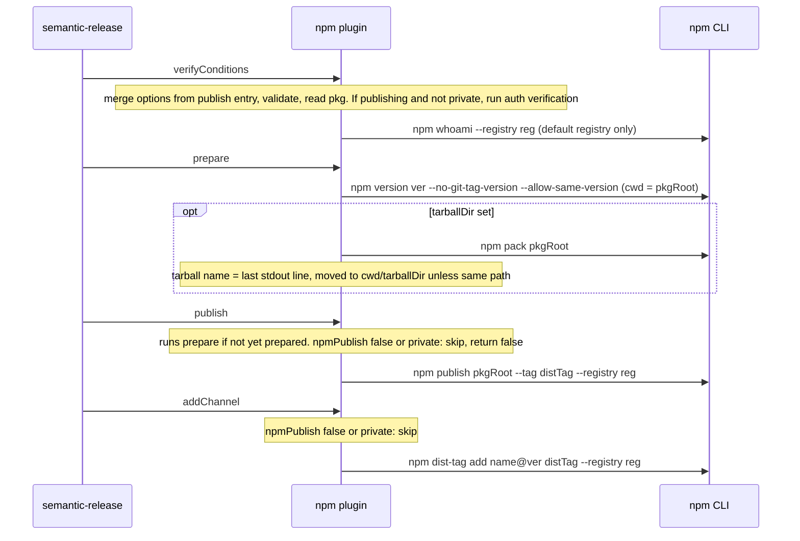

# Upstream @semantic-release/npm: behaviour reference

Scope: how the upstream npm plugin behaves (options, registry and auth resolution, per-step npm commands, side effects, tests, known bugs). Source: `semantic-release/npm` @ `ab4382f` (2026-10-05).

~400 LOC JS, ESM, Node `^22.14 || >=24.10`. Bundles `npm@^11.6.2` as a runtime dependency; every registry operation shells out to `npm` (`execa`, `preferLocal: true`). Steps: `verifyConditions`, `prepare`, `publish`, `addChannel` (no `success`/`fail`).

## 1. Features

| Feature | File |
| --- | --- |
| Inherit `npmPublish`/`tarballDir`/`pkgRoot` from the `publish` entry for `@semantic-release/npm` during verify | `index.js:15-24` |
| Option type validation (`npmPublish` bool, `tarballDir`/`pkgRoot` non-empty string) | `lib/verify-config.js` |
| Read `package.json` (from `pkgRoot`), require `name` | `lib/get-pkg.js` |
| Registry resolution | `lib/get-registry.js` |
| Temp `.npmrc` (merge all found npmrc files + `_authToken=${NPM_TOKEN}`) | `lib/set-npmrc-auth.js` |
| Auth verify: OIDC first, else token + `npm whoami` (official registry only) | `lib/verify-auth.js` |
| OIDC trusted publishing check for GitHub Actions / GitLab / CircleCI | `lib/trusted-publishing/*.js` |
| Version bump via `npm version`, optional tarball via `npm pack` | `lib/prepare.js` |
| Publish with dist-tag | `lib/publish.js` |
| Add version to dist-tag (channel promotion) | `lib/add-channel.js` |
| Channel → dist-tag mapping | `lib/get-channel.js` |
| Release info (name/url/channel) | `lib/get-release-info.js` |
| Skip publish when `npmPublish:false` or `pkg.private === true` (still bumps version) | `lib/publish.js`, `lib/add-channel.js` |
| Dead code: `attemptPublishDryRun` (auth check for custom registries, tests `skip`ped) | `lib/verify-auth.js:39-71` |
| Error catalog (`ENONPMTOKEN`, `EINVALIDNPMTOKEN`, `EINVALIDNPMAUTH`, `ENOPKG`, `ENOPKGNAME`, `EINVALID*`) | `lib/definitions/errors.js` |

## 2. Options and env vars

| Option | Type | Default | Notes |
| --- | --- | --- | --- |
| `npmPublish` | bool | `true` (effectively `false` if `pkg.private === true`) | false → bump only |
| `pkgRoot` | string | `.` (cwd) | dir with `package.json` to bump/pack/publish |
| `tarballDir` | string | unset (no tarball kept) | |

| Env var | Use |
| --- | --- |
| `NPM_TOKEN` | Written as literal `${NPM_TOKEN}` into the temp npmrc (npm expands it at run time; the secret never hits disk), only if no auth was found in npmrc |
| `NPM_CONFIG_REGISTRY` | Registry override (below `publishConfig.registry`) |
| `NPM_CONFIG_USERCONFIG` | User npmrc path used for `rc()` instead of `<cwd>/.npmrc` |
| `npm_config_*` | Read by `rc("npm")` and by the npm CLI (whole `context.env` passed to the child) |
| `DEFAULT_NPM_REGISTRY` | Undocumented; overrides the "official" registry for whoami/url decisions; stripped from the child env in verify |
| `NPM_ID_TOKEN` | OIDC ID token for GitLab / CircleCI (read from `process.env`, not `context.env`) |
| GHA `ACTIONS_ID_TOKEN_REQUEST_*` | Via `@actions/core.getIDToken("npm:registry.npmjs.org")`; needs `id-token: write` |

`package.json` `publishConfig`: `registry` (honoured by the plugin), `tag`, `provenance`, `access` (honoured by the npm CLI only).

**Registry resolution**: `publishConfig.registry` → `env.NPM_CONFIG_REGISTRY` → `@scope:registry` / `registry` from `rc("npm", {registry: OFFICIAL}, {config: USERCONFIG || <cwd>/.npmrc})` → `https://registry.npmjs.org/`. `.npmrc` is read from `cwd`, never from `pkgRoot`.

**Auth verification**. Every OIDC failure falls back to token auth silently (logged only):

The temp file is created by `tempy` at module load and never deleted. Every npm command gets `--userconfig <temp>`.

**Provenance** is not implemented by the plugin: the npm CLI emits it automatically under trusted publishing, or via `publishConfig.provenance` / `NPM_CONFIG_PROVENANCE=true`.

## 3. Per-step behaviour

Module-level state: `verified`, `prepared`, temp npmrc path. Each step re-reads `package.json`; if `verifyConditions` did not run, steps re-validate config + auth themselves. cwd is `context.cwd` unless noted.

**dist-tag mapping** (`get-channel.js`): no channel → `latest`; channel is a valid semver range (e.g. `1.x`) → `release-1.x`; else the channel verbatim.

**Return value** (`publish`/`addChannel`): `{ name: "npm package (@<tag> dist-tag)", url: "https://www.npmjs.com/package/<name>/v/<ver>" | undefined (non-default registry), channel: <tag> }`.

**Files written**: temp `.npmrc` (OS temp dir); `<pkgRoot>/package.json` plus `package-lock.json` / `npm-shrinkwrap.json` (by `npm version`, preserving indentation + CRLF); `<tarballDir>/<name>-<ver>.tgz`.

## 4. Side effects

- Lifecycle scripts run by npm: `preversion/version/postversion` (prepare), `prepack/prepare/postpack` (pack and publish), `prepublishOnly/publish/postpublish`.
- `npm version` in a workspace may run a full `npm install` / touch the root lockfile.
- The temp npmrc stays in the OS temp dir and contains concatenated user/global npmrc (may include plaintext tokens).
- Irreversible registry publish and dist-tag mutation; no rollback if later plugins fail.
- Network: OIDC exchange (token thrown away) + whoami.
- npm stdout/stderr piped into semantic-release streams.
- The bundled `npm` may shadow the user's npm (`preferLocal`).

## 5. Test suite

| Suite | Mechanism |
| --- | --- |
| `get-channel`, `verify-config`, `get-release-info`, `get-pkg` | Pure functions / temp dirs |
| `get-registry`, `set-npmrc-auth` | Temp dirs + fake `HOME`/`NPM_CONFIG_USERCONFIG` npmrc files; asserts temp npmrc content |
| `verify-auth` | `testdouble` ESM mocks of `execa`; asserts exact npm argv + env |
| `trusted-publishing/*` | Stubs `env-ci`, `@actions/core`, global `fetch` |
| `prepare` | Real npm CLI (no registry): package.json/lockfile/shrinkwrap bump, CRLF + indent preservation, tarball move |
| `integration` (excluded from default `ava`) | Docker `verdaccio/verdaccio:6` on :4873 via dockerode, config `test/helpers/config.yaml` (publish: `$authenticated`); user via `PUT /-/user/org.couchdb.user:<u>`, token via `POST /-/npm/v1/tokens`; full verify/prepare/publish/addChannel, then `npm view` to assert |

Two tests are `skip`ped (custom-registry dry-run auth check). The OIDC path has no integration test.

## 6. Known bugs

- Strict registry string compare: no trailing slash silently disables OIDC ([#1066](https://github.com/semantic-release/npm/issues/1066)).
- OIDC tokens cannot set dist-tags, so `addChannel` 401s on the first maintenance release ([#1023](https://github.com/semantic-release/npm/issues/1023), [npm/cli#8547](https://github.com/npm/cli/issues/8547)).
- Exchanged OIDC token is discarded; npm CLI exchanges again at publish.
- Temp npmrc never deleted, may contain plaintext tokens.
- npmrc merge drifted from npm's own semantics ([#790](https://github.com/semantic-release/npm/issues/790)).
- `tarballDir: false` documented but rejected by the validator ([#302](https://github.com/semantic-release/npm/issues/302)).
- `"private": "true"` (string) ignored ([#369](https://github.com/semantic-release/npm/issues/369)).
- `prepack` runs twice with `tarballDir` ([#535](https://github.com/semantic-release/npm/issues/535)).
- `npm version` triggers install / touches root lockfile in workspaces ([#1068](https://github.com/semantic-release/npm/issues/1068)).
- `npm publish <folder>` publishes cwd under `-w` ([#504](https://github.com/semantic-release/npm/issues/504)).
- `workspaces=true` breaks `whoami` (`ENOWORKSPACES`) ([#470](https://github.com/semantic-release/npm/issues/470)).
- No auth verification at all for non-default registries; `NPM_TOKEN` required even with ambient auth ([#324](https://github.com/semantic-release/npm/issues/324)).
- 403 on publish treated as success ([#269](https://github.com/semantic-release/npm/issues/269)).
- Republish over an existing version not detected ([#518](https://github.com/semantic-release/npm/issues/518)).
- Package stays published when a later step fails ([#275](https://github.com/semantic-release/npm/issues/275)).
- Module-global `verified`/`prepared` state breaks multiple plugin instances ([#69](https://github.com/semantic-release/npm/issues/69)).
- Bundled npm overrides the user's npm version ([#1026](https://github.com/semantic-release/npm/issues/1026)).
- Malformed path in prepare ([#773](https://github.com/semantic-release/npm/issues/773)).
- 2FA auth-and-writes (OTP) unsupported ([#93](https://github.com/semantic-release/npm/issues/93)); 2FA not detected in verify ([#11](https://github.com/semantic-release/npm/issues/11)).
- Package write permission not checked in verify; granular tokens 403 later ([#4](https://github.com/semantic-release/npm/issues/4)).
