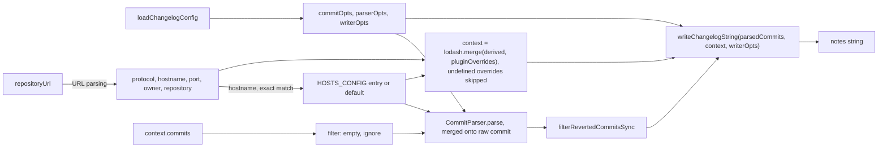

# Upstream release-notes-generator: implementation reference

Scope: how `@semantic-release/release-notes-generator` (the `generateNotes` step) actually behaves in code. Source: `semantic-release/release-notes-generator` master @ `9b15394` (2026-09-21), diffed against `beta`; ~190 LOC in `index.js`, `lib/hosts-config.js`, `lib/load-changelog-config.js`, `wrappers/conventional-changelog-writer.js`. Step contract and notes concatenation: [SEMANTIC-RELEASE-SPEC.md](SEMANTIC-RELEASE-SPEC.md).

## Source map

| Feature | File |
|---|---|
| Single step `generateNotes(pluginConfig, context) -> Promise<string>` | `index.js:29` |
| Preset by short name (`conventional-changelog-<preset>`), plugin dir first, then `cwd` | `lib/load-changelog-config.js:24-28` |
| Custom preset package via `config` | `lib/load-changelog-config.js:29-30` |
| Default preset angular (conventionalcommits on branch `feat/default-preset`) | `lib/load-changelog-config.js:32` |
| `presetConfig` passed to the preset factory | `lib/load-changelog-config.js:28` |
| Shallow override of preset parser/writer opts by `parserOpts`/`writerOpts` | `lib/load-changelog-config.js:35-39` |
| Hand-rolled repo URL parsing (scp-like, ssh, git+http(s), http(s)) | `index.js:31-40` |
| Per-host link keywords and reference parsing, exact hostname match | `lib/hosts-config.js` |
| Skips empty-message commits | `index.js:48-51` |
| Preset `commits.ignore` regex filter | `index.js:53-56` |
| Removes revert pairs (`filterRevertedCommitsSync`) | `index.js:45` |
| Compare link between previous and current tag (gitHead fallback) | `index.js:65-76` |
| `package.json` (read upward from cwd) exposed as `packageData` | `index.js:79` |
| Rendering by `conventional-changelog-writer.writeChangelogString` (wrapper exists only for test mocking) | `wrappers/conventional-changelog-writer.js` |

## Options

| Option | Default | Behaviour |
|---|---|---|
| `preset` | angular (when neither preset nor config set) | lowercased; wins over `config` |
| `config` | – | npm package name; factory called with no args |
| `presetConfig` | `undefined` | needed by conventionalcommits (`types`, `issuePrefixes`, `*UrlFormat`, `ignoreCommits`) |
| `parserOpts` | – | shallow spread over `preset.parser` and over host `referenceActions`/`issuePrefixes` |
| `writerOpts` | – | shallow spread over `preset.writer` |
| `host` | derived from `repositoryUrl` | full origin, e.g. `http://my-host:90` |
| `linkCompare` | `previousTag` (truthy) | README says `true`; actually false when there is no previous release |
| `linkReferences` | `undefined` → writer default | |
| `commit` | host table: `commit` (`commits` on bitbucket.org) | URL path keyword |
| `issue` | host table: `issues` (`issue` on bitbucket.org) | URL path keyword |

The code always loads angular as the base; the README claim that only `parserOpts`/`writerOpts` apply without preset/config is wrong.

## Algorithm and data flow

Ignore filter quirk: `commitOpts.ignore` applies only when `!commitOpts.merges`.

### URL parsing (`index.js:31-40`)
1. Strip a trailing `.git` (case-insensitive).
2. No `://` and matches `[auth@]host:path` (scp-like) → rewrite to `ssh://[auth@]host/path`.
3. Parse with WHATWG `new URL`.
4. Drop the port when the protocol contains `ssh`.
5. Protocol matching `/http[^s]/` (`http:`, `git+http:`) → `http`; everything else (ssh, git, file, codecommit) → `https`.
6. Path regex `^/(owner)?/?(repository)?$`: first segment is owner, the rest is repository (`grp/sub/r` → owner `grp`, repo `sub/r`).
7. `host = url.format({protocol, hostname, port})`; credentials dropped.

| Input | host / owner / repository |
|---|---|
| `git@gitlab.com:grp/sub/r.git` | `https://gitlab.com` / `grp` / `sub/r` |
| `git+ssh://git@h.com:2222/o/r.git` | `https://h.com` / `o` / `r` (ssh port dropped) |
| `http://h.com:90/o/r` | `http://h.com:90` / `o` / `r` |
| `http://bb.corp/scm/PROJ/repo.git` | `http://bb.corp` / **`scm`** / **`PROJ/repo`** (bug) |
| `codecommit::eu-central-1://profile@repo` | `https:` / – / – (references not linked) |
| `file:///tmp/repo` | `https:` / `tmp` / `repo` (garbage) |

### Host table (`lib/hosts-config.js`)

| host | issue | commit | referenceActions | issuePrefixes |
|---|---|---|---|---|
| github.com | issues | commit | close(s/d), fix(es/ed), resolve(s/d) | `#`, `gh-` |
| bitbucket.org | issue | commits | + closing/fixing/resolving | `#` |
| gitlab.com | issues | commit | close*, fix* (no resolve) | `#` |
| default (anything else, incl. self-hosted) | issues | commit | all 12 | `#`, `gh-` |

Parser option precedence, lowest first: host table, `preset.parser`, `parserOpts` (`new CommitParser({referenceActions, issuePrefixes, ...parserOpts})`). Presets therefore usually override host prefixes.

### Writer context (verified by `test/integration.test.js:39-108`)

| Field | Value |
|---|---|
| `version` | `nextRelease.version` |
| `host`, `owner`, `repository` | from URL parsing; `host` overridable by option |
| `previousTag` | `lastRelease.gitTag \|\| lastRelease.gitHead` |
| `currentTag` | `nextRelease.gitTag \|\| nextRelease.gitHead` |
| `linkCompare` | option, else `previousTag` (truthy) |
| `issue`, `commit` | option, else host table |
| `linkReferences` | option, else `undefined` |
| `packageData` | raw `package.json`, not normalized |

`repoUrl`, `date`, `title` and `isPatch` are not set here; the writer fills them from its defaults and the preset's `finalizeContext`.

### Writer interface
Only `writeChangelogString(commits, context, options) -> Promise<string>`, options = preset writer + `writerOpts` (writer 8: Handlebars `mainTemplate` + partials). `transform` must return a new object since writer v8. Templates build URLs from `@root.host/owner/repository/{commit}/{hash}` or the conventionalcommits `*UrlFormat` options. Beta pins writer@9 and parser@7, bundles conventionalcommits@10 and drops other presets.

## Side effects

- File reads: `readPackageUp({cwd, normalize:false})`; dynamic `import()` of preset modules from the plugin dir and `cwd`.
- `debug("semantic-release:release-notes-generator")`; `debug("host", changelogContext.hostname)` always logs `undefined` (`index.js:85`).
- No network, no writes, no git calls. Commits arrive pre-fetched in `context.commits`.
- Errors: `MODULE_NOT_FOUND` for a missing preset or config module.

## Tests

| Test file | Portable |
|---|---|
| `test/integration.test.js`: ~30 cases feeding `{hash, message}` commits with a `repositoryUrl`, asserting regex substrings (compare link, section headers, commit/issue links) | yes, as golden snapshots: URL matrix (http+port, scp, scp without user, git+http, `.git`, git+https, git+ssh+port, bitbucket, gitlab, codecommit, `host`/`commit`/`issue`/`linkCompare`/`linkReferences` overrides), revert exclusion, empty messages, malformed commits |
| Context-shape tests (`writerDouble` via testdouble) | yes, as unit tests on the context builder |
| `test/load-changelog-config.test.js`: preset/config loading × 7 presets, override merging, missing module → `MODULE_NOT_FOUND`, `transform.toString()` comparison | merge-precedence tests only |

Upstream assertions are substring regexes, not full golden files.

## Known upstream bugs

- SSH port leaks into the https web URL: [#151](https://github.com/semantic-release/release-notes-generator/issues/151)
- Bitbucket Server `/scm/` path parsed as owner: [#862](https://github.com/semantic-release/release-notes-generator/issues/862), [#990](https://github.com/semantic-release/release-notes-generator/issues/990)
- Bitbucket Server links wrong: [#491](https://github.com/semantic-release/release-notes-generator/issues/491); Bitbucket compare link wrong: [#131](https://github.com/semantic-release/release-notes-generator/issues/131)
- GitLab `/-/` URL prefix missing: [#449](https://github.com/semantic-release/release-notes-generator/issues/449)
- Self-hosted GitLab gets no issue links (exact hostname match): [#584](https://github.com/semantic-release/release-notes-generator/issues/584)
- `.git` over-trimmed from repo names: [#111](https://github.com/semantic-release/release-notes-generator/issues/111)
- CodeCommit URL crashed the parser: [#182](https://github.com/semantic-release/release-notes-generator/issues/182)
- Plain issue mentions rendered as "closes": [#201](https://github.com/semantic-release/release-notes-generator/issues/201)
- URLs and `diffhunk://#` in bodies parsed as references: [#788](https://github.com/semantic-release/release-notes-generator/issues/788), [#1025](https://github.com/semantic-release/release-notes-generator/issues/1025)
- Cross-project references mislinked: [#751](https://github.com/semantic-release/release-notes-generator/issues/751)
- Silent abort on large initial releases: [#459](https://github.com/semantic-release/release-notes-generator/issues/459)
- `[skip release]` commits still appear in notes: [#531](https://github.com/semantic-release/release-notes-generator/issues/531)
- Heading uses the version, not the `tagFormat` tag: [#179](https://github.com/semantic-release/release-notes-generator/issues/179)
- Writer v8 `transform` mutating input breaks ("Cannot modify immutable object"): [#658](https://github.com/semantic-release/release-notes-generator/issues/658), [#685](https://github.com/semantic-release/release-notes-generator/issues/685)
- Host parser options were always overwritten (fixed): [#62](https://github.com/semantic-release/release-notes-generator/issues/62)
- Preset/writer/parser major-version skew yields broken or empty notes: [#633](https://github.com/semantic-release/release-notes-generator/issues/633), [#992](https://github.com/semantic-release/release-notes-generator/issues/992)
