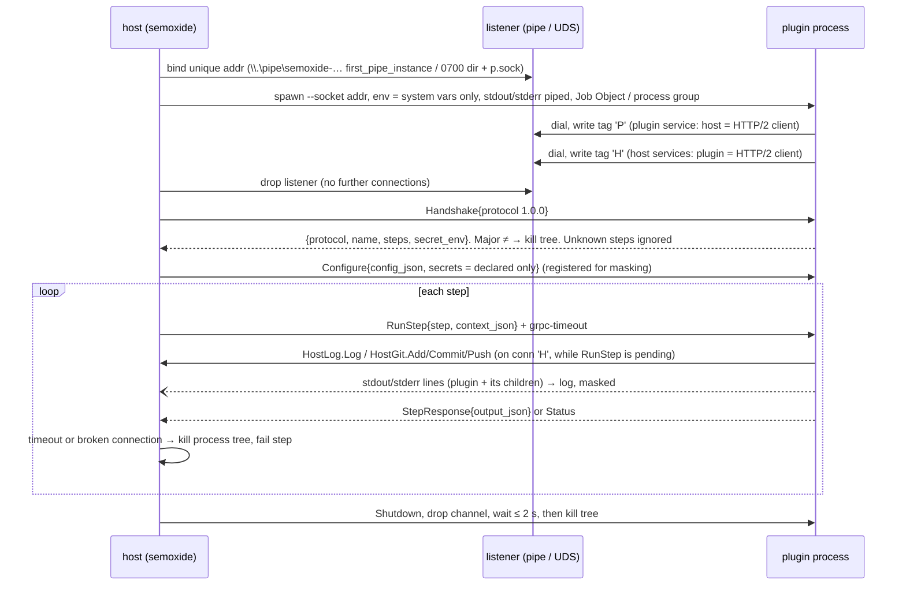

# PoC: gRPC plugins over a native local socket (throwaway)

Tests [ADR 0010](../../docs/decisions/0010-plugin-architecture.md). Supersedes [plugin-protocol](../plugin-protocol/README.md). tonic 0.14 + prost 0.14, protox (no `protoc` needed), rustc 1.99.

| Member | Planned repo | What |
|---|---|---|
| `proto/` | semoxide-plugin-protocol | `plugin.proto` (the spec) + generated code |
| `sdk/` | semoxide-plugin-protocol | `transport.rs` (pipe/UDS ↔ tonic), `plugin.rs` (`Plugin`, `Host`, `PluginEnv`), `serve.rs` (plugin side), `launcher.rs` + `proctree.rs` (feature `host`: spawn, Job Object / process group, client) |
| `host/` | semoxide | `HostServices` (Log + masking, stub Git with the release-tag rule), `LoadedPlugin` (process or in-process), tests, `bench` |
| `plugin-demo/` | semoxide-plugin-demo | lib `DemoPlugin` + bin; `mode` config selects misbehaviour |
| `conformance/` | semoxide-plugin-protocol | `semoxide-plugin-conformance <plugin-binary>`: 9 checks |

Run: `cargo test` (13 tests), `cargo run --release -p semoxide-host --bin bench -- 50`, `cargo run -p semoxide-plugin-conformance -- target/debug/semoxide-plugin-demo`.

## Flow as implemented

## Results

| Requirement | Windows 11 | Linux (Docker `rust:1`) |
|---|---|---|
| gRPC over native socket (named pipe / UDS) | ✅ custom connector + `Connected` wrapper | ✅ same code, `UnixStream` |
| Host creates socket, passes `--socket`, one process per run | ✅ | ✅ |
| Kill whole tree on timeout (grandchild checked) | ✅ Job Object, `TerminateJobObject` | ✅ `killpg(SIGKILL)` |
| Kill whole tree on crash (`exit 3`, grandchild checked) | ✅ | ✅ |
| stdout/stderr captured as logs, protocol unaffected (250 noise lines from plugin + child) | ✅ | ✅ |
| Handshake: major must match, newer minor OK, unknown step value / unknown fields ignored | ✅ | ✅ |
| Handshake declares steps + secret env | ✅ | ✅ |
| Host services `Log` + `Git` called during a pending step | ✅ second connection | ✅ |
| Git rule (only `refs/tags/<release tag>`, never move) | ✅ `PERMISSION_DENIED`, plugin keeps working | ✅ |
| Env: system vars + declared secrets only | ⚠️ see secrets below | ⚠️ same |
| Children run with the filtered env | ✅ `npm` (→ `npm.CMD`) 11.4.2, `python` 3.13.5 | ✅ `python3`, `git` |
| Secret masking (host Log and stderr) | ✅ out-of-process; ❌ in-process stderr is raw | same |
| Per-step gRPC deadline, kill + fail on expiry | ✅ | ✅ |
| `describe` → JSON Schema (schemars) | ✅ | ✅ |
| In-process path, same `Plugin` trait | ✅ (timeout only drops the future) | ✅ |
| Conformance binary against demo (+ wrong-major negative) | ✅ 9/9 | ✅ 9/9 |

## Measurements

Release, median of 50 runs (20 calls each), p90 in brackets. Windows: desktop, Defender on. Linux: 1-vCPU / 1 GB VPS, inside Docker.

| | Windows | Linux |
|---|---|---|
| spawn + connect (2 conns) + handshake + configure | **9.0 ms** (9.4) | **5.6 ms** (6.1) |
| step call round trip, no-op | 0.091 ms (0.124) | 0.305 ms (0.365) |
| plugin → host `Log` round trip | 0.081 ms (0.095) | 0.236 ms (0.264) |
| shutdown (RPC + exit + reap) | 2.7 ms | 1.8 ms |
| in-process call | 0.003 ms | 0.001 ms |

The old stdio/JSON PoC measured 5.1 ms spawn and 0.036 ms per call on Windows. gRPC adds about 4 ms per plugin per run and about 0.05 ms per call, which is negligible.

## Named-pipe connector findings

- **Client (host → plugin service):** `Endpoint::connect_with_connector(service_fn(..))` returns the already-accepted stream once, wrapped in `hyper_util::rt::TokioIo`. The URI is a dummy. A reconnect fails, which is what we want.
- **Server:** tonic implements `Connected` for `UnixStream` but not for named pipes. A 30-line `Io<T>` wrapper implements it. `serve_with_incoming_shutdown(once(io).chain(pending()))` is needed because tonic stops the server when the incoming stream ends. `Io` signals on drop, so the plugin exits when the host's connection goes away.
- **HTTP/2 roles do not depend on who accepts.** The host listens, the plugin dials both connections, and a 1-byte tag (`P`/`H`) routes them. This avoids a second address and an accept-order assumption. It works the same on both OSes.
- **Named-pipe instances:** each instance serves one client, so the host creates the next one after every `connect()`. The plugin's second dial hits `ERROR_PIPE_BUSY` in that gap. Retrying with `sleep(1ms)` costs about 15 ms (Windows timer granularity: 24 ms vs 9 ms spawn). `WaitNamedPipeW` fixes it.
- `first_pipe_instance(true)` blocks name squatting, and `reject_remote_clients(true)` is set. The `interprocess` crate was not needed: tokio's `named_pipe` plus `UnixListener` were enough.
- **Deadlines:** tonic's `Request::set_timeout` sends `grpc-timeout` (the plugin received it: `deadline_ms`). The tonic `Channel` also enforces it on the client side, reporting **`CANCELLED "Timeout expired"`**, not `DEADLINE_EXCEEDED`. The host maps both, and wraps the call in `tokio::time::timeout` as well.

## Issues needing an ADR decision

1. **Secrets declared in the handshake arrive after spawn.** The process env is fixed by then. The PoC delivers declared secrets in `Configure` (over the socket) and exposes them through `PluginEnv` / `PluginEnv::command()`. `std::env::var("GH_TOKEN")` in the plugin sees nothing (`set_var` is `unsafe` in edition 2024 once threads exist). Options: (a) keep channel delivery (PoC), (b) a manifest read before spawn (release asset, or `--manifest` invocation, cached by checksum), (c) spawn twice.
2. **Job Object race (Windows):** the job is assigned after spawn, so a grandchild spawned within the first microseconds could escape. Fixing it needs `CREATE_SUSPENDED` + `ResumeThread` (std hides the thread handle; needs a raw `CreateProcessW`) or `PROC_THREAD_ATTRIBUTE_JOB_LIST` (`CommandExt::raw_attribute` is still unstable in 1.99, verified).
3. **Unix: host death does not kill plugins.** A job closes on host exit; a process group does not. Decide between `PR_SET_PDEATHSIG` (Linux only) and the SDK exiting on connection drop (implemented). A descendant that calls `setsid()` also escapes `killpg`.
4. **In-process plugins:** they cannot be killed on timeout (the future is only dropped, and spawned children survive). Their stdout/stderr is not captured or masked: the demo's `eprintln!` of the token printed raw in the in-process test. Should the SDK forbid printing, or route children through `Host`?
5. **Program resolution on Windows:** std `Command::new("npm")` does not find `npm.cmd`. The SDK's `PluginEnv::command` resolves via `PATHEXT`. Should this be SDK policy for every plugin language? (`.cmd` also brings the BatBadBut arg-escaping rules.)
6. **Socket access control:** the tag byte is not authentication. Another process of the same user could connect in the window before the plugin does. Options: a per-run nonce passed via env/arg and checked with the tag, or a pipe DACL restricted to the current user.
7. **Payload typing:** `context_json` and `output_json` are JSON strings inside protobuf (PoC shortcut). Decide whether to define typed messages per step (better for non-Rust SDKs and evolution rules) before v1.
8. **Host-side launcher location:** the conformance kit needs the same spawn/kill/connect code as semoxide. In this PoC it lives in the SDK behind feature `host`. Confirm that it belongs in the protocol repo.
