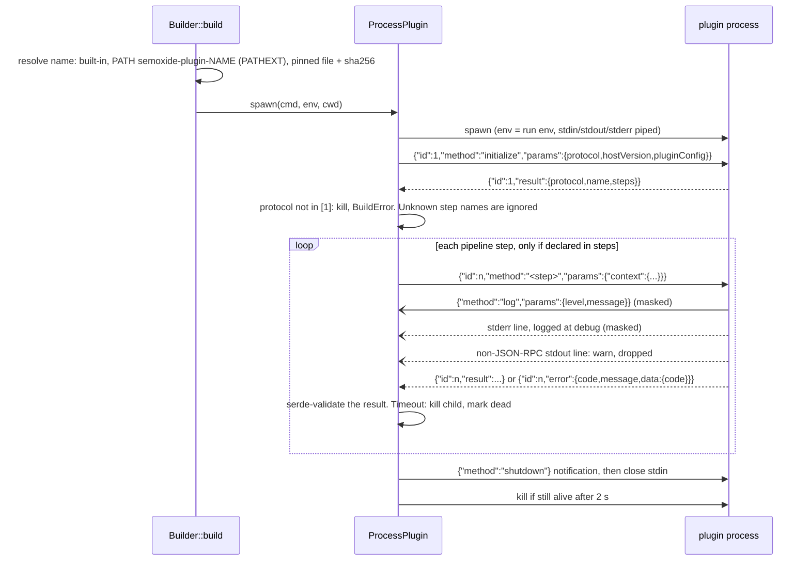

# PoC: plugin protocol (throwaway)

Tests the hybrid from [plugin-mechanisms](../../docs/research/plugin-mechanisms.md#recommendation-e-hybrid): one async `Plugin` trait, built-ins compiled in, and `ProcessPlugin` speaking JSON-RPC 2.0 over stdio. Windows 11, rustc 1.99 MSVC.

| Path | What |
|---|---|
| `host/` | lib: `Plugin` trait + `Context` + `Logger`/`Masker` (`plugin.rs`), wire types (`protocol.rs`), `ProcessPlugin` (`process.rs`), resolution (`resolve.rs`), built-in `conventional` (`builtin.rs`), builder + mini pipeline (`lib.rs`). bin `semoxide-poc demo\|bench [N]\|wasm <file>` |
| `plugin-demo/` | `semoxide-plugin-demo`, a Rust plugin with no SDK (only `serde_json`). `--mode` selects misbehaviour |
| `plugins/python/` | Python plugin: stdlib only, ~60 lines. `plugins/shims/*.cmd` puts it on PATH |
| `wasm-plugin/` | the same demo as a `wasm32-wasip2` component (separate workspace) |

Run: `cargo test` (13 tests), `cargo run -p semoxide-poc-host -- demo`, `cargo run --release -p semoxide-poc-host -- bench 50`. WASM: `cd wasm-plugin && cargo build --release --target wasm32-wasip2`, then `cargo run --release --features wasm -- wasm wasm-plugin/target/wasm32-wasip2/release/semoxide_plugin_wasm.wasm`.

## Protocol as implemented

Framing is one JSON object per line (`\n`; the host trims `\r`). The host spawns the child with exactly the run's env (`env_clear` + the embedder's env map), so secrets reach the plugin only through its environment.

| Message | Dir | Shape |
|---|---|---|
| `initialize` req | H→P | `{"jsonrpc":"2.0","id":1,"method":"initialize","params":{"protocol":1,"hostVersion":"0.0.0","pluginConfig":{}}}` |
| `initialize` res | P→H | `{"jsonrpc":"2.0","id":1,"result":{"protocol":1,"name":"demo","steps":["verifyConditions","generateNotes","publish"]}}` |
| step req | H→P | `{"jsonrpc":"2.0","id":2,"method":"generateNotes","params":{"context":{"cwd","branch":{name,channel},"commits":[{hash,message}],"lastRelease":{version,gitTag,gitHead}\|null,"nextRelease":{type,version,gitTag,notes}\|null,"options"}}}` |
| step res | P→H | `verifyConditions`: `null`. `analyzeCommits`: `"patch"\|"minor"\|"major"\|null`. `generateNotes`: `string\|null`. `publish`: `{name?,url?,channel?}\|false\|null` |
| step error | P→H | `{"jsonrpc":"2.0","id":2,"error":{"code":-32000,"message":"GH_TOKEN is not set","data":{"code":"ENOGHTOKEN"}}}`. `-32601` → not implemented, `-32001` → unsupported protocol |
| `log` notif | P→H | `{"jsonrpc":"2.0","method":"log","params":{"level":"debug\|info\|warn\|error","message":"..."}}` |
| `shutdown` notif | H→P | `{"jsonrpc":"2.0","method":"shutdown","params":{}}`, then EOF on stdin |

## Results

| Case | Handled | Behaviour (test in `host/tests/protocol.rs`) |
|---|---|---|
| Built-in + Rust + Python + embedder plugin in one pipeline | ✅ | notes concatenated, highest analyze type wins, publish results collected |
| Embedder registers own plugin (`builder().plugin(impl Plugin)`) | ✅ | same trait as built-ins and `ProcessPlugin` |
| Plugin crashes mid-run (`exit 3` in `publish`) | ✅ | `Exited("plugin exited (exit code: 3)")`; pending requests fail immediately, later calls fail fast |
| Invalid result (`analyzeCommits` → `"huge"`) | ✅ | `InvalidOutput{EANALYZECOMMITSOUTPUT}` via serde at the boundary |
| Step not implemented | ✅ | not called (handshake `steps`). If called anyway: `-32601` → `NotImplemented` |
| Unknown future step in handshake | ✅ | ignored, logged at debug |
| Protocol version mismatch (plugin says 99) | ✅ | child killed, `BuildError::Spawn(Protocol)` before the run starts |
| Plugin error with code (`ENOGHTOKEN`) | ✅ | `PluginError::Release{code}` (≈ `SemanticReleaseError`) |
| Garbage on stdout (non-JSON, JSON without `jsonrpc`) | ✅ | warn log, line dropped, run continues |
| Grandchild inheriting stdout (`cmd /C echo` in `publish`) | ✅ (luck) | tolerated only because the output isn't JSON-RPC, see issues |
| Step timeout (500 ms, plugin sleeps 30 s) | ✅ | `Timeout` after 0.5 s, child killed, plugin marked dead |
| stderr | ✅ | each line logged at debug, masked, never parsed |
| Secret masking (plugin logs `GH_TOKEN` via `log` and stderr) | ✅ | `[secure]` in both; raw and URL-encoded forms; semantic-release name regex |
| Resolution: built-in → PATH (`PATHEXT`) → pinned + sha256 | ✅ | sha256 mismatch → `ChecksumMismatch` |
| Python plugin through a `.cmd` shim on PATH | ✅ | works; see orphan issue |
| Killing a `.cmd`-shimmed plugin on timeout | ❌ | kills `cmd.exe` only; `python.exe` stays alive (checked manually). Needs a Job Object |

## Measurements

Release build, Windows 11, Defender on, median of 50 spawns / 500 calls (`semoxide-poc bench 50`).

| Plugin | spawn + handshake | call, empty params | call, 100-commit context (7.2 KB) |
|---|---|---|---|
| Rust `.exe` | **5.1 ms** (p90 5.4) | 0.036 ms | 0.18 ms |
| Python (`python.exe script.py`) | 34 ms (p90 41) | 0.042 ms | 0.17 ms |
| Python via `.cmd` shim | 51 ms (p90 56) | 0.047 ms | 0.18 ms |

Per run that is about 5–50 ms per plugin, plus well under 1 ms per step. Negligible next to network I/O.

## WASM (timeboxed)

wasmtime 49 + wasmtime-wasi (p2, sync) + wit-bindgen 0.62. It worked first try: `rustc --target wasm32-wasip2` emits a component directly, and `bindgen!` on the host matched.

| | |
|---|---|
| Host size (release, stripped, default wasmtime features) | 1.3 MB → **22.8 MB** (+21.5 MB) |
| Host clean build | +3 min (release) |
| Plugin `.wasm` | 140 KB (`opt-level="s"`) |
| Cold: compile the component (no cache) | 29 ms |
| Precompiled `deserialize` + instantiate + `initialize` | 0.4 + 0.3 ms |
| Per call (JSON string in/out) | 0.001 ms |
| `std::process::Command::new("npm")` | **`Unsupported: operation not supported on this platform`**. A WASM plugin cannot run `npm publish` without a custom host `exec` import |
| Env | only what the host passes (`WasiCtxBuilder::env`) |
| FS | none unless preopened (`read_dir(".")` → NotFound) |

Confirms deferral. The speed is excellent, but exec is impossible and the binary cost is +21 MB. The WIT world here simply tunnels the same JSON payloads (`call(step, context-json) -> result<string,string>`), so a later WASM backend can reuse the protocol types.

## Open questions for the ADR

- **Process tree kill on Windows**: assign each plugin to a Job Object (`KILL_ON_JOB_CLOSE`). Without it, timeouts orphan grandchildren (shims, `npm.cmd`, `npx`). On Unix, use a process group.
- **stdout ownership**: should the protocol move off stdout (fd 3 / named pipe, or LSP `Content-Length` framing)? Any grandchild that inherits stdout (e.g. `npm publish`) writes into the protocol stream. Today it is dropped only if it doesn't look like JSON-RPC. At minimum, document that plugins must redirect child stdout to stderr, and have the SDK do it.
- **Env policy**: the child gets exactly the embedder's env map. `env_clear` on Windows drops `SystemRoot`/`PATHEXT` unless the embedder passes them, which breaks Python and others. Should we inherit by default, use an allow-list, or pass the full map always?
- **Context size**: the full context is sent on every call (7 KB for 100 commits; 10k commits would be about 700 KB × steps). Should it be sent once and then deltas, or is it fine?
- **Plugin → host requests**: the PoC rejects them. A future need (e.g. "ask host for git op", progress) would require bidirectional JSON-RPC.
- **Concurrency**: one in-flight request per plugin is enough for the pipeline. Should the protocol forbid pipelining explicitly?
- **Protocol negotiation**: the host sends one version and the plugin answers. To support N and N-1, the host should send `protocols:[1,2]` and the plugin pick one (LSP-style).
- **Validation location**: result shape errors (`EANALYZECOMMITSOUTPUT`, …) are produced at the `ProcessPlugin` boundary by serde. Built-ins are typed, so the check exists only for process plugins. Is that enough?
- **Masking coverage**: logs are masked, but plugin results (notes, publish URLs) are not. semantic-release masks `success`/`fail` payloads too.
